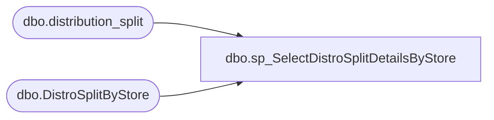

# dbo.sp_SelectDistroSplitDetailsByStore

**Database:** me_01  
**Server:** bedrockdb02  

## Architecture Diagram



## Table Dependencies

| Referenced Table |
|---|
| dbo.distribution_split |
| dbo.DistroSplitByStore |

## Stored Procedure Code

```sql
CREATE procEDURE [dbo].[sp_SelectDistroSplitDetailsByStore] 
		
AS
	/*
		Purpose: Select all stores that have shipments waiting to be released
		Created By: Dave Rice
		Last Updated By: Matt Ludtke
		Last Updated Date: 8/8/2011
		
		Last Update Notes
		----------------------------------------------------------------------
		Implemented a select from where in to pull only stores which have
		records waiting to be processed. Previously the query returned all
		stores regardless of whether they needed any product shipped. 
		Tim Callahan 2022-08-04	Updated to only inlcude where isnumeric(distribution_number)=1 so it only includes Aptos distros, not Dynamics
	*/
	SET NOCOUNT ON 
	SELECT 
		Store_Num
		,cartonsPerSplit
		,NumberOfSplits
		,StoreType
		,isSmallStockRoom 
		,Warehouse_Num
	FROM 
		DistroSplitByStore 
	WHERE
		Store_Num IN 
		(
			SELECT 
				DestID
			FROM 
				distribution_split
			WHERE 
				released = 0
			AND
				CAST(distribution_split.sourceid AS INT) = DistroSplitByStore.Warehouse_Num
			AND
				CAST(distribution_split.DestID AS INT) = DistroSplitByStore.Store_Num
			AND isnumeric(distribution_number)=1 -- Added on 8/4/2022
		)
	ORDER BY 
		store_num, Warehouse_num ASC;
```

