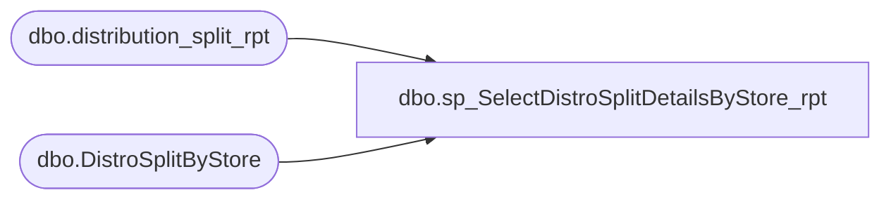

# dbo.sp_SelectDistroSplitDetailsByStore_rpt

**Database:** me_01  
**Server:** bedrockdb02  

## Architecture Diagram



## Table Dependencies

| Referenced Table |
|---|
| dbo.distribution_split_rpt |
| dbo.DistroSplitByStore |

## Stored Procedure Code

```sql
CREATE procEDURE [dbo].[sp_SelectDistroSplitDetailsByStore_rpt] 
		
AS
	/*
		Purpose: Select all stores that have shipments waiting to be released
		Created By: Dave Rice
		Last Updated By: Matt Ludtke
		Last Updated Date: 8/8/2011
		
		Last Update Notes
		----------------------------------------------------------------------
		Implemented a select from where in to pull only stores which have
		records waiting to be processed. Previously the query returned all
		stores regardless of whether they needed any product shipped. 
	*/
	SET NOCOUNT ON 
	SELECT 
		Store_Num
		,cartonsPerSplit
		,NumberOfSplits
		,StoreType
		,isSmallStockRoom 
		,Warehouse_Num
	FROM 
		DistroSplitByStore 
	WHERE
		Store_Num IN 
		(
			SELECT 
				DestID
			FROM 
				distribution_split_rpt
			WHERE 
				released = 0
			AND
				CAST(distribution_split_rpt.sourceid AS INT) = DistroSplitByStore.Warehouse_Num
			AND
				CAST(distribution_split_rpt.DestID AS INT) = DistroSplitByStore.Store_Num
		)
	ORDER BY 
		store_num, Warehouse_num ASC;
```

