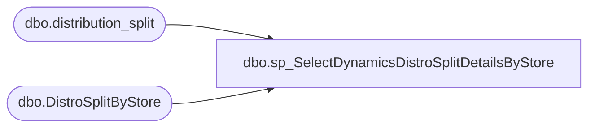

# dbo.sp_SelectDynamicsDistroSplitDetailsByStore

**Database:** me_01  
**Server:** bedrockdb02  

## Architecture Diagram



## Table Dependencies

| Referenced Table |
|---|
| dbo.distribution_split |
| dbo.DistroSplitByStore |

## Stored Procedure Code

```sql
CREATE proc  [dbo].[sp_SelectDynamicsDistroSplitDetailsByStore] 
		
AS
	/*
		Purpose: Select all stores that have shipments waiting to be released
		Dan Tweedie	2020-09-01	Created proc from sp_SelectDistroSplitDetailsByStore Updated to only inlcude where isnumeric(distribution_number)=0 so it only includes Dynamics distros, not Aptos

	*/
	SET NOCOUNT ON 
	SELECT 
		Store_Num
		,cartonsPerSplit
		,NumberOfSplits
		,StoreType
		,isSmallStockRoom 
		,Warehouse_Num
	FROM 
		DistroSplitByStore 
	WHERE
		Store_Num IN 
		(
			SELECT 
				DestID
			FROM 
				distribution_split
			WHERE 
				released = 0
			AND
				CAST(distribution_split.sourceid AS INT) = DistroSplitByStore.Warehouse_Num
			AND
				CAST(distribution_split.DestID AS INT) = DistroSplitByStore.Store_Num
			and isnumeric(distribution_number)=0
		)
	ORDER BY 
		store_num, Warehouse_num ASC;
```

