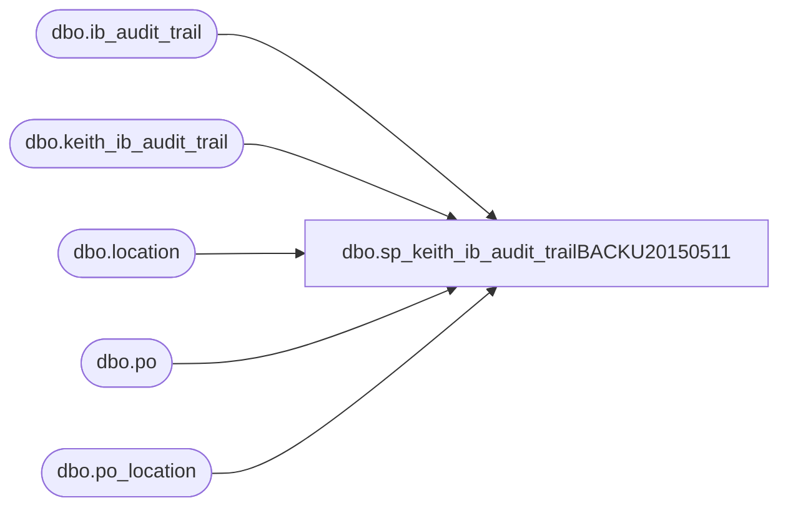

# dbo.sp_keith_ib_audit_trailBACKU20150511

**Database:** me_01  
**Server:** bedrockdb02  

## Architecture Diagram



## Table Dependencies

| Referenced Table |
|---|
| dbo.ib_audit_trail |
| dbo.keith_ib_audit_trail |
| dbo.location |
| dbo.po |
| dbo.po_location |

## Stored Procedure Code

```sql
create procedure [dbo].[sp_keith_ib_audit_trailBACKU20150511]

as

--drop table keith_ib_audit_trail

insert into keith_ib_audit_trail(
[po_no],[entry_date],[employee_first_name], [employee_last_name] 
)
	select 	distinct iat.application_identifier as po_no, 
		iat.entry_date,
		iat.employee_first_name, 
		iat.employee_last_name 
	from ib_audit_trail iat (nolock),
	po po (nolock),
	po_location ploc (nolock),
	location l (nolock) 
	where iat.application = 'POM' 
	and 	iat.activity = 'Create'
	---and 	iat.ib_audit_trail_id between (select ib_audit_trail_id from keith_ib_audit_trail_pointer where pointer = 'start')
	--and 	(select ib_audit_trail_id from keith_ib_audit_trail_pointer where pointer = 'end')
	and	iat.application_identifier not in (select po_no from keith_ib_audit_trail)
--and 583333
	and	iat.application_identifier = po.po_no
	and	po.po_id = ploc.po_id
	and	ploc.location_id = l.location_id
	and	l.location_code in ('0980','0470','2970','0975','0960')
```

