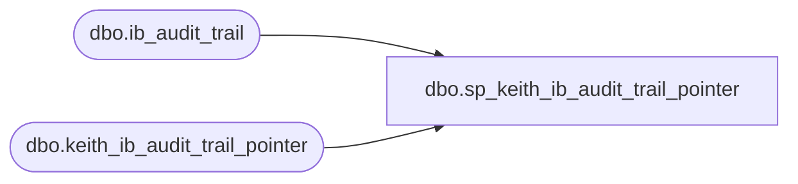

# dbo.sp_keith_ib_audit_trail_pointer

**Database:** me_01  
**Server:** bedrockdb02  

## Architecture Diagram



## Table Dependencies

| Referenced Table |
|---|
| dbo.ib_audit_trail |
| dbo.keith_ib_audit_trail_pointer |

## Stored Procedure Code

```sql
CREATE procedure [dbo].[sp_keith_ib_audit_trail_pointer]

as

update 	keith_ib_audit_trail_pointer 
set 	ib_audit_trail_id = (select ib_audit_trail_id from keith_ib_audit_trail_pointer where pointer = 'end')
--set ib_audit_trail_id = 1
where	pointer = 'start'

update 	keith_ib_audit_trail_pointer 
set 	ib_audit_trail_id = (select max(ib_audit_trail_id) from ib_audit_trail)
--set ib_audit_trail_id = 583333
where	pointer = 'end'
```

