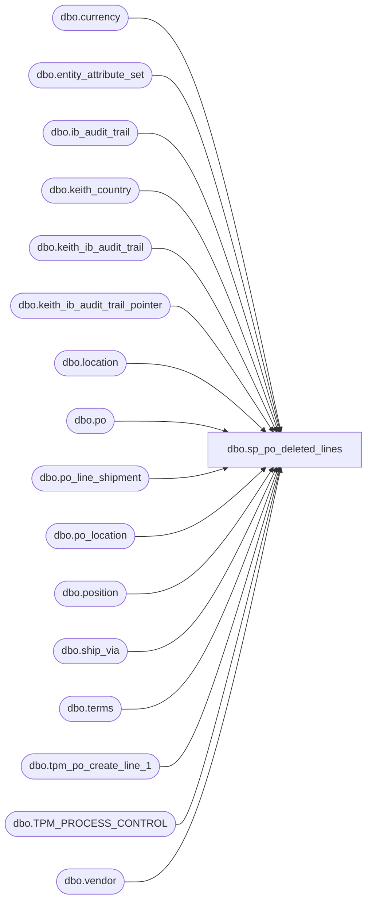

# dbo.sp_po_deleted_lines

**Database:** me_01  
**Server:** bedrockdb02  

## Architecture Diagram



## Table Dependencies

| Referenced Table |
|---|
| dbo.currency |
| dbo.entity_attribute_set |
| dbo.ib_audit_trail |
| dbo.keith_country |
| dbo.keith_ib_audit_trail |
| dbo.keith_ib_audit_trail_pointer |
| dbo.location |
| dbo.po |
| dbo.po_line_shipment |
| dbo.po_location |
| dbo.position |
| dbo.ship_via |
| dbo.terms |
| dbo.tpm_po_create_line_1 |
| dbo.TPM_PROCESS_CONTROL |
| dbo.vendor |

## Stored Procedure Code

```sql
CREATE procedure [dbo].[sp_po_deleted_lines]

as
-- =====================================================================================================
-- Name: sp_po_deleted_lines
--
-- Description:	
--
-- Input: 
--
-- Output: 
--
-- Dependencies: 
--
-- Revision History
--		Name:			Date:			Comments:
--		Keith Lee		xx/xx/xxx		Created proc.	
--		Tim Callahan	01/22/2016		Modified code to include China Warehouses 3970, 3980	
--		Tim Callahan	01/25/2018		Added China Warehouses 8502 to be included			
--		Tim Callahan	03/13/2018		Added China Warehouses 8505 to be included		
--		Lizzy Timm		01/09/2025		Added bonded China Warehouses 9942 to be included	
--		
-- =====================================================================================================


-- Line deletion -- Using the PO + Line number, we can find the corresponding po_line_shipment_id (since they are recorded) and negate them.
-- Sending over just the records that we need to negate.

select 	iat.application_identifier as 'po_no',
	substring(application_key,9,100) as 'line_no',
	tpc.po_line_shipment_id,
	iat.entry_date as TransactionDate
into	#keith_sp_po_deleted_line
from 	ib_audit_trail iat with (nolock)
join po po with (nolock) on iat.application_identifier = po.po_no
join po_location ploc with (nolock) on po.po_id = ploc.po_id
join location l with (nolock) on ploc.location_id = l.location_id
join TPM_PROCESS_CONTROL tpc with (nolock) on po.po_no = tpc.po_no
	and cast(substring(iat.application_key,9,100) as int) = tpc.line_no
where iat.application = 'POM' 
and	iat.action in ('Delete')
and	iat.application_level in ('Order line')
and	iat.field_affected in ('Order line')	
--and	l.location_code in ('0980','0470','2970','0975','0960','3970','3980','9942','8502','8505','0013','2991') -- Added China Warehouses
and	(
		l.location_code in ('0980','0470','2970','0975','0960','3970','3980','9942','8502','8505','0013','2991') -- Added China Warehouses
		or ---added stores = 2022-12-8
		l.location_code between '0001' and '0700'
		or
		l.location_code between '2000' and '2999'
	)
and	po.approval_status in (3,7) -- Approval
and	po.po_status in (4,7) -- Open
and ib_audit_trail_id between (select ib_audit_trail_id from keith_ib_audit_trail_pointer where pointer = 'start')
and 	(select ib_audit_trail_id from keith_ib_audit_trail_pointer where pointer = 'end')


---- Added Code 6/11/2009 for Expected Receipt Date deletion
insert into	#keith_sp_po_deleted_line
select 	iat.application_identifier as 'po_no',
tpc.line_no,
	tpc.po_line_shipment_id,
	iat.entry_date as TransactionDate
from ib_audit_trail iat with (nolock)
join po po with (nolock) on iat.application_identifier = po.po_no
join po_location ploc with (nolock) on po.po_id = ploc.po_id
join location l with (nolock) on ploc.location_id = l.location_id
join TPM_PROCESS_CONTROL tpc  with (nolock) on po.po_no = tpc.po_no
where iat.application = 'POM' 
and	iat.action in ('Delete')
and	iat.application_level in ('Order shipment')
and	iat.field_affected in ('Order shipment')
--and	l.location_code in ('0980','0470','2970','0975', '0960','3970','3980','8502','8505','0013','2991') -- Added China Warehouses
and	(
		l.location_code in ('0980','0470','2970','0975','0960','3970','3980','9942','8502','8505','0013','2991') -- Added China Warehouses
		or ---added stores = 2022-12-8
		l.location_code between '0001' and '0700'
		or
		l.location_code between '2000' and '2999'
	)
and	po.approval_status in (3,7) -- Approval
and	po.po_status in (4,7) -- Open
and ib_audit_trail_id between (select ib_audit_trail_id from keith_ib_audit_trail_pointer where pointer = 'start')
and (select ib_audit_trail_id from keith_ib_audit_trail_pointer where pointer = 'end')
--and tpc.po_line_shipment_id not in (select po_line_shipment_id from po_line_shipment where po_id = po.po_id and quantity <> 0)
and not exists (select distinct po_line_shipment_id from po_line_shipment where po_id = po.po_id and quantity <> 0 and tpc.po_line_shipment_id = po_line_shipment.po_line_shipment_id )


-- PO by line for Merchandising
insert into tpm_po_create_line_1 (
	po_no,Type,EventCode,EventLocationInternalId,EventSourceLocationInternalId,InternalStatus,FulFillFlag,
	AcceptRqdMode,AcceptedFlag,OwnerID,ShipToldRef,ShipTo,ShipFromId,SupplierId,Hub1Id,BillTold,TypeCode,CurrencyDesc,OrderDate,PayTermsDesc,
	TransportMethodDesc,FOBDesc,COOCode,Rep1Id,OrderLine,AltDetailKey,ItemId,ItemDesc,AcceptedItemFlag,CurrQty,UOMCode,StartShipDate,EndDeliverDateTime,CancelDate,
	UnitCost,RetailPrice,ColorCode,ColorDesc,ItemAttr1,SupplierItemId,SupplierItemDesc,ShipToId,StdPackQty,StdCaseQty,CatchWeightFlag,Rep2Id,InternalStatusDetail,line_no,TransactionDate,TransactionType
)

--- US POs by line (Supplies and Merch)

select 	po.po_no as po_no,
	1 as "Type", --1= PO 4= transfer
	'1110' as "EventCode",
	'HostHQ' as "EventLocationInternalId",
	'HostHQ' as "Event SourceLocationInternalId",
	10 as "InternalStatus", -- 1=Planning,10=Open,85= Completed, 90=Closed,99=Cancelled
	1 as "FulFillFlag",

	case when eas.attribute_set_id = 700002

		then 2
	else
		1
	end "AcceptRqdMode", -- 1 = Pending Partner Accept 2 = Auto Accept

	case when eas.attribute_set_id = 700002

		then 1
	else
		5
	end "AcceptedFlag",  -- 5 = Pending Partner Accept 1= Auto Accept	'Host' as "OwnerID",

	'Host' as "OwnerID",
	cast(l.location_code as int) as "ShipToldRef",
	cast(l.location_code as int) as "ShipTo",
	v.vendor_code as "ShipFromId",
	v.vendor_code as "SupplierId",
	'' as "Hub1Id",
	'HostHQ' as "BillTold",
	'1' as "TypeCode",
	cy.currency_description as "CurrencyDesc",
	po.order_date as "OrderDate",
	replace(t.terms_description,',',' ') as "PayTermsDesc",
	isnull(sv.ship_via_description,'Ocean') as "TransportMethodDesc",
	replace(po.fob_description,',',' ') as "FOBDesc",
	cty.country_code as "COOCode",
	p.position_label as "Rep1Id",
	kspdl.po_line_shipment_id as "OrderLine", --- VALID???? 09-19-20 - CONFIRMED with Roger
	0 as "AltDetailKey",
	'' as "ItemId",
	'' as "ItemDesc",

	case when eas.attribute_set_id = 700002 
		then 1
	else
		0
	end "AcceptedItemFlag",  -- 0 = Pending Parter Accept 1 = Auto Accept

	0 as "CurrQty",
	'' as "UOMCode",
	kspdl.TransactionDate as "StartShipDate",
	kspdl.TransactionDate as "EndDeliverDateTime",
	kspdl.TransactionDate as "CancelDate",
	0.00 as "UnitCost",
	0.00 as "RetailPrice", 
	'' as "ColorCode",
	'' as "ColorDesc",
	'' as "ItemAttr1",
	'' as "SupplierItemId", -- limit it to 25
	'' as "SupplierItemDesc",
	cast(l.location_code as int) as "ShipToId", 
	0 as "StdPackQty",
	0 as "StdCaseQty",
	0 as "CatchWeightFlag",
	lower(left(iat.employee_first_name,1) + iat.employee_last_name) as "Rep2Id",
	'99' as "InternalStatusDetail",
	kspdl.line_no,
	kspdl.TransactionDate as TransactionDate,
	'Deleted Line' as TransactionType
from #keith_sp_po_deleted_line kspdl with (nolock)
join po po with (nolock) on kspdl.po_no = po.po_no 
join position p  with (nolock) on po.position_id = p.position_id
join vendor v with (nolock) on po.vendor_id = v.vendor_id
left join ship_via sv with (nolock) on po.ship_via_id = sv.ship_via_id
join currency cy with (nolock) on po.currency_id = cy.currency_id
left join terms t with (nolock) on po.terms_id = t.terms_id
join po_location ploc with (nolock) on po.po_id = ploc.po_id
join location l with (nolock) on ploc.location_id = l.location_id
join keith_country cty with (nolock) on v.country_id = cty.country_id
join keith_ib_audit_trail iat with (nolock) on iat.po_no = po.po_no
join entity_attribute_set eas with (nolock) on v.vendor_id = eas.parent_id
	and eas.attribute_id = 7
where po.po_no > '1000000'	
--and	l.location_code in ('0980','0470','2970','0975', '0960','3970','3980','8502','8505','0013','2991') -- Added China Warehouses
and	(
		l.location_code in ('0980','0470','2970','0975','0960','3970','3980','9942','8502','8505','0013','2991') -- Added China Warehouses
		or ---added stores = 2022-12-8
		l.location_code between '0001' and '0700'
		or
		l.location_code between '2000' and '2999'
	)
```

