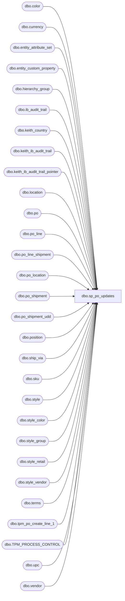

# dbo.sp_po_updates

**Database:** me_01  
**Server:** bedrockdb02  

## Architecture Diagram



## Table Dependencies

| Referenced Table |
|---|
| dbo.color |
| dbo.currency |
| dbo.entity_attribute_set |
| dbo.entity_custom_property |
| dbo.hierarchy_group |
| dbo.ib_audit_trail |
| dbo.keith_country |
| dbo.keith_ib_audit_trail |
| dbo.keith_ib_audit_trail_pointer |
| dbo.location |
| dbo.po |
| dbo.po_line |
| dbo.po_line_shipment |
| dbo.po_location |
| dbo.po_shipment |
| dbo.po_shipment_udd |
| dbo.position |
| dbo.ship_via |
| dbo.sku |
| dbo.style |
| dbo.style_color |
| dbo.style_group |
| dbo.style_retail |
| dbo.style_vendor |
| dbo.terms |
| dbo.tpm_po_create_line_1 |
| dbo.TPM_PROCESS_CONTROL |
| dbo.upc |
| dbo.vendor |

## Stored Procedure Code

```sql
CREATE procedure [dbo].[sp_po_updates]

as

-- =====================================================================================================
-- Name: sp_po_updates
--
-- Description:	
--
-- Input: 
--
-- Output: 
--
-- Dependencies: 
--
-- Revision History
--		Name:			Date:			Comments:
--		Keith Lee		xx/xx/xxx		Created proc.	
--		Tim Callahan	01/22/2016		Modified code to include China Warehouses 3970, 3980		
--		Tim Callahan	01/25/2018		Added China Warehouses 8502 to be included		
--		Tim Callahan	03/13/2018		Added China Warehouses 8505 to be included		
--		Lizzy Timm		01/09/2025		Added bonded China Warehouses 9942 to be included			
--		
-- =====================================================================================================

-- Quantity, System Date, Expected Receipt Date changes 
-- need to send entire PO over again


select 	distinct iat.application_identifier as 'po_no',
	max(iat.entry_date) as TransactionDate
into 	#keith_sp_po_updates
from ib_audit_trail iat WITH (nolock)
join po po WITH (nolock) on iat.application_identifier= po.po_no
join po_location ploc WITH (nolock) on po.po_id = ploc.po_id
join location l WITH (nolock) on ploc.location_id = l.location_id
join keith_ib_audit_trail kiat WITH (nolock) on po.po_no = kiat.po_no
where application = 'POM' 
and	(action in ('Modify','Add')
and	iat.application_level in ('Order detail','Order header','Order shipment','Order line','Order shipment dates')
and	iat.field_affected in ('ordered_units','Order detail','expected_receipt_date','user_defined_date','first_cost','net_cost','net_final_cost') or	iat.activity = 'Reapproved')
--and	l.location_code in ('0980','0470','2970','0975','0960','3970','3980','9942','8502','8505','0013','2991')
and	(
		l.location_code in ('0980','0470','2970','0975','0960','3970','3980','9942','8502','8505','0013','2991') -- Added China Warehouses
		or ---added stores = 2022-12-8
		l.location_code between '0001' and '0700'
		or
		l.location_code between '2000' and '2999'
	)
and	po.approval_status in (3,7) -- Approval
and	po.po_status in (4,7) -- Open
and 	iat.ib_audit_trail_id between (select ib_audit_trail_id from keith_ib_audit_trail_pointer where pointer = 'start')
and 	(select ib_audit_trail_id from keith_ib_audit_trail_pointer where pointer = 'end')
and	exists (select po_no from TPM_PROCESS_CONTROL where po.po_no = TPM_PROCESS_CONTROL.po_no )
and	iat.entry_date > kiat.entry_date
group by iat.application_identifier

-- PO by line for Merchandising
insert into tpm_po_create_line_1 (
	po_no,Type,EventCode,EventLocationInternalId,EventSourceLocationInternalId,InternalStatus,FulFillFlag,
	AcceptRqdMode,AcceptedFlag,OwnerID,ShipToldRef,ShipTo,ShipFromId,SupplierId,Hub1Id,BillTold,TypeCode,CurrencyDesc,OrderDate,PayTermsDesc,
	TransportMethodDesc,FOBDesc,COOCode,Rep1Id,OrderLine,AltDetailKey,ItemId,ItemDesc,AcceptedItemFlag,CurrQty,UOMCode,StartShipDate,EndDeliverDateTime,CancelDate,
	UnitCost,RetailPrice,ColorCode,ColorDesc,ItemAttr1,SupplierItemId,SupplierItemDesc,ShipToId,StdPackQty,StdCaseQty,CatchWeightFlag,Rep2Id,InternalStatusDetail,line_no,TransactionDate,TransactionType
)

--- US POs by line (Supplies and Merch)

select 	po.po_no as po_no,
	1 as "Type", --1= PO 4= transfer
	'1110' as "EventCode",
	'HostHQ' as "EventLocationInternalId",
	'HostHQ' as "EventSourceLocationInternalId",
	10 as "InternalStatus", -- 1=Planning,10=Open,85= Completed, 90=Closed,99=Cancelled
	1 as "FulFillFlag",

	case when eas.attribute_set_id = 700002

		then 2
	else
		1
	end "AcceptRqdMode", -- 1 = Pending Partner Accept 2 = Auto Accept

	case when eas.attribute_set_id = 700002

		then 1
	else
		5
	end "AcceptedFlag",  -- 5 = Pending Partner Accept 1= Auto Accept	'Host' as "OwnerID",

	'Host' as "OwnerID",
	cast(l.location_code as int) as "ShipToldRef",
	cast(l.location_code as int) as "ShipTo",
	v.vendor_code as "ShipFromId",
	v.vendor_code as "SupplierId",
	'' as "Hub1Id",
	'HostHQ' as "BillTold",
	'1' as "TypeCode",
	cy.currency_description as "CurrencyDesc",
	po.order_date as "OrderDate",
	replace(t.terms_description,',',' ') as "PayTermsDesc",
	isnull(sv.ship_via_description,'Ocean') as "TransportMethodDesc",
	replace(po.fob_description,',',' ') as "FOBDesc",
	cty.country_code as "COOCode",
	p.position_label as "Rep1Id",
	pls.po_line_shipment_id as "OrderLine", --- VALID???? 09-19-20 - CONFIRMED with Roger
	0 as "AltDetailKey",
	s.style_code as "ItemId",
	replace(s.short_desc,',',' ') as "ItemDesc",

	case when eas.attribute_set_id = 700002 
		then 1
	else
		0
	end "AcceptedItemFlag",  -- 0 = Pending Parter Accept 1 = Auto Accept

	case when ecp.custom_property_value is not null and substring(hg.hierarchy_group_code,7,2)='60'  
		then 
			case when ecp.custom_property_value = '0.00' 
				then pls.quantity * 1 
				else pls.quantity * ecp.custom_property_value 
			end
		else pls.quantity
	end "CurrQty",

	'' as "UOMCode",
	udd1.user_defined_date as "StartShipDate",
	ps.expected_receipt_date as "EndDeliverDateTime",
	udd2.user_defined_date as "CancelDate",

	case when ecp.custom_property_value is not null and substring(hg.hierarchy_group_code,7,2)='60' 
		then  
			case when ecp.custom_property_value = '0.00' 
				then (pl.first_cost / 1)
				else (pl.first_cost / ecp.custom_property_value)
			end
		else pl.first_cost -- needs to be US Cost
		end "UnitCost",

	sr.current_selling_retail as "RetailPrice", 
	clr.color_code as "ColorCode",
	clr.color_short_description as "ColorDesc",
	u.upc_number as "ItemAttr1",
	substring(replace(stv.vendor_style,',',' '),1,25) as "SupplierItemId", -- limit it to 25
	replace(stv.vendor_style,',',' ') as "SupplierItemDesc",
	cast(l.location_code as int) as "ShipToId", 

	case when ecp.custom_property_value is not null and substring(hg.hierarchy_group_code,7,2)='60'  
	then	
		case when ecp.custom_property_value = '0.00' 
		then 1
		else ecp.custom_property_value
		end
	else 	s.distribution_multiple
	end "StdPackQty",

	case when ecp.custom_property_value is not null and substring(hg.hierarchy_group_code,7,2)='60' 
	then	
		case when ecp.custom_property_value = '0.00' 
		then 1
		else ecp.custom_property_value
		end
	else 	s.order_multiple
	end "StdCaseQty",

	0 as "CatchWeightFlag",
	lower(left(iat.employee_first_name,1) + iat.employee_last_name) as "Rep2Id",
	'10' as "InternalStatusDetail",
	pl.line_no,
	(select TransactionDate from #keith_sp_po_updates where po.po_no = po_no) as TransactionDate,
	'Update' as TransactionType
from po po with (nolock) 
join po_line pl with (nolock) on po.po_id = pl.po_id
join po_shipment ps with (nolock) on po.po_id = ps.po_id
join po_line_shipment pls with (nolock) on pl.po_id = pls.po_id
	and pl.po_line_id = pls.po_line_id
	and ps.po_shipment_id = pls.po_shipment_id
join po_location ploc with (nolock) on po.po_id = ploc.po_id
join position p with (nolock) on po.position_id = p.position_id
join vendor v with (nolock) on po.vendor_id = v.vendor_id
join currency cy with (nolock) on po.currency_id = cy.currency_id
left join ship_via sv with (nolock) on po.ship_via_id = sv.ship_via_id
left join terms t with (nolock) on po.terms_id = t.terms_id
join sku sk with (nolock) on pl.style_color_id = sk.style_color_id
join upc u with (nolock) on sk.sku_id = u.sku_id 
join style_color sc with (nolock) on sk.style_color_id = sc.style_color_id
join color clr with (nolock) on sc.color_id = clr.color_id
join style s with (nolock) on sc.style_id = s.style_id
join style_group sg with (nolock) on s.style_id = sg.style_id
join hierarchy_group hg with (nolock) on sg.hierarchy_group_id = hg.hierarchy_group_id
join style_retail sr with (nolock) on s.style_id = sr.style_id
join style_vendor stv with (nolock) on po.vendor_id = stv.vendor_id
	and s.style_id = stv.style_id
join po_shipment_udd udd1 with (nolock) on ps.po_id = udd1.po_id
	and ps.po_shipment_id = udd1.po_shipment_id
	and udd1.po_date_type_id = 2
join po_shipment_udd udd2 with (nolock) on ps.po_id = udd2.po_id
	and ps.po_shipment_id = udd2.po_shipment_id
	and udd2.po_date_type_id = 3
left join entity_custom_property ecp with (nolock) on s.style_id = ecp.parent_id
	and	ecp.custom_property_id = 2
	and	ecp.parent_type = 1
join keith_country cty with (nolock) on v.country_id = cty.country_id
join location l with (nolock) on ploc.location_id = l.location_id
join keith_ib_audit_trail iat with (nolock) on iat.po_no = po.po_no
join entity_attribute_set eas with (nolock) on v.vendor_id = eas.parent_id
	and	eas.attribute_id = 7 
where po.po_no in (select po_no from #keith_sp_po_updates)
and	po.po_no > '1000000'
--and	l.location_code in ('0980','0470','2970','0975','0960','3970','3980','9942','8502','8505','0013','2991') -- Added China Warehouses
and	(
		l.location_code in ('0980','0470','2970','0975','0960','3970','3980','9942','8502','8505','0013','2991') -- Added China Warehouses
		or ---added stores = 2022-12-8
		l.location_code between '0001' and '0700'
		or
		l.location_code between '2000' and '2999'
	)
and	pls.quantity <> 0
and	u.upc_number < '000000999999'
and	sr.jurisdiction_id = 1 -- home
```

