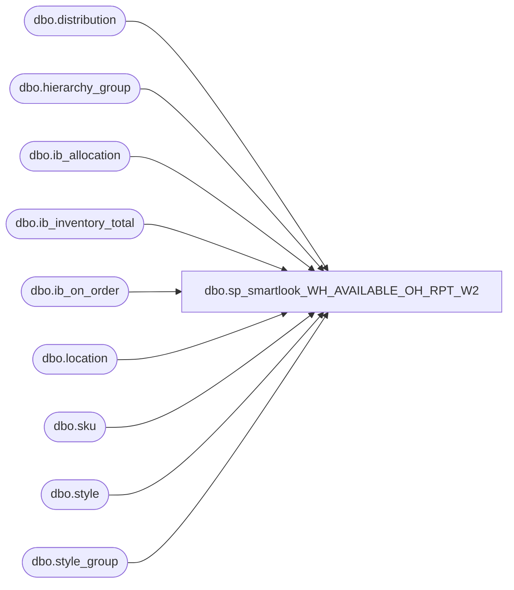

# dbo.sp_smartlook_WH_AVAILABLE_OH_RPT_W2

**Database:** me_01  
**Server:** bedrockdb02  

## Architecture Diagram



## Table Dependencies

| Referenced Table |
|---|
| dbo.distribution |
| dbo.hierarchy_group |
| dbo.ib_allocation |
| dbo.ib_inventory_total |
| dbo.ib_on_order |
| dbo.location |
| dbo.sku |
| dbo.style |
| dbo.style_group |

## Stored Procedure Code

```sql
CREATE proc [dbo].[sp_smartlook_WH_AVAILABLE_OH_RPT_W2] (@location_code varchar(4),@location_code2 varchar(4))

as
create table #keith_temp
(
location_code varchar(4),
dept varchar(10),
style_code varchar(6),
long_desc varchar(150),
distribution_multiple bigint,
available bigint,
allocated bigint,
next_receipt_date varchar(10),
on_order_units bigint)

-- Available On Hand
insert into #keith_temp
select l.location_code,
left(hg.hierarchy_group_code,8) as dept,
s.style_code,
s.long_desc,
s.distribution_multiple,
iit.total_on_hand_units as available,
0 as allocated,
'' as next_receipt_date, 
0 as on_order_units
from ib_inventory_total iit with (nolock)
join sku sk with (nolock)
on iit.sku_id = sk.sku_id
join style s with (nolock)
on sk.style_id = s.style_id 
join location l with (nolock)
on iit.location_id = l.location_id
join style_group sg with (nolock)
on s.style_id = sg.style_id
join hierarchy_group hg with (nolock)
on sg.hierarchy_group_id = hg.hierarchy_group_id
where iit.inventory_status_id =1
and (l.location_code = (@location_code) or l.location_code = (@location_code2))
and left(hg.hierarchy_group_code,1)  = 'W'
--and s.style_code = '015809'
order by 3


-- Allocated
insert into #keith_temp
select l.location_code,
left(hg.hierarchy_group_code,8) as dept,
s.style_code,
s.long_desc,
s.distribution_multiple,
0 as available,
isnull(sum(ia.allocated_units),0) as allocated,
'' as next_receipt_date, 
0 as on_order_units
from sku sk with (nolock)
join ib_allocation ia with (nolock)
on ia.sku_id = sk.sku_id
join style s with (nolock)
on sk.style_id = s.style_id 
join style_group sg with (nolock)
on s.style_id = sg.style_id
join hierarchy_group hg with (nolock)
on sg.hierarchy_group_id = hg.hierarchy_group_id
join distribution d with (nolock)
on ia.allocation_number = d.distribution_number
join location l with (nolock)
on l.location_id = d.location_id
and (l.location_code = (@location_code) or l.location_code = (@location_code2))
and isnull(d.po_id,0)=0 and isnull(d.advance_shipping_notice_id,0)=0
and left(hg.hierarchy_group_code,1)  = 'W'
group by l.location_code, hg.hierarchy_group_code, s.style_code, s.long_desc,s.distribution_multiple
order by 3

-- On order
--Build full on order table
select l.location_code,
s.style_code,
receipt_date, 
sum(on_order_units) as on_order_units
into #all_on_order
from ib_on_order ioo,
sku sk,
style s,
location l
where s.style_id = sk.style_id
and sk.sku_id = ioo.sku_id
and ioo.location_id = l.location_id
and (l.location_code = (@location_code) or l.location_code = (@location_code2))
group by s.style_code,l.location_code,receipt_date
having sum(on_order_units) >0
order by 2

-- Get next receipt date
select aoo.location_code,
aoo.style_code,
min(aoo.receipt_date) as next_receipt_date
into #next_oo_date
from #all_on_order aoo
group by aoo.location_code,aoo.style_code
order by 3

-- On Order table
select aoo.location_code,
left(hg.hierarchy_group_code,8) as dept,
aoo.style_code,
s.long_desc,
s.distribution_multiple,
0 as available,
0 as allocated,
convert(varchar, nod.next_receipt_date,101) as next_receipt_date,
aoo.on_order_units
into #keith_temp_2
from #all_on_order aoo,
#next_oo_date nod,
style s,
hierarchy_group hg,
style_group sg
where aoo.style_code = nod.style_code
and nod.style_code = s.style_code
and s.style_id = sg.style_id
and aoo.location_code = nod.location_code
and aoo.receipt_date = nod.next_receipt_date
and sg.hierarchy_group_id = hg.hierarchy_group_id
and left(hg.hierarchy_group_code,1)  = 'W'
order by 3

-- Consolidate On Hand and Allocated
select location_code,
dept,
style_code,
long_desc,
sum(available) as available,
distribution_multiple,
sum(allocated) as allocated,
sum(available) - sum(allocated) as available_to_distribute,
next_receipt_date,
sum(on_order_units) as on_order_units
into #keith_temp_3
from #keith_temp
group by location_code, dept,style_code,long_desc,distribution_multiple,next_receipt_date
order by 3


-- Update Main table with On order
update #keith_temp_3 set next_receipt_date = kt2.next_receipt_date, on_order_units = kt2.on_order_units
--select kt3.*
from #keith_temp_3 kt3,
#keith_temp_2 kt2
where kt3.location_code = kt2.location_code
and kt3.dept= kt2.dept
and kt3.style_code = kt2.style_code
and kt3.long_desc = kt2.long_desc

-- Delete from OO work table
delete from #keith_temp_2
from #keith_temp_3 kt3,
#keith_temp_2 kt2
where kt3.location_code = kt2.location_code
and kt3.dept= kt2.dept
and kt3.style_code = kt2.style_code
and kt3.long_desc = kt2.long_desc

-- Insert missing entries
insert into #keith_temp_3
select location_code, dept, style_code, long_desc, available, distribution_multiple,allocated,0 as available_to_distribute,next_receipt_date, on_order_units from #keith_temp_2

select location_code, dept, style_code, long_desc, available, distribution_multiple,allocated,available_to_distribute, on_order_units,isnull(next_receipt_date ,'') as next_receipt_date
from #keith_temp_3

drop table #all_on_order
drop table #next_oo_date
drop table #keith_temp_3
drop table #keith_temp_2
drop table #keith_temp
```

