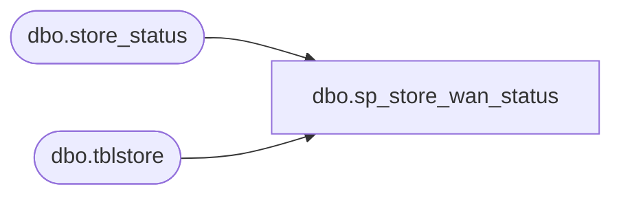

# dbo.sp_store_wan_status

**Database:** me_01  
**Server:** bedrockdb02  

## Architecture Diagram



## Table Dependencies

| Referenced Table |
|---|
| dbo.store_status |
| dbo.tblstore |

## Stored Procedure Code

```sql
CREATE proc [dbo].[sp_store_wan_status]
as
set nocount on

IF (Object_ID('me_01..store_status ') IS NOT NULL) DROP TABLE store_status 
create table store_status 
(store_nbr varchar(4),
status varchar(12))

declare @store varchar(4), @storeip varchar(12), @counter int, @total_stores int

set @counter = 1

select @total_stores = count(distinct right('0000' + cast(istoreid as varchar(4)), 4)) 
						from kodiak.Bearhouse.dbo.tblstore 
						where iCoalitionstore = 1
						and dCoalitiondate < getdate()+1
						and istoreid < 3000
						order by 1
					

declare store_ip cursor for 
						select distinct right('0000' + cast(istoreid as varchar(4)), 4) 
						from OPENROWSET('MSDASQL', 'DRIVER={SQL Server};SERVER=kodiak;UID=sa;PWD=sa', Bearhouse.dbo.tblstore) 
						where iCoalitionstore = 1
						and dCoalitiondate < getdate()+1
						and istoreid < 3000
						order by 1
			

open store_ip

while @counter <= @total_stores 

begin
	
	fetch next from store_ip into @store

	set @storeip = case when @store like '00%' then '10.0.' + right(@store, 2) + '.101'
						else '10.' + left(@store, 2) + '.' + right(@store, 2) + '.101' end
						
	
	declare @ping varchar (400), @wan varchar(10)
	set @ping = 'ping ' + @storeip + ' -n 1'
	create table #temp (ping varchar(400))
	insert #temp
	exec master..xp_cmdShell @ping

	delete from #temp where ping not like '%packets: sent%' or ping is null

	select @wan = case when ping like '%packets: sent%' and ping not like '%lost = 0%' then 'offline' else 'online' end from #temp

	insert store_status (store_nbr, status) values(@store, @wan)
	
	drop table #temp

	set @counter = @counter + 1

end

close store_ip
deallocate store_ip
```

