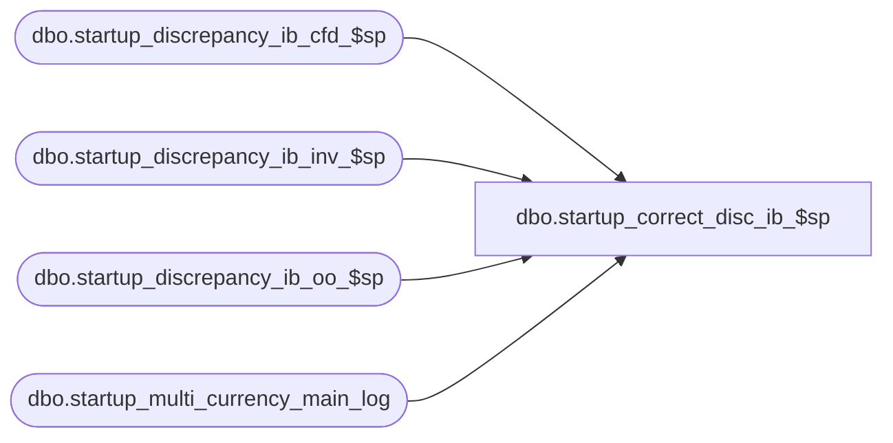

# dbo.startup_correct_disc_ib_$sp

**Database:** me_01  
**Server:** bedrockdb02  

## Architecture Diagram



## Table Dependencies

| Referenced Table |
|---|
| dbo.startup_discrepancy_ib_cfd_$sp |
| dbo.startup_discrepancy_ib_inv_$sp |
| dbo.startup_discrepancy_ib_oo_$sp |
| dbo.startup_multi_currency_main_log |

## Stored Procedure Code

```sql
-- Copy of original added to R2 build 18 after build was released

CREATE PROC [dbo].[startup_correct_disc_ib_$sp] 
AS

/*
    Version		: 1.00 
	Date		: 2010/01/04	
	Created by	: Pierrette Lemay
	Description : This procedure is part of the startup associated to the multi-currency project.  
				  It adjusts the discrepancy between the home cost and the local cost for a group of transactions in IB.
		
*/

BEGIN
	DECLARE @line_id INT, @error_msg NVARCHAR(2000), @new_startup_id INT,
		@sql_err_num DECIMAL(38,0), @object_name NVARCHAR(30),  @proc_name NVARCHAR(50)

	BEGIN TRY
		-- First we're going to adjust ib_inventory
		SELECT @new_startup_id = MAX(startup_main_id) + 1
		FROM startup_multi_currency_main_log

		IF @new_startup_id IS NULL
			SET @new_startup_id = 1

		BEGIN TRAN
		-- Flag this part of the process as being started
		INSERT INTO startup_multi_currency_main_log
			(startup_main_id, main_proc_name, start_time, completed_flag)
		VALUES (@new_startup_id, N'startup_discrepancy_ib_inv_$sp', GETDATE(), 0)
		COMMIT TRAN
	
		SELECT @line_id = 10, @object_name = N'startup_discrepancy_ib_inv_$sp'
		EXEC startup_discrepancy_ib_inv_$sp
		
		BEGIN TRAN
		UPDATE startup_multi_currency_main_log
		SET end_time = getdate(), completed_flag = 1 
		WHERE startup_main_id = @new_startup_id
		COMMIT TRAN

		-- Adjust ib_cost_factor_discount
		SET @new_startup_id = @new_startup_id + 1

		BEGIN TRAN
		-- Flag this part of the process as being started
		INSERT INTO startup_multi_currency_main_log
			(startup_main_id, main_proc_name, start_time, completed_flag)
		VALUES (@new_startup_id, N'startup_discrepancy_ib_cfd_$sp', GETDATE(), 0)
		COMMIT TRAN
	
		SELECT @line_id = 20, @object_name = N'startup_discrepancy_ib_cfd_$sp'
		EXEC startup_discrepancy_ib_cfd_$sp
		
		BEGIN TRAN
		UPDATE startup_multi_currency_main_log
		SET end_time = getdate(), completed_flag = 1 
		WHERE startup_main_id = @new_startup_id
		COMMIT TRAN

		-- Upgrade ib_on_order
		SET @new_startup_id = @new_startup_id + 1

		BEGIN TRAN
		-- Flag this part of the process as being started
		INSERT INTO startup_multi_currency_main_log
			(startup_main_id, main_proc_name, start_time, completed_flag)
		VALUES (@new_startup_id, N'startup_discrepancy_ib_oo_$sp', GETDATE(), 0)
		COMMIT TRAN
	
		SELECT @line_id = 30, @object_name = N'startup_discrepancy_ib_oo_$sp'
		EXEC startup_discrepancy_ib_oo_$sp
		
		BEGIN TRAN
		UPDATE startup_multi_currency_main_log
		SET end_time = getdate(), completed_flag = 1 
		WHERE startup_main_id = @new_startup_id
		COMMIT TRAN
		
	END TRY

	BEGIN CATCH

		IF @@TRANCOUNT <> 0
			ROLLBACK TRANSACTION

		IF @line_id = 10	
			SET @error_msg = N'Error in procedure startup_discrepancy_ib_inv_$sp: ' + CAST(ERROR_NUMBER() AS NVARCHAR) + N' ' + ERROR_MESSAGE()
		ELSE IF @line_id = 20	
			SET @error_msg = N'Error in procedure startup_discrepancy_ib_cfd_$sp: ' + CAST(ERROR_NUMBER() AS NVARCHAR) + N' ' + ERROR_MESSAGE()
		ELSE IF @line_id = 30
			SET @error_msg = N'Error in procedure startup_discrepancy_ib_oo_$sp: ' + CAST(ERROR_NUMBER() AS NVARCHAR) + N' ' + ERROR_MESSAGE()
			
		 RAISERROR (@error_msg, -- Message text.
			   16, -- Severity.
			   1) -- State.
	END CATCH
END
```

