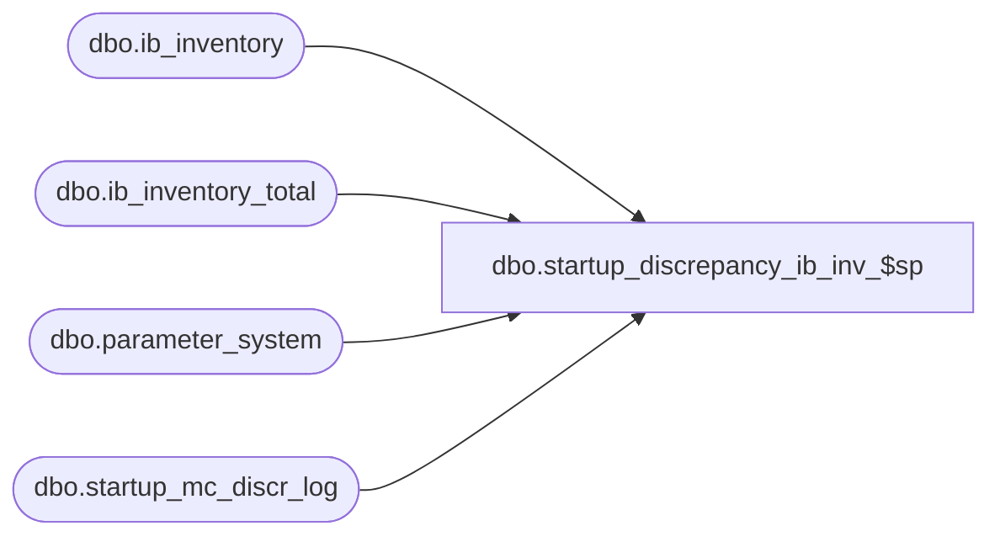

# dbo.startup_discrepancy_ib_inv_$sp

**Database:** me_01  
**Server:** bedrockdb02  

## Architecture Diagram



## Table Dependencies

| Referenced Table |
|---|
| dbo.ib_inventory |
| dbo.ib_inventory_total |
| dbo.parameter_system |
| dbo.startup_mc_discr_log |

## Stored Procedure Code

```sql
-- Copy of original added to R2 build 18 after build was released

CREATE PROCEDURE [dbo].[startup_discrepancy_ib_inv_$sp] AS

SET NOCOUNT ON

BEGIN
	DECLARE @sku_id_completed DECIMAL(13,0), @current_sku_id DECIMAL(13,0), @discrepancy INT, @multi_jurisdiction_flag BIT, @crs_sku_flag BIT,
		@error_msg NVARCHAR(4000), @crs_sku_key_flag bit, @current_location_id SMALLINT, @current_inventory_status_id SMALLINT, 
		@local_cost DECIMAL(14,2), @number_of_rows SMALLINT, @crs_sku_cost_flag BIT, @current_transaction_cost_local DECIMAL(14,2),
		@ib_inventory_id DECIMAL(12,0)

	-- Processing 
	BEGIN TRY
		SELECT @multi_jurisdiction_flag = multi_sales_jurisdiction_flag FROM parameter_system
		
		-- there is no point going further because transaction cost = transaction_cost_local
		IF @multi_jurisdiction_flag = 0 
			RETURN 

		SELECT @sku_id_completed = MAX(sku_id)
		FROM startup_mc_discr_log
		WHERE proc_name = N'startup_discrepancy_ib_inv_$sp'
		AND completed_flag = 1

	   IF @sku_id_completed IS NULL
		  SET @sku_id_completed = 0
		
		-- Process by sku
		DECLARE crs_sku CURSOR FOR
		SELECT DISTINCT sku_id
	  	FROM ib_inventory_total
		WHERE sku_id > @sku_id_completed
	  	ORDER BY sku_id

	  	OPEN crs_sku
		SET @crs_sku_flag = 1

		FETCH NEXT FROM crs_sku INTO @current_sku_id

		WHILE @@FETCH_STATUS = 0
		BEGIN
			-- For the current sku get the group key to update
			DECLARE crs_sku_key CURSOR FOR
			SELECT location_id, inventory_status_id, SUM(transaction_cost_local) local_cost
			FROM ib_inventory
			WHERE sku_id = @current_sku_id
			GROUP BY location_id, inventory_status_id
			HAVING SUM(transaction_cost) = 0 AND SUM(transaction_cost_local) <> 0
			ORDER BY location_id, inventory_status_id
			
			OPEN crs_sku_key
			SET @crs_sku_key_flag = 1
			
			FETCH NEXT FROM crs_sku_key INTO @current_location_id, @current_inventory_status_id, @local_cost

			WHILE @@FETCH_STATUS = 0
			BEGIN
				-- For each row here where local_cost is <> 0, I need to adjust some or all the rows that belong to this group 
				-- by pro-rating the discrepancy until the total of transaction_cost_local equals transaction_cost and equal 0.
				
				-- Get the rows from ib_inventory that will be affected by pro-rating the current discrepancy 
				-- Open a third cursor: loop through the row(s) until the discrepancy stored in @local_cost reached 0.
				SET @number_of_rows = ABS(@local_cost * 100)
				
				DECLARE crs_sku_cost CURSOR FOR
				SELECT TOP(@number_of_rows) ib_inventory_id, transaction_cost_local
				FROM ib_inventory
				WHERE sku_id = @current_sku_id
				AND location_id = @current_location_id
				AND inventory_status_id = @current_inventory_status_id
				ORDER BY transaction_cost_local 

				BEGIN TRANSACTION
				
				WHILE (@local_cost <> 0)
				BEGIN
					OPEN crs_sku_cost
					SET @crs_sku_cost_flag = 1
					
					FETCH NEXT FROM crs_sku_cost INTO @ib_inventory_id, @current_transaction_cost_local

					WHILE @@FETCH_STATUS = 0
					BEGIN
						IF @local_cost > 0
						BEGIN
							-- We need to reduce the row of 0.01 until there is no discrepancy
							UPDATE ib_inventory
							SET transaction_cost_local = transaction_cost_local - 0.01
							WHERE ib_inventory_id = @ib_inventory_id
							
							SET @local_cost = @local_cost - 0.01

						END
						ELSE 
						BEGIN
							-- We need to add each row of 0.01 until there is no discrepancy
							UPDATE ib_inventory
							SET transaction_cost_local = transaction_cost_local + 0.01
							WHERE ib_inventory_id = @ib_inventory_id
							
							SET @local_cost = @local_cost + 0.01
							
						END
						IF @local_cost = 0 
							BREAK
						ELSE
							FETCH NEXT FROM crs_sku_cost INTO @ib_inventory_id, @current_transaction_cost_local
					END
					CLOSE crs_sku_cost
					SET @crs_sku_cost_flag = 0
				END
				
				IF @crs_sku_cost_flag = 1
					CLOSE crs_sku_cost
					
				DEALLOCATE crs_sku_cost
				SET @crs_sku_cost_flag = 0
					
				-- UPDATE ib_inventory_total
				UPDATE ib_inventory_total
				SET total_on_hand_cost_local = 0
				WHERE sku_id = @current_sku_id
				AND location_id = @current_location_id
				AND inventory_status_id = @current_inventory_status_id
					
				-- INSERT a row in the log because we'll pick up the next sku to adjust
				INSERT INTO startup_mc_discr_log
					(proc_name, sku_id, location_id, third_key_id, end_time, completed_flag)
				VALUES (N'startup_discrepancy_ib_inv_$sp', @current_sku_id, @current_location_id, @current_inventory_status_id, GETDATE(), 1)
			
				COMMIT TRANSACTION			
				
				FETCH NEXT FROM crs_sku_key INTO @current_location_id, @current_inventory_status_id, @local_cost
			END
			
			CLOSE crs_sku_key
			DEALLOCATE crs_sku_key
			SET @crs_sku_key_flag = 0
			
			FETCH NEXT FROM crs_sku INTO @current_sku_id
		END
      
      CLOSE crs_sku
	  DEALLOCATE crs_sku
	  SET @crs_sku_flag = 0

	END TRY
	BEGIN CATCH
	
	IF @@TRANCOUNT <> 0
		ROLLBACK TRANSACTION
		
	IF (@crs_sku_cost_flag = 1)
    BEGIN
		CLOSE crs_sku_cost
		DEALLOCATE crs_sku_cost
    END
    
	IF (@crs_sku_key_flag = 1)
    BEGIN
		CLOSE crs_sku_key
		DEALLOCATE crs_sku_key
    END
    
    IF (@crs_sku_flag = 1)
    BEGIN
		CLOSE crs_sku
		DEALLOCATE crs_sku
    END
   
	SET @error_msg = N'Error in procedure startup_discrepancy_ib_inv_$sp: ' + CAST(ERROR_NUMBER() AS NVARCHAR) + N' ' + ERROR_MESSAGE()
	RAISERROR (@error_msg, -- Message text.
           16, -- Severity.
           1) -- State.

	END CATCH
END
```

