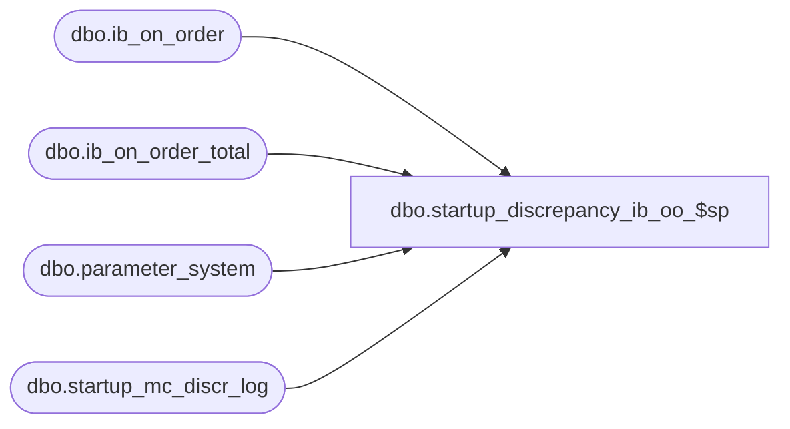

# dbo.startup_discrepancy_ib_oo_$sp

**Database:** me_01  
**Server:** bedrockdb02  

## Architecture Diagram



## Table Dependencies

| Referenced Table |
|---|
| dbo.ib_on_order |
| dbo.ib_on_order_total |
| dbo.parameter_system |
| dbo.startup_mc_discr_log |

## Stored Procedure Code

```sql
-- Copy of original added to R2 build 18 after build was released

CREATE PROCEDURE [dbo].[startup_discrepancy_ib_oo_$sp] AS

SET NOCOUNT ON

BEGIN
	DECLARE @doc_no_completed NVARCHAR(20), @current_document_no NVARCHAR(20), @discrepancy INT, @multi_jurisdiction_flag BIT, 
		@crs_document_cost_flag BIT, @error_msg NVARCHAR(4000), @local_cost DECIMAL(14,2), @number_of_rows TINYINT, 
		@crs_document_flag BIT, @current_on_order_cost_local DECIMAL(14,2), @ib_on_order_id DECIMAL(12,0)

	-- Processing 
	BEGIN TRY
		SELECT @multi_jurisdiction_flag = multi_sales_jurisdiction_flag FROM parameter_system
		
		-- there is no point going further because transaction cost = transaction_cost_local
		IF @multi_jurisdiction_flag = 0 
			RETURN 

		SELECT @doc_no_completed = MAX(document_no)
		FROM startup_mc_discr_log
		WHERE proc_name = N'startup_discrepancy_ib_oo_$sp'
		AND completed_flag = 1

	   IF @doc_no_completed IS NULL
		  SET @doc_no_completed = N''
		
		-- Process by sku
		DECLARE crs_document CURSOR FOR
		SELECT DISTINCT document_number, SUM(on_order_cost_local) local_cost
	  	FROM ib_on_order
		WHERE document_number > @doc_no_completed
		GROUP BY document_number
	  	HAVING SUM(on_order_cost) = 0 AND SUM(on_order_cost_local) <> 0
	  	ORDER BY document_number

	  	OPEN crs_document
		SET @crs_document_flag = 1

		FETCH NEXT FROM crs_document INTO @current_document_no, @local_cost

		WHILE @@FETCH_STATUS = 0
		BEGIN
			-- For each group of rows where local_cost is <> 0, I need to adjust some or all the rows that belong to this group 
			-- by pro-rating the discrepancy until the total of on_order_cost_local equals on_order_cost and equal 0.
				
			-- Get the rows from ib_inventory that will be affected by pro-rating the current discrepancy 
			-- Open another cursor: loop through the row(s) until the discrepancy stored in @local_cost reached 0.
			SET @number_of_rows = ABS(@local_cost * 100)
				
			DECLARE crs_document_cost CURSOR FOR
			SELECT TOP(@number_of_rows) ib_on_order_id, on_order_cost_local
			FROM ib_on_order
			WHERE document_number = @current_document_no
			ORDER BY on_order_cost_local 

			BEGIN TRANSACTION
				
			WHILE (@local_cost <> 0)
			BEGIN
				OPEN crs_document_cost
				SET @crs_document_cost_flag = 1
					
				FETCH NEXT FROM crs_document_cost INTO @ib_on_order_id, @current_on_order_cost_local

				WHILE @@FETCH_STATUS = 0
				BEGIN
					IF @local_cost > 0
					BEGIN
						-- We need to reduce the row of 0.01 until there is no discrepancy
						UPDATE ib_on_order
						SET on_order_cost_local = on_order_cost_local - 0.01
						WHERE ib_on_order_id = @ib_on_order_id
							
						SET @local_cost = @local_cost - 0.01
					END
					ELSE 
					BEGIN
						-- We need to add each row of 0.01 until there is no discrepancy
						UPDATE ib_on_order
						SET on_order_cost_local = on_order_cost_local + 0.01
						WHERE ib_on_order_id = @ib_on_order_id
						
						SET @local_cost = @local_cost + 0.01			
					END
					IF (@local_cost = 0)
						BREAK
					ELSE
						FETCH NEXT FROM crs_document_cost INTO @ib_on_order_id, @current_on_order_cost_local
				END
				CLOSE crs_document_cost
				SET @crs_document_cost_flag = 0
			END
			IF @crs_document_cost_flag = 1
				CLOSE crs_document_cost
					
			DEALLOCATE crs_document_cost
			SET @crs_document_cost_flag = 0
			
			-- UPDATE ib_on_order_total
			UPDATE i 
			SET i.total_on_order_cost_local = T.total_on_order_cost_local
			FROM ib_on_order_total i WITH (INDEX(ib_on_order_total_$ndx2)), 
				(SELECT sku_id, location_id, receipt_date, SUM(on_order_cost_local) total_on_order_cost_local
				  FROM ib_on_order
				  WHERE document_number = @current_document_no
				  AND pack_id IS NULL
				  GROUP BY sku_id, location_id, receipt_date) T
			WHERE i.document_number = @current_document_no
			AND i.sku_id = T.sku_id
			AND i.location_id = T.location_id
			AND i.receipt_date = T.receipt_date
			AND i.pack_id IS NULL
			  
			UPDATE i 
			SET i.total_on_order_cost_local = ISNULL(i.total_on_order_cost_local, 0) + T.total_on_order_cost_local
			FROM ib_on_order_total i WITH (INDEX(ib_on_order_total_$ndx2)), 
				(SELECT sku_id, location_id, receipt_date, pack_id, SUM(on_order_cost_local) total_on_order_cost_local
				FROM ib_on_order
				WHERE document_number = @current_document_no
				AND pack_id IS NOT NULL
				GROUP BY sku_id, location_id, receipt_date, pack_id) T
			WHERE i.document_number = @current_document_no
			AND i.sku_id = T.sku_id
			AND i.location_id = T.location_id
			AND i.receipt_date = T.receipt_date
			AND i.pack_id = T.pack_id
				
			-- INSERT a row in the log because we'll pick up the next sku to adjust
			INSERT INTO startup_mc_discr_log
				(proc_name, document_no, end_time, completed_flag)
			VALUES (N'startup_discrepancy_ib_oo_$sp', @current_document_no, GETDATE(), 1)
		
			COMMIT TRANSACTION			

			FETCH NEXT FROM crs_document INTO @current_document_no, @local_cost
		END
      
        CLOSE crs_document
	    DEALLOCATE crs_document
	    SET @crs_document_flag = 0

	END TRY
	BEGIN CATCH
	
	IF @@TRANCOUNT <> 0
		ROLLBACK TRANSACTION
		
	IF (@crs_document_cost_flag = 1)
    BEGIN
		CLOSE crs_document_cost
		DEALLOCATE crs_document_cost
    END
    
    IF (@crs_document_flag = 1)
    BEGIN
		CLOSE crs_document
		DEALLOCATE crs_document
    END
   
	SET @error_msg = N'Error in procedure startup_discrepancy_ib_oo_$sp: ' + CAST(ERROR_NUMBER() AS NVARCHAR) + N' ' + ERROR_MESSAGE()
	RAISERROR (@error_msg, -- Message text.
           16, -- Severity.
           1) -- State.

	END CATCH
END
```

