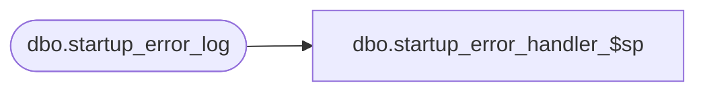

# dbo.startup_error_handler_$sp

**Database:** me_01  
**Server:** bedrockdb02  

## Architecture Diagram



## Table Dependencies

| Referenced Table |
|---|
| dbo.startup_error_log |

## Stored Procedure Code

```sql
CREATE PROC [dbo].[startup_error_handler_$sp] 	
	( @startup_multi_currency_main_log_id INT 
	, @proc_name NVARCHAR(80)
	, @line_id SMALLINT
	, @sql_err_num DECIMAL(38,0) 
	, @object_name NVARCHAR(30) 
	, @error_msg NVARCHAR(4000)
	, @raise_flag BIT)

AS

/*
    Version		: 1.00 
	Date		: 2010/03/09	
	Created by	: Pierrette Lemay
	Description : Common error handling procedure for startup
				  Logs errors to the startup_error_log table 
				  Raises application errors depending on raise_flag passed in	

	Input parameter: contains all the values of the columns to be inserted in startup_error_log.
*/

BEGIN
	DECLARE @error_message NVARCHAR(1000), @error_severity SMALLINT, @error_state SMALLINT, @done BIT
	SELECT @error_message	= N'An error occurred during the Startup and is logged in the startup_error_log table.'
		 , @error_severity	= 16
		 , @error_state		= 1

	IF @@TRANCOUNT <> 0
        -- Procedure called when there was an active transaction that failed. This transaction must be Rollback
		-- and we want to start a new transaction in order to write this error to the job_error table
		ROLLBACK TRANSACTION

     BEGIN TRY
		-- Procedure must start its own transaction.
        BEGIN TRANSACTION

		INSERT INTO startup_error_log
				(startup_multi_currency_main_log_id
				, proc_name 
				, line_id 
				, error_timestamp 
				, sql_err_num 
				, object_name
				, error_msg)
		VALUES ( @startup_multi_currency_main_log_id
				, @proc_name 
				, @line_id 
				, GETDATE() 
				, @sql_err_num 
				, @object_name
				, @error_msg)
	
		COMMIT TRANSACTION

		-- Here we want to force the execution to go in the Catch block in order to manage
		-- the behavior of the raise_flag.
		RAISERROR (@error_msg, @error_severity, @error_state)

	END TRY
	BEGIN CATCH
        IF @@TRANCOUNT <> 0 -- Transaction failed trying to de the insert into job_error
		BEGIN
			IF XACT_STATE() = 1
				-- There is an active transaction committable 
				COMMIT TRANSACTION
            IF XACT_STATE() <> -1
                -- The session has an active transaction, but an error 
				-- has occurred that has caused the transaction to be classified as an uncommittable transaction
                ROLLBACK TRANSACTION 
		END

		IF @raise_flag = 1
			RAISERROR (@error_msg, @error_severity, @error_state)

	END CATCH
END
```

