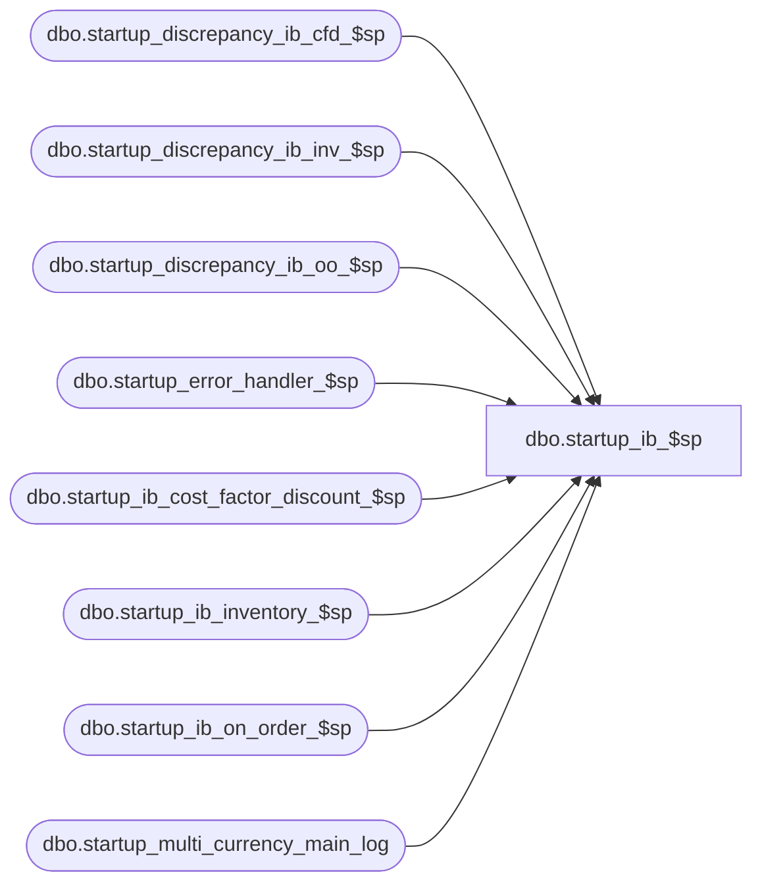

# dbo.startup_ib_$sp

**Database:** me_01  
**Server:** bedrockdb02  

## Architecture Diagram



## Table Dependencies

| Referenced Table |
|---|
| dbo.startup_discrepancy_ib_cfd_$sp |
| dbo.startup_discrepancy_ib_inv_$sp |
| dbo.startup_discrepancy_ib_oo_$sp |
| dbo.startup_error_handler_$sp |
| dbo.startup_ib_cost_factor_discount_$sp |
| dbo.startup_ib_inventory_$sp |
| dbo.startup_ib_on_order_$sp |
| dbo.startup_multi_currency_main_log |

## Stored Procedure Code

```sql
-- Copy of version added to R2 build 18 after build was released

CREATE PROC [dbo].[startup_ib_$sp] 
	(@disc_adjustment_flag BIT = 0)	
AS

/*
    Version		: 1.00 
	Date		: 2010/01/04	
	Created by	: Pierrette Lemay
	Description : This procedure is part of the startup associated to the multi-currency project.  
				  It's called by the exe that controls the startup process in IB.
				  This is the main procedure for populating ib_* tables.
	History: Version 1.01 A new parameter was added: this parameter trigger if the procedure adjust discrepancy between
			home cost and local cost when the SUM od home cost = 0.
			Bug was found in the startup of ib_inventory and ib_on_order and wee needed to add a new column : updated_flag
			that will only stay for the duration of the startup process.
		
*/

BEGIN
	DECLARE @line_id INT, @error_msg NVARCHAR(2000), @new_startup_id INT, @sql_error NVARCHAR(2000), 
		@sql_err_num DECIMAL(38,0), @object_name NVARCHAR(30),  @proc_name NVARCHAR(50)
		
	IF NOT EXISTS (SELECT * FROM sysobjects t, syscolumns c
				   WHERE t.type = N'U' 
				   AND t.name = N'ib_inventory'
				   AND t.id = c.id 
				   AND c.name = N'updated_flag')
		ALTER TABLE ib_inventory ADD updated_flag BIT NULL

	IF NOT EXISTS (SELECT * FROM sysobjects t, syscolumns c
				   WHERE t.type = N'U' 
				   AND t.name = N'ib_on_order'
				   AND t.id = c.id 
				   AND c.name = N'updated_flag')
		ALTER TABLE ib_on_order ADD updated_flag BIT NULL

	BEGIN TRY
		-- First we're going to upgrade ib_inventory
		SELECT @new_startup_id = MAX(startup_main_id) + 1
		FROM startup_multi_currency_main_log

		IF @new_startup_id IS NULL
			SET @new_startup_id = 1

		BEGIN TRAN
		-- Flag this part of the process as being started
		INSERT INTO startup_multi_currency_main_log
			(startup_main_id, main_proc_name, start_time, completed_flag)
		VALUES (@new_startup_id, N'startup_ib_inventory_$sp', GETDATE(), 0)
		COMMIT TRAN

		SELECT @line_id = 10, @object_name = N'startup_ib_inventory_$sp'
		EXEC startup_ib_inventory_$sp

		BEGIN TRAN
		UPDATE startup_multi_currency_main_log
		SET end_time = getdate(), completed_flag = 1
		WHERE startup_main_id = @new_startup_id
		COMMIT TRAN

		IF @disc_adjustment_flag = 1
		BEGIN
			-- Second phase of the Upgrade of ib_inventory and ib_inventory_total: According the parameter passed in
			-- Adjusting discrepancy when the SUM of transaction_cost = 0 but the SUM of transaction_cost_local <> 0
			SET @new_startup_id = @new_startup_id + 1
			
			BEGIN TRAN
			-- Flag this part of the process as being started
			INSERT INTO startup_multi_currency_main_log
				(startup_main_id, main_proc_name, start_time, completed_flag)
			VALUES (@new_startup_id, N'startup_discrepancy_ib_inv_$sp', GETDATE(), 0)
			COMMIT TRAN
		
			SELECT @line_id = 15, @object_name = N'startup_discrepancy_ib_inv_$sp'
			EXEC startup_discrepancy_ib_inv_$sp
			
			BEGIN TRAN
			UPDATE startup_multi_currency_main_log
			SET end_time = getdate(), completed_flag = 1 
			WHERE startup_main_id = @new_startup_id
			COMMIT TRAN
		END
		
		-- Upgrade ib_cost_factor_discount
		SET @new_startup_id = @new_startup_id + 1

		BEGIN TRAN
		-- Flag this part of the process as being started
		INSERT INTO startup_multi_currency_main_log
			(startup_main_id, main_proc_name, start_time, completed_flag)
		VALUES (@new_startup_id, N'startup_ib_cost_factor_discount_$sp', GETDATE(), 0)
		COMMIT TRAN

		SELECT @line_id = 30, @object_name = N'startup_ib_cost_factor_discount_$sp'
		EXEC startup_ib_cost_factor_discount_$sp

		BEGIN TRAN
		UPDATE startup_multi_currency_main_log
		SET end_time = getdate(), completed_flag = 1 
		WHERE startup_main_id = @new_startup_id
		COMMIT TRAN

		IF @disc_adjustment_flag = 1
		BEGIN
			-- Second phase of the Upgrade of ib_cost_factor_discount: According the parameter passed in
			-- Adjusting discrepancy when the SUM of extended_cost = 0 but the SUM of extended_cost_local <> 0
			SET @new_startup_id = @new_startup_id + 1
			
			BEGIN TRAN
			-- Flag this part of the process as being started
			INSERT INTO startup_multi_currency_main_log
				(startup_main_id, main_proc_name, start_time, completed_flag)
			VALUES (@new_startup_id, N'startup_discrepancy_ib_cfd_$sp', GETDATE(), 0)
			COMMIT TRAN
		
			SELECT @line_id = 15, @object_name = N'startup_discrepancy_ib_cfd_$sp'
			EXEC startup_discrepancy_ib_cfd_$sp
			
			BEGIN TRAN
			UPDATE startup_multi_currency_main_log
			SET end_time = getdate(), completed_flag = 1 
			WHERE startup_main_id = @new_startup_id
			COMMIT TRAN
		END
		
		-- Upgrade ib_on_order
		SET @new_startup_id = @new_startup_id + 1

		BEGIN TRAN
		-- Flag this part of the process as being started
		INSERT INTO startup_multi_currency_main_log
			(startup_main_id, main_proc_name, start_time, completed_flag)
		VALUES (@new_startup_id, N'startup_ib_on_order_$sp', GETDATE(), 0)
		COMMIT TRAN

		SELECT @line_id = 40, @object_name = N'startup_ib_on_order_$sp'
		EXEC startup_ib_on_order_$sp

		BEGIN TRAN
		UPDATE startup_multi_currency_main_log
		SET end_time = getdate(), completed_flag = 1
		WHERE startup_main_id = @new_startup_id
		COMMIT TRAN
		
		IF @disc_adjustment_flag = 1
		BEGIN
			-- Second phase of the Upgrade of ib_on_order: According the parameter passed in
			-- Adjusting discrepancy when the SUM of on_order_cost by sku/location = 0 but the SUM of on_order_cost_local <> 0
			SET @new_startup_id = @new_startup_id + 1
			
			BEGIN TRAN
			-- Flag this part of the process as being started
			INSERT INTO startup_multi_currency_main_log
				(startup_main_id, main_proc_name, start_time, completed_flag)
			VALUES (@new_startup_id, N'startup_discrepancy_ib_oo_$sp', GETDATE(), 0)
			COMMIT TRAN
		
			SELECT @line_id = 15, @object_name = N'startup_discrepancy_ib_oo_$sp'
			EXEC startup_discrepancy_ib_oo_$sp
			
			BEGIN TRAN
			UPDATE startup_multi_currency_main_log
			SET end_time = getdate(), completed_flag = 1 
			WHERE startup_main_id = @new_startup_id
			COMMIT TRAN
		END
		
		IF NOT EXISTS (SELECT * FROM sysobjects t, syscolumns c
				   WHERE t.type = N'U' 
				   AND t.name = N'ib_inventory'
				   AND t.id = c.id 
				   AND c.name = N'updated_flag')
			ALTER TABLE ib_inventory DROP COLUMN updated_flag
		
		IF EXISTS (SELECT * FROM sysobjects t, syscolumns c
				   WHERE t.type = N'U' 
				   AND t.name = N'ib_on_order'
				   AND t.id = c.id 
				   AND c.name = N'updated_flag')
		ALTER TABLE ib_on_order DROP COLUMN updated_flag
		
	END TRY

	BEGIN CATCH

		IF @@TRANCOUNT <> 0
			ROLLBACK TRANSACTION

		SELECT @error_msg	= ERROR_MESSAGE()
			 , @sql_err_num		= ERROR_NUMBER()

		EXEC startup_error_handler_$sp
					@new_startup_id 
					, @proc_name 
					, @line_id 
					, @sql_err_num 
					, @object_name 
					, @error_msg 
					, 1
	END CATCH
END
```

