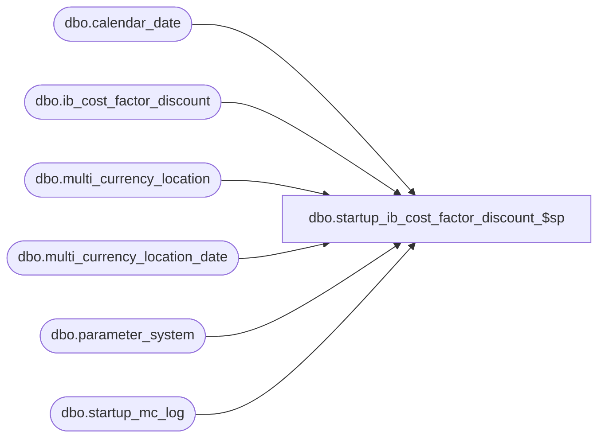

# dbo.startup_ib_cost_factor_discount_$sp

**Database:** me_01  
**Server:** bedrockdb02  

## Architecture Diagram



## Table Dependencies

| Referenced Table |
|---|
| dbo.calendar_date |
| dbo.ib_cost_factor_discount |
| dbo.multi_currency_location |
| dbo.multi_currency_location_date |
| dbo.parameter_system |
| dbo.startup_mc_log |

## Stored Procedure Code

```sql
-- Copy of version added to R2 build 18 after build was released

CREATE PROCEDURE [dbo].[startup_ib_cost_factor_discount_$sp]
AS
/*
    Version		: 1.00 
	Date		: 2010/01/05	
	Created by	: Pierrette Lemay
	Description : This procedure is part of the startup associated to the multi-currency project. It's populating the new columns
				  added to ib_cost_factor_discount.
	Version 1.01   This version corrects the selection of the applicable exchange_rate when the transaction date
					falls before the first effective_from_date defined in the system.

	Version 1.02 Remove TRUNCATE TABLE location_rate_cost_ibcfd
	Version 1.03  Added table multi_currency_location_date to prevent using the wrong exchange rate to be used in the UPDATE of ib_inventory.
*/
BEGIN
	DECLARE @last_transaction_date smalldatetime, @current_transaction_date smalldatetime, @error_msg NVARCHAR(4000), 
		@multi_jurisdiction_flag BIT, @crs_transaction_flg BIT

	IF OBJECT_ID(N'multi_currency_location_date') IS NOT NULL 
		DROP TABLE multi_currency_location_date
		
	CREATE TABLE dbo.multi_currency_location_date
		( location_id SMALLINT NOT NULL,
		  exchange_rate float NOT NULL,
		  CONSTRAINT multi_currency_location_date_$pk PRIMARY KEY CLUSTERED (location_id) )
		  
	BEGIN TRY
		SELECT @multi_jurisdiction_flag = multi_sales_jurisdiction_flag FROM parameter_system

		-- Make this process re-startable
		SELECT @last_transaction_date = MAX(date_processed) from startup_mc_log 
		WHERE proc_name = N'startup_ib_cost_factor_discount_$sp'
		AND completed_flag = 1

		IF @last_transaction_date IS NULL
			SELECT @last_transaction_date = MIN(calendar_date) FROM calendar_date

		-- make sure we created an index on location_id, transaction_date
		IF NOT EXISTS (SELECT 1 from sys.indexes WHERE name = N'ib_cost_factor_discount_$ndx')
			CREATE INDEX ib_cost_factor_discount_$ndx ON ib_cost_factor_discount (location_id, transaction_date)

		-- Process by day, create a cursor on day
		DECLARE crs_transaction_date CURSOR FOR
		SELECT DISTINCT transaction_date 
	  	FROM ib_cost_factor_discount WITH (NOLOCK)
		WHERE transaction_date > @last_transaction_date
	  	ORDER BY transaction_date

	  	OPEN crs_transaction_date
		SET @crs_transaction_flg  = 1

		FETCH NEXT FROM crs_transaction_date INTO @current_transaction_date

		WHILE @@FETCH_STATUS = 0
		BEGIN
			 -- populate multi_currency_location_date for the current date
			INSERT INTO multi_currency_location_date (location_id, exchange_rate)
			SELECT location_id, exchange_rate from multi_currency_location 
			where currency_conversion_type = 1
			AND ( effective_from_date <= @current_transaction_date
				AND (effective_to_date >= @current_transaction_date OR effective_to_date IS NULL) )
				
			INSERT INTO multi_currency_location_date (location_id, exchange_rate)
			SELECT l.location_id, l.exchange_rate from multi_currency_location l
			where  l.currency_conversion_type = 1
			AND ( l.effective_from_date <= GETDATE() 
				AND (l.effective_to_date >= GETDATE() OR l.effective_to_date IS NULL) )	
			AND NOT EXISTS (SELECT 1 FROM multi_currency_location_date d WHERE l.location_id = d.location_id)
			
			BEGIN TRAN
			IF @multi_jurisdiction_flag = 1
				  UPDATE i 
				  SET i.extended_cost_local = i.extended_cost / m.exchange_rate
				  FROM ib_cost_factor_discount i, multi_currency_location_date m
				  WHERE i.transaction_date = @current_transaction_date
				  AND i.location_id = m.location_id
			ELSE
				  UPDATE ib_cost_factor_discount
				  SET extended_cost_local = extended_cost 
				  WHERE transaction_date = @current_transaction_date

			  INSERT INTO startup_mc_log
					(proc_name, date_processed, end_time, completed_flag)
			  VALUES (N'startup_ib_cost_factor_discount_$sp', @current_transaction_date, GETDATE(), 1) 

			COMMIT TRAN

			TRUNCATE TABLE multi_currency_location_date
			
			FETCH NEXT FROM crs_transaction_date INTO @current_transaction_date	   
		END
      
		CLOSE crs_transaction_date
		DEALLOCATE crs_transaction_date
		SET @crs_transaction_flg = 0

		-- the index we created for this process is no longer required
		IF EXISTS (SELECT 1 from sys.indexes WHERE name = N'ib_cost_factor_discount_$ndx')
			DROP INDEX ib_cost_factor_discount_$ndx ON ib_cost_factor_discount 

	END TRY
	BEGIN CATCH
	
		IF @@TRANCOUNT <> 0
			ROLLBACK TRANSACTION

		IF (@crs_transaction_flg = 1)
		BEGIN
			CLOSE crs_transaction_date
			DEALLOCATE crs_transaction_date
		 END

		 SET @error_msg = N'Error in procedure startup_ib_cost_factor_discount_$sp: ' + CAST(ERROR_NUMBER() AS NVARCHAR) + N' ' + ERROR_MESSAGE()
		 RAISERROR (@error_msg, -- Message text.
			   16, -- Severity.
			   1) -- State.

	END CATCH
END
```

