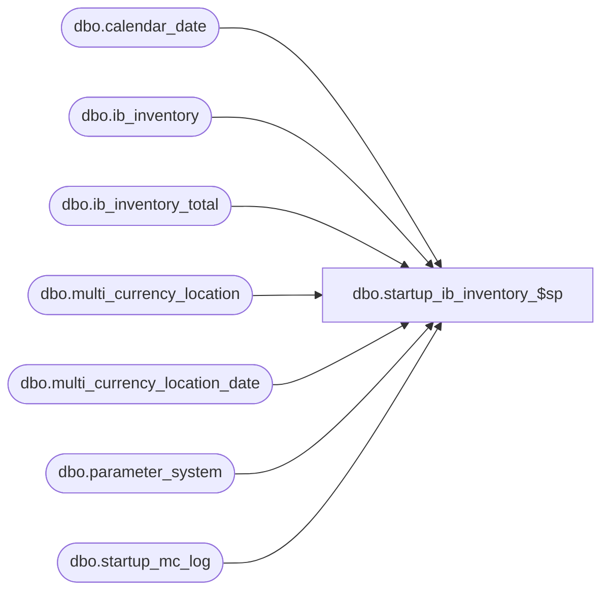

# dbo.startup_ib_inventory_$sp

**Database:** me_01  
**Server:** bedrockdb02  

## Architecture Diagram



## Table Dependencies

| Referenced Table |
|---|
| dbo.calendar_date |
| dbo.ib_inventory |
| dbo.ib_inventory_total |
| dbo.multi_currency_location |
| dbo.multi_currency_location_date |
| dbo.parameter_system |
| dbo.startup_mc_log |

## Stored Procedure Code

```sql
-- Copy of version added to R2 build 18 after build was released

CREATE PROCEDURE [dbo].[startup_ib_inventory_$sp] AS

/*
    Version		: 1.00 
	Date		: 2009/12/22	
	Created by	: Pierrette Lemay
	Description : This procedure is part of the startup associated to the multi-currency project. It's populating the new columns
				  added to ib_inventory'
				  Depends on multi_currency_location
	Version 1.01  This version corrects the selection of the applicable exchange_rate when the transaction date
					falls before the first effective_from_date defined in the system.
	Version 1.02  Removing done flag, change the logic there.
	Version 1.03  Added table multi_currency_location_date to prevent using the wrong exchange rate to be used in the UPDATE of ib_inventory.
*/

BEGIN
	DECLARE @min_date smalldatetime, @max_date smalldatetime, @current_date smalldatetime, @error_msg NVARCHAR(4000), @crs_da_flg BIT,
			@crs_sku_flag BIT, @batch_counter INT, @current_sku_id DECIMAL(13,0), @current_count INT, @batch_start DECIMAL(13,0), 
			@multi_jurisdiction_flag BIT, @batch_end DECIMAL(13,0), @batch_size INT, @end_sku_id DECIMAL(13,0)

	IF OBJECT_ID(N'multi_currency_location_date') IS NOT NULL 
		DROP TABLE multi_currency_location_date
		
	CREATE TABLE dbo.multi_currency_location_date
		( location_id SMALLINT NOT NULL,
		  exchange_rate float NOT NULL,
		  CONSTRAINT multi_currency_location_date_$pk PRIMARY KEY CLUSTERED (location_id) )

	-- Processing 
	BEGIN TRY
		SELECT @multi_jurisdiction_flag = multi_sales_jurisdiction_flag FROM parameter_system

		SELECT @crs_da_flg = 0, @batch_size = 100000,
				@current_date = MAX(date_processed)
		FROM startup_mc_log
		WHERE proc_name = N'startup_ib_inventory_$sp'
		AND completed_flag = 1

	   IF @current_date IS NULL
		  SET @current_date = 0
	   ELSE
	   BEGIN
			-- This procedure ran previously, check if there is more to process or if the proc completed previously
			SELECT @end_sku_id = MAX(end_sku_id)
			FROM startup_mc_log
			WHERE proc_name = N'startup_ib_inventory_$sp'
			AND date_processed = @current_date
			AND completed_flag = 1			

			-- Check if @current_date is complete or not
			IF NOT EXISTS (SELECT 1 FROM ib_inventory WHERE sku_id > @end_sku_id and transaction_date = @current_date)
			BEGIN
				-- We're done with this date then set @current_date to the date after
				SELECT @current_date = MIN(transaction_date)
				FROM ib_inventory
				WHERE transaction_date > @current_date
			END
		END
		
		SELECT @min_date = MIN(transaction_date), @max_date = MAX(transaction_date)
	  	FROM ib_inventory
		WHERE transaction_date >= @current_date

		-- Process by week, create a cursor on week
		DECLARE crs_merch_da CURSOR FOR
		SELECT calendar_date 
	  	FROM calendar_date
		WHERE calendar_date BETWEEN @min_date AND @max_date
	  	ORDER BY calendar_date

	  	OPEN crs_merch_da
		SET @crs_da_flg = 1

		FETCH NEXT FROM crs_merch_da INTO @current_date

		WHILE @@FETCH_STATUS = 0
		BEGIN
			-- populate multi_currency_location_date for the current date
			INSERT INTO multi_currency_location_date (location_id, exchange_rate)
			SELECT location_id, exchange_rate from multi_currency_location 
			where currency_conversion_type = 1
			AND ( effective_from_date <= @current_date
				AND (effective_to_date >= @current_date OR effective_to_date IS NULL) )
				
			INSERT INTO multi_currency_location_date (location_id, exchange_rate)
			SELECT l.location_id, l.exchange_rate from multi_currency_location l
			where  l.currency_conversion_type = 1
			AND ( l.effective_from_date <= GETDATE() 
				AND (l.effective_to_date >= GETDATE() OR l.effective_to_date IS NULL) )	
			AND NOT EXISTS (SELECT 1 FROM multi_currency_location_date d WHERE l.location_id = d.location_id)

			-- declare another cursor on sku_count
			DECLARE crs_sku_count CURSOR FOR
			SELECT sku_id, COUNT(*) sku_count
			FROM ib_inventory
			WHERE transaction_date = @current_date
			GROUP BY sku_id
			ORDER BY sku_id

			OPEN crs_sku_count
			SELECT @crs_sku_flag = 1, @batch_counter = 0

			FETCH NEXT FROM crs_sku_count
				INTO @current_sku_id, @current_count

			WHILE @@FETCH_STATUS = 0
			BEGIN

				IF @batch_counter = 0
					SET @batch_start = @current_sku_id

				SELECT @batch_counter = @batch_counter + @current_count,
					 @batch_end = @current_sku_id

				IF (@batch_counter > @batch_size)
				BEGIN
					BEGIN TRAN
					
					-- update this range of skus in ib_inventory current date
					IF @multi_jurisdiction_flag = 1
						UPDATE i 
						SET i.transaction_cost_local = i.transaction_cost / m.exchange_rate
						FROM ib_inventory i, multi_currency_location_date m
						WHERE i.sku_id BETWEEN @batch_start AND @batch_end
						AND i.transaction_date = @current_date
						AND i.location_id = m.location_id
					ELSE
						UPDATE ib_inventory
						SET transaction_cost_local = transaction_cost
						WHERE transaction_date = @current_date
						AND sku_id BETWEEN @batch_start AND @batch_end

					-- Prepare a temporary table that will be used to update ib_inventory_total
					UPDATE l
					SET l.total_on_hand_cost_local = ISNULL(l.total_on_hand_cost_local, 0) + T.total_on_hand_cost_local
					FROM ib_inventory_total l, ( SELECT sku_id, 
													location_id, 
													inventory_status_id, 
													SUM(transaction_cost_local) total_on_hand_cost_local
												FROM ib_inventory 
												WHERE sku_id BETWEEN @batch_start AND @batch_end
												AND transaction_date = @current_date
												GROUP BY sku_id, location_id, inventory_status_id) T
					WHERE l.sku_id = T.sku_id
					AND l.location_id = T.location_id
					AND l.inventory_status_id = T.inventory_status_id

					INSERT INTO startup_mc_log
						(proc_name, date_processed, start_sku_id, end_sku_id, end_time, completed_flag)
					VALUES (N'startup_ib_inventory_$sp', @current_date, @batch_start, @batch_end, GETDATE(), 1) 
	    
					COMMIT TRAN

					SET @batch_counter = 0	
				END
				
				FETCH NEXT FROM crs_sku_count
				INTO @current_sku_id, @current_count
			END
			-- Last loop if n_batch_count is not zero
			IF (@batch_counter <> 0) 
			BEGIN
				BEGIN TRAN

				IF @multi_jurisdiction_flag = 1
					UPDATE i 
						SET i.transaction_cost_local = i.transaction_cost / m.exchange_rate
						FROM ib_inventory i, multi_currency_location_date m
						WHERE i.sku_id BETWEEN @batch_start AND @batch_end
						AND i.transaction_date = @current_date
						AND i.location_id = m.location_id
				ELSE
					UPDATE ib_inventory
					SET transaction_cost_local = transaction_cost
					WHERE transaction_date = @current_date
					AND sku_id BETWEEN @batch_start AND @batch_end

				UPDATE l
				SET l.total_on_hand_cost_local = ISNULL(l.total_on_hand_cost_local, 0) + T.total_on_hand_cost_local
				FROM ib_inventory_total l, ( SELECT sku_id, 
												location_id, 
												inventory_status_id, 
												SUM(transaction_cost_local) total_on_hand_cost_local
											FROM ib_inventory 
											WHERE sku_id BETWEEN @batch_start AND @batch_end
											AND transaction_date = @current_date
											GROUP BY sku_id, location_id, inventory_status_id) T
				WHERE l.sku_id = T.sku_id
				AND l.location_id = T.location_id
				AND l.inventory_status_id = T.inventory_status_id

	            INSERT INTO startup_mc_log
					(proc_name, date_processed, start_sku_id, end_sku_id, end_time, completed_flag)
				VALUES (N'startup_ib_inventory_$sp', @current_date, @batch_start, @batch_end, GETDATE(), 1) 
    
				COMMIT TRAN
			END

			CLOSE crs_sku_count
			DEALLOCATE crs_sku_count
			SET @crs_sku_flag = 0
		
			-- Get ready to process another date
			TRUNCATE TABLE multi_currency_location_date
			
			FETCH NEXT FROM crs_merch_da INTO @current_date    
		END
      
      CLOSE crs_merch_da
	  DEALLOCATE crs_merch_da
	  SET @crs_da_flg = 0

	END TRY
	BEGIN CATCH
	
	IF @@TRANCOUNT <> 0
		ROLLBACK TRANSACTION

	IF (@crs_sku_flag = 1)
    BEGIN
		CLOSE crs_sku_count
		DEALLOCATE crs_sku_count
    END


	IF (@crs_da_flg = 1)
    BEGIN
		CLOSE crs_merch_da
		DEALLOCATE crs_merch_da
    END
   
	SET @error_msg = N'Error in procedure startup_ib_inventory_$sp: ' + CAST(ERROR_NUMBER() AS NVARCHAR) + N' ' + ERROR_MESSAGE()
	RAISERROR (@error_msg, -- Message text.
           16, -- Severity.
           1) -- State.

	END CATCH
END
```

