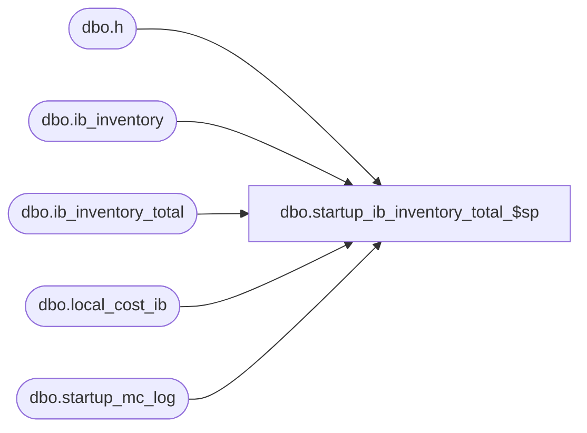

# dbo.startup_ib_inventory_total_$sp

**Database:** me_01  
**Server:** bedrockdb02  

## Architecture Diagram



## Table Dependencies

| Referenced Table |
|---|
| dbo.h |
| dbo.ib_inventory |
| dbo.ib_inventory_total |
| dbo.local_cost_ib |
| dbo.startup_mc_log |

## Stored Procedure Code

```sql
CREATE PROCEDURE [dbo].[startup_ib_inventory_total_$sp]

AS

/*
    Version		: 1.00 
	Date		: 2010/01/05	
	Created by	: Pierrette Lemay
	Description : This procedure is part of the startup associated to the multi-currency project. It's populating the new column
				  added to ib_inventory_total by reading and summing ib_inventory by range of skus representing about 200000 rows.
*/

DECLARE @error_msg NVARCHAR(4000), @batch_size INT, @crs_sku_flag BIT, @current_sku_id DECIMAL(13,0), @end_sku_id DECIMAL(13,0),
		@current_count INT, @batch_start DECIMAL(13,0), @batch_end DECIMAL(13,0), @batch_counter INT

BEGIN
	SET @batch_size = 200000

	BEGIN TRY
		-- build dynamically a range of sku to use as a batch size
		-- if it's a re-process, we don't want to double update the same range of sku
		SELECT @end_sku_id = MAX(end_sku_id)
		FROM startup_mc_log
		WHERE proc_name = N'startup_ib_inventory_total_$sp'  
		AND completed_flag = 1
		
		IF @end_sku_id IS NULL
			SET @end_sku_id = 0
		
		DECLARE crs_sku_count CURSOR FOR
		SELECT sku_id, COUNT(*) sku_count
		FROM ib_inventory
		WHERE sku_id > @end_sku_id
		GROUP BY sku_id
		ORDER BY sku_id

		OPEN crs_sku_count
		SELECT @crs_sku_flag = 1, @batch_counter = 0

		FETCH NEXT FROM crs_sku_count
			INTO @current_sku_id, @current_count

		WHILE @@FETCH_STATUS = 0
		BEGIN
			IF @batch_counter = 0
				SET @batch_start = @current_sku_id

			SELECT @batch_counter = @batch_counter + @current_count,
				 @batch_end = @current_sku_id

			IF (@batch_counter > @batch_size)
			BEGIN
				IF OBJECT_ID(N'local_cost_ib') IS NOT NULL 
					DROP TABLE local_cost_ib
				
				-- update this range of sku in ib_inventory_total
				SELECT sku_id, 
					 location_id, 
					 inventory_status_id, 
					 SUM(transaction_cost_local) total_on_hand_cost_local
			    INTO local_cost_ib
			    FROM ib_inventory h 
			    WHERE h.sku_id BETWEEN @batch_start AND @batch_end
			    GROUP BY sku_id, location_id, inventory_status_id

				ALTER TABLE local_cost_ib ADD CONSTRAINT local_cost_ib_$pk PRIMARY KEY CLUSTERED 
					( sku_id, location_id, inventory_status_id) 

				UPDATE STATISTICS local_cost_ib

				BEGIN TRAN
				 UPDATE h 
				 SET h.total_on_hand_cost_local = c.total_on_hand_cost_local
				 FROM ib_inventory_total h WITH (INDEX(ib_inventory_total_$pk)), local_cost_ib c
				 WHERE h.sku_id = c.sku_id 
				 AND h.location_id = c.location_id 
				 AND h.inventory_status_id = c.inventory_status_id

				  -- log this operation
				  INSERT INTO startup_mc_log
						(proc_name, start_sku_id, end_sku_id, end_time, completed_flag)
				  VALUES (N'startup_ib_inventory_total_$sp', @batch_start, @batch_end, GETDATE(), 1)  

			   COMMIT TRAN

			SET @batch_counter = 0	
			END
				
			FETCH NEXT FROM crs_sku_count
			INTO @current_sku_id, @current_count
		END
			
		-- Last loop if n_batch_count is not zero
		IF (@batch_counter <> 0) 
		BEGIN
			IF OBJECT_ID(N'local_cost_ib') IS NOT NULL 
				DROP TABLE local_cost_ib
				
			-- update this range of sku in ib_inventory_total
			SELECT sku_id, 
				 location_id, 
				 inventory_status_id, 
				 SUM(transaction_cost_local) total_on_hand_cost_local
		    INTO local_cost_ib
		    FROM ib_inventory h 
		    WHERE h.sku_id BETWEEN @batch_start AND @batch_end
		    GROUP BY sku_id, location_id, inventory_status_id

			ALTER TABLE local_cost_ib ADD CONSTRAINT local_cost_ib_$pk PRIMARY KEY CLUSTERED 
				( sku_id, location_id, inventory_status_id) 

			UPDATE STATISTICS local_cost_ib

			BEGIN TRAN
			  UPDATE h 
			  SET h.total_on_hand_cost_local = c.total_on_hand_cost_local
			  FROM ib_inventory_total h WITH (INDEX(ib_inventory_total_$pk)), local_cost_ib c
			  WHERE h.sku_id = c.sku_id 
			  AND h.location_id = c.location_id 
			  AND h.inventory_status_id = c.inventory_status_id

			  -- log this operation
			  INSERT INTO startup_mc_log
					(proc_name, start_sku_id, end_sku_id, end_time, completed_flag)
			  VALUES (N'startup_ib_inventory_total_$sp', @batch_start, @batch_end, GETDATE(), 1)  

		   COMMIT TRAN

		END

		CLOSE crs_sku_count
		DEALLOCATE crs_sku_count
		SET @crs_sku_flag = 0

	END TRY
	BEGIN CATCH
	
	IF @@TRANCOUNT <> 0
		ROLLBACK TRANSACTION

    IF (@crs_sku_flag = 1)
    BEGIN
		CLOSE crs_sku_count
		DEALLOCATE crs_sku_count
    END

	SET @error_msg = N'Error in procedure startup_ib_inventory_total_$sp: ' + CAST(ERROR_NUMBER() AS NVARCHAR) + N' ' + ERROR_MESSAGE()
	RAISERROR (@error_msg, -- Message text.
           16, -- Severity.
           1) -- State.

	END CATCH
END
```

