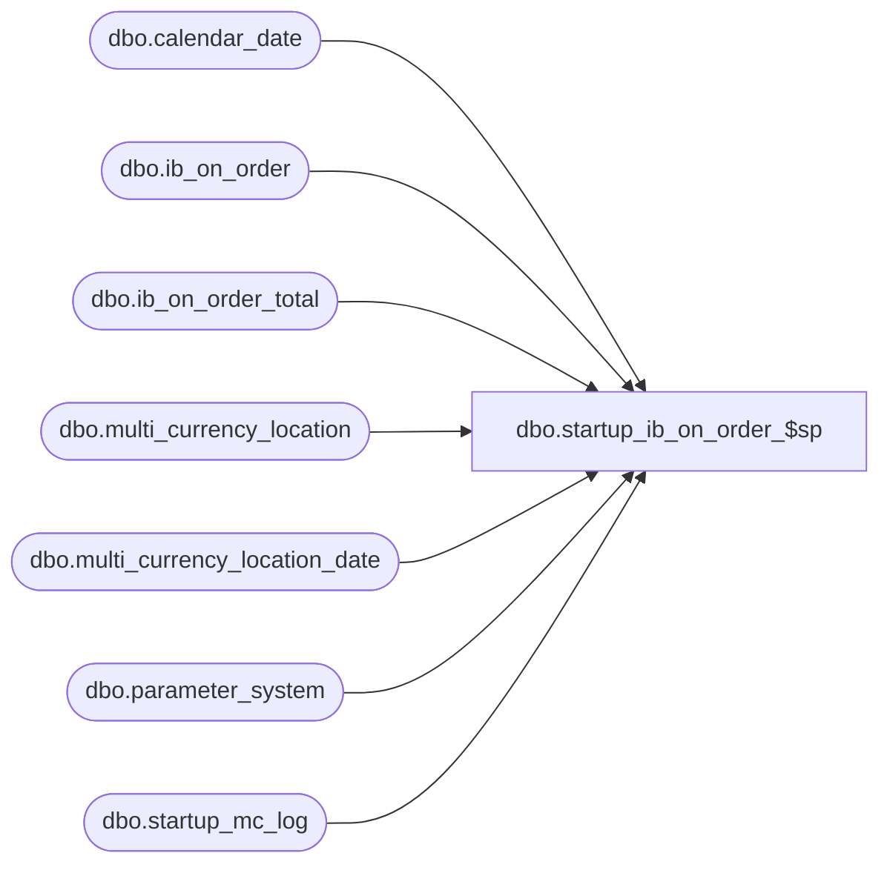

# dbo.startup_ib_on_order_$sp

**Database:** me_01  
**Server:** bedrockdb02  

## Architecture Diagram



## Table Dependencies

| Referenced Table |
|---|
| dbo.calendar_date |
| dbo.ib_on_order |
| dbo.ib_on_order_total |
| dbo.multi_currency_location |
| dbo.multi_currency_location_date |
| dbo.parameter_system |
| dbo.startup_mc_log |

## Stored Procedure Code

```sql
-- Copy of version added to R2 build 18 after build was released

CREATE PROCEDURE [dbo].[startup_ib_on_order_$sp]
AS
/*
    Version		: 1.00 
	Date		: 2009/12/22	
	Created by	: Pierrette Lemay
	Description : This procedure is part of the startup associated to the multi-currency project. It's populating the new columns
				  added to ib_on_order.
				  Depends on multi_currency_location
	Version 1.01  This version corrects the selection of the applicable exchange_rate when the transaction date
				  falls before the first effective_from_date defined in the system.
	Version 1.02  Remove the TRUNCATE TABLE.
	Version 1.03  Populate a new table called multi_currency_location_date and use it to populate ib_on_order because there was a bug in the previous UPDATE statement
				  Make this process re-startable
				  Make sure ib_on_order_total is updated even when pack_is IS NULL
*/
BEGIN
	DECLARE @last_receipt_date smalldatetime, @current_receipt_date smalldatetime, @error_msg NVARCHAR(4000), @crs_receipt_flg BIT, @multi_jurisdiction_flag BIT

	IF OBJECT_ID(N'multi_currency_location_date') IS NOT NULL 
		DROP TABLE multi_currency_location_date
		
	CREATE TABLE dbo.multi_currency_location_date
		( location_id SMALLINT NOT NULL,
		  exchange_rate float NOT NULL,
		  CONSTRAINT multi_currency_location_date_$pk PRIMARY KEY CLUSTERED (location_id) )
		  
    BEGIN TRY
		SELECT @multi_jurisdiction_flag = multi_sales_jurisdiction_flag FROM parameter_system

		-- Make this process re-startable
		SELECT @last_receipt_date = MAX(date_processed) from startup_mc_log 
		WHERE proc_name = N'startup_ib_on_order_$sp'
		AND completed_flag = 1

		IF @last_receipt_date IS NULL
			SELECT @last_receipt_date = MIN(calendar_date) FROM calendar_date

		-- Process by day, create a cursor on day
		DECLARE crs_receipt_date CURSOR FOR
		SELECT DISTINCT receipt_date 
	  	FROM ib_on_order_total
	  	WHERE receipt_date > @last_receipt_date
	  	ORDER BY receipt_date

	  	OPEN crs_receipt_date
		SET @crs_receipt_flg  = 1

		FETCH NEXT FROM crs_receipt_date INTO @current_receipt_date

		WHILE @@FETCH_STATUS = 0
		BEGIN
			-- populate multi_currency_location_date for the current date
			INSERT INTO multi_currency_location_date (location_id, exchange_rate)
			SELECT location_id, exchange_rate FROM multi_currency_location 
			WHERE currency_conversion_type = 1
			AND ( effective_from_date <= @current_receipt_date
				AND (effective_to_date >= @current_receipt_date OR effective_to_date IS NULL) )
				
			INSERT INTO multi_currency_location_date (location_id, exchange_rate)
			SELECT l.location_id, l.exchange_rate FROM multi_currency_location l
			WHERE  l.currency_conversion_type = 1
			AND ( l.effective_from_date <= GETDATE() 
				AND (l.effective_to_date >= GETDATE() OR l.effective_to_date IS NULL) )	
			AND NOT EXISTS (SELECT 1 FROM multi_currency_location_date d WHERE l.location_id = d.location_id)
			
			BEGIN TRAN
			  IF @multi_jurisdiction_flag = 1
				  UPDATE i 
				  SET i.on_order_cost_local = i.on_order_cost / m.exchange_rate
				  FROM ib_on_order i, multi_currency_location_date m
				  WHERE i.receipt_date = @current_receipt_date
				  AND i.location_id = m.location_id	
			  ELSE
				  UPDATE ib_on_order
				  SET on_order_cost_local = on_order_cost
				  WHERE receipt_date = @current_receipt_date

			  UPDATE i 
		      SET i.total_on_order_cost_local = ISNULL(i.total_on_order_cost_local, 0) + T.total_on_order_cost_local
		      FROM ib_on_order_total i WITH (INDEX(ib_on_order_total_$ndx2)), 
					(SELECT document_number, sku_id, location_id, receipt_date, pack_id, 
						SUM(on_order_cost_local) total_on_order_cost_local
					FROM ib_on_order
					WHERE receipt_date = @current_receipt_date
					GROUP BY document_number, sku_id, location_id, receipt_date, pack_id) T
		      WHERE i.receipt_date = @current_receipt_date
			  AND i.document_number = T.document_number
			  AND i.sku_id = T.sku_id
			  AND i.location_id = T.location_id
			 AND i.receipt_date = T.receipt_date
			  AND i.pack_id IS NULL
			  
			  UPDATE i 
		      SET i.total_on_order_cost_local = ISNULL(i.total_on_order_cost_local, 0) + T.total_on_order_cost_local
		      FROM ib_on_order_total i WITH (INDEX(ib_on_order_total_$ndx2)), 
					(SELECT document_number, sku_id, location_id, receipt_date, pack_id, 
						SUM(on_order_cost_local) total_on_order_cost_local
					FROM ib_on_order
					WHERE receipt_date = @current_receipt_date
					GROUP BY document_number, sku_id, location_id, receipt_date, pack_id) T
		      WHERE i.receipt_date = @current_receipt_date
			  AND i.document_number = T.document_number
			  AND i.sku_id = T.sku_id
			  AND i.location_id = T.location_id
			  AND i.receipt_date = T.receipt_date
			  AND i.pack_id IS NOT NULL
			  AND i.pack_id = T.pack_id

			  INSERT INTO startup_mc_log
					(proc_name, date_processed, end_time, completed_flag)
			  VALUES (N'startup_ib_on_order_$sp', @current_receipt_date, GETDATE(), 1) 

			COMMIT TRAN

			TRUNCATE TABLE multi_currency_location_date
			
			FETCH NEXT FROM crs_receipt_date INTO @current_receipt_date	   
      END
      
      CLOSE crs_receipt_date
	  DEALLOCATE crs_receipt_date
	  SET @crs_receipt_flg = 0

	END TRY
	BEGIN CATCH
	
		IF @@TRANCOUNT <> 0
			ROLLBACK TRANSACTION

		IF (@crs_receipt_flg = 1)
		BEGIN
			CLOSE crs_receipt_date
			DEALLOCATE crs_receipt_date
		 END

		 SET @error_msg = N'Error in procedure startup_ib_on_order_$sp: ' + CAST(ERROR_NUMBER() AS NVARCHAR) + N' ' + ERROR_MESSAGE()
		 RAISERROR (@error_msg, -- Message text.
			   16, -- Severity.
			   1) -- State.

	END CATCH
END
```

