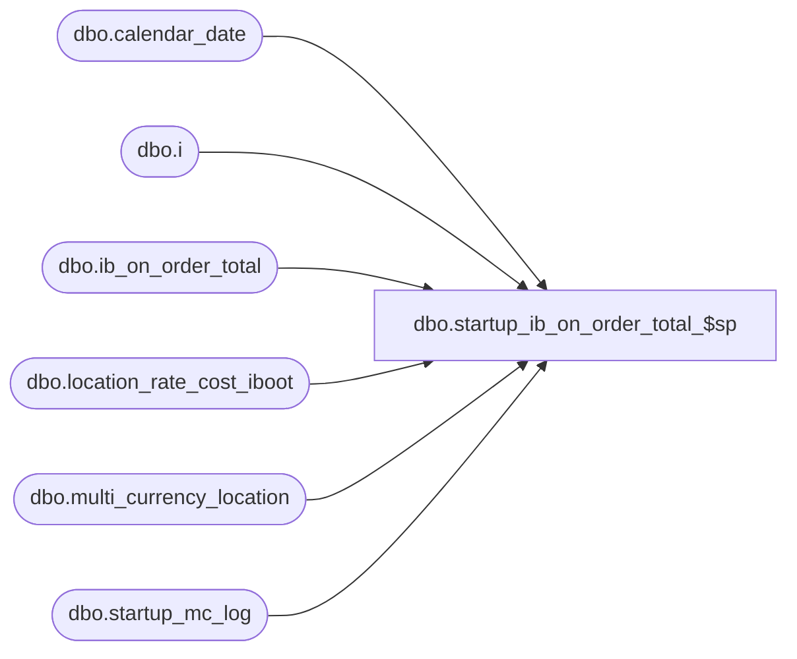

# dbo.startup_ib_on_order_total_$sp

**Database:** me_01  
**Server:** bedrockdb02  

## Architecture Diagram



## Table Dependencies

| Referenced Table |
|---|
| dbo.calendar_date |
| dbo.i |
| dbo.ib_on_order_total |
| dbo.location_rate_cost_iboot |
| dbo.multi_currency_location |
| dbo.startup_mc_log |

## Stored Procedure Code

```sql
CREATE PROCEDURE [dbo].[startup_ib_on_order_total_$sp]
AS
/*
    Version		: 1.00 
	Date		: 2010/01/05	
	Created by	: Pierrette Lemay
	Description : This procedure is part of the startup associated to the multi-currency project. It's populating the new columns
				  added to ib_on_order_total.
*/
DECLARE @last_receipt_date smalldatetime, @current_receipt_date smalldatetime, @error_msg NVARCHAR(4000), @crs_receipt_flg BIT

BEGIN
    IF OBJECT_ID(N'location_rate_cost_iboot') IS NOT NULL 
		DROP TABLE location_rate_cost_iboot
		
	CREATE TABLE location_rate_cost_iboot
		(location_id DECIMAL(12,0) NOT NULL, 
		exchange_rate_cost FLOAT NOT NULL
	PRIMARY KEY CLUSTERED 
		(location_id ASC))

	BEGIN TRY
		-- Make this process re-startable
		SELECT @last_receipt_date = MAX(date_processed) from startup_mc_log 
		WHERE proc_name = N'startup_ib_on_order_total_$sp'
		AND completed_flag = 1

		IF @last_receipt_date IS NULL
			SELECT @last_receipt_date = MIN(calendar_date) FROM calendar_date

		-- Process by day, create a cursor on day
		DECLARE crs_receipt_date CURSOR FOR
		SELECT DISTINCT receipt_date 
	  	FROM ib_on_order_total
		WHERE receipt_date > @last_receipt_date
	  	ORDER BY receipt_date

	  	OPEN crs_receipt_date
		SET @crs_receipt_flg  = 1

		FETCH NEXT FROM crs_receipt_date
			INTO @current_receipt_date

		WHILE @@FETCH_STATUS = 0
		BEGIN
			-- first load the temp table that will contain the correct rate to apply at the current receipt date
		   INSERT INTO location_rate_cost_iboot
			   ( location_id, exchange_rate_cost)
		   SELECT location_id, exchange_rate
		   FROM multi_currency_location
		   WHERE currency_conversion_type = 1 
		   AND effective_from_date <= @current_receipt_date 
		   AND @current_receipt_date <= effective_to_date 

		   INSERT INTO location_rate_cost_iboot
			   ( location_id, exchange_rate_cost)
		   SELECT m.location_id, m.exchange_rate
		   FROM multi_currency_location m
		   WHERE m.currency_conversion_type = 1 
		   AND m.effective_to_date IS NULL 
		   AND NOT EXISTS (SELECT 1 FROM location_rate_cost_iboot l
						   WHERE l.location_id = m.location_id)

		   UPDATE STATISTICS location_rate_cost_iboot
					
		   BEGIN TRAN
		      UPDATE i 
		      SET i.total_on_order_cost_local = i.total_on_order_cost / l.exchange_rate_cost
		      FROM ib_on_order_total i WITH (INDEX(ib_on_order_total_$ndx2)), location_rate_cost_iboot l
		      WHERE i.location_id = l.location_id
			  AND i.receipt_date = @current_receipt_date

		      INSERT INTO startup_mc_log
					(proc_name, date_processed, end_time, completed_flag)
			  VALUES (N'startup_ib_on_order_total_$sp', @current_receipt_date, GETDATE(), 1) 

			COMMIT TRAN

			TRUNCATE TABLE location_rate_cost_iboot
	
			FETCH NEXT FROM crs_receipt_date
			INTO @current_receipt_date	   
      END
      
      CLOSE crs_receipt_date
	  DEALLOCATE crs_receipt_date
	  SET @crs_receipt_flg = 0

	END TRY
	BEGIN CATCH
	
		IF @@TRANCOUNT <> 0
			ROLLBACK TRANSACTION

		IF (@crs_receipt_flg = 1)
		BEGIN
			CLOSE crs_receipt_date
			DEALLOCATE crs_receipt_date
		 END

		 SET @error_msg = N'Error in procedure startup_ib_on_order_total_$sp: ' + CAST(ERROR_NUMBER() AS NVARCHAR) + N' ' + ERROR_MESSAGE()
		 RAISERROR (@error_msg, -- Message text.
			   16, -- Severity.
			   1) -- State.

	END CATCH
END
```

