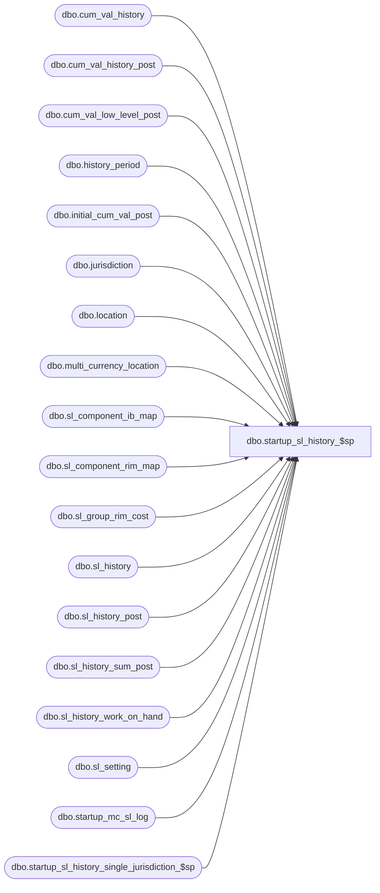

# dbo.startup_sl_history_$sp

**Database:** me_01  
**Server:** bedrockdb02  

## Architecture Diagram



## Table Dependencies

| Referenced Table |
|---|
| dbo.cum_val_history |
| dbo.cum_val_history_post |
| dbo.cum_val_low_level_post |
| dbo.history_period |
| dbo.initial_cum_val_post |
| dbo.jurisdiction |
| dbo.location |
| dbo.multi_currency_location |
| dbo.sl_component_ib_map |
| dbo.sl_component_rim_map |
| dbo.sl_group_rim_cost |
| dbo.sl_history |
| dbo.sl_history_post |
| dbo.sl_history_sum_post |
| dbo.sl_history_work_on_hand |
| dbo.sl_setting |
| dbo.startup_mc_sl_log |
| dbo.startup_sl_history_single_jurisdiction_$sp |

## Stored Procedure Code

```sql
CREATE PROCEDURE [dbo].[startup_sl_history_$sp] 
	( @run_type	AS	NVARCHAR(10) )
AS

/*
    Version		: 1.00 
	Date		: 2010/05/14	
	Created by	: Pierrette Lemay
	Description : This procedure is part of the startup associated to the multi-currency project. It's populating the new columns
				  added to sl_history and sl_group_rim_cost. The update trigger on sl_history is disbled at the beginning of the process
				  and enable at the end of the procedure.
				  Depends on multi_currency_location
				  
	Parameters:	For doing an initialization of SL, one parameter is required: INITIALIZE
				In order to populated the new columns in sl_history and sl_group_rim_cost, the parameter required is: UPDATE
	Version 1.2 Defect #141853 Only SL components linked sl_component_ib_map were covered in the first version of this stored procedure.

*/

BEGIN
	DECLARE @min_date smalldatetime, @max_date smalldatetime, @current_hist_period_id DECIMAL(12,0), @crs_loc_flag BIT,
		@error_msg NVARCHAR(4000), @crs_hist_prd_flg BIT, @current_end_date SMALLDATETIME, @batch_counter INT, @start_location_id SMALLINT, 
		@end_location_id SMALLINT, @current_count INT, @batch_size INT, @current_location_id SMALLINT, @v_run_type NVARCHAR(10), 
		@trigger_disable_flag BIT, @loc_count SMALLINT, @foreign_loc_count SMALLINT;

	SELECT @v_run_type = UPPER(@run_type), @foreign_loc_count = 0;
		
	BEGIN TRY
	   
	   IF (@v_run_type = N'INITIALIZE')
	   BEGIN
			-- (When upgrading from R1 to R2)
			-- Before running the segment 5006 in order to re-populate SL, we need to make sure that the following tables are empty
			-- and that we reset the 5 last ids of sl_setting back to 0.
			
			UPDATE dbo.sl_setting
			SET last_id = 0
			WHERE sl_setting_type between 1 and 5

			TRUNCATE TABLE sl_history
			TRUNCATE TABLE cum_val_history
			TRUNCATE TABLE initial_cum_val_post
			TRUNCATE TABLE sl_history_post
			TRUNCATE TABLE cum_val_history_post
			TRUNCATE TABLE sl_history_work_on_hand
			TRUNCATE TABLE cum_val_low_level_post
			TRUNCATE TABLE sl_history_sum_post
			TRUNCATE TABLE sl_group_rim_cost

			RETURN
	   END
	   ELSE IF (@v_run_type = N'UPDATE')
	   BEGIN
			-- Disable thr Update trigger on sl_history
			IF EXISTS (SELECT * FROM sys.triggers WHERE name = N'sl_history_$trU')
			BEGIN
				DISABLE TRIGGER sl_history_$trU ON sl_history;
				SET @trigger_disable_flag = 1;
			END
			ELSE
				SET @trigger_disable_flag = 0;
				
			-- Find out if all the locations belong to a single jurisdiction
			SELECT @foreign_loc_count = COUNT(*) FROM location l
			WHERE NOT EXISTS (SELECT * FROM jurisdiction j
					WHERE j.home_jurisdiction_flag = 1
					AND j.jurisdiction_id = l.jurisdiction_id);
							
			IF (@foreign_loc_count = 0)
				EXEC startup_sl_history_single_jurisdiction_$sp;
			ELSE
			BEGIN 
				-- find out if table multi_currency_location have been populated for each location included in al_history
				SELECT @loc_count = COUNT(*) FROM sl_history sl
				WHERE NOT EXISTS (SELECT 1 FROM multi_currency_location m
									WHERE sl.location_id = m.location_id);
				IF (@loc_count > 0)
				BEGIN
					RAISERROR (N'System cannot perform the upgrade of table sl_history in a multi-jurisdiction environment because some location(s) has no rate in table: multi_currency_location. ', -- Message text.
							   16, -- Severity.
							   1 -- State.
							   );
				END
				 
				SELECT @end_location_id = 0, 
					@crs_hist_prd_flg = 0, 
					@crs_loc_flag = 0,
					@batch_size = 100000,
					@current_hist_period_id = MAX(hist_period_processed)
				FROM startup_mc_sl_log
				WHERE proc_name = N'startup_sl_history_$sp'
				AND completed_flag = 1;

			   IF @current_hist_period_id IS NULL
				  SET @current_hist_period_id = 0;
			   ELSE
			   BEGIN
					-- This procedure ran previously, check if there is more to process or if the proc completed previously
					SELECT @end_location_id = MAX(end_location_id)
					FROM startup_mc_sl_log
					WHERE proc_name = N'startup_sl_history_$sp'
					AND hist_period_processed = @current_hist_period_id
					AND completed_flag = 1;		
				
					IF NOT EXISTS ( SELECT 1 FROM sl_history WHERE history_period_id > @current_hist_period_id
									UNION
									SELECT 1 FROM sl_history WHERE history_period_id = @current_hist_period_id AND location_id > @end_location_id )
					BEGIN
						PRINT N'All the periods have been processed, please verify the log in table: startup_mc_sl_log.  In order to start over the upgrade process truncate this log table.';
						RETURN;					
					END
				END

				-- Process by week, create a cursor on week
				DECLARE crs_hist_period CURSOR FOR
				SELECT DISTINCT history_period_id 
	  			FROM sl_history
				WHERE history_period_id > @current_hist_period_id
	  			ORDER BY history_period_id

	  			OPEN crs_hist_period
				SET @crs_hist_prd_flg = 1

				FETCH NEXT FROM crs_hist_period INTO @current_hist_period_id

				WHILE @@FETCH_STATUS = 0
				BEGIN
					-- go and get the last day of the current history_period
					SELECT @current_end_date = end_date, @end_location_id = 0 FROM history_period  WHERE history_period_id = @current_hist_period_id; 
						
						-- declare another cursor on location_count
						DECLARE crs_location_count CURSOR FOR
						SELECT location_id, COUNT(*) loc_count
						FROM sl_history
						WHERE history_period_id = @current_hist_period_id
						AND location_id > @end_location_id
						GROUP BY location_id
						ORDER BY location_id
						
						OPEN crs_location_count
						SELECT @crs_loc_flag = 1, @batch_counter = 0;

						FETCH NEXT FROM crs_location_count INTO @current_location_id, @current_count;

						WHILE @@FETCH_STATUS = 0
						BEGIN

							IF @batch_counter = 0
								SET @start_location_id = @current_location_id;

							SELECT @batch_counter = @batch_counter + @current_count,
								 @end_location_id = @current_location_id;

							IF (@batch_counter > @batch_size)
							BEGIN
								BEGIN TRAN
						
								-- Update the sl_history values for the sl_component of type cost
								UPDATE sl
								SET history_value_local = 
										( CASE
											WHEN c.ib_value_type = 0 THEN history_value / cost.exchange_rate -- this is a cost component
											WHEN c.ib_value_type = 2 THEN history_value -- this is a unit component
											ELSE history_value / retail.exchange_rate
										  END )
								FROM sl_history sl, sl_component_ib_map c, multi_currency_location cost, multi_currency_location retail
								WHERE sl.history_period_id = @current_hist_period_id
								AND sl.location_id BETWEEN @start_location_id AND @end_location_id
								AND sl.sl_component_id = c.sl_component_id
								-- Join with the cost alias
								AND sl.location_id = cost.location_id
								AND cost.currency_conversion_type = 1 
								AND cost.effective_from_date <= @current_end_date 
								AND (cost.effective_to_date >= @current_end_date
											OR cost.effective_to_date IS NULL) 
								-- Join with the retail alias
								AND sl.location_id = retail.location_id
								AND retail.currency_conversion_type = 2
								AND retail.effective_from_date <= @current_end_date 
								AND (retail.effective_to_date >= @current_end_date
											OR retail.effective_to_date IS NULL);
											
								-- Defect #141853 sl component linked to rim are not covered by the previous SQL
								UPDATE sl
								SET sl.history_value_local = sl.history_value / cost.exchange_rate
								FROM sl_history sl, sl_component_rim_map rim, multi_currency_location cost
								WHERE sl.history_period_id = @current_hist_period_id
								AND sl.location_id BETWEEN @start_location_id AND @end_location_id
								AND sl.sl_component_id = rim.sl_component_id
								-- Join with the cost alias
								AND sl.location_id = cost.location_id
								AND cost.currency_conversion_type = 1 
								AND cost.effective_from_date <= @current_end_date 
								AND (cost.effective_to_date >= @current_end_date
											OR cost.effective_to_date IS NULL);
									
								UPDATE c
								SET  value_local = sl.history_value_local
								FROM   sl_group_rim_cost c, sl_history sl 
								WHERE sl.history_period_id = @current_hist_period_id
								AND sl.location_id BETWEEN @start_location_id AND @end_location_id
								AND sl.sl_component_id IN (7, 8, 10, 13, 14, 17, 18, 20, 21, 22, 24, 25, 26, 27, 29)
								AND c.hierarchy_group_id = sl.merch_hierarchy_group_id
								AND c.history_period_id  = sl.history_period_id
								AND c.location_id        = sl.location_id
								AND c.sl_component_id    = sl.sl_component_id;
							    
								INSERT INTO startup_mc_sl_log
									(proc_name, hist_period_processed, start_location_id, end_location_id, end_time, completed_flag)
								VALUES (N'startup_sl_history_$sp', @current_hist_period_id, @start_location_id, @end_location_id, GETDATE(), 1) 
				    
								COMMIT TRAN
								
								SET @batch_counter = 0;
						END
						
						FETCH NEXT FROM crs_location_count INTO @current_location_id, @current_count;
					END
					-- Last loop if n_batch_count is not zero
					IF (@batch_counter <> 0) 
					BEGIN
						BEGIN TRAN
						
						-- Update the sl_history values for the sl_component of type cost
						UPDATE sl
						SET history_value_local = 
								( CASE
									WHEN c.ib_value_type = 0 THEN history_value / cost.exchange_rate -- this is a cost component
									WHEN c.ib_value_type = 2 THEN history_value -- this is a unit component
									ELSE history_value / retail.exchange_rate
								  END )
						FROM sl_history sl, sl_component_ib_map c, multi_currency_location cost, multi_currency_location retail
						WHERE sl.history_period_id = @current_hist_period_id
						AND sl.location_id BETWEEN @start_location_id AND @end_location_id
						AND sl.sl_component_id = c.sl_component_id
						-- Join with the cost alias
						AND sl.location_id = cost.location_id
						AND cost.currency_conversion_type = 1 
						AND cost.effective_from_date <= @current_end_date 
						AND (cost.effective_to_date >= @current_end_date
									OR cost.effective_to_date IS NULL) 
						-- Join with the retail alias
						AND sl.location_id = retail.location_id
						AND retail.currency_conversion_type = 2
						AND retail.effective_from_date <= @current_end_date 
						AND (retail.effective_to_date >= @current_end_date
									OR retail.effective_to_date IS NULL);
									
						-- Defect #141853 sl component linked to rim are not covered by the previous SQL
						UPDATE sl
						SET history_value_local = history_value / cost.exchange_rate 
						FROM sl_history sl, sl_component_rim_map rim,multi_currency_location cost
						WHERE sl.history_period_id = @current_hist_period_id
						AND sl.location_id BETWEEN @start_location_id AND @end_location_id
						AND sl.sl_component_id = rim.sl_component_id
						-- Join with the cost alias
						AND sl.location_id = cost.location_id
						AND cost.currency_conversion_type = 1 
						AND cost.effective_from_date <= @current_end_date 
						AND (cost.effective_to_date >= @current_end_date
									OR cost.effective_to_date IS NULL);
									
						UPDATE c
						SET  value_local = sl.history_value_local
						FROM   sl_group_rim_cost c, sl_history sl 
						WHERE sl.history_period_id = @current_hist_period_id
						AND sl.location_id BETWEEN @start_location_id AND @end_location_id
						AND sl.sl_component_id IN (7, 8, 10, 13, 14, 17, 18, 20, 21, 22, 24, 25, 26, 27, 29)
						AND c.hierarchy_group_id = sl.merch_hierarchy_group_id
						AND c.history_period_id  = sl.history_period_id
						AND c.location_id        = sl.location_id
						AND c.sl_component_id    = sl.sl_component_id;
							
						INSERT INTO startup_mc_sl_log
							(proc_name, hist_period_processed, start_location_id, end_location_id, end_time, completed_flag)
						VALUES (N'startup_sl_history_$sp', @current_hist_period_id, @start_location_id, @end_location_id, GETDATE(), 1) 
		    
						COMMIT TRAN
						
					END

					CLOSE crs_location_count
					DEALLOCATE crs_location_count
					SET @crs_loc_flag = 0;

					FETCH NEXT FROM crs_hist_period INTO @current_hist_period_id;
				END
		      
			  CLOSE crs_hist_period
			  DEALLOCATE crs_hist_period
			  SET @crs_hist_prd_flg = 0;
		  END
		  
		  IF (@trigger_disable_flag = 1)
			ENABLE TRIGGER sl_history_$trU ON sl_history;
		END  
	    ELSE
		  RAISERROR (N'Wrong option entered as a parameter, it must be either INITIALIZE or UPDATE.', -- Message text.
               16, -- Severity.
               1) -- State.
	
	END TRY
	BEGIN CATCH
	
	IF @@TRANCOUNT <> 0
		ROLLBACK TRANSACTION;
		
	SET @error_msg = N'Error in procedure startup_sl_history_$sp: ' + CAST(ERROR_NUMBER() AS NVARCHAR) + ' ' + ERROR_MESSAGE()

	IF (@crs_loc_flag = 1)
    BEGIN
		CLOSE crs_location_count
		DEALLOCATE crs_location_count
    END
    
    IF (@crs_hist_prd_flg = 1)
    BEGIN
      CLOSE crs_hist_period
	  DEALLOCATE crs_hist_period
    END
    
    IF (@trigger_disable_flag = 1)
			ENABLE TRIGGER sl_history_$trU ON sl_history;
   
	RAISERROR (@error_msg, -- Message text.
           16, -- Severity.
           1) -- State.

	END CATCH
END
```

