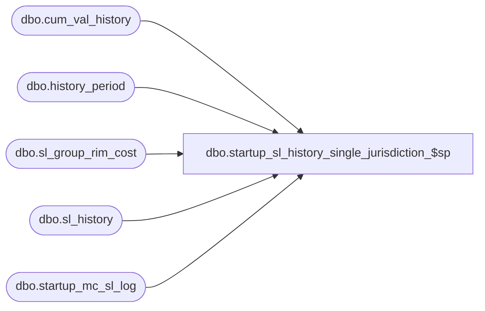

# dbo.startup_sl_history_single_jurisdiction_$sp

**Database:** me_01  
**Server:** bedrockdb02  

## Architecture Diagram



## Table Dependencies

| Referenced Table |
|---|
| dbo.cum_val_history |
| dbo.history_period |
| dbo.sl_group_rim_cost |
| dbo.sl_history |
| dbo.startup_mc_sl_log |

## Stored Procedure Code

```sql
CREATE PROCEDURE [dbo].[startup_sl_history_single_jurisdiction_$sp] 
AS

/*
    Version		: 1.00 
	Date		: 2013/03/01	
	Created by	: Pierrette Lemay
	Description : This procedure is part of the startup associated to the multi-currency project. It's populating the new columns
				  added to sl_history and sl_group_rim_cost. The update trigger on sl_history is disbled at the beginning of the process
				  and enable at the end of the procedure.
	This procedure was created for Defect #141853 as an accomodation for single jurisdiction databases.

*/

BEGIN
	DECLARE @min_date smalldatetime, @max_date smalldatetime, @current_hist_period_id DECIMAL(12,0), @crs_loc_flag BIT,
		@error_msg NVARCHAR(4000), @crs_hist_prd_flg BIT;
		
	BEGIN TRY

    SELECT @crs_hist_prd_flg = 0, 
		@current_hist_period_id = MAX(hist_period_processed)
	FROM startup_mc_sl_log
	WHERE proc_name = N'startup_sl_history_single_jurisdiction_$sp'
	AND completed_flag = 1;

   IF @current_hist_period_id IS NULL
	  SET @current_hist_period_id = 0;
				
	-- Process by week, create a cursor on week
	DECLARE crs_hist_prd CURSOR FOR
	SELECT history_period_id 
	FROM history_period
	WHERE history_period_id > @current_hist_period_id
	ORDER BY history_period_id;

	OPEN crs_hist_prd
	SET @crs_hist_prd_flg = 1;

	FETCH NEXT FROM crs_hist_prd INTO @current_hist_period_id

	WHILE @@FETCH_STATUS = 0
	BEGIN
		BEGIN TRAN
		
		-- Update the sl_history values for the sl_component of type cost
		UPDATE sl_history
		SET history_value_local = history_value
		WHERE history_period_id = @current_hist_period_id;
		
		UPDATE sl_group_rim_cost
	    SET  value_local = value
	    WHERE history_period_id = @current_hist_period_id
	    AND sl_component_id IN (7, 8, 10, 13, 14, 17, 18, 20, 21, 22, 24, 25, 26, 27, 29);
					
		-- UPDATE cum_val_history using the current history_period_id
		UPDATE c
		SET cum_val_cost_local = cum_val_cost,
			cum_val_retail_local = cum_val_retail
		FROM cum_val_history c, history_period h
		WHERE h.history_period_id = @current_hist_period_id
		AND h.calendar_period_id = c.calendar_period_id;
		
		INSERT INTO startup_mc_sl_log
			(proc_name, hist_period_processed, start_location_id, end_location_id, end_time, completed_flag)
		VALUES (N'startup_sl_history_single_jurisdiction_$sp', @current_hist_period_id, -1, -1, GETDATE(), 1);

		COMMIT TRAN

		FETCH NEXT FROM crs_hist_prd INTO @current_hist_period_id;
	END
      
	CLOSE crs_hist_prd
	DEALLOCATE crs_hist_prd
	SET @crs_hist_prd_flg = 0;
	
	END TRY
	BEGIN CATCH
	
	IF @@TRANCOUNT <> 0
		ROLLBACK TRANSACTION;
		
	SET @error_msg = N'Error in procedure startup_sl_history_single_jurisdiction_$sp: ' + CAST(ERROR_NUMBER() AS NVARCHAR) + ' ' + ERROR_MESSAGE();

	IF (@crs_hist_prd_flg = 1)
    BEGIN
      CLOSE crs_hist_prd
	  DEALLOCATE crs_hist_prd
    END
			
	RAISERROR (@error_msg, -- Message text.
           16, -- Severity.
           1) -- State.

	END CATCH
END
```

