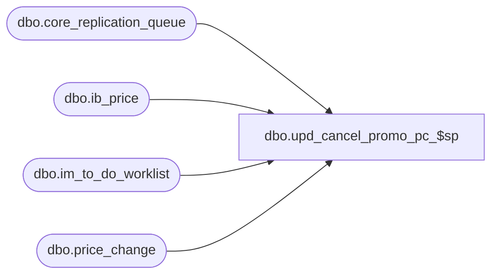

# dbo.upd_cancel_promo_pc_$sp

**Database:** me_01  
**Server:** bedrockdb02  

## Architecture Diagram



## Table Dependencies

| Referenced Table |
|---|
| dbo.core_replication_queue |
| dbo.ib_price |
| dbo.im_to_do_worklist |
| dbo.price_change |

## Stored Procedure Code

```sql
-----------------------------------------------------------------------------------------------------------------------------
--	Main Query: Create Procedure
--
--  This stored procedure is called when cancelling an issued promotional price change document.
-----------------------------------------------------------------------------------------------------------------------------

CREATE PROCEDURE dbo.upd_cancel_promo_pc_$sp

	@Price_Change_ID AS DECIMAL (12, 0)

AS

SET TRANSACTION ISOLATION LEVEL READ UNCOMMITTED
SET NOCOUNT ON

DECLARE
	@Price_Change_No AS NVARCHAR (20)
	,@Price_Change_Status SMALLINT
	,@Send_Price_Change_To_Webim_Flag BIT
	,@Document_Type SMALLINT
	,@Entity_Code_For_PLU SMALLINT
	,@Entity_Action_For_PLU NVARCHAR(1)

SELECT
	@Price_Change_No = PC.price_change_no
	,@Price_Change_Status = PC.price_change_status
	,@Send_Price_Change_To_Webim_Flag = PC.send_price_change_to_webim_flag
	,@Document_Type = 33
	,@Entity_Code_For_PLU = 931
	,@Entity_Action_For_PLU = N'C'
FROM
	dbo.price_change PC
WHERE
	PC.price_change_id = @Price_Change_ID

/*
PCM00405.3.5 - If cancelling an issued promotional document and if the PC header flag for ‘send price change to Web IM’ = True,  
then remove that price change from the Web IM To Do Worklist  (if it was still in the Web IM To Do List).
*/
IF (@Send_Price_Change_To_Webim_Flag = 1)
BEGIN

	DELETE FROM 
		im_to_do_worklist 
	WHERE 
		document_type = @Document_Type
		AND document_id = @Price_Change_ID

END

/*
PCM00405.3.6 - If cancelling an issued promotional document, add the canceled promo price change to the core replication queue 
to notify PLU of the cancellation (updated with entity code 931).

Note, if a promotional price change document is issued and then cancelled on the same day 
(i.e. the issued promo PC was not yet downloaded to POS), then PLU will not send down the promo PC to POS
*/

INSERT INTO core_replication_queue 
	(
		entity_code
		,replication_action
		,entity_id
		,primary_entity_key
	) 

SELECT
	@Entity_Code_For_PLU
	,@Entity_Action_For_PLU
	,@Price_Change_ID
	,@Price_Change_No

/*
PCM00405.3.7 - If cancelling am issued promotional document, update IB Price as follows:

	PCM00405.3.7.1 - Set the cancel promo flag to True for all rows that were previously inserted for this promo PC 
					 (note, ignore any row in IB price that already has the cancel promo flag set to True for that 
					 price change document).

	PCM00405.3.7.2 - For each  IB Price row where the cancel promo flag was updated from False to True 
					(for the cancelled promo PC), insert a new row and set all values the same as the 
					cancelled row EXCEPT set the end date to the current system date and the cancel promo flag to False.
*/

INSERT INTO dbo.ib_price

		(
			 style_id
			,color_id
			,location_id
			,jurisdiction_id
			,pricing_group_id
			,temp_price_flag
			,[start_date]
			,end_date
			,valuation_retail_price
			,selling_retail_price
			,price_status_id
			,document_number
			,cancel_promo_flag
			,effective_date
			,price_change_type
			,insert_guid
			,style_color_id
			,sku_id
		)

SELECT
	SQU.style_id
	,SQU.color_id
	,SQU.location_id
	,SQU.jurisdiction_id
	,SQU.pricing_group_id
	,SQU.temp_price_flag
	,SQU.[start_date]
	,GETDATE() AS end_date
	,SQU.valuation_retail_price
	,SQU.selling_retail_price
	,SQU.price_status_id
	,SQU.document_number
	,0 AS cancel_promo_flag
	,SQU.effective_date
	,SQU.price_change_type
	,SQU.insert_guid
	,SQU.style_color_id
	,SQU.sku_id

FROM
	(
		UPDATE dbo.ib_price
		SET
			cancel_promo_flag = 1
		OUTPUT
			inserted.style_id
			,inserted.color_id
			,inserted.location_id
			,inserted.jurisdiction_id
			,inserted.pricing_group_id
			,inserted.temp_price_flag
			,inserted.[start_date]
			,inserted.valuation_retail_price
			,inserted.selling_retail_price
			,inserted.price_status_id
			,inserted.document_number
			,inserted.effective_date
			,inserted.price_change_type
			,inserted.insert_guid
			,inserted.style_color_id
			,inserted.sku_id
		WHERE
			document_number = @Price_Change_No
			AND cancel_promo_flag = 0
	) SQU
```

