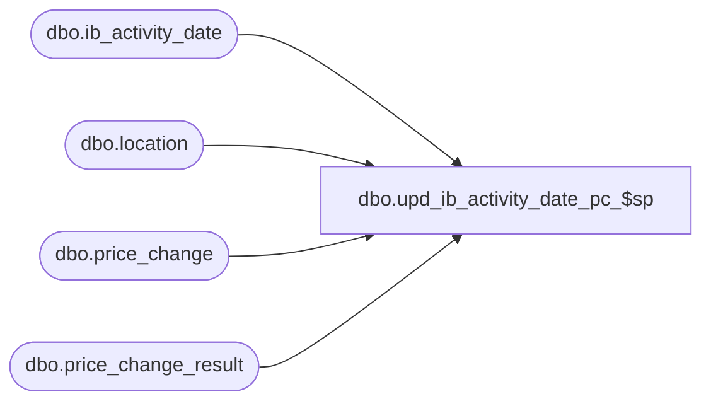

# dbo.upd_ib_activity_date_pc_$sp

**Database:** me_01  
**Server:** bedrockdb02  

## Architecture Diagram



## Table Dependencies

| Referenced Table |
|---|
| dbo.ib_activity_date |
| dbo.location |
| dbo.price_change |
| dbo.price_change_result |

## Stored Procedure Code

```sql
-----------------------------------------------------------------------------------------------------------------------------
--	Main Query: Create Procedure
-----------------------------------------------------------------------------------------------------------------------------

CREATE PROCEDURE [dbo].[upd_ib_activity_date_pc_$sp]

	 @Effective_From_Date AS SMALLDATETIME
	,@Price_Change_ID AS DECIMAL (12, 0)

AS

--	Object GUID: BEA9BB07-9438-45A6-A6E8-94F37029A347
--	Pricing GUID (General): EFB5A343-8978-4ACF-952C-37862704CBC8

SET TRANSACTION ISOLATION LEVEL READ UNCOMMITTED
SET NOCOUNT ON

DECLARE @Result_ID AS DECIMAL(12,0) = (SELECT result_id FROM dbo.price_change WHERE price_change_id = @Price_Change_ID);

--for explicit location price changes
MERGE
	dbo.ib_activity_date T
USING

	(
		SELECT DISTINCT
			 PCD.style_id
			,PCD.color_id
			,PCD.location_id
		FROM
			dbo.price_change_result PCD
		WHERE
			PCD.result_id = @Result_ID
			AND PCD.is_pseudo_instruction = 0
			AND PCD.location_id is not null
	) S ON S.style_id = T.style_id AND S.color_id = T.color_id AND S.location_id = T.location_id

WHEN MATCHED THEN

	UPDATE
	SET
		 T.first_markdown_date = (CASE
									WHEN T.first_markdown_date IS NULL THEN @Effective_From_Date
									WHEN T.first_markdown_date > @Effective_From_Date THEN @Effective_From_Date
									ELSE T.first_markdown_date
									END)
		,T.last_markdown_date = (CASE
									WHEN T.last_markdown_date IS NULL THEN @Effective_From_Date
									WHEN T.last_markdown_date < @Effective_From_Date THEN @Effective_From_Date
									ELSE T.last_markdown_date
									END)

WHEN NOT MATCHED THEN

	INSERT

		(
			 style_id
			,color_id
			,location_id
			,first_receipt_date
			,last_receipt_date
			,first_sale_date
			,last_sale_date
			,first_on_order_date
			,last_on_order_date
			,first_po_receipt_date
			,last_po_receipt_date
			,first_markdown_date
			,last_markdown_date
		)

	VALUES

		(
			 S.style_id
			,S.color_id
			,S.location_id
			,NULL -- first_receipt_date
			,NULL -- last_receipt_date
			,NULL -- first_sale_date
			,NULL -- last_sale_date
			,NULL -- first_on_order_date
			,NULL -- last_on_order_date
			,NULL -- first_po_receipt_date
			,NULL -- last_po_receipt_date
			,@Effective_From_Date -- first_markdown_date
			,@Effective_From_Date -- last_markdown_date
		);


MERGE
	dbo.ib_activity_date T
USING

	(
		SELECT DISTINCT
			 PCD.style_id
			,PCD.color_id
			,L.location_id
		FROM
			dbo.price_change_result PCD
			INNER JOIN location L on L.jurisdiction_id=PCD.jurisdiction_id
		WHERE
			PCD.result_id = @Result_ID
			AND PCD.is_pseudo_instruction = 0
			AND PCD.location_id is null

	) S ON S.style_id = T.style_id AND S.color_id = T.color_id AND S.location_id = T.location_id

WHEN MATCHED THEN

	UPDATE
	SET
		 T.first_markdown_date = (CASE
									WHEN T.first_markdown_date IS NULL THEN @Effective_From_Date
									WHEN T.first_markdown_date > @Effective_From_Date THEN @Effective_From_Date
									ELSE T.first_markdown_date
									END)
		,T.last_markdown_date = (CASE
									WHEN T.last_markdown_date IS NULL THEN @Effective_From_Date
									WHEN T.last_markdown_date < @Effective_From_Date THEN @Effective_From_Date
									ELSE T.last_markdown_date
									END)

WHEN NOT MATCHED THEN

	INSERT

		(
			 style_id
			,color_id
			,location_id
			,first_receipt_date
			,last_receipt_date
			,first_sale_date
			,last_sale_date
			,first_on_order_date
			,last_on_order_date
			,first_po_receipt_date
			,last_po_receipt_date
			,first_markdown_date
			,last_markdown_date
		)

	VALUES

		(
			 S.style_id
			,S.color_id
			,S.location_id
			,NULL -- first_receipt_date
			,NULL -- last_receipt_date
			,NULL -- first_sale_date
			,NULL -- last_sale_date
			,NULL -- first_on_order_date
			,NULL -- last_on_order_date
			,NULL -- first_po_receipt_date
			,NULL -- last_po_receipt_date
			,@Effective_From_Date -- first_markdown_date
			,@Effective_From_Date -- last_markdown_date
		)
;
```

