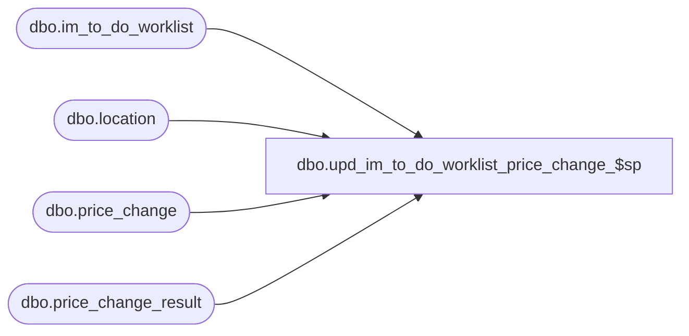

# dbo.upd_im_to_do_worklist_price_change_$sp

**Database:** me_01  
**Server:** bedrockdb02  

## Architecture Diagram



## Table Dependencies

| Referenced Table |
|---|
| dbo.im_to_do_worklist |
| dbo.location |
| dbo.price_change |
| dbo.price_change_result |

## Stored Procedure Code

```sql
----------------------------------------------------------------------------------------------------------------------------
--	Main Query: Create Procedure
-----------------------------------------------------------------------------------------------------------------------------

CREATE PROCEDURE dbo.upd_im_to_do_worklist_price_change_$sp

	@Price_Change_ID AS DECIMAL (12, 0)
	,@Location_ID AS SMALLINT = NULL

AS

--	Object GUID: 0DCB2CD3-6910-4F42-8788-E324A6D98FF8

SET TRANSACTION ISOLATION LEVEL READ UNCOMMITTED
SET NOCOUNT ON


-----------------------------------------------------------------------------------------------------------------------------
--	Declarations / Sets: Declare And Set Variables
-----------------------------------------------------------------------------------------------------------------------------

DECLARE
	 @Send_Price_Change_To_Webim_Flag BIT
	,@Document_Type SMALLINT
	,@Price_Change_Status SMALLINT
	,@Result_ID AS DECIMAL(12,0)

SELECT
	 @Send_Price_Change_To_Webim_Flag = PC.send_price_change_to_webim_flag
	,@Document_Type = 33
	,@Price_Change_Status = PC.price_change_status
	,@Result_ID = PC.result_id
FROM
	dbo.price_change PC
WHERE
	PC.price_change_id = @Price_Change_ID

IF (@Send_Price_Change_To_Webim_Flag = 1 AND @Price_Change_Status IN (3,4))
BEGIN

	INSERT INTO im_to_do_worklist
		(
			document_type
			,document_id
			,location_id
		)

	SELECT
		DISTINCT
			@Document_Type AS document_type
			,@Price_Change_ID AS document_id
			,location_id
	FROM
		(
			SELECT
				DISTINCT
					location_id
			FROM
				dbo.price_change_result PCD
			WHERE
				PCD.is_pseudo_instruction = 0
				AND PCD.result_id = @Result_ID
				AND PCD.location_id IS NOT NULL
				AND (PCD.location_id = @Location_ID OR @Location_ID IS NULL)
			UNION ALL
			SELECT
				DISTINCT
					L.location_id
			FROM
				price_change_result PCD
			INNER JOIN dbo.location L ON PCD.jurisdiction_id = L.jurisdiction_id
			WHERE
				PCD.is_pseudo_instruction = 0
				AND PCD.result_id = @Result_ID
				AND PCD.location_id IS NULL
				AND (L.location_id = @Location_ID OR @Location_ID IS NULL)
		) sq
	WHERE
		NOT EXISTS
			(
				SELECT 1
				FROM
					im_to_do_worklist ITDW
				WHERE
					ITDW.document_id = @Price_Change_ID
					AND ITDW.document_type = @Document_Type
					AND ITDW.location_id = sq.location_id
			)

END
```

