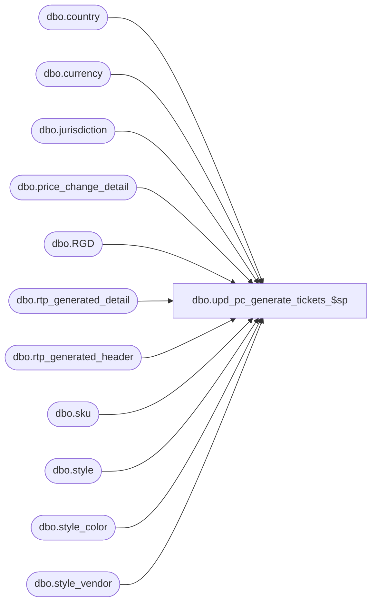

# dbo.upd_pc_generate_tickets_$sp

**Database:** me_01  
**Server:** bedrockdb02  

## Architecture Diagram



## Table Dependencies

| Referenced Table |
|---|
| dbo.country |
| dbo.currency |
| dbo.jurisdiction |
| dbo.price_change_detail |
| dbo.RGD |
| dbo.rtp_generated_detail |
| dbo.rtp_generated_header |
| dbo.sku |
| dbo.style |
| dbo.style_color |
| dbo.style_vendor |

## Stored Procedure Code

```sql
CREATE PROCEDURE dbo.upd_pc_generate_tickets_$sp

	@Price_Change_ID AS DECIMAL (12, 0)
	,@Location_ID AS SMALLINT = NULL

AS

DECLARE @Current_Date AS DATETIME = CAST(FLOOR(CAST(GETDATE() AS FLOAT)) AS DATETIME)

DECLARE @Document_Type AS TINYINT = 5
DECLARE @Print_Status AS TINYINT = 2

SET TRANSACTION ISOLATION LEVEL READ UNCOMMITTED
SET NOCOUNT ON

-----------------------------------------------------------------------------------------------------------------------------
--	Error Trapping: Check If Temp Table(s) Already Exist(s) And Drop If Applicable
-----------------------------------------------------------------------------------------------------------------------------

IF OBJECT_ID (N'tempdb.dbo.#temp_rtp_generated_header', N'U') IS NOT NULL
BEGIN

	DROP TABLE dbo.#temp_rtp_generated_header

END

IF OBJECT_ID (N'tempdb.dbo.#temp_rtp_generated_detail', N'U') IS NOT NULL
BEGIN

	DROP TABLE dbo.#temp_rtp_generated_detail

END

CREATE TABLE dbo.#temp_rtp_generated_header
	(
		document_id DECIMAL(12, 0)
		,document_type TINYINT
		,location_id SMALLINT
		,vendor_id DECIMAL(12, 0)
		,print_status TINYINT
		,deleted_flag BIT
		,date_updated SMALLDATETIME
	)

CREATE TABLE dbo.#temp_rtp_generated_detail
	(
		location_id SMALLINT NOT NULL
		,vendor_id DECIMAL(12, 0) NOT NULL
		,style_id DECIMAL(12, 0) NOT NULL
		,style_color_id DECIMAL(13, 0) NOT NULL
		,style_size_id DECIMAL(13, 0) NOT NULL
		,unit_price DECIMAL(14, 2) NULL
		,rtp_format_id SMALLINT NOT NULL
		,currency_symbol NVARCHAR(3) NULL
		,currency_code NVARCHAR(3) NULL
	)

INSERT INTO dbo.#temp_rtp_generated_detail
	(
		location_id
		,vendor_id
		,style_id
		,style_color_id
		,style_size_id
		,unit_price
		,rtp_format_id
		,currency_symbol
		,currency_code
	)
SELECT
	PCD.location_id
	,SV.vendor_id
	,PCD.style_id
	,SC.style_color_id
	,SK.style_size_id
	,PCD.selling_retail_price AS unit_price
	,S.ticket_format_id AS rtp_format_id
	,CRCY.currency_symbol
	,CRCY.currency_code
FROM
	dbo.price_change_detail PCD
INNER JOIN dbo.style_vendor SV ON SV.style_id = PCD.style_id AND SV.primary_vendor_flag = 1
INNER JOIN dbo.style_color SC ON SC.style_id = PCD.style_id AND SC.color_id = PCD.color_id
INNER JOIN dbo.sku SK ON SK.sku_id = PCD.sku_id
INNER JOIN dbo.style S ON S.style_id = SC.style_id
INNER JOIN dbo.jurisdiction J ON J.jurisdiction_id = PCD.jurisdiction_id
INNER JOIN dbo.country CTRY ON CTRY.country_id = J.country_id
INNER JOIN dbo.currency CRCY ON CRCY.currency_id = CTRY.currency_id
WHERE
	PCD.price_change_id = @Price_Change_ID
	AND (PCD.location_id = @Location_ID OR @Location_ID IS NULL)
	AND PCD.current_retail_price <> PCD.selling_retail_price

INSERT INTO dbo.#temp_rtp_generated_header
	(
		document_id
		,document_type
		,location_id
		,vendor_id
		,print_status
		,deleted_flag
		,date_updated
	)
SELECT
	@Price_Change_ID AS document_id
	,@Document_Type AS document_type
	,sqMRG.location_id
	,sqMRG.vendor_id
	,@Print_Status AS print_status
	,sqMRG.deleted_flag
	,sqMRG.date_updated
FROM
	(
		MERGE
			dbo.rtp_generated_detail RGD
		USING
			dbo.#temp_rtp_generated_detail TRGD ON RGD.document_id = @Price_Change_ID
																	AND RGD.document_type = @Document_Type
																	AND TRGD.location_id = RGD.location_id
																	AND TRGD.vendor_id = RGD.vendor_id
																	AND TRGD.style_id = RGD.style_id
																	AND TRGD.style_color_id = RGD.style_color_id
																	AND TRGD.style_size_id = RGD.style_size_id

		WHEN MATCHED AND RGD.print_flag = 1 AND RGD.unit_price <> TRGD.unit_price THEN

			UPDATE
			SET
				RGD.tkt_unit = 0
				,RGD.unit_price = TRGD.unit_price
				,RGD.date_updated = @Current_Date
				,RGD.print_flag = 0
				,RGD.deleted_flag = CASE WHEN (RGD.print_flag = 1 AND RGD.unit_price <> TRGD.unit_price) THEN 0 ELSE RGD.deleted_flag END

		WHEN NOT MATCHED BY TARGET THEN

			INSERT
				(
					document_id
					,document_type
					,location_id
					,vendor_id
					,style_id
					,style_color_id
					,style_size_id
					,tkt_unit
					,unit_price
					,rtp_format_id
					,print_flag
					,deleted_flag
					,date_updated
					,currency_symbol
					,currency_code
				)
			VALUES
				(
					@Price_Change_ID
					,@Document_Type
					,TRGD.location_id
					,TRGD.vendor_id
					,TRGD.style_id
					,TRGD.style_color_id
					,TRGD.style_size_id
					,0
					,TRGD.unit_price
					,TRGD.rtp_format_id
					,0
					,0
					,@Current_Date
					,TRGD.currency_symbol
					,TRGD.currency_code
				)

		OUTPUT

			$action AS action_performed
			,inserted.location_id
			,inserted.vendor_id
			,inserted.deleted_flag
			,inserted.date_updated

	) sqMRG
WHERE
	action_performed = 'INSERT'

INSERT INTO dbo.rtp_generated_header
	(
		document_id
		,document_type
		,location_id
		,vendor_id
		,print_status
		,deleted_flag
		,date_updated
	)
SELECT
	DISTINCT
		document_id
		,document_type
		,location_id
		,vendor_id
		,print_status
		,deleted_flag
		,date_updated
FROM
	dbo.#temp_rtp_generated_header TRGH
WHERE
	NOT EXISTS
		(
			SELECT 1
			FROM
				 dbo.rtp_generated_header RGH
			WHERE
				RGH.document_id = TRGH.document_id
				AND RGH.document_type = TRGH.document_type
				AND RGH.location_id = TRGH.location_id
				AND RGH.vendor_id = TRGH.vendor_id
		)

DELETE RGD
FROM
	dbo.rtp_generated_detail RGD
WHERE
	RGD.document_id = @Price_Change_ID
	AND NOT EXISTS
		(
			SELECT 1
			FROM
				dbo.#temp_rtp_generated_detail TRGD
			WHERE
				RGD.document_id = @Price_Change_ID
				AND RGD.document_type = @Document_Type
				AND TRGD.location_id = RGD.location_id
				AND TRGD.vendor_id = RGD.vendor_id
				AND TRGD.style_id = RGD.style_id
				AND TRGD.style_color_id = RGD.style_color_id
				AND TRGD.style_size_id = RGD.style_size_id
		)

RETURN
```

