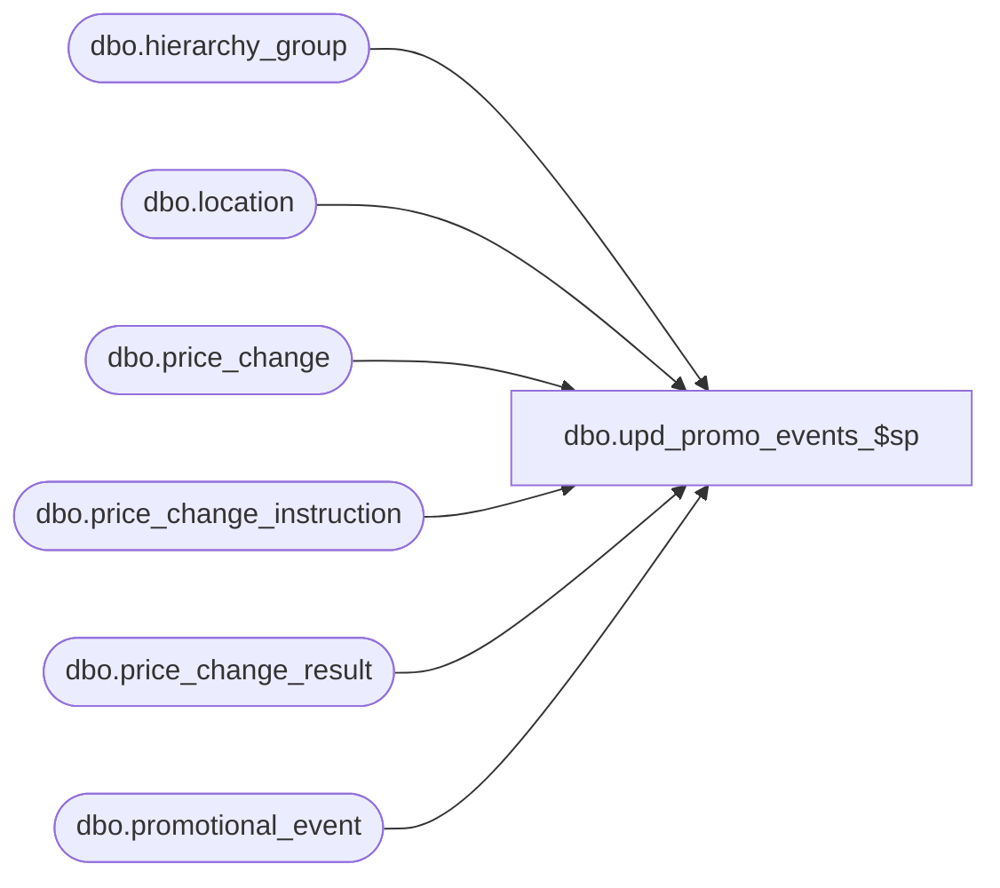

# dbo.upd_promo_events_$sp

**Database:** me_01  
**Server:** bedrockdb02  

## Architecture Diagram



## Table Dependencies

| Referenced Table |
|---|
| dbo.hierarchy_group |
| dbo.location |
| dbo.price_change |
| dbo.price_change_instruction |
| dbo.price_change_result |
| dbo.promotional_event |

## Stored Procedure Code

```sql
-----------------------------------------------------------------------------------------------------------------------------
--	Main Query: Create Procedure
-----------------------------------------------------------------------------------------------------------------------------

CREATE PROCEDURE dbo.upd_promo_events_$sp

	@Price_Change_ID AS DECIMAL (12, 0)
	,@Location_ID AS SMALLINT = NULL

AS

--	Object GUID: F71F7443-FF17-45A7-BB6B-450F25E29B84
--	Pricing GUID (General): EFB5A343-8978-4ACF-952C-37862704CBC8

SET TRANSACTION ISOLATION LEVEL READ UNCOMMITTED
SET NOCOUNT ON


-----------------------------------------------------------------------------------------------------------------------------
--	Declarations / Sets: Declare And Set Variables
-----------------------------------------------------------------------------------------------------------------------------

DECLARE
	 @Effective_From_Date AS SMALLDATETIME
	,@Effective_To_Date AS SMALLDATETIME
	,@Price_Change_No AS NVARCHAR (20)
	,@Price_Change_Type AS SMALLINT
	,@Price_Status_ID AS SMALLINT
	,@Price_Change_Description AS NVARCHAR(120)
	,@Promotional_Event_Flag AS BIT
	,@Event_Type AS SMALLINT
	,@Enterprise_Hierarchy_Group_ID AS INT
	,@Price_Change_Duration AS SMALLINT
	,@Price_Change_Status AS SMALLINT
	,@Result_ID AS DECIMAL(12, 0)

SET @Event_Type = 3	-- PCM
-- enum deal = 1, non-pricing = 2, pcm = 3
SELECT @Enterprise_Hierarchy_Group_ID = hierarchy_group_id FROM hierarchy_group WHERE parent_group_id IS NULL AND hierarchy_id = 1

SELECT
	 @Effective_From_Date = PC.effective_from_date
	,@Effective_To_Date = PC.effective_to_date
	,@Price_Change_No = PC.price_change_no
	,@Price_Change_Type = PC.price_change_type
	,@Price_Status_ID = PC.price_status_id
	,@Price_Change_Description = PC.price_change_description
	,@Promotional_Event_Flag = PC.promotional_event_flag
	,@Price_Change_Duration = PC.price_change_duration
	,@Price_Change_Status = PC.price_change_status
	,@Result_ID = PC.result_id
FROM
	dbo.price_change PC
WHERE
	PC.price_change_id = @Price_Change_ID

/*
	PCM00393.2.6
	If the promo price change type is MD or MUC and the flag on the PC header for ‘update promotional events in A&R’ is set to True,
	then update A&R’s  promotional  event table with all item/locations that have been marked down by this price change.
*/

IF ((@Price_Change_Type = 0 OR @Price_Change_Type = 3) AND @Promotional_Event_Flag = 1 AND @Price_Change_Duration = 1 AND @Price_Change_Status = 4)
BEGIN

	/*
	Add a record to the promotional_event table like this
	Price change instruction is at Hierarchy Group or higher level, add records with hierarchy_group_id set
	Price change instruction is at Style level and not included in above, add records with style_id set
	Price change instruction is at Style Color level and not included in above, add records with style_color_id set
	Price change instruction is at Sku level and not included in above, add records with sku_id set
	*/

	MERGE
		dbo.promotional_event T
	USING

		(
			SELECT
				DISTINCT
					@Price_Change_No AS event_number
					,@Event_Type AS event_type
					,@Price_Change_Description AS [description]
					,@Effective_From_Date AS [start_date]
					,@Effective_To_Date AS end_date
					,PCD.location_id
					,CASE
							WHEN PCI.merch_instruction_type = 2 THEN PCI.style_id
							ELSE NULL
						END AS style_id
					,CASE
							WHEN PCI.merch_instruction_type = 3 THEN PCI.style_color_id
							ELSE NULL
						END AS style_color_id
					,CASE
							WHEN PCI.merch_instruction_type = 4 THEN PCI.sku_id
							ELSE NULL
						END AS sku_id
					,CASE
							WHEN PCI.merch_instruction_type = 1 THEN PCI.merch_hierarchy_group_id
							WHEN PCI.merch_instruction_type = 0 THEN @Enterprise_Hierarchy_Group_ID
							ELSE NULL
						END AS hierarchy_group_id
			FROM
				dbo.price_change_result PCD
			INNER JOIN dbo.price_change_instruction PCI ON PCI.price_change_id = @Price_Change_ID
																				AND PCD.price_change_instruction_id = PCI.price_change_instruction_id
			WHERE
				PCD.result_id = @Result_ID
				AND (PCD.location_id = @Location_ID OR @Location_ID IS NULL)
				AND PCD.location_id IS NOT NULL

		) S ON S.event_number = T.event_number AND S.event_type = T.event_type
					AND S.location_id = T.location_id
					AND ((S.style_id = T.style_id) OR (S.style_id IS NULL AND T.style_id IS NULL))
					AND ((S.style_color_id = T.style_color_id) OR (S.style_color_id IS NULL AND T.style_color_id IS NULL))
					AND ((S.sku_id = T.sku_id) OR (S.sku_id IS NULL AND T.sku_id IS NULL))
					AND ((S.hierarchy_group_id = T.hierarchy_group_id) OR (S.hierarchy_group_id IS NULL AND T.hierarchy_group_id IS NULL))

	WHEN MATCHED THEN

		UPDATE
		SET
			T.end_date = S.end_date

	WHEN NOT MATCHED THEN

		INSERT

			(
				id
				,event_number
				,event_type
				,[description]
				,[start_date]
				,end_date
				,location_id
				,style_id
				,style_color_id
				,sku_id
				,hierarchy_group_id
			)

		VALUES

			(
				newid()
				,S.event_number
				,S.event_type
				,S.[description]
				,S.[start_date]
				,S.end_date
				,S.location_id
				,S.style_id
				,S.style_color_id
				,S.sku_id
				,S.hierarchy_group_id
			)
	;

	MERGE
		dbo.promotional_event T
	USING

		(
			SELECT
				DISTINCT
					@Price_Change_No AS event_number
					,@Event_Type AS event_type
					,@Price_Change_Description AS [description]
					,@Effective_From_Date AS [start_date]
					,@Effective_To_Date AS end_date
					,L.location_id
					,CASE
							WHEN PCI.merch_instruction_type = 2 THEN PCI.style_id
							ELSE NULL
						END AS style_id
					,CASE
							WHEN PCI.merch_instruction_type = 3 THEN PCI.style_color_id
							ELSE NULL
						END AS style_color_id
					,CASE
							WHEN PCI.merch_instruction_type = 4 THEN PCI.sku_id
							ELSE NULL
						END AS sku_id
					,CASE
							WHEN PCI.merch_instruction_type = 1 THEN PCI.merch_hierarchy_group_id
							WHEN PCI.merch_instruction_type = 0 THEN @Enterprise_Hierarchy_Group_ID
							ELSE NULL
						END AS hierarchy_group_id
			FROM
				dbo.price_change_result PCD
			INNER JOIN dbo.location L ON L.jurisdiction_id = PCD.jurisdiction_id
			INNER JOIN dbo.price_change_instruction PCI ON PCI.price_change_id = @Price_Change_ID
																				AND PCD.price_change_instruction_id = PCI.price_change_instruction_id
			WHERE
				PCD.result_id = @Result_ID
				AND (L.location_id = @Location_ID OR @Location_ID IS NULL)
				AND PCD.location_id IS NULL

		) S ON S.event_number = T.event_number AND S.event_type = T.event_type
					AND S.location_id = T.location_id
					AND ((S.style_id = T.style_id) OR (S.style_id IS NULL AND T.style_id IS NULL))
					AND ((S.style_color_id = T.style_color_id) OR (S.style_color_id IS NULL AND T.style_color_id IS NULL))
					AND ((S.sku_id = T.sku_id) OR (S.sku_id IS NULL AND T.sku_id IS NULL))
					AND ((S.hierarchy_group_id = T.hierarchy_group_id) OR (S.hierarchy_group_id IS NULL AND T.hierarchy_group_id IS NULL))

	WHEN MATCHED THEN

		UPDATE
		SET
			T.end_date = S.end_date

	WHEN NOT MATCHED THEN

		INSERT

			(
				id
				,event_number
				,event_type
				,[description]
				,[start_date]
				,end_date
				,location_id
				,style_id
				,style_color_id
				,sku_id
				,hierarchy_group_id
			)

		VALUES

			(
				newid()
				,S.event_number
				,S.event_type
				,S.[description]
				,S.[start_date]
				,S.end_date
				,S.location_id
				,S.style_id
				,S.style_color_id
				,S.sku_id
				,S.hierarchy_group_id
			)
	;

END

ELSE
	RETURN
```

