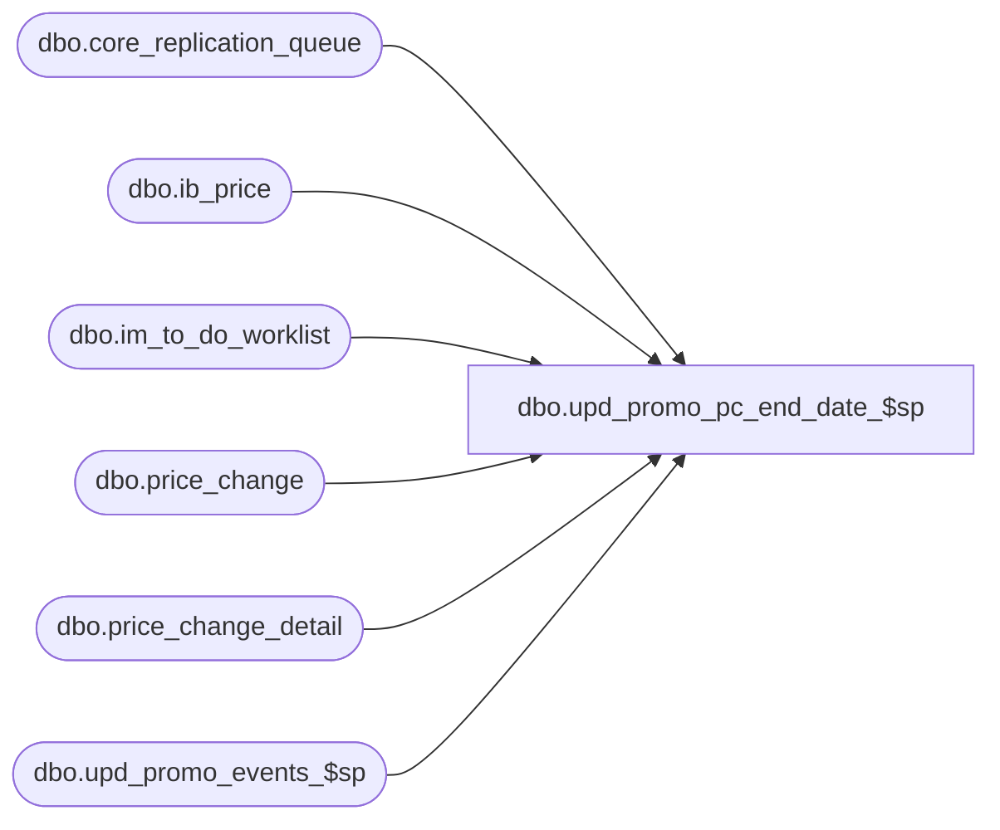

# dbo.upd_promo_pc_end_date_$sp

**Database:** me_01  
**Server:** bedrockdb02  

## Architecture Diagram



## Table Dependencies

| Referenced Table |
|---|
| dbo.core_replication_queue |
| dbo.ib_price |
| dbo.im_to_do_worklist |
| dbo.price_change |
| dbo.price_change_detail |
| dbo.upd_promo_events_$sp |

## Stored Procedure Code

```sql
-----------------------------------------------------------------------------------------------------------------------------
--	Main Query: Create Procedure
-----------------------------------------------------------------------------------------------------------------------------

CREATE PROCEDURE dbo.upd_promo_pc_end_date_$sp

	@Price_Change_ID AS DECIMAL (12, 0)

AS

SET TRANSACTION ISOLATION LEVEL READ UNCOMMITTED
SET NOCOUNT ON

DECLARE
	 @Effective_From_Date AS SMALLDATETIME
	,@Effective_To_Date AS SMALLDATETIME
	,@Price_Change_No AS NVARCHAR (20)
	,@Price_Change_Type AS SMALLINT
	,@Promotional_Event_Flag BIT
	,@Price_Change_Status SMALLINT
	,@Send_Price_Change_To_Webim_Flag BIT
	,@Document_Type SMALLINT
	,@Entity_Code_For_PLU SMALLINT
	,@Entity_Action_For_PLU NVARCHAR(1)

SELECT
	 @Effective_From_Date = PC.effective_from_date
	,@Effective_To_Date = PC.effective_to_date
	,@Price_Change_No = PC.price_change_no
	,@Price_Change_Type = PC.price_change_type
	,@Promotional_Event_Flag = PC.promotional_event_flag
	,@Price_Change_Status = PC.price_change_status
	,@Send_Price_Change_To_Webim_Flag = PC.send_price_change_to_webim_flag
	,@Document_Type = 33
	,@Entity_Code_For_PLU = 931
	,@Entity_Action_For_PLU = N'U'
FROM
	dbo.price_change PC
WHERE
	PC.price_change_id = @Price_Change_ID

/*
PCM00404.1.1	
If the promo price change type is MD or MUC 
and the PC header flag for ‘update promotional events in A&R’ is set to True, 
then update the promo event end date in the A&R promo event table to the new effective to date.
*/
/*
Use Case:  FT27137.UC038 – Make Promotional PC Effective  
PCM00393.2.6 	
If the promo price change type is MD or MUC and the flag on the PC header for ‘update promotional events in A&R’ is set to True, 
then update A&R’s  promotional  event table with all item/locations that have been marked down by this price change.

THEREFORE, check if price change status is 'Effective' (4)
*/
IF ((@Price_Change_Type = 0 OR @Price_Change_Type = 3) AND @Promotional_Event_Flag = 1 AND @Price_Change_Status = 4)
BEGIN

	EXEC dbo.upd_promo_events_$sp

		@Price_Change_ID = @Price_Change_ID

END

/*
PCM00404.1.2	
If the PC header flag for ‘send price change to Web IM’ = True,  
then add that price change to the Web IM To Do Worklist 
(if that price change was previously set to Done in the To Do Worklist).  
*/

IF (@Send_Price_Change_To_Webim_Flag = 1)
BEGIN

	INSERT INTO im_to_do_worklist
		(
			document_type
			,document_id
			,location_id
		)

	SELECT
		DISTINCT
			@Document_Type AS document_type
			,@Price_Change_ID AS document_id
			,location_id
	FROM
		price_change_detail PCD
	WHERE
		PCD.price_change_id = @Price_Change_ID
		AND NOT EXISTS
			( 
				SELECT 1
				FROM
					im_to_do_worklist ITDW
				WHERE
					ITDW.document_id = @Price_Change_ID
					AND ITDW.document_type = @Document_Type
					AND ITDW.location_id = PCD.location_id
			)

END

/*
PCM00404.1.3	
Add price change to the core replication queue to notify PLU of new termination date 
(updated with entity code 931). 
*/

INSERT INTO core_replication_queue 
	(
		entity_code
		,replication_action
		,entity_id
		,primary_entity_key
	) 

SELECT
	@Entity_Code_For_PLU
	,@Entity_Action_For_PLU
	,@Price_Change_ID
	,@Price_Change_No

/*
PCM00404.1.4	
Update IB Price to reflect the new termination date of the promotional price change as follows: 

	PCM00404.1.4.1	
	Set the cancel promo flag to True for all rows that were previously inserted for this promo PC 
	(note, ignore any row in IB price that already has the cancel promo flag set to True for that price change document).

	PCM00404.1.4.2	
	For each IB Price row where the cancel promo flag was updated from False to True (for the cancelled promo PC), 
	insert a new row and set all values the same as the cancelled row 
	EXCEPT set the end date to the new effective to date and set the cancel promo flag to False.
*/

INSERT INTO dbo.ib_price

		(
			 style_id
			,color_id
			,location_id
			,jurisdiction_id
			,pricing_group_id
			,temp_price_flag
			,[start_date]
			,end_date
			,valuation_retail_price
			,selling_retail_price
			,price_status_id
			,document_number
			,cancel_promo_flag
			,effective_date
			,price_change_type
			,insert_guid
			,style_color_id
			,sku_id
		)

SELECT
	SQU.style_id
	,SQU.color_id
	,SQU.location_id
	,SQU.jurisdiction_id
	,SQU.pricing_group_id
	,SQU.temp_price_flag
	,SQU.[start_date]
	,@Effective_To_Date AS end_date
	,SQU.valuation_retail_price
	,SQU.selling_retail_price
	,SQU.price_status_id
	,SQU.document_number
	,0 AS cancel_promo_flag
	,SQU.effective_date
	,SQU.price_change_type
	,SQU.insert_guid
	,SQU.style_color_id
	,SQU.sku_id

FROM
	(
		UPDATE dbo.ib_price
		SET
			cancel_promo_flag = 1
		OUTPUT
			inserted.style_id
			,inserted.color_id
			,inserted.location_id
			,inserted.jurisdiction_id
			,inserted.pricing_group_id
			,inserted.temp_price_flag
			,inserted.[start_date]
			,inserted.valuation_retail_price
			,inserted.selling_retail_price
			,inserted.price_status_id
			,inserted.document_number
			,inserted.effective_date
			,inserted.price_change_type
			,inserted.insert_guid
			,inserted.style_color_id
			,inserted.sku_id
		WHERE
			document_number = @Price_Change_No
			AND cancel_promo_flag = 0
	) SQU
```

