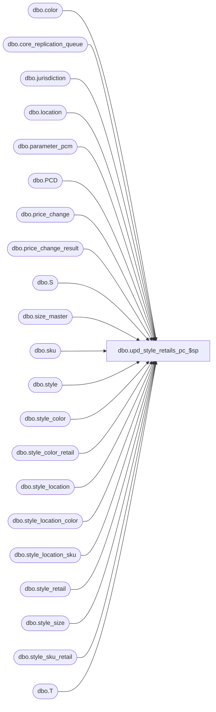

# dbo.upd_style_retails_pc_$sp

**Database:** me_01  
**Server:** bedrockdb02  

## Architecture Diagram



## Table Dependencies

| Referenced Table |
|---|
| dbo.color |
| dbo.core_replication_queue |
| dbo.jurisdiction |
| dbo.location |
| dbo.parameter_pcm |
| dbo.PCD |
| dbo.price_change |
| dbo.price_change_result |
| dbo.S |
| dbo.size_master |
| dbo.sku |
| dbo.style |
| dbo.style_color |
| dbo.style_color_retail |
| dbo.style_location |
| dbo.style_location_color |
| dbo.style_location_sku |
| dbo.style_retail |
| dbo.style_size |
| dbo.style_sku_retail |
| dbo.T |

## Stored Procedure Code

```sql
-----------------------------------------------------------------------------------------------------------------------------
--	Main Query: Create Procedure
-----------------------------------------------------------------------------------------------------------------------------

CREATE PROCEDURE dbo.upd_style_retails_pc_$sp

  @Price_Change_ID AS DECIMAL (12, 0)

AS

--	Object GUID: C1768A50-9C59-49A2-842D-A4BE951B7E59
--	Pricing GUID (General): EFB5A343-8978-4ACF-952C-37862704CBC8

SET TRANSACTION ISOLATION LEVEL READ UNCOMMITTED
SET NOCOUNT ON

/*
  Purpose: Updated retails tables when PC becomes effective, called by ins_ib_inventory_perm_pc_effective_$sp

  History:
10/19/2015		Ivan D.		141252 - EDM - Original retail is not updated when style status = Ordered (at any level:  style, style/color, style/color/size)
*/


-----------------------------------------------------------------------------------------------------------------------------
--	Declarations / Sets: Declare And Set Variables
-----------------------------------------------------------------------------------------------------------------------------

DECLARE
   @Exception_Level AS TINYINT
  ,@Reset_Retail_Price_Status_ID AS SMALLINT
  ,@Action_Date AS SMALLDATETIME
  ,@Result_ID AS DECIMAL(12,0)


SET @Reset_Retail_Price_Status_ID = (SELECT COALESCE(PPCM.reset_retail_price_status_id, -1) FROM dbo.parameter_pcm PPCM WHERE PPCM.parameter_pcm_id = 1)


SET @Action_Date = GETDATE ()

SET @Result_ID = (SELECT result_id FROM price_change WHERE price_change_id = @Price_Change_ID)

-----------------------------------------------------------------------------------------------------------------------------
--	Error Trapping: Check If Temp Table(s) Already Exist(s) And Drop If Applicable
-----------------------------------------------------------------------------------------------------------------------------

IF OBJECT_ID (N'tempdb.dbo.#temp_inserted_style_id_list', N'U') IS NOT NULL
BEGIN

  DROP TABLE dbo.#temp_inserted_style_id_list

END


IF OBJECT_ID (N'tempdb.dbo.#temp_price_change_redundancies', N'U') IS NOT NULL
BEGIN

  DROP TABLE dbo.#temp_price_change_redundancies

END


IF OBJECT_ID (N'tempdb.dbo.#temp_price_change_rollup', N'U') IS NOT NULL
BEGIN

  DROP TABLE dbo.#temp_price_change_rollup

END


-----------------------------------------------------------------------------------------------------------------------------
--	Table Create: Shell Table For "last_item_id" Field Update
-----------------------------------------------------------------------------------------------------------------------------

CREATE TABLE dbo.#temp_inserted_style_id_list

  (
     style_id DECIMAL (12, 0) NULL
    ,[entity_id] DECIMAL (15, 0) NULL
    ,action_performed NVARCHAR (10) NULL
    ,sku_id DECIMAL (13, 0) NULL
    ,style_color_id DECIMAL (13, 0) NULL
    ,size_master_id INT NULL
    ,location_id SMALLINT NULL
    ,jurisdiction_id SMALLINT NULL
  )


-----------------------------------------------------------------------------------------------------------------------------
--	Temp Table: Roll-up Price Change Data To Appropriate Exception Level
-----------------------------------------------------------------------------------------------------------------------------

SELECT DISTINCT
   PCD.style_id -- ORDER BY 2/6
  ,(CASE
    WHEN PCD.final_exception_level IN (10, 20, 40, 50) THEN PCD.color_id
    ELSE NULL
    END) AS color_id -- ORDER BY 5/6
  ,(CASE
    WHEN PCD.final_exception_level IN (10, 20, 30) THEN PCD.location_id
    ELSE NULL
    END) AS location_id -- ORDER BY 4/6
  ,PCD.jurisdiction_id -- ORDER BY 1/6
  ,PCD.valuation_retail_price
  ,PCD.selling_retail_price
  ,PCD.price_status_id
  ,(CASE
    WHEN PCD.final_exception_level IN (10, 40) THEN PCD.sku_id
    ELSE NULL
    END) AS sku_id -- ORDER BY 6/6
  ,PCD.final_exception_level -- ORDER BY 3/6
INTO
  dbo.#temp_price_change_rollup
FROM
  dbo.price_change_result PCD
WHERE
  PCD.result_id = @Result_ID


-----------------------------------------------------------------------------------------------------------------------------
--	Data Population: Lower Level Redundancies
-----------------------------------------------------------------------------------------------------------------------------

SELECT
   PCD.location_id
  ,PCD.sku_id
INTO
  dbo.#temp_price_change_redundancies
FROM
  dbo.#temp_price_change_rollup ttPCR
  INNER JOIN dbo.price_change_result PCD ON PCD.final_exception_level = ttPCR.final_exception_level
    AND PCD.result_id = @Result_ID
    AND
    (
      (
        PCD.final_exception_level = 10
        AND PCD.sku_id = ttPCR.sku_id
        AND PCD.location_id = ttPCR.location_id
      )
      OR
      (
        PCD.final_exception_level = 20
        AND PCD.style_id = ttPCR.style_id
        AND PCD.color_id = ttPCR.color_id
        AND PCD.location_id = ttPCR.location_id
      )
      OR
      (
        PCD.final_exception_level = 30
        AND PCD.style_id = ttPCR.style_id
        AND PCD.location_id = ttPCR.location_id
      )
      OR
      (
        PCD.final_exception_level = 40
        AND PCD.sku_id = ttPCR.sku_id
        AND PCD.jurisdiction_id = ttPCR.jurisdiction_id
      )
      OR
      (
        PCD.final_exception_level = 50
        AND PCD.style_id = ttPCR.style_id
        AND PCD.color_id = ttPCR.color_id
        AND PCD.jurisdiction_id = ttPCR.jurisdiction_id
      )
    )

  LEFT JOIN

    ( -- Attempt Roll-up (AKA: Remove Lower Level Redundancies) Into: 60 -- Style / Jurisdiction (No Pricing Exception)
      SELECT
         ttPCR.style_id
        ,ttPCR.jurisdiction_id
        ,ttPCR.valuation_retail_price
        ,ttPCR.selling_retail_price
        ,ttPCR.price_status_id
      FROM
        dbo.#temp_price_change_rollup ttPCR
      WHERE
        ttPCR.final_exception_level = 60
    ) sq60 ON sq60.style_id = ttPCR.style_id
          AND sq60.jurisdiction_id = ttPCR.jurisdiction_id
          AND sq60.valuation_retail_price = ttPCR.valuation_retail_price
          AND sq60.selling_retail_price = ttPCR.selling_retail_price
          AND sq60.price_status_id = ttPCR.price_status_id
          AND ttPCR.final_exception_level < 60

  LEFT JOIN

    ( -- Attempt Roll-up (AKA: Remove Lower Level Redundancies) Into: 50 -- Style / Color / Jurisdiction Exception
      SELECT
         ttPCR.style_id
        ,ttPCR.color_id
        ,ttPCR.jurisdiction_id
        ,ttPCR.valuation_retail_price
        ,ttPCR.selling_retail_price
        ,ttPCR.price_status_id
      FROM
        dbo.#temp_price_change_rollup ttPCR
      WHERE
        ttPCR.final_exception_level = 50
    ) sq50 ON sq50.style_id = ttPCR.style_id
          AND sq50.jurisdiction_id = ttPCR.jurisdiction_id
          AND sq50.valuation_retail_price = ttPCR.valuation_retail_price
          AND sq50.selling_retail_price = ttPCR.selling_retail_price
          AND sq50.price_status_id = ttPCR.price_status_id
          AND sq50.color_id = ttPCR.color_id
          AND ttPCR.final_exception_level IN (10, 20, 40)

  LEFT JOIN

    ( -- Attempt Roll-up (AKA: Remove Lower Level Redundancies) Into: 50 -- Style / Color / Jurisdiction Exception
      SELECT
         PCD.style_id
        ,PCD.location_id
      FROM
        dbo.price_change_result PCD -- 30 -- Style / Location Exception
        LEFT JOIN #temp_price_change_rollup ttPCR ON ttPCR.style_id = PCD.style_id -- 50 -- Style / Color / Jurisdiction Exception
          AND ttPCR.jurisdiction_id = PCD.jurisdiction_id
          AND ttPCR.valuation_retail_price = PCD.valuation_retail_price
          AND ttPCR.selling_retail_price = PCD.selling_retail_price
          AND ttPCR.price_status_id = PCD.price_status_id
          AND ttPCR.color_id = PCD.color_id
          AND ttPCR.final_exception_level = 50
      WHERE
        PCD.final_exception_level = 30
        AND PCD.result_id = @Result_ID
      GROUP BY
          PCD.style_id
        ,PCD.location_id
      HAVING
        COUNT (*) = COUNT (ttPCR.jurisdiction_id)
    ) sq50A ON sq50A.style_id = ttPCR.style_id
          AND sq50A.location_id = ttPCR.location_id
          AND ttPCR.final_exception_level = 30

  LEFT JOIN

    ( -- Attempt Roll-up (AKA: Remove Lower Level Redundancies) Into: 40 -- Style / Color / SKU / Jurisdiction Exception
      SELECT
         ttPCR.jurisdiction_id
        ,ttPCR.valuation_retail_price
        ,ttPCR.selling_retail_price
        ,ttPCR.price_status_id
        ,ttPCR.sku_id
      FROM
        dbo.#temp_price_change_rollup ttPCR
      WHERE
        ttPCR.final_exception_level = 40
    ) sq40 ON sq40.jurisdiction_id = ttPCR.jurisdiction_id
          AND sq40.valuation_retail_price = ttPCR.valuation_retail_price
          AND sq40.selling_retail_price = ttPCR.selling_retail_price
          AND sq40.price_status_id = ttPCR.price_status_id
          AND sq40.sku_id = ttPCR.sku_id
          AND ttPCR.final_exception_level = 10

  LEFT JOIN

    ( -- Attempt Roll-up (AKA: Remove Lower Level Redundancies) Into: 40 -- Style / Color / SKU / Jurisdiction Exception
      SELECT
         PCD.style_id
        ,PCD.location_id
      FROM
        dbo.price_change_result PCD -- 30 -- Style / Location Exception
        LEFT JOIN #temp_price_change_rollup ttPCR ON ttPCR.jurisdiction_id = PCD.jurisdiction_id -- 40 -- Style / Color / SKU / Jurisdiction Exception
          AND ttPCR.valuation_retail_price = PCD.valuation_retail_price
          AND ttPCR.selling_retail_price = PCD.selling_retail_price
          AND ttPCR.price_status_id = PCD.price_status_id
          AND ttPCR.sku_id = PCD.sku_id
          AND ttPCR.final_exception_level = 40
      WHERE
        PCD.final_exception_level = 30
        AND PCD.result_id = @Result_ID
      GROUP BY
          PCD.style_id
        ,PCD.location_id
      HAVING
        COUNT (*) = COUNT (ttPCR.jurisdiction_id)
    ) sq40A ON sq40A.style_id = ttPCR.style_id
          AND sq40A.location_id = ttPCR.location_id
          AND ttPCR.final_exception_level = 30

  LEFT JOIN

    ( -- Attempt Roll-up (AKA: Remove Lower Level Redundancies) Into: 40 -- Style / Color / SKU / Jurisdiction Exception
      SELECT
         PCD.style_id
        ,PCD.color_id
        ,PCD.location_id
      FROM
        dbo.price_change_result PCD -- 20 -- Style / Color / Location Exception
        LEFT JOIN #temp_price_change_rollup ttPCR ON ttPCR.jurisdiction_id = PCD.jurisdiction_id -- 40 -- Style / Color / SKU / Jurisdiction Exception
          AND ttPCR.valuation_retail_price = PCD.valuation_retail_price
          AND ttPCR.selling_retail_price = PCD.selling_retail_price
          AND ttPCR.price_status_id = PCD.price_status_id
          AND ttPCR.sku_id = PCD.sku_id
          AND ttPCR.final_exception_level = 40
      WHERE
        PCD.final_exception_level = 20
        AND PCD.result_id = @Result_ID
      GROUP BY
          PCD.style_id
        ,PCD.color_id
        ,PCD.location_id
      HAVING
        COUNT (*) = COUNT (ttPCR.jurisdiction_id)
    ) sq40B ON sq40B.style_id = ttPCR.style_id
          AND sq40B.color_id = ttPCR.color_id
          AND sq40B.location_id = ttPCR.location_id
          AND ttPCR.final_exception_level = 20

  LEFT JOIN

    ( -- Attempt Roll-up (AKA: Remove Lower Level Redundancies) Into: 30 -- Style / Location Exception
      SELECT
         ttPCR.style_id
        ,ttPCR.location_id
        ,ttPCR.valuation_retail_price
        ,ttPCR.selling_retail_price
        ,ttPCR.price_status_id
      FROM
        dbo.#temp_price_change_rollup ttPCR
      WHERE
        ttPCR.final_exception_level = 30
    ) sq30 ON sq30.style_id = ttPCR.style_id
          AND sq30.valuation_retail_price = ttPCR.valuation_retail_price
          AND sq30.selling_retail_price = ttPCR.selling_retail_price
          AND sq30.price_status_id = ttPCR.price_status_id
          AND sq30.location_id = ttPCR.location_id
          AND ttPCR.final_exception_level < 30

  LEFT JOIN

    ( -- Attempt Roll-up (AKA: Remove Lower Level Redundancies) Into: 20 -- Style / Color / Location Exception
      SELECT
         ttPCR.style_id
        ,ttPCR.color_id
        ,ttPCR.location_id
        ,ttPCR.valuation_retail_price
        ,ttPCR.selling_retail_price
        ,ttPCR.price_status_id
      FROM
        dbo.#temp_price_change_rollup ttPCR
      WHERE
        ttPCR.final_exception_level = 20
    ) sq20 ON sq20.style_id = ttPCR.style_id
          AND sq20.valuation_retail_price = ttPCR.valuation_retail_price
          AND sq20.selling_retail_price = ttPCR.selling_retail_price
          AND sq20.price_status_id = ttPCR.price_status_id
          AND sq20.color_id = ttPCR.color_id
          AND sq20.location_id = ttPCR.location_id
          AND ttPCR.final_exception_level = 10

WHERE
  (
    sq60.price_status_id IS NOT NULL
    OR sq50.price_status_id IS NOT NULL
    OR sq50A.style_id IS NOT NULL
    OR sq40.price_status_id IS NOT NULL
    OR sq40A.style_id IS NOT NULL
    OR sq40B.style_id IS NOT NULL
    OR sq30.price_status_id IS NOT NULL
    OR sq20.price_status_id IS NOT NULL
  )


IF OBJECT_ID (N'tempdb.dbo.#temp_price_change_rollup', N'U') IS NOT NULL
BEGIN

  DROP TABLE dbo.#temp_price_change_rollup

END


-----------------------------------------------------------------------------------------------------------------------------
--	Table Update: Temporarily Change The Exception Level On Redundant Records In Order To Easily Identify Them
-----------------------------------------------------------------------------------------------------------------------------

UPDATE
  PCD
SET
  PCD.final_exception_level = PCD.final_exception_level + 1
FROM
  dbo.price_change_result PCD
  INNER JOIN dbo.#temp_price_change_redundancies ttPCR ON ttPCR.location_id = PCD.location_id
    AND ttPCR.sku_id = PCD.sku_id
WHERE
  PCD.result_id = @Result_ID


-----------------------------------------------------------------------------------------------------------------------------
--	Table Update: Style / Color / SKU / Location Exception (Exception Level 10)
-----------------------------------------------------------------------------------------------------------------------------

SET @Exception_Level = 10


INSERT INTO dbo.#temp_inserted_style_id_list

  (
     style_id
    ,[entity_id]
    ,action_performed
    ,sku_id
    ,style_color_id
    ,size_master_id
    ,location_id
    ,jurisdiction_id
  )

SELECT
   sqMRG.style_id
  ,sqMRG.[entity_id]
  ,sqMRG.action_performed
  ,sqMRG.sku_id
  ,sqMRG.style_color_id
  ,sqMRG.size_master_id
  ,sqMRG.location_id
  ,sqMRG.jurisdiction_id
FROM

  (
    MERGE
      dbo.style_location_sku T
    USING

      (
        SELECT
           (CASE
            WHEN SLS.style_location_sku_id IS NULL AND sqPCDF.exists_at_current_level IS NOT NULL THEN ROW_NUMBER () OVER
                                                              (
                                                                PARTITION BY
                                                                  S.style_id
                                                                ORDER BY
                                                                   SLS.style_location_sku_id
                                                                  ,sqPCDF.exists_at_current_level DESC
                                                              ) + ((100000 * sqPCDF.style_id) + S.last_item_id)
            END) AS style_location_sku_id
          ,sqPCDF.style_id
          ,sqPCDF.location_id
          ,SC.style_color_id
          ,SS.size_master_id
          ,sqPCDF.jurisdiction_id
          ,sqPCDF.sku_id
          ,(CASE -- Received / Lookup Values Found By Querying: SELECT * FROM dbo.style_status
            WHEN S.style_status IN (3, 4) AND sqPCDF.price_status_id = @Reset_Retail_Price_Status_ID THEN sqPCDF.selling_retail_price
            END) AS original_selling_retail
          ,(CASE -- Received / Lookup Values Found By Querying: SELECT * FROM dbo.style_status
            WHEN S.style_status IN (3, 4) AND sqPCDF.price_status_id = @Reset_Retail_Price_Status_ID THEN sqPCDF.valuation_retail_price
            END) AS original_valuation_retail
          ,(CASE -- Received / Lookup Values Found By Querying: SELECT * FROM dbo.style_status
            WHEN S.style_status IN (3, 4) AND sqPCDF.price_status_id = @Reset_Retail_Price_Status_ID THEN sqPCDF.price_status_id
            END) AS original_price_status_id
          ,sqPCDF.selling_retail_price AS current_selling_retail
          ,sqPCDF.valuation_retail_price AS current_valuation_retail
          ,sqPCDF.price_status_id AS current_price_status_id
          ,sqPCDF.exists_at_current_level
          ,sqPCDF.is_pseudo_instruction
        FROM

          (
            SELECT
               PCD.style_id
              ,PCD.location_id
              ,PCD.jurisdiction_id
              ,PCD.sku_id
              ,PCD.color_id
              ,MAX (CASE
                  WHEN PCD.final_exception_level = @Exception_Level THEN PCD.selling_retail_price
                  END) AS selling_retail_price
              ,MAX (CASE
                  WHEN PCD.final_exception_level = @Exception_Level THEN PCD.valuation_retail_price
                  END) AS valuation_retail_price
              ,MAX (CASE
                  WHEN PCD.final_exception_level = @Exception_Level THEN PCD.price_status_id
                  END) AS price_status_id
              ,MAX (CASE
                  WHEN PCD.final_exception_level = @Exception_Level THEN 1
                  WHEN PCD.final_exception_level = @Exception_Level+1 AND price_status_id <> @Reset_Retail_Price_Status_ID THEN 2
                  END) AS exists_at_current_level
              ,MAX (CASE
                  WHEN PCD.final_exception_level = @Exception_Level THEN CONVERT (INT, PCD.is_pseudo_instruction)
                  WHEN PCD.final_exception_level = @Exception_Level+1 AND price_status_id <> @Reset_Retail_Price_Status_ID THEN 0
                  END) AS is_pseudo_instruction
            FROM
              dbo.price_change_result PCD
            WHERE
              PCD.result_id = @Result_ID
              AND PCD.final_exception_level >= @Exception_Level
            GROUP BY
               PCD.style_id
              ,PCD.location_id
              ,PCD.jurisdiction_id
              ,PCD.sku_id
              ,PCD.color_id
          ) sqPCDF

          INNER JOIN dbo.style S ON S.style_id = sqPCDF.style_id
          INNER JOIN dbo.sku SK ON SK.sku_id = sqPCDF.sku_id
          INNER JOIN dbo.style_size SS ON SS.style_size_id = SK.style_size_id
          INNER JOIN dbo.style_color SC ON SC.style_id = sqPCDF.style_id
            AND SC.color_id = sqPCDF.color_id
          LEFT JOIN dbo.style_location_sku SLS ON SLS.sku_id = sqPCDF.sku_id -- Style / Color / SKU / Location Exception
            AND SLS.location_id = sqPCDF.location_id
      ) S ON S.style_id = T.style_id AND S.location_id = T.location_id AND S.style_color_id = T.style_color_id AND S.size_master_id = T.size_master_id AND S.jurisdiction_id = T.jurisdiction_id

    WHEN MATCHED AND S.exists_at_current_level IS NOT NULL AND S.is_pseudo_instruction = 0 THEN

      UPDATE
      SET
         T.original_selling_retail = ISNULL (S.original_selling_retail, T.original_selling_retail)
        ,T.original_valuation_retail = ISNULL (S.original_valuation_retail, T.original_valuation_retail)
        ,T.original_price_status_id = ISNULL (S.original_price_status_id, T.original_price_status_id)
        ,T.current_selling_retail = CASE WHEN S.exists_at_current_level=1 THEN S.current_selling_retail ELSE NULL END
        ,T.current_valuation_retail = CASE WHEN S.exists_at_current_level=1 THEN S.current_valuation_retail ELSE NULL END
        ,T.current_price_status_id = CASE WHEN S.exists_at_current_level=1 THEN S.current_price_status_id ELSE NULL END

    WHEN NOT MATCHED BY TARGET AND S.exists_at_current_level = 1 THEN

      INSERT

        (
           style_location_sku_id
          ,style_id
          ,location_id
          ,style_color_id
          ,size_master_id
          ,jurisdiction_id
          ,original_selling_retail
          ,original_valuation_retail
          ,original_price_status_id
          ,current_selling_retail
          ,current_valuation_retail
          ,current_price_status_id
          ,sku_id
        )

      VALUES

        (
           S.style_location_sku_id
          ,S.style_id
          ,S.location_id
          ,S.style_color_id
          ,S.size_master_id
          ,S.jurisdiction_id
          ,S.original_selling_retail
          ,S.original_valuation_retail
          ,S.original_price_status_id
          ,S.current_selling_retail
          ,S.current_valuation_retail
          ,S.current_price_status_id
          ,S.sku_id
        )

    WHEN MATCHED AND S.exists_at_current_level IS NULL THEN

      DELETE

    OUTPUT
       $action AS action_performed
      ,COALESCE (inserted.style_id, deleted.style_id) AS style_id
      ,COALESCE (inserted.style_location_sku_id, deleted.style_location_sku_id) AS [entity_id]
      ,deleted.sku_id
      ,deleted.style_color_id
      ,deleted.size_master_id
      ,deleted.location_id
      ,deleted.jurisdiction_id
  ) sqMRG


IF EXISTS (SELECT * FROM dbo.#temp_inserted_style_id_list ttISIL)
BEGIN

  IF EXISTS (SELECT * FROM dbo.#temp_inserted_style_id_list ttISIL WHERE ttISIL.action_performed = N'INSERT')
  BEGIN

    UPDATE
      S
    SET
      S.last_item_id = S.last_item_id + sqTO.occurrences
    FROM
      dbo.style S
      INNER JOIN

        (
          SELECT
             ttISIL.style_id
            ,COUNT (*) AS occurrences
          FROM
            dbo.#temp_inserted_style_id_list ttISIL
          WHERE
            ttISIL.action_performed = N'INSERT'
          GROUP BY
            ttISIL.style_id
        ) sqTO ON sqTO.style_id = S.style_id

  END


  IF EXISTS (SELECT * FROM dbo.#temp_inserted_style_id_list ttISIL WHERE ttISIL.action_performed <> N'DELETE')
  BEGIN

    INSERT INTO dbo.core_replication_queue

      (
         entity_code
        ,replication_action
        ,action_date
        ,[entity_id]
        ,other_entity_id
      )

    SELECT
       320 AS entity_code
      ,(CASE
        WHEN ttISIL.action_performed = N'INSERT' THEN N'I'
        WHEN ttISIL.action_performed = N'UPDATE' THEN N'U'
        END) AS replication_action
      ,@Action_Date AS action_date
      ,ttISIL.[entity_id]
      ,0 AS other_entity_id
    FROM
      dbo.#temp_inserted_style_id_list ttISIL
    WHERE
      ttISIL.action_performed <> N'DELETE'

  END


  IF EXISTS (SELECT * FROM dbo.#temp_inserted_style_id_list ttISIL WHERE ttISIL.action_performed = N'DELETE')
  BEGIN

    INSERT INTO dbo.core_replication_queue

      (
         entity_code
        ,replication_action
        ,action_date
        ,[entity_id]
        ,other_entity_id
        ,replication_data
      )

    SELECT
       320 AS entity_code
      ,N'D' AS replication_action
      ,@Action_Date AS action_date
      ,ttISIL.[entity_id]
      ,0 AS other_entity_id
      ,S.style_code
        + NCHAR (9) + C.color_code
        + NCHAR (9) + SM.size_code
        + NCHAR (9) + L.location_code
        + NCHAR (9) + J.jurisdiction_code AS replication_data
    FROM
      dbo.#temp_inserted_style_id_list ttISIL
      INNER JOIN dbo.style S ON ttISIL.style_id = S.style_id
      INNER JOIN dbo.style_color SC ON ttISIL.style_color_id = SC.style_color_id
      INNER JOIN dbo.color C ON SC.color_id = C.color_id
      INNER JOIN dbo.size_master SM ON ttISIL.size_master_id = SM.size_master_id
      INNER JOIN dbo.location L ON ttISIL.location_id = L.location_id
      INNER JOIN dbo.jurisdiction J ON ttISIL.jurisdiction_id = J.jurisdiction_id
    WHERE
      ttISIL.action_performed = N'DELETE'

  END


  TRUNCATE TABLE dbo.#temp_inserted_style_id_list

END


-----------------------------------------------------------------------------------------------------------------------------
--	Table Update: Style / Color / Location Exception (Exception Level 20)
-----------------------------------------------------------------------------------------------------------------------------

SET @Exception_Level = 20


INSERT INTO dbo.#temp_inserted_style_id_list

  (
     style_id
    ,[entity_id]
    ,action_performed
    ,style_color_id
    ,location_id
    ,jurisdiction_id
  )

SELECT
   sqMRG.style_id
  ,sqMRG.[entity_id]
  ,sqMRG.action_performed
  ,sqMRG.style_color_id
  ,sqMRG.location_id
  ,sqMRG.jurisdiction_id
FROM

  (
    MERGE
      dbo.style_location_color T
    USING

      (
        SELECT
           (CASE
            WHEN SLC.style_location_color_id IS NULL AND sqPCDF.exists_at_current_level IS NOT NULL THEN ROW_NUMBER () OVER
                                                                (
                                                                  PARTITION BY
                                                                    S.style_id
                                                                  ORDER BY
                                                                     SLC.style_location_color_id
                                                                    ,sqPCDF.exists_at_current_level DESC
                                                                ) + ((100000 * sqPCDF.style_id) + S.last_item_id)
            END) AS style_location_color_id
          ,sqPCDF.style_id
          ,sqPCDF.location_id
          ,SC.style_color_id
          ,sqPCDF.jurisdiction_id
          ,(CASE -- Received / Lookup Values Found By Querying: SELECT * FROM dbo.style_status
            WHEN S.style_status IN (3, 4) AND sqPCDF.price_status_id = @Reset_Retail_Price_Status_ID THEN sqPCDF.selling_retail_price
            END) AS original_selling_retail
          ,(CASE -- Received / Lookup Values Found By Querying: SELECT * FROM dbo.style_status
            WHEN S.style_status IN (3, 4) AND sqPCDF.price_status_id = @Reset_Retail_Price_Status_ID THEN sqPCDF.valuation_retail_price
            END) AS original_valuation_retail
          ,(CASE -- Received / Lookup Values Found By Querying: SELECT * FROM dbo.style_status
            WHEN S.style_status IN (3, 4) AND sqPCDF.price_status_id = @Reset_Retail_Price_Status_ID THEN sqPCDF.price_status_id
            END) AS original_price_status_id
          ,sqPCDF.selling_retail_price AS current_selling_retail
          ,sqPCDF.valuation_retail_price AS current_valuation_retail
          ,sqPCDF.price_status_id AS current_price_status_id
          ,sqPCDF.exists_at_current_level
          ,sqPCDF.is_pseudo_instruction
        FROM

          (
            SELECT
               PCD.style_id
              ,PCD.location_id
              ,PCD.jurisdiction_id
              ,PCD.color_id
              ,MAX (CASE
                  WHEN PCD.final_exception_level = @Exception_Level THEN PCD.selling_retail_price
                  END) AS selling_retail_price
              ,MAX (CASE
                  WHEN PCD.final_exception_level = @Exception_Level THEN PCD.valuation_retail_price
                  END) AS valuation_retail_price
              ,MAX (CASE
                  WHEN PCD.final_exception_level = @Exception_Level THEN PCD.price_status_id
                  END) AS price_status_id
              ,MAX (CASE
                  WHEN PCD.final_exception_level = @Exception_Level THEN 1
                  WHEN PCD.final_exception_level = @Exception_Level+1 AND price_status_id <> @Reset_Retail_Price_Status_ID THEN 2
                  END) AS exists_at_current_level
              ,MAX (CASE
                  WHEN PCD.final_exception_level = @Exception_Level THEN CONVERT (INT, PCD.is_pseudo_instruction)
                  WHEN PCD.final_exception_level = @Exception_Level+1 AND price_status_id <> @Reset_Retail_Price_Status_ID THEN 0
                  END) AS is_pseudo_instruction
            FROM
              dbo.price_change_result PCD
            WHERE
              PCD.result_id = @Result_ID
              AND PCD.final_exception_level >= @Exception_Level
            GROUP BY
               PCD.style_id
              ,PCD.location_id
              ,PCD.jurisdiction_id
              ,PCD.color_id
          ) sqPCDF

          INNER JOIN dbo.style S ON S.style_id = sqPCDF.style_id
          INNER JOIN dbo.style_color SC ON SC.style_id = sqPCDF.style_id
            AND SC.color_id = sqPCDF.color_id
          LEFT JOIN dbo.style_location_color SLC ON SLC.style_id = sqPCDF.style_id -- Style / Color / Location Exception
            AND SLC.location_id = sqPCDF.location_id
            AND SLC.style_color_id = SC.style_color_id
      ) S ON S.style_id = T.style_id AND S.location_id = T.location_id AND S.style_color_id = T.style_color_id AND S.jurisdiction_id = T.jurisdiction_id

    WHEN MATCHED AND S.exists_at_current_level IS NOT NULL AND S.is_pseudo_instruction = 0 THEN

      UPDATE
      SET
         T.original_selling_retail = ISNULL (S.original_selling_retail, T.original_selling_retail)
        ,T.original_valuation_retail = ISNULL (S.original_valuation_retail, T.original_valuation_retail)
        ,T.original_price_status_id = ISNULL (S.original_price_status_id, T.original_price_status_id)
        ,T.current_selling_retail = CASE WHEN S.exists_at_current_level=1 THEN S.current_selling_retail ELSE NULL END
        ,T.current_valuation_retail = CASE WHEN S.exists_at_current_level=1 THEN S.current_valuation_retail ELSE NULL END
        ,T.current_price_status_id = CASE WHEN S.exists_at_current_level=1 THEN S.current_price_status_id ELSE NULL END

    WHEN NOT MATCHED BY TARGET AND S.exists_at_current_level = 1 THEN

      INSERT

        (
           style_location_color_id
          ,style_id
          ,location_id
          ,style_color_id
          ,jurisdiction_id
          ,original_selling_retail
          ,original_valuation_retail
          ,original_price_status_id
          ,current_selling_retail
          ,current_valuation_retail
          ,current_price_status_id
          ,mix_match_rule_id1
          ,mix_match_rule_id2
          ,mix_match_rule_id3
          ,mix_match_rule_id4
        )

      VALUES

        (
           S.style_location_color_id
          ,S.style_id
          ,S.location_id
          ,S.style_color_id
          ,S.jurisdiction_id
          ,S.original_selling_retail
          ,S.original_valuation_retail
          ,S.original_price_status_id
          ,S.current_selling_retail
          ,S.current_valuation_retail
          ,S.current_price_status_id
          ,NULL -- mix_match_rule_id1
          ,NULL -- mix_match_rule_id2
          ,NULL -- mix_match_rule_id3
          ,NULL -- mix_match_rule_id4
        )

    WHEN MATCHED AND S.exists_at_current_level IS NULL THEN

      DELETE

    OUTPUT
       $action AS action_performed
      ,COALESCE (inserted.style_id, deleted.style_id) AS style_id
      ,COALESCE (inserted.style_location_color_id, deleted.style_location_color_id) AS [entity_id]
      ,deleted.style_color_id
      ,deleted.location_id
      ,deleted.jurisdiction_id
  ) sqMRG


IF EXISTS (SELECT * FROM dbo.#temp_inserted_style_id_list ttISIL)
BEGIN

 IF EXISTS (SELECT * FROM dbo.#temp_inserted_style_id_list ttISIL WHERE ttISIL.action_performed = N'INSERT')
  BEGIN

    UPDATE
      S
    SET
      S.last_item_id = S.last_item_id + sqTO.occurrences
    FROM
      dbo.style S
      INNER JOIN

        (
          SELECT
             ttISIL.style_id
            ,COUNT (*) AS occurrences
          FROM
            dbo.#temp_inserted_style_id_list ttISIL
          WHERE
            ttISIL.action_performed = N'INSERT'
          GROUP BY
            ttISIL.style_id
        ) sqTO ON sqTO.style_id = S.style_id

  END


  IF EXISTS (SELECT * FROM dbo.#temp_inserted_style_id_list ttISIL WHERE ttISIL.action_performed <> N'DELETE')
  BEGIN

    INSERT INTO dbo.core_replication_queue

      (
         entity_code
        ,replication_action
        ,action_date
        ,[entity_id]
        ,other_entity_id
      )

    SELECT
       312 AS entity_code
      ,(CASE
        WHEN ttISIL.action_performed = N'INSERT' THEN N'I'
        WHEN ttISIL.action_performed = N'UPDATE' THEN N'U'
        END) AS replication_action
      ,@Action_Date AS action_date
      ,ttISIL.[entity_id]
      ,0 AS other_entity_id
    FROM
      dbo.#temp_inserted_style_id_list ttISIL
    WHERE
      ttISIL.action_performed <> N'DELETE'

  END


  IF EXISTS (SELECT * FROM dbo.#temp_inserted_style_id_list ttISIL WHERE ttISIL.action_performed = N'DELETE')
  BEGIN

    INSERT INTO dbo.core_replication_queue

      (
         entity_code
        ,replication_action
        ,action_date
        ,[entity_id]
        ,other_entity_id
        ,replication_data
      )

    SELECT
       312 AS entity_code
      ,N'D' AS replication_action
      ,@Action_Date AS action_date
      ,ttISIL.[entity_id]
      ,0 AS other_entity_id
      ,S.style_code
        + NCHAR (9) + C.color_code
        + NCHAR (9) + L.location_code
        + NCHAR (9) + J.jurisdiction_code AS replication_data
    FROM
      dbo.#temp_inserted_style_id_list ttISIL
      INNER JOIN dbo.style S ON ttISIL.style_id = S.style_id
      INNER JOIN dbo.style_color SC ON ttISIL.style_color_id = SC.style_color_id
      INNER JOIN dbo.color C ON SC.color_id = C.color_id
      INNER JOIN dbo.location L ON ttISIL.location_id = L.location_id
      INNER JOIN dbo.jurisdiction J ON ttISIL.jurisdiction_id = J.jurisdiction_id
    WHERE
      ttISIL.action_performed = N'DELETE'

  END


  TRUNCATE TABLE dbo.#temp_inserted_style_id_list

END


-----------------------------------------------------------------------------------------------------------------------------
--	Table Update: Style / Location Exception (Exception Level 30)
-----------------------------------------------------------------------------------------------------------------------------

SET @Exception_Level = 30


INSERT INTO dbo.#temp_inserted_style_id_list

  (
     style_id
    ,[entity_id]
    ,action_performed
    ,location_id
    ,jurisdiction_id
  )

SELECT
   sqMRG.style_id
  ,sqMRG.[entity_id]
  ,sqMRG.action_performed
  ,sqMRG.location_id
  ,sqMRG.jurisdiction_id
FROM

  (
    MERGE
      dbo.style_location T
    USING

      (
        SELECT
           (CASE
            WHEN SL.style_location_id IS NULL AND sqPCDF.exists_at_current_level IS NOT NULL THEN ROW_NUMBER () OVER
                                                            (
                                                              PARTITION BY
                                                                S.style_id
                                                              ORDER BY
                                                                 SL.style_location_id
                                                                ,sqPCDF.exists_at_current_level DESC
                                                            ) + ((100000 * sqPCDF.style_id) + S.last_item_id)
            END) AS style_location_id
          ,sqPCDF.style_id
          ,sqPCDF.location_id
          ,sqPCDF.jurisdiction_id
          ,(CASE -- Received / Lookup Values Found By Querying: SELECT * FROM dbo.style_status
            WHEN S.style_status IN (3, 4) AND sqPCDF.price_status_id = @Reset_Retail_Price_Status_ID THEN sqPCDF.selling_retail_price
            END) AS original_selling_retail
          ,(CASE -- Received / Lookup Values Found By Querying: SELECT * FROM dbo.style_status
            WHEN S.style_status IN (3, 4) AND sqPCDF.price_status_id = @Reset_Retail_Price_Status_ID THEN sqPCDF.valuation_retail_price
            END) AS original_valuation_retail
          ,(CASE -- Received / Lookup Values Found By Querying: SELECT * FROM dbo.style_status
            WHEN S.style_status IN (3, 4) AND sqPCDF.price_status_id = @Reset_Retail_Price_Status_ID THEN sqPCDF.price_status_id
            END) AS original_price_status_id
          ,sqPCDF.selling_retail_price AS current_selling_retail
          ,sqPCDF.valuation_retail_price AS current_valuation_retail
          ,sqPCDF.price_status_id AS current_price_status_id
          ,sqPCDF.exists_at_current_level
          ,sqPCDF.is_pseudo_instruction
        FROM

          (
            SELECT
               PCD.style_id
              ,PCD.location_id
              ,PCD.jurisdiction_id
              ,MAX (CASE
                  WHEN PCD.final_exception_level = @Exception_Level THEN PCD.selling_retail_price
                  END) AS selling_retail_price
              ,MAX (CASE
                  WHEN PCD.final_exception_level = @Exception_Level THEN PCD.valuation_retail_price
                  END) AS valuation_retail_price
              ,MAX (CASE
                  WHEN PCD.final_exception_level = @Exception_Level THEN PCD.price_status_id
                  END) AS price_status_id
              ,MAX (CASE
                  WHEN PCD.final_exception_level = @Exception_Level THEN 1
                  WHEN PCD.final_exception_level = @Exception_Level+1 AND price_status_id <> @Reset_Retail_Price_Status_ID THEN 2
                  END) AS exists_at_current_level
              ,MAX (CASE
                  WHEN PCD.final_exception_level = @Exception_Level THEN CONVERT (INT, PCD.is_pseudo_instruction)
                  WHEN PCD.final_exception_level = @Exception_Level+1 AND price_status_id <> @Reset_Retail_Price_Status_ID THEN 0
                  END) AS is_pseudo_instruction
            FROM
              dbo.price_change_result PCD
            WHERE
              PCD.result_id = @Result_ID
              AND PCD.final_exception_level >= @Exception_Level
            GROUP BY
               PCD.style_id
              ,PCD.location_id
              ,PCD.jurisdiction_id
          ) sqPCDF

          INNER JOIN dbo.style S ON S.style_id = sqPCDF.style_id
          LEFT JOIN dbo.style_location SL ON SL.style_id = sqPCDF.style_id -- Style / Location Exception
            AND SL.location_id = sqPCDF.location_id
            AND SL.jurisdiction_id = sqPCDF.jurisdiction_id
      ) S ON S.style_id = T.style_id AND S.location_id = T.location_id

    WHEN MATCHED AND S.exists_at_current_level IS NOT NULL AND S.is_pseudo_instruction = 0 THEN

      UPDATE
      SET
         T.original_selling_retail = ISNULL (S.original_selling_retail, T.original_selling_retail)
        ,T.original_valuation_retail = ISNULL (S.original_valuation_retail, T.original_valuation_retail)
        ,T.original_price_status_id = ISNULL (S.original_price_status_id, T.original_price_status_id)
        ,T.current_selling_retail = CASE WHEN S.exists_at_current_level=1 THEN S.current_selling_retail ELSE NULL END
        ,T.current_valuation_retail = CASE WHEN S.exists_at_current_level=1 THEN S.current_valuation_retail ELSE NULL END
        ,T.current_price_status_id = CASE WHEN S.exists_at_current_level=1 THEN S.current_price_status_id ELSE NULL END

    WHEN NOT MATCHED BY TARGET AND S.exists_at_current_level = 1 THEN

      INSERT

        (
           style_location_id
          ,style_id
          ,location_id
          ,jurisdiction_id
          ,original_selling_retail
          ,original_valuation_retail
          ,original_price_status_id
          ,current_selling_retail
          ,current_valuation_retail
          ,current_price_status_id
          ,mix_match_rule_id1
          ,mix_match_rule_id2
          ,mix_match_rule_id3
          ,mix_match_rule_id4
        )

      VALUES

        (
           S.style_location_id
          ,S.style_id
          ,S.location_id
          ,S.jurisdiction_id
          ,S.original_selling_retail
          ,S.original_valuation_retail
          ,S.original_price_status_id
          ,S.current_selling_retail
          ,S.current_valuation_retail
          ,S.current_price_status_id
          ,NULL -- mix_match_rule_id1
          ,NULL -- mix_match_rule_id2
          ,NULL -- mix_match_rule_id3
          ,NULL -- mix_match_rule_id4
        )

    WHEN MATCHED AND S.exists_at_current_level IS NULL THEN

      DELETE

    OUTPUT
       $action AS action_performed
      ,COALESCE (inserted.style_id, deleted.style_id) AS style_id
      ,COALESCE (inserted.style_location_id, deleted.style_location_id) AS [entity_id]
      ,deleted.location_id
      ,deleted.jurisdiction_id
  ) sqMRG


IF EXISTS (SELECT * FROM dbo.#temp_inserted_style_id_list ttISIL)
BEGIN

  IF EXISTS (SELECT * FROM dbo.#temp_inserted_style_id_list ttISIL WHERE ttISIL.action_performed = N'INSERT')
  BEGIN

    UPDATE
      S
    SET
      S.last_item_id = S.last_item_id + sqTO.occurrences
    FROM
      dbo.style S
      INNER JOIN

        (
          SELECT
             ttISIL.style_id
            ,COUNT (*) AS occurrences
          FROM
            dbo.#temp_inserted_style_id_list ttISIL
          WHERE
            ttISIL.action_performed = N'INSERT'
          GROUP BY
            ttISIL.style_id
        ) sqTO ON sqTO.style_id = S.style_id

  END


  IF EXISTS (SELECT * FROM dbo.#temp_inserted_style_id_list ttISIL WHERE ttISIL.action_performed <> N'DELETE')
  BEGIN

    INSERT INTO dbo.core_replication_queue

      (
         entity_code
        ,replication_action
        ,action_date
        ,[entity_id]
        ,other_entity_id
      )

    SELECT
       313 AS entity_code
      ,(CASE
        WHEN ttISIL.action_performed = N'INSERT' THEN N'I'
        WHEN ttISIL.action_performed = N'UPDATE' THEN N'U'
        END) AS replication_action
      ,@Action_Date AS action_date
      ,ttISIL.[entity_id]
      ,0 AS other_entity_id
    FROM
      dbo.#temp_inserted_style_id_list ttISIL
    WHERE
      ttISIL.action_performed <> N'DELETE'

  END


  IF EXISTS (SELECT * FROM dbo.#temp_inserted_style_id_list ttISIL WHERE ttISIL.action_performed = N'DELETE')
  BEGIN

    INSERT INTO dbo.core_replication_queue

      (
         entity_code
        ,replication_action
        ,action_date
        ,[entity_id]
        ,other_entity_id
        ,replication_data
      )

    SELECT
       313 AS entity_code
      ,N'D' AS replication_action
      ,@Action_Date AS action_date
      ,ttISIL.[entity_id]
      ,0 AS other_entity_id
      ,S.style_code
        + NCHAR (9) + L.location_code
        + NCHAR (9) + J.jurisdiction_code AS replication_data
    FROM
      dbo.#temp_inserted_style_id_list ttISIL
      INNER JOIN dbo.style S ON ttISIL.style_id = S.style_id
      INNER JOIN dbo.location L ON ttISIL.location_id = L.location_id
      INNER JOIN dbo.jurisdiction J ON ttISIL.jurisdiction_id = J.jurisdiction_id
    WHERE
      ttISIL.action_performed = N'DELETE'

  END


  TRUNCATE TABLE dbo.#temp_inserted_style_id_list

END


-----------------------------------------------------------------------------------------------------------------------------
--	Table Update: Style / Color / SKU / Jurisdiction Exception (Exception Level 40)
-----------------------------------------------------------------------------------------------------------------------------

SET @Exception_Level = 40


INSERT INTO dbo.#temp_inserted_style_id_list

  (
     style_id
    ,[entity_id]
    ,action_performed
    ,sku_id
    ,jurisdiction_id
  )

SELECT
   sqMRG.style_id
  ,sqMRG.[entity_id]
  ,sqMRG.action_performed
  ,sqMRG.sku_id
  ,sqMRG.jurisdiction_id
FROM

  (
    MERGE
      dbo.style_sku_retail T
    USING

      (
        SELECT
           (CASE
            WHEN SSR.style_sku_retail_id IS NULL AND sqPCDF.exists_at_current_level = 1 THEN ROW_NUMBER () OVER
                                                              (
                                                                PARTITION BY
                                                                  S.style_id
                                                                ORDER BY
                                                                   SSR.style_sku_retail_id
                                                                  ,sqPCDF.exists_at_current_level DESC
                                                              ) + ((100000 * sqPCDF.style_id) + S.last_item_id)
            END) AS style_sku_retail_id
          ,sqPCDF.style_id
          ,sqPCDF.jurisdiction_id
          ,sqPCDF.sku_id
          ,(CASE -- Received / Lookup Values Found By Querying: SELECT * FROM dbo.style_status
            WHEN S.style_status IN (3, 4) AND sqPCDF.price_status_id = @Reset_Retail_Price_Status_ID THEN sqPCDF.selling_retail_price
            END) AS original_selling_retail
          ,(CASE -- Received / Lookup Values Found By Querying: SELECT * FROM dbo.style_status
            WHEN S.style_status IN (3, 4) AND sqPCDF.price_status_id = @Reset_Retail_Price_Status_ID THEN sqPCDF.valuation_retail_price
            END) AS original_valuation_retail
          ,(CASE -- Received / Lookup Values Found By Querying: SELECT * FROM dbo.style_status
            WHEN S.style_status IN (3, 4) AND sqPCDF.price_status_id = @Reset_Retail_Price_Status_ID THEN sqPCDF.price_status_id
            END) AS original_price_status_id
          ,sqPCDF.selling_retail_price AS current_selling_retail
          ,sqPCDF.valuation_retail_price AS current_valuation_retail
          ,sqPCDF.price_status_id AS current_price_status_id
          ,sqPCDF.exists_at_current_level
          ,sqPCDF.is_pseudo_instruction
        FROM

          (
            SELECT
               PCD.style_id
              ,PCD.jurisdiction_id
              ,PCD.sku_id
              ,PCD.color_id
              ,MAX (CASE
                  WHEN PCD.final_exception_level = @Exception_Level THEN PCD.selling_retail_price
                  END) AS selling_retail_price
              ,MAX (CASE
                  WHEN PCD.final_exception_level = @Exception_Level THEN PCD.valuation_retail_price
                  END) AS valuation_retail_price
              ,MAX (CASE
                  WHEN PCD.final_exception_level = @Exception_Level THEN PCD.price_status_id
                  END) AS price_status_id
              ,MAX (CASE
                  WHEN PCD.final_exception_level = @Exception_Level THEN 1
                  END) AS exists_at_current_level
              ,MAX (CASE
                  WHEN PCD.final_exception_level = @Exception_Level THEN CONVERT (INT, PCD.is_pseudo_instruction)
                  END) AS is_pseudo_instruction
            FROM
              dbo.price_change_result PCD
            WHERE
              PCD.result_id = @Result_ID
              AND PCD.final_exception_level >= @Exception_Level
            GROUP BY
               PCD.style_id
              ,PCD.jurisdiction_id
              ,PCD.sku_id
              ,PCD.color_id
          ) sqPCDF

          INNER JOIN dbo.style S ON S.style_id = sqPCDF.style_id
          LEFT JOIN dbo.style_sku_retail SSR ON SSR.sku_id = sqPCDF.sku_id -- Style / Color / SKU / Jurisdiction Exception
            AND SSR.jurisdiction_id = sqPCDF.jurisdiction_id
      ) S ON S.style_id = T.style_id AND S.sku_id = T.sku_id AND S.jurisdiction_id = T.jurisdiction_id

    WHEN MATCHED AND S.exists_at_current_level = 1 AND S.is_pseudo_instruction = 0 THEN

      UPDATE
      SET
         T.original_selling_retail = ISNULL (S.original_selling_retail, T.original_selling_retail)
        ,T.original_valuation_retail = ISNULL (S.original_valuation_retail, T.original_valuation_retail)
        ,T.original_price_status_id = ISNULL (S.original_price_status_id, T.original_price_status_id)
        ,T.current_selling_retail = S.current_selling_retail
        ,T.current_valuation_retail = S.current_valuation_retail
        ,T.current_price_status_id = S.current_price_status_id

    WHEN NOT MATCHED BY TARGET AND S.exists_at_current_level = 1 THEN

      INSERT

        (
           style_sku_retail_id
          ,style_id
          ,sku_id
          ,jurisdiction_id
          ,original_selling_retail
          ,original_valuation_retail
          ,original_price_status_id
          ,current_selling_retail
          ,current_valuation_retail
          ,current_price_status_id
        )

      VALUES

        (
           S.style_sku_retail_id
          ,S.style_id
          ,S.sku_id
          ,S.jurisdiction_id
          ,S.original_selling_retail
          ,S.original_valuation_retail
          ,S.original_price_status_id
          ,S.current_selling_retail
          ,S.current_valuation_retail
          ,S.current_price_status_id
        )

    WHEN MATCHED AND S.exists_at_current_level IS NULL THEN

      DELETE

    OUTPUT
       $action AS action_performed
      ,COALESCE (inserted.style_id, deleted.style_id) AS style_id
      ,COALESCE (inserted.style_sku_retail_id, deleted.style_sku_retail_id) AS [entity_id]
      ,deleted.sku_id
      ,deleted.jurisdiction_id
  ) sqMRG


IF EXISTS (SELECT * FROM dbo.#temp_inserted_style_id_list ttISIL)
BEGIN

  IF EXISTS (SELECT * FROM dbo.#temp_inserted_style_id_list ttISIL WHERE ttISIL.action_performed = N'INSERT')
  BEGIN

    UPDATE
      S
    SET
      S.last_item_id = S.last_item_id + sqTO.occurrences
    FROM
      dbo.style S
      INNER JOIN

        (
          SELECT
             ttISIL.style_id
            ,COUNT (*) AS occurrences
          FROM
            dbo.#temp_inserted_style_id_list ttISIL
          WHERE
            ttISIL.action_performed = N'INSERT'
          GROUP BY
            ttISIL.style_id
        ) sqTO ON sqTO.style_id = S.style_id

  END


  IF EXISTS (SELECT * FROM dbo.#temp_inserted_style_id_list ttISIL WHERE ttISIL.action_performed <> N'DELETE')
  BEGIN

    INSERT INTO dbo.core_replication_queue

      (
         entity_code
        ,replication_action
        ,action_date
        ,[entity_id]
        ,other_entity_id
      )

    SELECT
       319 AS entity_code
      ,(CASE
        WHEN ttISIL.action_performed = N'INSERT' THEN N'I'
        WHEN ttISIL.action_performed = N'UPDATE' THEN N'U'
        END) AS replication_action
      ,@Action_Date AS action_date
      ,ttISIL.[entity_id]
      ,0 AS other_entity_id
    FROM
      dbo.#temp_inserted_style_id_list ttISIL
    WHERE
      ttISIL.action_performed <> N'DELETE'

  END


  IF EXISTS (SELECT * FROM dbo.#temp_inserted_style_id_list ttISIL WHERE ttISIL.action_performed = N'DELETE')
  BEGIN

    INSERT INTO dbo.core_replication_queue

      (
         entity_code
        ,replication_action
        ,action_date
        ,[entity_id]
        ,other_entity_id
        ,replication_data
      )

    SELECT
       319 AS entity_code
      ,N'D' AS replication_action
      ,@Action_Date AS action_date
      ,ttISIL.[entity_id]
      ,ttISIL.sku_id AS other_entity_id
      ,S.style_code
        + NCHAR (9) + C.color_code
        + NCHAR (9) + SM.size_code
        + NCHAR (9) + J.jurisdiction_code AS replication_data
    FROM
      dbo.#temp_inserted_style_id_list ttISIL
      INNER JOIN dbo.style S ON ttISIL.style_id = S.style_id
      INNER JOIN dbo.sku K ON ttISIL.sku_id = K.sku_id
      INNER JOIN dbo.style_color SC ON K.style_color_id = SC.style_color_id
      INNER JOIN dbo.color C ON SC.color_id = C.color_id
      INNER JOIN dbo.style_size SS ON K.style_size_id = SS.style_size_id
      INNER JOIN dbo.size_master SM ON SS.size_master_id = SM.size_master_id
      INNER JOIN dbo.jurisdiction J ON ttISIL.jurisdiction_id = J.jurisdiction_id
    WHERE
      ttISIL.action_performed = N'DELETE'

  END


  TRUNCATE TABLE dbo.#temp_inserted_style_id_list

END


-----------------------------------------------------------------------------------------------------------------------------
--	Table Update: Style / Color / Jurisdiction Exception (Exception Level 50)
-----------------------------------------------------------------------------------------------------------------------------

SET @Exception_Level = 50


INSERT INTO dbo.#temp_inserted_style_id_list

  (
     style_id
    ,[entity_id]
    ,action_performed
    ,style_color_id
    ,jurisdiction_id
  )

SELECT
   sqMRG.style_id
  ,sqMRG.[entity_id]
  ,sqMRG.action_performed
  ,sqMRG.style_color_id
  ,sqMRG.jurisdiction_id
FROM

  (
    MERGE
      dbo.style_color_retail T
    USING

      (
        SELECT
           (CASE
            WHEN SCR.style_color_retail_id IS NULL AND sqPCDF.exists_at_current_level = 1 THEN ROW_NUMBER () OVER
                                                              (
                                                                PARTITION BY
                                                                  S.style_id
                                                                ORDER BY
                                                                   SCR.style_color_retail_id
                                                                  ,sqPCDF.exists_at_current_level DESC
                                                              ) + ((100000 * sqPCDF.style_id) + S.last_item_id)
            END) AS style_color_retail_id
          ,sqPCDF.style_id
          ,SC.style_color_id
          ,sqPCDF.jurisdiction_id
          ,(CASE -- Received / Lookup Values Found By Querying: SELECT * FROM dbo.style_status
            WHEN S.style_status IN (3, 4) AND sqPCDF.price_status_id = @Reset_Retail_Price_Status_ID THEN sqPCDF.selling_retail_price
            END) AS original_selling_retail
          ,(CASE -- Received / Lookup Values Found By Querying: SELECT * FROM dbo.style_status
            WHEN S.style_status IN (3, 4) AND sqPCDF.price_status_id = @Reset_Retail_Price_Status_ID THEN sqPCDF.valuation_retail_price
            END) AS original_valuation_retail
          ,(CASE -- Received / Lookup Values Found By Querying: SELECT * FROM dbo.style_status
            WHEN S.style_status IN (3, 4) AND sqPCDF.price_status_id = @Reset_Retail_Price_Status_ID THEN sqPCDF.price_status_id
            END) AS original_price_status_id
          ,sqPCDF.selling_retail_price AS current_selling_retail
          ,sqPCDF.valuation_retail_price AS current_valuation_retail
          ,sqPCDF.price_status_id AS current_price_status_id
          ,sqPCDF.exists_at_current_level
          ,sqPCDF.is_pseudo_instruction
        FROM

          (
            SELECT
               PCD.style_id
              ,PCD.jurisdiction_id
              ,PCD.color_id
              ,MAX (CASE
                  WHEN PCD.final_exception_level = @Exception_Level THEN PCD.selling_retail_price
                  END) AS selling_retail_price
              ,MAX (CASE
                  WHEN PCD.final_exception_level = @Exception_Level THEN PCD.valuation_retail_price
                  END) AS valuation_retail_price
              ,MAX (CASE
                  WHEN PCD.final_exception_level = @Exception_Level THEN PCD.price_status_id
                  END) AS price_status_id
              ,MAX (CASE
                  WHEN PCD.final_exception_level = @Exception_Level THEN 1
                  END) AS exists_at_current_level
              ,MAX (CASE
                  WHEN PCD.final_exception_level = @Exception_Level THEN CONVERT (INT, PCD.is_pseudo_instruction)
                  END) AS is_pseudo_instruction
            FROM
              dbo.price_change_result PCD
            WHERE
              PCD.result_id = @Result_ID
              AND PCD.final_exception_level >= @Exception_Level
            GROUP BY
               PCD.style_id
              ,PCD.jurisdiction_id
              ,PCD.color_id
          ) sqPCDF

          INNER JOIN dbo.style S ON S.style_id = sqPCDF.style_id
          INNER JOIN dbo.style_color SC ON SC.style_id = sqPCDF.style_id
            AND SC.color_id = sqPCDF.color_id
          LEFT JOIN dbo.style_color_retail SCR ON SCR.style_id = sqPCDF.style_id -- Style / Color / Jurisdiction Exception
            AND SCR.style_color_id = SC.style_color_id
            AND SCR.jurisdiction_id = sqPCDF.jurisdiction_id
      ) S ON S.style_id = T.style_id AND S.style_color_id = T.style_color_id AND S.jurisdiction_id = T.jurisdiction_id

    WHEN MATCHED AND S.exists_at_current_level = 1 AND S.is_pseudo_instruction = 0 THEN

      UPDATE
      SET
         T.original_selling_retail = ISNULL (S.original_selling_retail, T.original_selling_retail)
        ,T.original_valuation_retail = ISNULL (S.original_valuation_retail, T.original_valuation_retail)
        ,T.original_price_status_id = ISNULL (S.original_price_status_id, T.original_price_status_id)
        ,T.current_selling_retail = S.current_selling_retail
        ,T.current_valuation_retail = S.current_valuation_retail
        ,T.current_price_status_id = S.current_price_status_id

    WHEN NOT MATCHED BY TARGET AND S.exists_at_current_level = 1 THEN

      INSERT

        (
           style_color_retail_id
          ,style_id
          ,style_color_id
          ,jurisdiction_id
          ,original_selling_retail
          ,original_valuation_retail
          ,original_price_status_id
          ,current_selling_retail
          ,current_valuation_retail
          ,current_price_status_id
          ,mix_match_rule_id1
          ,mix_match_rule_id2
          ,mix_match_rule_id3
          ,mix_match_rule_id4
        )

      VALUES

        (
           S.style_color_retail_id
          ,S.style_id
          ,S.style_color_id
          ,S.jurisdiction_id
          ,S.original_selling_retail
          ,S.original_valuation_retail
          ,S.original_price_status_id
          ,S.current_selling_retail
          ,S.current_valuation_retail
          ,S.current_price_status_id
          ,NULL -- mix_match_rule_id1
          ,NULL -- mix_match_rule_id2
          ,NULL -- mix_match_rule_id3
          ,NULL -- mix_match_rule_id4
        )

    WHEN MATCHED AND S.exists_at_current_level IS NULL THEN

      DELETE

    OUTPUT
       $action AS action_performed
      ,COALESCE (inserted.style_id, deleted.style_id) AS style_id
      ,COALESCE (inserted.style_color_retail_id, deleted.style_color_retail_id) AS [entity_id]
      ,deleted.style_color_id
      ,deleted.jurisdiction_id
  ) sqMRG


IF EXISTS (SELECT * FROM dbo.#temp_inserted_style_id_list ttISIL)
BEGIN

  IF EXISTS (SELECT * FROM dbo.#temp_inserted_style_id_list ttISIL WHERE ttISIL.action_performed = N'INSERT')
  BEGIN

    UPDATE
      S
    SET
      S.last_item_id = S.last_item_id + sqTO.occurrences
    FROM
      dbo.style S
      INNER JOIN

        (
          SELECT
             ttISIL.style_id
            ,COUNT (*) AS occurrences
  FROM
            dbo.#temp_inserted_style_id_list ttISIL
          WHERE
            ttISIL.action_performed = N'INSERT'
          GROUP BY
            ttISIL.style_id
        ) sqTO ON sqTO.style_id = S.style_id

  END


  IF EXISTS (SELECT * FROM dbo.#temp_inserted_style_id_list ttISIL WHERE ttISIL.action_performed <> N'DELETE')
  BEGIN

    INSERT INTO dbo.core_replication_queue

      (
         entity_code
        ,replication_action
        ,action_date
        ,[entity_id]
        ,other_entity_id
      )

    SELECT
       317 AS entity_code
      ,(CASE
        WHEN ttISIL.action_performed = N'INSERT' THEN N'I'
        WHEN ttISIL.action_performed = N'UPDATE' THEN N'U'
        END) AS replication_action
      ,@Action_Date AS action_date
      ,ttISIL.[entity_id]
      ,0 AS other_entity_id
    FROM
      dbo.#temp_inserted_style_id_list ttISIL
    WHERE
      ttISIL.action_performed <> N'DELETE'

  END


  IF EXISTS (SELECT * FROM dbo.#temp_inserted_style_id_list ttISIL WHERE ttISIL.action_performed = N'DELETE')
  BEGIN

    INSERT INTO dbo.core_replication_queue

      (
         entity_code
        ,replication_action
        ,action_date
        ,[entity_id]
        ,other_entity_id
        ,replication_data
      )

    SELECT
       317 AS entity_code
      ,N'D' AS replication_action
      ,@Action_Date AS action_date
      ,ttISIL.[entity_id]
      ,ttISIL.style_color_id AS other_entity_id
      ,S.style_code
        + NCHAR (9) + C.color_code
        + NCHAR (9) + J.jurisdiction_code AS replication_data
    FROM
      dbo.#temp_inserted_style_id_list ttISIL
      INNER JOIN dbo.style S ON ttISIL.style_id = S.style_id
      INNER JOIN dbo.style_color SC ON ttISIL.style_color_id = SC.style_color_id
      INNER JOIN dbo.color C ON SC.color_id = C.color_id
      INNER JOIN dbo.jurisdiction J ON ttISIL.jurisdiction_id = J.jurisdiction_id
    WHERE
      ttISIL.action_performed = N'DELETE'

  END


  TRUNCATE TABLE dbo.#temp_inserted_style_id_list

END


-----------------------------------------------------------------------------------------------------------------------------
--	Table Update: Return Exception Levels For Redundant Records Back To Their Original Value
-----------------------------------------------------------------------------------------------------------------------------

UPDATE
  PCD
SET
  PCD.final_exception_level = PCD.final_exception_level - 1
FROM
  dbo.price_change_result PCD
  INNER JOIN dbo.#temp_price_change_redundancies ttPCR ON ttPCR.location_id = PCD.location_id
    AND ttPCR.sku_id = PCD.sku_id
WHERE
  PCD.result_id = @Result_ID


IF OBJECT_ID (N'tempdb.dbo.#temp_price_change_redundancies', N'U') IS NOT NULL
BEGIN

  DROP TABLE dbo.#temp_price_change_redundancies

END


-----------------------------------------------------------------------------------------------------------------------------
--	Table Update: Style / Jurisdiction (No Pricing Exception) (Exception Level 60)
-----------------------------------------------------------------------------------------------------------------------------

SET @Exception_Level = 60


INSERT INTO dbo.#temp_inserted_style_id_list

  (
     style_id
    ,[entity_id]
    ,action_performed
    ,jurisdiction_id
  )

SELECT
   sqU.style_id
  ,sqU.[entity_id]
  ,sqU.action_performed
  ,sqU.jurisdiction_id
FROM

  (
    UPDATE
      T
    SET
       T.original_selling_retail = (CASE -- Received / Lookup Values Found By Querying: SELECT * FROM dbo.style_status
                      WHEN S.style_status IN (3, 4) AND PCD.price_status_id = @Reset_Retail_Price_Status_ID THEN PCD.selling_retail_price
                      ELSE T.original_selling_retail
                      END)
      ,T.original_valuation_retail = (CASE -- Received / Lookup Values Found By Querying: SELECT * FROM dbo.style_status
    WHEN S.style_status IN (3, 4) AND PCD.price_status_id = @Reset_Retail_Price_Status_ID THEN PCD.valuation_retail_price
                        ELSE T.original_valuation_retail
                        END)
      ,T.original_price_status_id = (CASE -- Received / Lookup Values Found By Querying: SELECT * FROM dbo.style_status
                        WHEN S.style_status IN (3, 4) AND PCD.price_status_id = @Reset_Retail_Price_Status_ID THEN PCD.price_status_id
                        ELSE T.original_price_status_id
                        END)
      ,T.current_selling_retail = PCD.selling_retail_price
      ,T.current_valuation_retail = PCD.valuation_retail_price
      ,T.current_price_status_id = PCD.price_status_id
    OUTPUT
       N'UPDATE' AS action_performed
      ,inserted.style_id
      ,inserted.style_retail_id AS [entity_id]
      ,inserted.jurisdiction_id
    FROM
      dbo.style_retail T
      INNER JOIN dbo.price_change_result PCD ON PCD.style_id = T.style_id
        AND T.jurisdiction_id = PCD.jurisdiction_id
        AND PCD.result_id = @Result_ID
        AND PCD.is_pseudo_instruction = 0
        AND PCD.final_exception_level = @Exception_Level
      INNER JOIN dbo.style S ON S.style_id = T.style_id
  ) sqU


IF EXISTS (SELECT * FROM dbo.#temp_inserted_style_id_list ttISIL)
BEGIN

  INSERT INTO dbo.core_replication_queue

    (
       entity_code
      ,replication_action
      ,action_date
      ,[entity_id]
      ,other_entity_id
    )

  SELECT
     316 AS entity_code
    ,N'U' AS replication_action
    ,@Action_Date AS action_date
    ,ttISIL.[entity_id]
    ,0 AS other_entity_id
  FROM
    dbo.#temp_inserted_style_id_list ttISIL

END


IF OBJECT_ID (N'tempdb.dbo.#temp_inserted_style_id_list', N'U') IS NOT NULL
BEGIN

  DROP TABLE dbo.#temp_inserted_style_id_list

END
```

