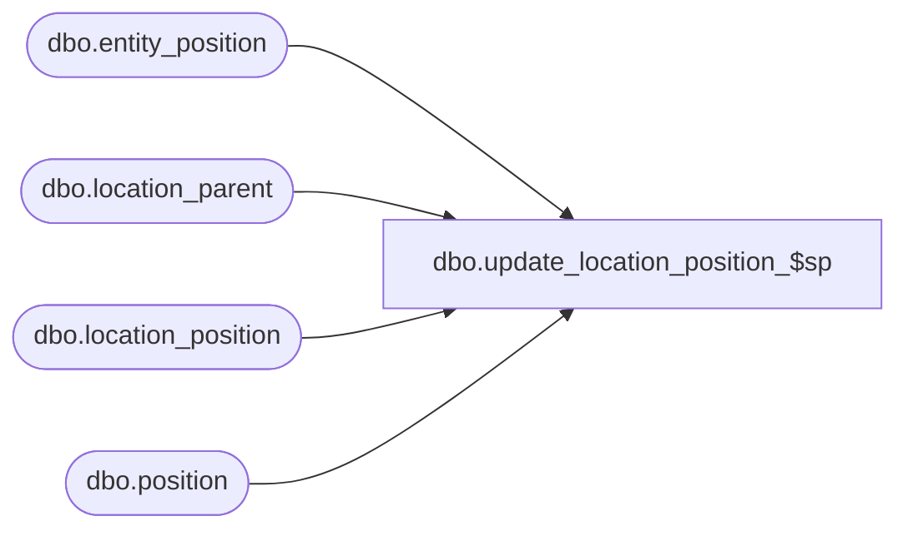

# dbo.update_location_position_$sp

**Database:** me_01  
**Server:** bedrockdb02  

## Architecture Diagram



## Table Dependencies

| Referenced Table |
|---|
| dbo.entity_position |
| dbo.location_parent |
| dbo.location_position |
| dbo.position |

## Stored Procedure Code

```sql
CREATE PROCEDURE [dbo].[update_location_position_$sp]
AS
BEGIN
  SET NOCOUNT ON;

  -- this proc refreshes the location_position table
  -- it is called whenever locations are moved in the hierarchy, and when position assignments are modified in the hierarchy

  MERGE location_position as LPOS
  USING (
    SELECT DISTINCT r.location_id,p.position_id FROM
    location_parent r
    INNER JOIN entity_position ep on ep.parent_type = 5 AND ep.parent_id = r.parent_hierarchy_group_id
    INNER JOIN position p ON ep.position_id = p.position_id
    ) as LGROUP (location_id, position_id)
    ON (LPOS.location_id = LGROUP.location_id and LPOS.position_id = LGROUP.position_id)

  WHEN NOT MATCHED BY TARGET THEN
      INSERT (location_id, position_id)
    VALUES (LGROUP.location_id, LGROUP.position_id)

  WHEN NOT MATCHED BY SOURCE THEN
    DELETE;
END
```

