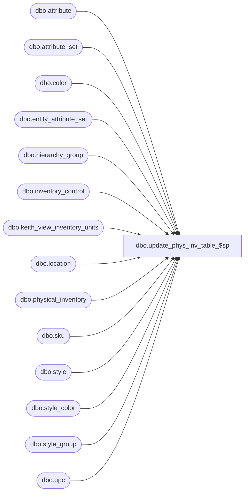

# dbo.update_phys_inv_table_$sp

**Database:** me_01  
**Server:** bedrockdb02  

## Architecture Diagram



## Table Dependencies

| Referenced Table |
|---|
| dbo.attribute |
| dbo.attribute_set |
| dbo.color |
| dbo.entity_attribute_set |
| dbo.hierarchy_group |
| dbo.inventory_control |
| dbo.keith_view_inventory_units |
| dbo.location |
| dbo.physical_inventory |
| dbo.sku |
| dbo.style |
| dbo.style_color |
| dbo.style_group |
| dbo.upc |

## Stored Procedure Code

```sql
CREATE  PROCEDURE [dbo].[update_phys_inv_table_$sp] (@sp  DECIMAL(12,0))

AS

--Modified by DanT - 01/23/2015 to allow for new hierarchy logic


BEGIN

--added 1/23/2015 to capture country information from the style attribute
IF (Object_ID('tempdb..#attribute') IS NOT NULL) DROP TABLE #attribute
select s.style_code, att.attribute_set_code
into #attribute
from style s (nolock)
join entity_attribute_set eas (nolock) on s.style_id = eas.parent_id
join attribute_set att (nolock) on eas.attribute_set_id = att.attribute_set_id
join attribute a (nolock) on att.attribute_id = a.attribute_id and a.parent_type = 1
where a.attribute_code = 'AVAILB'
order by s.style_code


declare @DocId as DECIMAL(12,0)
set @DocId = @sp

DELETE FROM physical_inventory
WHERE inventory_control_no = 
(
	SELECT document_no
	FROM inventory_control
	WHERE inventory_control_id = @DocId
)

INSERT INTO 
	physical_inventory (inventory_control_no, location_code, style_code, color_code, hierarchy_group_code, hierarchy_group_short_label, item_type, counted_quantity, counted_cost, transaction_units, transaction_cost, short_desc, delta_units, delta_cost, country)
SELECT 
	ic.document_no AS inventory_control_no, 
	l.location_code AS location_code, 
	s.style_code AS 	style_code, 
	c.color_code AS color_code, 
	hg_d.hierarchy_group_code AS hierarchy_group_code, 
	--u.upc_number AS upc_number, 
	hg_d.hierarchy_group_short_label AS hierarchy_group_short_label, 
	case when substring(hg_d.hierarchy_group_code, 7,2) = '60'
		then 'SUPPLY'
		else 'MERCH'
	end as item_type,
	ISNULL(viu.counted_units, 0) AS counted_quantity, 
	ISNULL(viu.counted_cost, 0) AS counted_cost, 
	ISNULL(viu.book_qty, 0) AS transaction_units, 
	ISNULL(viu.cost, 0) AS transaction_cost, 
	s.short_desc AS short_desc, 
	ISNULL(viu.shrink_units, 0)*-1 AS delta_units, 
	ISNULL(viu.shrink_cost, 0)*-1 AS delta_cost,
	--case when left(hg_d.hierarchy_group_code, 5) = 'R-B-C' --DanT 01/23/2015
	case when s.style_code in (select style_code from #attribute where attribute_set_code = 'CA')
		then 'CA'
	--when left(hg_d.hierarchy_group_code, 5) = 'R-B-U' --DanT 01/23/2015
	when s.style_code in (select style_code from #attribute where attribute_set_code = 'UK')
		then 'UK'
	--when left(hg_d.hierarchy_group_code, 5) = 'R-R-R' --DanT 01/23/2015
		--then 'RZ' --no longer used
	else 'US'
	end as "country"
FROM 
	inventory_control ic, 
	location l, 
	style s, 
	color c, 
	sku k, 
	style_color sc, 
	hierarchy_group hg_s, 
	hierarchy_group hg_d, 
	style_group sg, 
	keith_view_inventory_units viu/*, 
	(
		SELECT 
			sku_id, 
			MIN(upc_number) AS upc_number 
		FROM 
			upc 
		GROUP BY 
			sku_id
	) AS u*/
WHERE 
	ic.inventory_control_id = viu.inventory_control_id
	AND l.location_id = viu.location_id
	AND k.sku_id = viu.sku_id
	AND k.style_color_id = sc.style_color_id
	AND sc.color_id = c.color_id
	AND s.style_id = sc.style_id
	--AND u.sku_id = viu.sku_id 
	AND sg.style_id = s.style_id 
	AND sg.hierarchy_group_id = hg_s.hierarchy_group_id
	AND left(hg_s.hierarchy_group_code,8) = hg_d.hierarchy_group_code
	AND ic.inventory_control_id = @DocId


UPDATE
	physical_inventory
SET upc_number = 
(
	SELECT 
		MIN(upc_number)
	FROM
		upc, sku, style_color, style, color
	WHERE upc.sku_id = sku.sku_id
	AND sku.style_color_id = style_color.style_color_id
	AND style_color.style_id = style.style_id
	AND style_color.color_id = color.color_id
	AND physical_inventory.style_code = style.style_code
	AND physical_inventory.color_code = color.color_code
)

END
```

