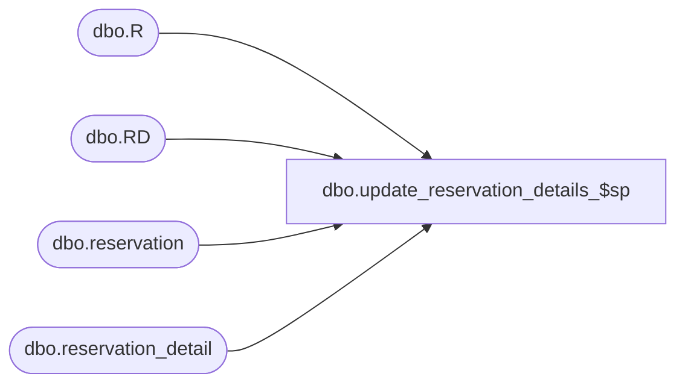

# dbo.update_reservation_details_$sp

**Database:** me_01  
**Server:** bedrockdb02  

## Architecture Diagram



## Table Dependencies

| Referenced Table |
|---|
| dbo.R |
| dbo.RD |
| dbo.reservation |
| dbo.reservation_detail |

## Stored Procedure Code

```sql
CREATE PROCEDURE dbo.update_reservation_details_$sp

   @Document_Number AS NVARCHAR(MAX) = NULL
  ,@Customer_Order_Number AS NVARCHAR(MAX) = NULL
  ,@Transaction_Type AS SMALLINT = 0
  ,@Document_Type AS SMALLINT = 0
  ,@Mark_Quantites_As_Done AS BIT = 0

AS
BEGIN

DECLARE @Reserve_From_Available_Type AS SMALLINT = 0
DECLARE @Future_Reserve_Type AS SMALLINT = 1
DECLARE @NSI_PO_Receipt_Type AS SMALLINT = 2
DECLARE @Ship_To_Store_Transfer_Type AS SMALLINT = 3

DECLARE @Action_Date_UTC AS DATETIME = GETUTCDATE()
DECLARE @Action_Date AS DATETIME = (SELECT DATEADD(MILLISECOND,DATEDIFF(MILLISECOND,GETUTCDATE(),GETDATE()),@Action_Date_UTC))

IF COALESCE(LEN(@Document_Number), 0) = 0
BEGIN

  SET @Document_Number = NULL

END

IF COALESCE(LEN(@Customer_Order_Number), 0) = 0
BEGIN

  SET @Customer_Order_Number = NULL

END

IF (@Transaction_Type = @Ship_To_Store_Transfer_Type OR @Transaction_Type = @NSI_PO_Receipt_Type OR @Mark_Quantites_As_Done = 1)
BEGIN

  INSERT INTO dbo.#temp_reservation_details
    (
      sku_id
      ,location_id
      ,quantity_reserved
    )
  SELECT
    sku_id
    ,location_id
    ,available_units_adjusted
  FROM
    dbo.#temp_available_units_adjusted

END

IF (@Mark_Quantites_As_Done = 1)
BEGIN

  UPDATE R
  SET
    R.action_date_utc = @Action_Date_UTC
    ,R.action_date = @Action_Date
    ,R.updatestamp = R.updatestamp+1
  FROM
    dbo.reservation R
  WHERE EXISTS
    (
      SELECT 1
      FROM
        dbo.#temp_reservation_details T
      WHERE
        T.location_id = R.location_id
        AND R.document_type = @Document_Type
        AND
          (
            (R.number = @Document_Number AND @Document_Number IS NOT NULL)
            OR (R.number IS NULL AND @Document_Number IS NULL)
          )
        AND
          (
            (R.customer_order_number = @Customer_Order_Number AND @Customer_Order_Number IS NOT NULL)
            OR (R.customer_order_number IS NULL AND @Customer_Order_Number IS NULL)
          )
        AND R.transaction_type = @Transaction_Type
    )

  UPDATE RD
  SET
    RD.quantity_done = T.quantity_reserved
  FROM
    dbo.reservation_detail RD
  INNER JOIN dbo.reservation R ON
    R.reservation_id = RD.reservation_id
    AND R.document_type = @Document_Type
    AND
      (
        (R.number = @Document_Number AND @Document_Number IS NOT NULL)
        OR (R.number IS NULL AND @Document_Number IS NULL)
      )
    AND
      (
        (R.customer_order_number = @Customer_Order_Number AND @Customer_Order_Number IS NOT NULL)
        OR (R.customer_order_number IS NULL AND @Customer_Order_Number IS NULL)
      )
    AND R.transaction_type = @Transaction_Type
  INNER JOIN dbo.#temp_reservation_details T ON
    T.sku_id = RD.sku_id
    AND T.location_id = R.location_id


  RETURN

END

UPDATE R
SET
  R.action_date_utc = @Action_Date_UTC
  ,R.action_date = @Action_Date
  ,R.updatestamp = R.updatestamp+1
FROM
  dbo.reservation R
WHERE EXISTS
  (
    SELECT 1
    FROM
      dbo.#temp_reservation_details T
    WHERE
      T.location_id = R.location_id
      AND R.document_type = @Document_Type
      AND
        (
          (R.number = @Document_Number AND @Document_Number IS NOT NULL)
          OR (R.number IS NULL AND @Document_Number IS NULL)
        )
      AND
        (
          (R.customer_order_number = @Customer_Order_Number AND @Customer_Order_Number IS NOT NULL)
          OR (R.customer_order_number IS NULL AND @Customer_Order_Number IS NULL)
        )
      AND R.transaction_type = @Transaction_Type
  )

INSERT INTO dbo.reservation
  (
    transaction_type
    ,document_type
    ,number
    ,customer_order_number
    ,location_id
    ,action_date_utc
    ,action_date
  )
SELECT
  DISTINCT
    @Transaction_Type
    ,@Document_Type
    ,@Document_Number
    ,@Customer_Order_Number
    ,T.location_id
    ,@Action_Date_UTC
    ,@Action_Date
FROM
  dbo.#temp_reservation_details T
WHERE NOT EXISTS
  (
    SELECT 1
    FROM
      dbo.reservation R
    WHERE
      R.location_id = T.location_id
      AND R.document_type = @Document_Type
      AND
        (
          (R.number = @Document_Number AND @Document_Number IS NOT NULL)
          OR (R.number IS NULL AND @Document_Number IS NULL)
        )
      AND
        (
          (R.customer_order_number = @Customer_Order_Number AND @Customer_Order_Number IS NOT NULL)
          OR (R.customer_order_number IS NULL AND @Customer_Order_Number IS NULL)
        )
      AND R.transaction_type = @Transaction_Type
  )

UPDATE RD
SET
  RD.quantity = RD.quantity + T.quantity_reserved
FROM
  dbo.reservation_detail RD
INNER JOIN dbo.reservation R ON
  R.reservation_id = RD.reservation_id
  AND R.document_type = @Document_Type
  AND
    (
      (R.number = @Document_Number AND @Document_Number IS NOT NULL)
      OR (R.number IS NULL AND @Document_Number IS NULL)
    )
  AND
    (
      (R.customer_order_number = @Customer_Order_Number AND @Customer_Order_Number IS NOT NULL)
      OR (R.customer_order_number IS NULL AND @Customer_Order_Number IS NULL)
    )
  AND R.transaction_type = @Transaction_Type
INNER JOIN dbo.#temp_reservation_details T ON
  T.sku_id = RD.sku_id
  AND T.location_id = R.location_id

INSERT INTO dbo.reservation_detail
  (
    reservation_id
    ,sku_id
    ,quantity
  )
SELECT
  R.reservation_id
  ,T.sku_id
  ,T.quantity_reserved
FROM
  dbo.#temp_reservation_details T
INNER JOIN dbo.reservation R ON
  R.location_id = T.location_id
  AND R.document_type = @Document_Type
  AND
    (
      (R.number = @Document_Number AND @Document_Number IS NOT NULL)
      OR (R.number IS NULL AND @Document_Number IS NULL)
    )
  AND
    (
      (R.customer_order_number = @Customer_Order_Number AND @Customer_Order_Number IS NOT NULL)
      OR (R.customer_order_number IS NULL AND @Customer_Order_Number IS NULL)
    )
  AND R.transaction_type = @Transaction_Type
WHERE NOT EXISTS
  (
    SELECT 1
    FROM
      dbo.reservation_detail RD
    WHERE
      RD.reservation_id = R.reservation_id
      AND RD.sku_id = T.sku_id
  )

END
```

