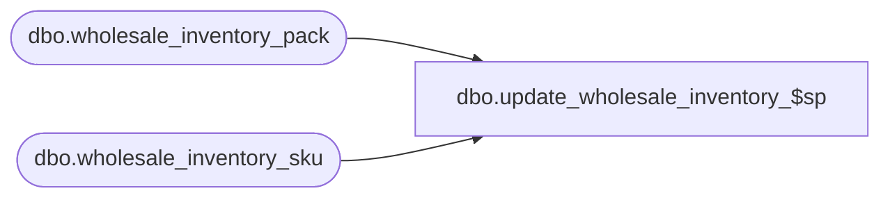

# dbo.update_wholesale_inventory_$sp

**Database:** me_01  
**Server:** bedrockdb02  

## Architecture Diagram



## Table Dependencies

| Referenced Table |
|---|
| dbo.wholesale_inventory_pack |
| dbo.wholesale_inventory_sku |

## Stored Procedure Code

```sql
CREATE PROCEDURE [dbo].[update_wholesale_inventory_$sp] 
	(@p_action as NCHAR(1), @p_vendorCode AS NVARCHAR(20))
AS

DECLARE   @UseTran	BIT
		, @table_name NVARCHAR(30), @operation_name NVARCHAR(50)
		, @sql_err_num DECIMAL(38,0), @error_msg NVARCHAR(2000)
		, @error_severity SMALLINT, @error_state SMALLINT
		, @line_id	INT

SET NOCOUNT ON;

/* 
Proc name: update_wholesale_inventory_$sp 
Description: Procedure called by the .Net component Nsb.Inventory.WholesaleInventoryImport.exe to update the wholesale inventory
			 tables wholesale_inventory_sku and wholesale_inventory_pack.

	Steps:
		1.  	Delete the existing entries for any vendors in the vendor list parameter
		2.  	Update any existing entries with the new available quantity
		3.		Insert new row for any new skus.

HISTORY:
Date       			Name         		Def#			Desc
March 9, 2011			Margaret M					Create
*/

BEGIN TRY

-- Begin the transaction
	IF @@TRANCOUNT = 0
	BEGIN

		BEGIN TRANSACTION
		SET @UseTran = 1

	END

-- Step 1 Delete existing vendor inventory for vendors that are undergoing a Refresh action
	SET @line_id = 10

	IF @p_action = N'R'
	BEGIN
		DELETE FROM wholesale_inventory_sku WHERE vendor_code = @p_vendorCode;
		SET @line_id = 20
		DELETE FROM wholesale_inventory_pack WHERE vendor_code = @p_vendorCode;
    	END

-- Step 2 Execute the sql to update existing records in the inventory tables
	
	SET @line_id = 30
	UPDATE wholesale_inventory_sku 
	SET available_on_hand = inventory_import_details.available_on_hand 
	FROM #inventory_import_details inventory_import_details, wholesale_inventory_sku s 
	WHERE inventory_import_details.sku_id = s.sku_id AND inventory_import_details.vendor_code = s.vendor_code; 

	SET @line_id = 40
	UPDATE wholesale_inventory_pack 
	SET available_on_hand = inventory_import_details.available_on_hand 
	FROM #inventory_import_details inventory_import_details, wholesale_inventory_pack p 
	WHERE inventory_import_details.pack_id = p.pack_id AND inventory_import_details.vendor_code = p.vendor_code;

-- Step 3 Execute the sql to insert new records in the inventory tables

	SET @line_id = 50	
	INSERT INTO wholesale_inventory_sku (vendor_code, style_code, color_code, size_code, sku_id, available_on_hand) 
	(SELECT inventory_import_details.vendor_code, inventory_import_details.style_code, inventory_import_details.color_code, 
		inventory_import_details.size_code, inventory_import_details.sku_id, inventory_import_details.available_on_hand 
	FROM #inventory_import_details inventory_import_details  LEFT JOIN 
	wholesale_inventory_sku s ON s.sku_id = inventory_import_details.sku_id AND s.vendor_code = inventory_import_details.vendor_code 
	WHERE s.sku_id IS NULL AND inventory_import_details.sku_id IS NOT NULL);

	SET @line_id = 60
	INSERT INTO wholesale_inventory_pack (vendor_code, pack_code, pack_id, available_on_hand) 
	(SELECT inventory_import_details.vendor_code, inventory_import_details.pack_code, inventory_import_details.pack_id, inventory_import_details.available_on_hand 
	FROM #inventory_import_details inventory_import_details LEFT JOIN 
	wholesale_inventory_pack p ON p.pack_id = inventory_import_details.pack_id AND p.vendor_code = inventory_import_details.vendor_code 
	WHERE p.pack_id IS NULL AND inventory_import_details.pack_id IS NOT NULL);

-- Commit the transaction 	

	SET @line_id = 70

	IF @UseTran = 1
	BEGIN

	   COMMIT TRANSACTION;

	END;
	
	RETURN	

END TRY

BEGIN CATCH

	SELECT 
		@error_severity	= 16
		, @error_state = 1

	IF @line_id = 10
		SELECT  
			@table_name			= N'wholesale_inventory_sku'
			, @operation_name	= N'DELETE for refresh'
			, @sql_err_num		= ERROR_NUMBER()
			, @error_msg		= N'Line Id = ' + CAST(@line_id AS NVARCHAR(4)) + N' '
									+ N' Table Name = ' + @table_name + N' '
									+ N' Operation Name = ' + @operation_name + N' '
									+ N' SQL Error Number = ' + CAST(@sql_err_num AS NVARCHAR(38)) + N' '
									+ N' Error Message = ' + ERROR_MESSAGE()

	ELSE IF @line_id = 20
		SELECT  
			@table_name			= N'wholesale_inventory_pack'
			, @operation_name	= N'DELETE for refresh'
			, @sql_err_num		= ERROR_NUMBER()
			, @error_msg		= N'Line Id = ' + CAST(@line_id AS NVARCHAR(4)) + N' '
									+ N' Table Name = ' + @table_name + N' '
									+ N' Operation Name = ' + @operation_name + N' '
									+ N' SQL Error Number = ' + CAST(@sql_err_num AS NVARCHAR(38)) + N' '
									+ N' Error Message = ' + ERROR_MESSAGE()

	ELSE IF @line_id = 30
		SELECT  
			@table_name			= N'wholesale_inventory_sku'
			, @operation_name	= N'UPDATE'
			, @sql_err_num		= ERROR_NUMBER()
			, @error_msg		= N'Line Id = ' + CAST(@line_id AS NVARCHAR(4)) + N' '
									+ N' Table Name = ' + @table_name + N' '
									+ N' Operation Name = ' + @operation_name + N' '
									+ N' SQL Error Number = ' + CAST(@sql_err_num AS NVARCHAR(38)) + N' '
									+ N' Error Message = ' + ERROR_MESSAGE()

	ELSE IF @line_id = 40
		SELECT  
			@table_name			= N'wholesale_inventory_pack'
			, @operation_name	= N'UPATE'
			, @sql_err_num		= ERROR_NUMBER()
			, @error_msg		= N'Line Id = ' + CAST(@line_id AS NVARCHAR(4)) + N' '
									+ N' Table Name = ' + @table_name + N' '
									+ N' Operation Name = ' + @operation_name + N' '
									+ N' SQL Error Number = ' + CAST(@sql_err_num AS NVARCHAR(38)) + N' '
									+ N' Error Message = ' + ERROR_MESSAGE()

	ELSE IF @line_id = 50
		SELECT  
			@table_name			= N'wholesale_inventory_sku'
			, @operation_name	= N'INSERT'
			, @sql_err_num		= ERROR_NUMBER()
			, @error_msg		= N'Line Id = ' + CAST(@line_id AS NVARCHAR(4)) + N' '
									+ N' Table Name = ' + @table_name + N' '
									+ N' Operation Name = ' + @operation_name + N' '
									+ N' SQL Error Number = ' + CAST(@sql_err_num AS NVARCHAR(38)) + N' '
									+ N' Error Message = ' + ERROR_MESSAGE()

	ELSE IF @line_id = 60
		SELECT  
			@table_name			= N'wholesale_inventory_pack'
			, @operation_name	= N'INSERT'
			, @sql_err_num		= ERROR_NUMBER()
			, @error_msg		= N'Line Id = ' + CAST(@line_id AS NVARCHAR(4)) + N' '
									+ N' Table Name = ' + @table_name + N' '
									+ N' Operation Name = ' + @operation_name + N' '
									+ N' SQL Error Number = ' + CAST(@sql_err_num AS NVARCHAR(38)) + N' '
									+ N' Error Message = ' + ERROR_MESSAGE()

	ELSE IF @line_id = 70
		SELECT  
			@table_name			= N'Not applicable'
			, @operation_name	= N'COMMIT TRANSACTION'
			, @sql_err_num		= ERROR_NUMBER()
			, @error_msg		= N'Line Id = ' + CAST(@line_id AS NVARCHAR(4)) + N' '
									+ N' Table Name = ' + @table_name + N' '
									+ N' Operation Name = ' + @operation_name + N' '
									+ N' SQL Error Number = ' + CAST(@sql_err_num AS NVARCHAR(38)) + N' '
									+ N' Error Message = ' + ERROR_MESSAGE()
									
	IF @UseTran = 1
	BEGIN
	
		ROLLBACK TRANSACTION;
		
	END;									
			
	RAISERROR (@error_msg, @error_severity, @error_state)	

END CATCH
```

