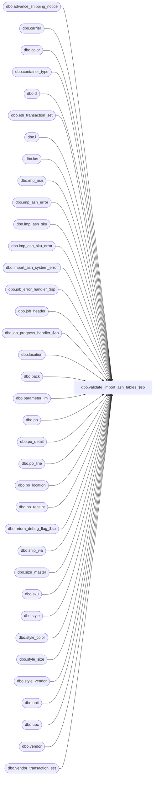

# dbo.validate_import_asn_tables_$sp

**Database:** me_01  
**Server:** bedrockdb02  

## Architecture Diagram



## Table Dependencies

| Referenced Table |
|---|
| dbo.advance_shipping_notice |
| dbo.carrier |
| dbo.color |
| dbo.container_type |
| dbo.d |
| dbo.edi_transaction_set |
| dbo.i |
| dbo.ias |
| dbo.imp_asn |
| dbo.imp_asn_error |
| dbo.imp_asn_sku |
| dbo.imp_asn_sku_error |
| dbo.import_asn_system_error |
| dbo.job_error_handler_$sp |
| dbo.job_header |
| dbo.job_progress_handler_$sp |
| dbo.location |
| dbo.pack |
| dbo.parameter_im |
| dbo.po |
| dbo.po_detail |
| dbo.po_line |
| dbo.po_location |
| dbo.po_receipt |
| dbo.return_debug_flag_$sp |
| dbo.ship_via |
| dbo.size_master |
| dbo.sku |
| dbo.style |
| dbo.style_color |
| dbo.style_size |
| dbo.style_vendor |
| dbo.unit |
| dbo.upc |
| dbo.vendor |
| dbo.vendor_transaction_set |

## Stored Procedure Code

```sql
CREATE PROCEDURE [dbo].[validate_import_asn_tables_$sp]
  (@job_id INT)

AS

/*
  Version		: 1.00
  Description	: This procedure is called by import_asn_batch_$sp and it validates the imp_asn and imp_asn_sku tables business rules and foreign keys,
        updates the imp_asn tables with the IDs of the referenced entities and copy the rows in error in the error tables:
        imp_asn_error and imp_asn_sku_error.
        These rows are extracted from the batch and will not be processed part of the job_id where they were associated to.
        The errors require manual corrections before being re-submit and will be linked to a new job_id when the re-processing will take place.
*/

BEGIN
  DECLARE @line_id SMALLINT, @job_type TINYINT, @proc_name NVARCHAR(30), @sql_err_num DECIMAL(38,0), @range_start DECIMAL(24,0), @debug_flag BIT,
      @range_end DECIMAL(24,0), @table_name	NVARCHAR(30), @operation_name NVARCHAR(30), @error_msg NVARCHAR(2000), @job_debug_flag BIT,
      @c_true BIT, @c_false BIT, @msg NVARCHAR(500), @job_detail_count INT, @count TINYINT, @gen_po_receipt_flag BIT, @error_count INT,
      @n_retry TINYINT, @delay nchar(8);

  SELECT @c_true	= 1,
       @c_false = 0,
       @line_id = 10,
       @job_type = 10,
       @n_retry	= 0,
       @delay	= N'00:00:05',
       @proc_name = N'validate_import_asn_tables_$sp';

  IF NOT OBJECT_ID(N'tempdb..#imp_asn_error') IS NULL
    DROP TABLE #imp_asn_error;

  CREATE TABLE #imp_asn_error
    (imp_asn_id	DECIMAL(12, 0) NOT NULL,
    import_asn_system_error_id SMALLINT NOT NULL,
    PRIMARY KEY CLUSTERED (imp_asn_id ASC));

  IF NOT OBJECT_ID(N'tempdb..#imp_asn_sku_error') IS NULL
    DROP TABLE #imp_asn_sku_error;

  CREATE TABLE #imp_asn_sku_error
    (imp_asn_sku_id	DECIMAL(12, 0) NOT NULL,
    imp_asn_id DECIMAL(12, 0) NOT NULL,
    import_asn_system_error_id SMALLINT NOT NULL,
    UNIQUE CLUSTERED (imp_asn_sku_id ASC, imp_asn_id ASC));

  IF NOT OBJECT_ID(N'tempdb..#vendor') IS NULL
    DROP TABLE #vendor;

  CREATE TABLE #vendor
    (imp_asn_id DECIMAL(12, 0) NOT NULL,
    vendor_code varchar(20) NULL);

  IF NOT OBJECT_ID(N'tempdb..#sku_detail') IS NULL
    DROP TABLE #sku_detail;

  CREATE TABLE #sku_detail
    (imp_asn_sku_id	DECIMAL(12, 0) NOT NULL,
    imp_asn_id DECIMAL(12, 0) NOT NULL,
    sku_id DECIMAL(13, 0) NULL,
    style_color_id DECIMAL(13, 0) NULL,
    style_id DECIMAL(12, 0) NOT NULL,
    order_no TINYINT NOT NULL);

  IF NOT OBJECT_ID(N'tempdb..#imp_po') IS NULL
    DROP TABLE #imp_po;

  CREATE TABLE #imp_po
    (imp_asn_sku_id DECIMAL(12, 0) NOT NULL,
    po_id DECIMAL(12, 0) NULL);

  IF NOT OBJECT_ID(N'tempdb..#imp_blanket_po') IS NULL
    DROP TABLE #imp_blanket_po;

  CREATE TABLE #imp_blanket_po
    (imp_asn_sku_id DECIMAL(12, 0) NOT NULL,
    po_id DECIMAL(12, 0) NULL);

  BEGIN TRY
    -- Get parameters associates to the current job
    SELECT @range_start = range_start, @range_end = range_end, @job_debug_flag = debug_flag
    FROM job_header WITH (NOLOCK)
    WHERE job_id = @job_id
    AND job_type = @job_type;

    IF @@ROWCOUNT = 0
      RAISERROR (N'Error: job #%i is missing in the job_header table.',
               16, -- Severity.
               1, -- State.
               @job_id);

    -- Log progress if job_params.debug_flag is true
    EXEC return_debug_flag_$sp @job_type, @debug_flag OUT
    IF (@debug_flag = @c_true OR @job_debug_flag = @c_true)
      EXEC job_progress_handler_$sp @job_type, @job_id, @proc_name, @line_id;

    -- ** Validations on the import tables, header section **

    -- Validate if vendor codes provided are valid
    SET @line_id = 20
    INSERT INTO #imp_asn_error
      (imp_asn_id, import_asn_system_error_id)
    SELECT i.imp_asn_id, ISNULL(r.import_asn_system_error_id, 4)
    FROM imp_asn i WITH (NOLOCK)
    LEFT OUTER JOIN import_asn_system_error r WITH (NOLOCK)
       ON r.error_code = N'vendor'
    WHERE i.imp_asn_id BETWEEN @range_start AND @range_end
    AND i.vendor_code IS NOT NULL
    AND NOT EXISTS( SELECT 1 FROM vendor v WITH (NOLOCK)
          WHERE v.vendor_code = i.vendor_code);

    -- Log progress if job_params.debug_flag is true
    EXEC return_debug_flag_$sp @job_type, @debug_flag OUT
    IF (@debug_flag = @c_true OR @job_debug_flag = @c_true)
      EXEC job_progress_handler_$sp @job_type, @job_id, @proc_name, @line_id;

    -- if vendor not provided, get default vendor and update import table
    IF ( SELECT count(*) FROM imp_asn WHERE imp_asn_id BETWEEN @range_start AND @range_end AND vendor_code IS NULL ) > 0
    BEGIN
      -- If we don't have the vendor code then we need: vendor interchange id qualifier and vendor interchange id code.
      -- in order to retrieve the default vendor for vendor_inter_id_qualifier and vendor_inter_id_code provided in the interface file (col 5 and 6 ).
      -- First, check if the values provided in those columns are valid:
      SET @line_id = 25;

      INSERT INTO #imp_asn_error
        (imp_asn_id, import_asn_system_error_id)
      SELECT i.imp_asn_id, ISNULL(r.import_asn_system_error_id, 4)
      FROM imp_asn i WITH (NOLOCK)
      LEFT OUTER JOIN import_asn_system_error r WITH (NOLOCK)
         ON r.error_code = N'vendor'
      WHERE i.imp_asn_id BETWEEN @range_start AND @range_end
      AND i.vendor_code IS NULL
      AND NOT EXISTS( SELECT 1 FROM vendor v WITH (NOLOCK)
            WHERE v.vendor_interchange_id_qual = i.vendor_inter_id_qualifier
            AND v.vendor_interchange_id_code = i.vendor_inter_id_code);

      -- Log progress if job_params.debug_flag is true
      EXEC return_debug_flag_$sp @job_type, @debug_flag OUT
      IF (@debug_flag = @c_true OR @job_debug_flag = @c_true)
        EXEC job_progress_handler_$sp @job_type, @job_id, @proc_name, @line_id;

      SET @line_id = 30;
      -- Start by inserting vendor code in a temp table in order to speed up the following UPDATE
      INSERT INTO #vendor
        (imp_asn_id, vendor_code)
      SELECT i.imp_asn_id, v.vendor_code
      FROM imp_asn i WITH (NOLOCK), vendor v WITH (NOLOCK)
      WHERE i.imp_asn_id BETWEEN @range_start AND @range_end
      AND i.vendor_code IS NULL
      AND i.vendor_inter_id_qualifier = v.vendor_interchange_id_qual
      AND i.vendor_inter_id_code = v.vendor_interchange_id_code
      AND NOT EXISTS (SELECT 1
              FROM #imp_asn_error ir WITH (NOLOCK)
              WHERE ir.imp_asn_id BETWEEN @range_start AND @range_end
              AND ir.imp_asn_id = i.imp_asn_id);

      -- Log progress if job_params.debug_flag is true
      EXEC return_debug_flag_$sp @job_type, @debug_flag OUT
      IF (@debug_flag = @c_true OR @job_debug_flag = @c_true)
        EXEC job_progress_handler_$sp @job_type, @job_id, @proc_name, @line_id;

      SET @line_id = 35;

      vendor_step:
      BEGIN TRY
        BEGIN TRAN

        UPDATE i
        SET i.vendor_code = v.vendor_code
        FROM imp_asn i, #vendor v
        WHERE i.imp_asn_id BETWEEN @range_start AND @range_end
        AND i.imp_asn_id = v.imp_asn_id;

        UPDATE ias
        SET    ias.vendor_code = v.vendor_code
        FROM   imp_asn_sku ias, #vendor v
        WHERE ias.imp_asn_id = v.imp_asn_id;

        COMMIT TRAN
      END TRY
      BEGIN CATCH
        SELECT @error_msg = N'Error ' + CAST(ERROR_NUMBER() AS NVARCHAR(20)) + N' : unable to update vendor_code for job #%i after 3 retries,  ' + ERROR_MESSAGE();

        ROLLBACK TRANSACTION;

        SET @n_retry = @n_retry + 1;

        IF @n_retry <= 3
        BEGIN
          WAITFOR DELAY @delay;
          GOTO vendor_step;
        END
        ELSE
        RAISERROR (@error_msg,
              16, -- Severity.
              1, -- State.
              @job_id);
      END CATCH

      -- Log progress if job_params.debug_flag is true
      EXEC return_debug_flag_$sp @job_type, @debug_flag OUT
      IF (@debug_flag = @c_true OR @job_debug_flag = @c_true)
        EXEC job_progress_handler_$sp @job_type, @job_id, @proc_name, @line_id
    END

    SET @line_id = 40
    -- Validate that vendor has been authorized to process EDI 856 transactions
    INSERT INTO #imp_asn_error
      (imp_asn_id, import_asn_system_error_id)
    SELECT i.imp_asn_id, ISNULL(r.import_asn_system_error_id, 4)
    FROM imp_asn i WITH (NOLOCK)
    LEFT OUTER JOIN import_asn_system_error r WITH (NOLOCK)
       ON r.error_code = N'vendor'
    WHERE i.imp_asn_id BETWEEN @range_start AND @range_end
    AND NOT EXISTS (SELECT 1 FROM vendor v  WITH (NOLOCK), edi_transaction_set ets WITH (NOLOCK), vendor_transaction_set vts  WITH (NOLOCK)
            WHERE v.vendor_code = i.vendor_code
            AND v.active_flag = 1
            AND v.vendor_id = vts.vendor_id
            AND vts.edi_transaction_set_id = ets.edi_transaction_set_id
            AND ets.edi_transaction_set_code = N'856')
    AND NOT EXISTS (SELECT 1
             FROM #imp_asn_error ir WITH (NOLOCK)
             WHERE  i.imp_asn_id = ir.imp_asn_id
             AND ir.imp_asn_id BETWEEN @range_start AND @range_end);

    -- Log progress if job_params.debug_flag is true
    EXEC return_debug_flag_$sp @job_type, @debug_flag OUT
    IF (@debug_flag = @c_true OR @job_debug_flag = @c_true)
      EXEC job_progress_handler_$sp @job_type, @job_id, @proc_name, @line_id

    -- VALIDATIONS of foreigh keys: unit_weight_code, container_type_code, ship_via_code, carrier
    SET @line_id = 50;

    INSERT INTO #imp_asn_error
      (imp_asn_id, import_asn_system_error_id)
    SELECT i.imp_asn_id, ISNULL(r.import_asn_system_error_id, 5)
    FROM imp_asn i WITH (NOLOCK)
    LEFT OUTER JOIN import_asn_system_error r WITH (NOLOCK)
       ON r.error_code = N'weight'
    WHERE i.imp_asn_id BETWEEN @range_start AND @range_end
    AND   i.unit_weight_code IS NOT NULL
    AND (NOT EXISTS
             (SELECT 1 FROM unit u  WITH (NOLOCK) WHERE u.unit_code = i.unit_weight_code)
         OR weight <= 0)
    AND NOT EXISTS
      (SELECT 1
       FROM #imp_asn_error ir WITH (NOLOCK)
       WHERE  i.imp_asn_id = ir.imp_asn_id
       AND ir.imp_asn_id BETWEEN @range_start AND @range_end);

    -- Log progress if job_params.debug_flag is true
    EXEC return_debug_flag_$sp @job_type, @debug_flag OUT
    IF (@debug_flag = @c_true OR @job_debug_flag = @c_true)
      EXEC job_progress_handler_$sp @job_type, @job_id, @proc_name, @line_id;

    SET @line_id = 51;

    INSERT INTO #imp_asn_error
      (imp_asn_id, import_asn_system_error_id)
    SELECT i.imp_asn_id, ISNULL(r.import_asn_system_error_id, 6)
    FROM imp_asn i WITH (NOLOCK)
    LEFT OUTER JOIN import_asn_system_error r WITH (NOLOCK)
       ON r.error_code = N'container'
    WHERE i.imp_asn_id BETWEEN @range_start AND @range_end
    AND i.container_type_code IS NOT NULL
    AND (NOT EXISTS
             (SELECT * FROM container_type c  WITH (NOLOCK) WHERE c.container_type_code = i.container_type_code)
         OR i.no_of_containers <= 0)
    AND NOT EXISTS
      (SELECT 1
       FROM #imp_asn_error ir WITH (NOLOCK)
       WHERE  i.imp_asn_id = ir.imp_asn_id
       AND ir.imp_asn_id BETWEEN @range_start AND @range_end);

    -- Log progress if job_params.debug_flag is true
    EXEC return_debug_flag_$sp @job_type, @debug_flag OUT
    IF (@debug_flag = @c_true OR @job_debug_flag = @c_true)
      EXEC job_progress_handler_$sp @job_type, @job_id, @proc_name, @line_id

    SET @line_id = 52;

    INSERT INTO #imp_asn_error
      (imp_asn_id, import_asn_system_error_id)
    SELECT i.imp_asn_id, ISNULL(r.import_asn_system_error_id, 7)
    FROM imp_asn i WITH (NOLOCK)
    LEFT OUTER JOIN import_asn_system_error r WITH (NOLOCK)
       ON r.error_code = N'ship_via'
    WHERE i.imp_asn_id BETWEEN @range_start AND @range_end
    AND i.ship_via_code IS NOT NULL
    AND NOT EXISTS (
      SELECT 1 FROM ship_via s  WITH (NOLOCK)
      WHERE  s.ship_via_code = i.ship_via_code
        AND s.active_flag = 1)
    AND NOT EXISTS
      (SELECT 1
       FROM #imp_asn_error ir WITH (NOLOCK)
       WHERE  i.imp_asn_id = ir.imp_asn_id
       AND ir.imp_asn_id BETWEEN @range_start AND @range_end);

    -- Log progress if job_params.debug_flag is true
    EXEC return_debug_flag_$sp @job_type, @debug_flag OUT
    IF (@debug_flag = @c_true OR @job_debug_flag = @c_true)
      EXEC job_progress_handler_$sp @job_type, @job_id, @proc_name, @line_id;

    SET @line_id = 53;

    INSERT INTO #imp_asn_error
      (imp_asn_id, import_asn_system_error_id)
    SELECT i.imp_asn_id, ISNULL(r.import_asn_system_error_id, 8)
    FROM imp_asn i WITH (NOLOCK)
    LEFT OUTER JOIN import_asn_system_error r WITH (NOLOCK)
       ON r.error_code = N'carrier'
    WHERE i.imp_asn_id BETWEEN @range_start AND @range_end
    AND i.carrier_code IS NOT NULL
    AND NOT EXISTS (SELECT 1 FROM carrier c  WITH (NOLOCK)
        WHERE c.carrier_code = i.carrier_code
        AND c.active_flag = 1)
    AND NOT EXISTS
      (SELECT 1
       FROM #imp_asn_error ir WITH (NOLOCK)
       WHERE  i.imp_asn_id = ir.imp_asn_id
       AND ir.imp_asn_id BETWEEN @range_start AND @range_end);

    -- Log progress if job_params.debug_flag is true
    EXEC return_debug_flag_$sp @job_type, @debug_flag OUT
    IF (@debug_flag = @c_true OR @job_debug_flag = @c_true)
      EXEC job_progress_handler_$sp @job_type, @job_id, @proc_name, @line_id;

    SET @line_id = 60;
    -- check if a shipment with the same reference number already exists in the system
    INSERT INTO #imp_asn_error
      (imp_asn_id, import_asn_system_error_id)
    SELECT i.imp_asn_id, ISNULL(r.import_asn_system_error_id, 9)
    FROM  imp_asn i WITH (NOLOCK)
    LEFT OUTER JOIN import_asn_system_error r WITH (NOLOCK)
       ON r.error_code = N'shp_ref_no'
    WHERE i.imp_asn_id BETWEEN @range_start AND @range_end
    AND EXISTS
       (SELECT 1
        FROM   advance_shipping_notice a WITH (NOLOCK)
        INNER  JOIN vendor v WITH (NOLOCK)
           ON  a.vendor_id = v.vendor_id
        WHERE  a.shipment_ref_no = i.shipment_ref_no
        AND    v.vendor_code = i.vendor_code )
    AND NOT EXISTS
      (SELECT 1
       FROM #imp_asn_error ir WITH (NOLOCK)
       WHERE  i.imp_asn_id = ir.imp_asn_id
       AND ir.imp_asn_id BETWEEN @range_start AND @range_end);

    -- Log progress if job_params.debug_flag is true
    EXEC return_debug_flag_$sp @job_type, @debug_flag OUT
    IF (@debug_flag = @c_true OR @job_debug_flag = @c_true)
      EXEC job_progress_handler_$sp @job_type, @job_id, @proc_name, @line_id

    SET @line_id = 70
    -- ** Validations on the import table, detail section **
    --  is UPC valid

    INSERT INTO #imp_asn_sku_error
      (imp_asn_sku_id, imp_asn_id, import_asn_system_error_id)
    SELECT ia.imp_asn_sku_id, ia.imp_asn_id, ISNULL(r.import_asn_system_error_id, 10)
    FROM    imp_asn_sku ia  WITH (NOLOCK)
    LEFT OUTER JOIN import_asn_system_error r WITH (NOLOCK)
       ON r.error_code = N'upc_number'
    WHERE   ia.imp_asn_id BETWEEN @range_start AND @range_end
    AND     ia.upc_number IS NOT NULL
    AND NOT EXISTS (SELECT *
            FROM upc u  WITH (NOLOCK)
            WHERE u.upc_number = ia.upc_number )
    AND NOT EXISTS
      (SELECT 1
       FROM #imp_asn_sku_error ir WITH (NOLOCK)
       WHERE  ia.imp_asn_id = ir.imp_asn_id
       AND ia.imp_asn_sku_id = ir.imp_asn_sku_id
       AND ir.imp_asn_id BETWEEN @range_start AND @range_end);

    -- Log progress if job_params.debug_flag is true
    EXEC return_debug_flag_$sp @job_type, @debug_flag OUT
    IF (@debug_flag = @c_true OR @job_debug_flag = @c_true)
      EXEC job_progress_handler_$sp @job_type, @job_id, @proc_name, @line_id

    SET @line_id = 80;
    -- Do we have to validate vendor style
    SELECT @count = COUNT(*)
    FROM    imp_asn_sku ias WITH (NOLOCK)
    WHERE   ias.imp_asn_id BETWEEN @range_start AND @range_end
    AND     ias.vendor_style_code IS NOT NULL
    AND		ias.upc_number IS NULL
    AND		ias.style_code IS NULL
    AND NOT EXISTS ( SELECT  *
             FROM style_vendor sv WITH (NOLOCK), vendor v  WITH (NOLOCK)
             WHERE sv.vendor_style = ias.vendor_style_code
             AND sv.vendor_id = v.vendor_id
             AND v.vendor_code = ias.vendor_code )
    AND NOT EXISTS
      (SELECT 1
       FROM #imp_asn_sku_error ir WITH (NOLOCK)
       WHERE  ias.imp_asn_id = ir.imp_asn_id
       AND ias.imp_asn_sku_id = ir.imp_asn_sku_id
       AND ir.imp_asn_id BETWEEN @range_start AND @range_end);

    -- Validate vendor_style when provided in the interface file
    IF (@count > 0)
    BEGIN
      INSERT INTO #imp_asn_sku_error
        (imp_asn_sku_id, imp_asn_id, import_asn_system_error_id)
      SELECT ias.imp_asn_sku_id, ias.imp_asn_id, ISNULL(r.import_asn_system_error_id, 3)
      FROM    imp_asn_sku ias  WITH (NOLOCK)
      LEFT OUTER JOIN import_asn_system_error r WITH (NOLOCK)
        ON r.error_code = N'ven_style'
      WHERE   ias.imp_asn_id BETWEEN @range_start AND @range_end
      AND     ias.vendor_style_code IS NOT NULL
      AND		ias.upc_number IS NULL
      AND		ias.style_code IS NULL
      AND NOT EXISTS ( SELECT  *
               FROM style_vendor sv WITH (NOLOCK), vendor v  WITH (NOLOCK)
               WHERE sv.vendor_style = ias.vendor_style_code
               AND sv.vendor_id = v.vendor_id
               AND v.vendor_code = ias.vendor_code )
      AND NOT EXISTS
        (SELECT 1
         FROM #imp_asn_sku_error ir WITH (NOLOCK)
         WHERE  ias.imp_asn_id = ir.imp_asn_id
         AND ias.imp_asn_sku_id = ir.imp_asn_sku_id
         AND ir.imp_asn_id BETWEEN @range_start AND @range_end);
    END

    -- Log progress if job_params.debug_flag is true
    EXEC return_debug_flag_$sp @job_type, @debug_flag OUT
    IF (@debug_flag = @c_true OR @job_debug_flag = @c_true)
      EXEC job_progress_handler_$sp @job_type, @job_id, @proc_name, @line_id

    SET @line_id = 90;
    -- update the style_id, style_color_id and sku_id for vendor styles that match directly
    -- We support some combination: UPC beats Pack Code and Packs Code beats style/vendor_style

    INSERT INTO #sku_detail -- This inserts is for style_vendor and 2 dimension sizes
      (imp_asn_sku_id, imp_asn_id, sku_id, style_color_id, style_id, order_no)
    SELECT DISTINCT i.imp_asn_sku_id, i.imp_asn_id, sku.sku_id, sku.style_color_id, sku.style_id, 3
    FROM imp_asn_sku i WITH (NOLOCK)
    INNER JOIN style_vendor sv WITH (NOLOCK)
      ON i.vendor_style_code = sv.vendor_style
    INNER JOIN vendor v WITH (NOLOCK)
       ON sv.vendor_id = v.vendor_id
       AND v.vendor_code = i.vendor_code
    INNER  JOIN style_color sc WITH (NOLOCK)
       ON  sv.style_id = sc.style_id
    INNER  JOIN color c WITH (NOLOCK)
       ON  sc.color_id = c.color_id
       AND (c.color_code = i.color_code OR (i.color_code IS NULL AND c.color_id = 1))
    INNER JOIN style_size ss WITH (NOLOCK)
       ON  sv.style_id = ss.style_id
    INNER JOIN size_master sm WITH (NOLOCK)
       ON sm.size_master_id = ss.size_master_id
       AND (sm.size_code = i.size_code
        OR
        (sm.prim_size_label = i.primary_size_label AND sm.sec_size_label = i.secondary_size_label))
    INNER  JOIN sku WITH (NOLOCK)
       ON  sv.style_id = sku.style_id
       AND ss.style_size_id = sku.style_size_id
       AND sc.style_color_id = sku.style_color_id
    WHERE i.imp_asn_id BETWEEN @range_start AND @range_end
    AND i.upc_number IS NULL
    AND i.pack_code IS NULL
    AND i.vendor_style_code IS NOT NULL
    AND i.secondary_size_label IS NOT NULL;

    -- Log progress if job_params.debug_flag is true
    EXEC return_debug_flag_$sp @job_type, @debug_flag OUT
    IF (@debug_flag = @c_true OR @job_debug_flag = @c_true)
      EXEC job_progress_handler_$sp @job_type, @job_id, @proc_name, @line_id

    SET @line_id = 100;

    INSERT INTO #sku_detail  -- This inserts is for style_vendor and 1 dimension sizes
      (imp_asn_sku_id, imp_asn_id, sku_id, style_color_id, style_id, order_no)
    SELECT DISTINCT i.imp_asn_sku_id, i.imp_asn_id, sku.sku_id, sku.style_color_id, sku.style_id, 3
    FROM imp_asn_sku i WITH (NOLOCK)
    INNER JOIN style_vendor sv WITH (NOLOCK)
      ON i.vendor_style_code = sv.vendor_style
    INNER JOIN vendor v WITH (NOLOCK)
       ON sv.vendor_id = v.vendor_id
       AND v.vendor_code = i.vendor_code
    INNER  JOIN style_color sc WITH (NOLOCK)
       ON  sv.style_id = sc.style_id
    INNER  JOIN color c WITH (NOLOCK)
       ON  sc.color_id = c.color_id
       AND (c.color_code = i.color_code OR (i.color_code IS NULL AND c.color_id = 1))
    INNER JOIN style_size ss WITH (NOLOCK)
       ON  sv.style_id = ss.style_id
    INNER JOIN size_master sm WITH (NOLOCK)
       ON sm.size_master_id = ss.size_master_id
       AND ( sm.size_code = i.size_code
         OR
          sm.prim_size_label = i.primary_size_label)
    INNER  JOIN sku WITH (NOLOCK)
       ON  sv.style_id = sku.style_id
       AND ss.style_size_id = sku.style_size_id
       AND sc.style_color_id = sku.style_color_id
    WHERE i.imp_asn_id BETWEEN @range_start AND @range_end
    AND i.upc_number IS NULL
    AND i.pack_code IS NULL
    AND i.vendor_style_code IS NOT NULL
    AND i.secondary_size_label IS NULL;

    -- Log progress if job_params.debug_flag is true
    EXEC return_debug_flag_$sp @job_type, @debug_flag OUT
    IF (@debug_flag = @c_true OR @job_debug_flag = @c_true)
      EXEC job_progress_handler_$sp @job_type, @job_id, @proc_name, @line_id

    SET @line_id = 110
    -- Validate style_code when provided in the interface file
    SELECT  @count = COUNT(*)
    FROM    imp_asn_sku i WITH (NOLOCK)
    WHERE   i.imp_asn_id BETWEEN @range_start AND @range_end
    AND		i.upc_number IS NULL
    AND     i.style_code IS NOT NULL
    AND NOT EXISTS ( SELECT  *
             FROM style s WITH (NOLOCK)
             WHERE s.style_code = i.style_code)
    AND NOT EXISTS
      (SELECT 1
       FROM #imp_asn_sku_error ir WITH (NOLOCK)
       WHERE  i.imp_asn_id = ir.imp_asn_id
       AND i.imp_asn_sku_id = ir.imp_asn_sku_id
       AND ir.imp_asn_id BETWEEN @range_start AND @range_end);

    IF (@count > 0)
    BEGIN
      INSERT INTO #imp_asn_sku_error
        (imp_asn_sku_id, imp_asn_id, import_asn_system_error_id)
      SELECT i.imp_asn_sku_id, i.imp_asn_id, ISNULL(r.import_asn_system_error_id, 2)
      FROM    imp_asn_sku i WITH (NOLOCK)
      LEFT OUTER JOIN import_asn_system_error r WITH (NOLOCK)
        ON r.error_code = N'style'
      WHERE   i.imp_asn_id BETWEEN @range_start AND @range_end
      AND		i.upc_number IS NULL
      AND     i.style_code IS NOT NULL
      AND NOT EXISTS ( SELECT  *
               FROM style s WITH (NOLOCK)
               WHERE s.style_code = i.style_code)
      AND NOT EXISTS
        (SELECT 1
         FROM #imp_asn_sku_error ir WITH (NOLOCK)
         WHERE  i.imp_asn_id = ir.imp_asn_id
         AND i.imp_asn_sku_id = ir.imp_asn_sku_id
         AND ir.imp_asn_id BETWEEN @range_start AND @range_end);
    END
    -- Log progress if job_params.debug_flag is true
    EXEC return_debug_flag_$sp @job_type, @debug_flag OUT
    IF (@debug_flag = @c_true OR @job_debug_flag = @c_true)
      EXEC job_progress_handler_$sp @job_type, @job_id, @proc_name, @line_id

    SET @line_id = 120
    -- update the style_id, style_color_id and sku_id for styles that exist with the same name

    INSERT INTO #sku_detail  -- This inserts is for style and 2 dimension sizes
      (imp_asn_sku_id, imp_asn_id, sku_id, style_color_id, style_id, order_no)
    SELECT DISTINCT i.imp_asn_sku_id, i.imp_asn_id, sku.sku_id, sc.style_color_id, s.style_id, 3
    FROM imp_asn_sku i WITH (NOLOCK)
    INNER JOIN style s WITH (NOLOCK)
       ON i.style_code = s.style_code
    INNER JOIN style_color sc WITH (NOLOCK)
       ON  s.style_id = sc.style_id
    INNER JOIN color c WITH (NOLOCK)
      ON sc.color_id = c.color_id
      AND (c.color_code = i.color_code OR (i.color_code IS NULL AND c.color_id = 1))
     INNER JOIN style_size ss WITH (NOLOCK)
       ON  s.style_id = ss.style_id
     INNER JOIN size_master sm WITH (NOLOCK)
      ON ss.size_master_id = sm.size_master_id
      AND (sm.size_code = i.size_code
        OR
          (sm.prim_size_label = i.primary_size_label AND sm.sec_size_label = i.secondary_size_label))
    INNER JOIN sku WITH (NOLOCK)
       ON  s.style_id = sku.style_id
       AND sc.style_color_id = sku.style_color_id
       AND ss.style_size_id = sku.style_size_id
    WHERE i.imp_asn_id BETWEEN @range_start AND @range_end
    AND i.upc_number IS NULL
    AND i.pack_code IS NULL
    AND i.style_code IS NOT NULL
    AND i.secondary_size_label IS NOT NULL;

    -- Log progress if job_params.debug_flag is true
    EXEC return_debug_flag_$sp @job_type, @debug_flag OUT
    IF (@debug_flag = @c_true OR @job_debug_flag = @c_true)
      EXEC job_progress_handler_$sp @job_type, @job_id, @proc_name, @line_id;

    SET @line_id = 130;

    INSERT INTO #sku_detail  -- This inserts is for style_vendor and 1 dimension sizes
      (imp_asn_sku_id, imp_asn_id, sku_id, style_color_id, style_id, order_no)
    SELECT DISTINCT i.imp_asn_sku_id, i.imp_asn_id, sku.sku_id, sc.style_color_id, s.style_id, 3
    FROM imp_asn_sku i WITH (NOLOCK)
    INNER JOIN style s WITH (NOLOCK)
       ON i.style_code = s.style_code
    INNER JOIN style_color sc WITH (NOLOCK)
       ON  s.style_id = sc.style_id
    INNER JOIN color c WITH (NOLOCK)
      ON sc.color_id = c.color_id
      AND (c.color_code = i.color_code OR (i.color_code IS NULL AND c.color_id = 1))
     INNER JOIN style_size ss WITH (NOLOCK)
       ON  s.style_id = ss.style_id
     INNER JOIN size_master sm WITH (NOLOCK)
      ON ss.size_master_id = sm.size_master_id
      AND (sm.size_code = i.size_code
        OR
          (sm.prim_size_label = i.primary_size_label))
    INNER JOIN sku WITH (NOLOCK)
       ON  s.style_id = sku.style_id
       AND sc.style_color_id = sku.style_color_id
       AND ss.style_size_id = sku.style_size_id
    WHERE i.imp_asn_id BETWEEN @range_start AND @range_end
    AND i.upc_number IS NULL
    AND i.pack_code IS NULL
    AND i.style_code IS NOT NULL
    AND i.secondary_size_label IS NULL;

    -- Log progress if job_params.debug_flag is true
    EXEC return_debug_flag_$sp @job_type, @debug_flag OUT
    IF (@debug_flag = @c_true OR @job_debug_flag = @c_true)
      EXEC job_progress_handler_$sp @job_type, @job_id, @proc_name, @line_id;

    SET @line_id = 140
    -- If blanket_po_no provided then release_no should also be provided
    INSERT INTO #imp_asn_sku_error
      (imp_asn_sku_id, imp_asn_id, import_asn_system_error_id)
    SELECT i.imp_asn_sku_id, i.imp_asn_id, ISNULL(r.import_asn_system_error_id, 15)
    FROM imp_asn_sku i WITH (NOLOCK)
    LEFT OUTER JOIN import_asn_system_error r WITH (NOLOCK)
      ON r.error_code = N'blnkt_po'
    WHERE imp_asn_id BETWEEN @range_start AND @range_end
    AND blanket_po_no IS NOT NULL
    AND release_no IS NULL
    AND NOT EXISTS
      (SELECT 1
       FROM #imp_asn_sku_error ir WITH (NOLOCK)
       WHERE  i.imp_asn_id = ir.imp_asn_id
       AND i.imp_asn_sku_id = ir.imp_asn_sku_id
       AND ir.imp_asn_id BETWEEN @range_start AND @range_end);

    -- Log progress if job_params.debug_flag is true
    EXEC return_debug_flag_$sp @job_type, @debug_flag OUT
    IF (@debug_flag = @c_true OR @job_debug_flag = @c_true)
      EXEC job_progress_handler_$sp @job_type, @job_id, @proc_name, @line_id;

    SET @line_id = 150;
    -- Ship To Locations should be valid and active
    INSERT INTO #imp_asn_sku_error
      (imp_asn_sku_id, imp_asn_id, import_asn_system_error_id)
    SELECT i.imp_asn_sku_id, i.imp_asn_id, ISNULL(r.import_asn_system_error_id, 12)
    FROM imp_asn_sku i WITH (NOLOCK)
    LEFT OUTER JOIN import_asn_system_error r WITH (NOLOCK)
      ON r.error_code = N'shp_to_loc'
    WHERE i.imp_asn_id BETWEEN @range_start AND @range_end
    AND NOT EXISTS (SELECT 1 FROM location l WITH (NOLOCK)
            WHERE i.ship_to_location = l.location_code
            AND l.active_flag = 1)
    AND NOT EXISTS
      (SELECT 1
       FROM #imp_asn_sku_error ir WITH (NOLOCK)
       WHERE  i.imp_asn_id = ir.imp_asn_id
       AND i.imp_asn_sku_id = ir.imp_asn_sku_id
       AND ir.imp_asn_id BETWEEN @range_start AND @range_end);

    -- Log progress if job_params.debug_flag is true
    EXEC return_debug_flag_$sp @job_type, @debug_flag OUT
    IF (@debug_flag = @c_true OR @job_debug_flag = @c_true)
      EXEC job_progress_handler_$sp @job_type, @job_id, @proc_name, @line_id

    SET @line_id = 160;
    -- Selling Locations (if provided) should be valid and active
    INSERT INTO #imp_asn_sku_error
      (imp_asn_sku_id, imp_asn_id, import_asn_system_error_id)
    SELECT i.imp_asn_sku_id, i.imp_asn_id, ISNULL(r.import_asn_system_error_id, 13)
    FROM imp_asn_sku i WITH (NOLOCK)
    LEFT OUTER JOIN import_asn_system_error r WITH (NOLOCK)
      ON r.error_code = N'sell_loc'
    WHERE i.imp_asn_id BETWEEN @range_start AND @range_end
    AND i.selling_location_code IS NOT NULL
    AND NOT EXISTS (SELECT 1 FROM location l WITH (NOLOCK)
            WHERE i.selling_location_code = l.location_code
            AND l.active_flag = 1)
    AND NOT EXISTS
      (SELECT 1
       FROM #imp_asn_sku_error ir WITH (NOLOCK)
       WHERE  i.imp_asn_id = ir.imp_asn_id
       AND i.imp_asn_sku_id = ir.imp_asn_sku_id
       AND ir.imp_asn_id BETWEEN @range_start AND @range_end);

    -- Log progress if job_params.debug_flag is true
    EXEC return_debug_flag_$sp @job_type, @debug_flag OUT
    IF (@debug_flag = @c_true OR @job_debug_flag = @c_true)
      EXEC job_progress_handler_$sp @job_type, @job_id, @proc_name, @line_id

    SET @line_id = 170;
    -- Check units shipped > 0
    INSERT INTO #imp_asn_sku_error
      (imp_asn_sku_id, imp_asn_id, import_asn_system_error_id)
    SELECT i.imp_asn_sku_id, i.imp_asn_id, ISNULL(r.import_asn_system_error_id, 16)
    FROM imp_asn_sku i WITH (NOLOCK)
    LEFT OUTER JOIN import_asn_system_error r WITH (NOLOCK)
      ON r.error_code = N'shp_units'
    WHERE imp_asn_id BETWEEN @range_start AND @range_end
    AND units_shipped <= 0
    AND NOT EXISTS
      (SELECT 1
       FROM #imp_asn_sku_error ir WITH (NOLOCK)
       WHERE  i.imp_asn_id = ir.imp_asn_id
       AND i.imp_asn_sku_id = ir.imp_asn_sku_id
       AND ir.imp_asn_id BETWEEN @range_start AND @range_end);

    -- Log progress if job_params.debug_flag is true
    EXEC return_debug_flag_$sp @job_type, @debug_flag OUT
    IF (@debug_flag = @c_true OR @job_debug_flag = @c_true)
      EXEC job_progress_handler_$sp @job_type, @job_id, @proc_name, @line_id;

    SELECT @line_id = 180, @n_retry = 0;
    -- Convert upc number to pack_code if applicable: and get rid of the pack UPC
    -- because we need to apply the rule: UPC beats Pack Code: if there was already a pack code it'll be overlaid
    -- and now the new pack has precedence over style and style_vendor.

    upc_step:
    BEGIN TRY
      BEGIN TRAN

      UPDATE i
      SET i.pack_code = pack.pack_code,
        i.upc_number = NULL
      FROM imp_asn_sku i, upc WITH (NOLOCK), pack WITH (NOLOCK)
      WHERE i.imp_asn_id BETWEEN @range_start AND @range_end
      AND i.upc_number IS NOT NULL
      AND i.upc_number = upc.upc_number
      AND upc.sku_id IS NULL
      AND upc.pack_id = pack.pack_id;

      UPDATE i
      SET i.pack_code = NULL
      FROM imp_asn_sku i, upc WITH (NOLOCK)
      WHERE i.imp_asn_id BETWEEN @range_start AND @range_end
      AND i.upc_number IS NOT NULL
      AND i.upc_number = upc.upc_number
      AND upc.sku_id IS NOT NULL
      AND upc.pack_id IS NULL;

      COMMIT TRAN

    END TRY
    BEGIN CATCH
      SELECT @error_msg = N'Error ' + CAST(ERROR_NUMBER() AS NVARCHAR(20)) + N' : unable to add pack information for job #%i after 3 retries,  ' + ERROR_MESSAGE();

      ROLLBACK TRANSACTION;

      SET @n_retry = @n_retry + 1;

      IF @n_retry <= 3
      BEGIN
        WAITFOR DELAY @delay;
        GOTO upc_step;
      END
      ELSE
      RAISERROR (@error_msg,
            16, -- Severity.
            1, -- State.
            @job_id);

    END CATCH

    -- Log progress if job_params.debug_flag is true
    EXEC return_debug_flag_$sp @job_type, @debug_flag OUT
    IF (@debug_flag = @c_true OR @job_debug_flag = @c_true)
      EXEC job_progress_handler_$sp @job_type, @job_id, @proc_name, @line_id;

    -- Convert upc number to sku_id
    SET @line_id = 182;
    -- Order is 1 because UPC beats all other information that could be provided
    INSERT INTO #sku_detail
      (imp_asn_sku_id, imp_asn_id, sku_id, style_color_id, style_id, order_no)
    SELECT DISTINCT i.imp_asn_sku_id, i.imp_asn_id, k.sku_id, k.style_color_id, k.style_id, 1
    FROM imp_asn_sku i WITH (NOLOCK)
    INNER JOIN upc u WITH (NOLOCK)
      ON  i.upc_number = u.upc_number
      AND u.sku_id IS NOT NULL
      AND u.pack_id IS NULL
    INNER JOIN sku k WITH (NOLOCK)
      ON u.sku_id = k.sku_id
    WHERE i.imp_asn_id BETWEEN @range_start AND @range_end
    AND i.upc_number IS NOT NULL;

    -- Log progress if job_params.debug_flag is true
    EXEC return_debug_flag_$sp @job_type, @debug_flag OUT
    IF (@debug_flag = @c_true OR @job_debug_flag = @c_true)
      EXEC job_progress_handler_$sp @job_type, @job_id, @proc_name, @line_id;

    SET @line_id = 185;

    -- Before doing validation on sku, insert the rows related to the packs and update imp_asn_sku
    -- This is because we don't want the pack to be overlaid by style/style_vendor for a particular imp_asn_sku_id.
    INSERT INTO #sku_detail
      (imp_asn_sku_id, imp_asn_id, sku_id, style_color_id, style_id, order_no)
    SELECT DISTINCT i.imp_asn_sku_id, i.imp_asn_id, NULL, NULL, p.style_id, 2
    FROM imp_asn_sku i WITH (NOLOCK), pack p WITH (NOLOCK)
    WHERE i.imp_asn_id BETWEEN @range_start AND @range_end
    AND i.pack_code IS NOT NULL
    AND i.pack_code = p.pack_code;

    -- Log progress if job_params.debug_flag is true
    EXEC return_debug_flag_$sp @job_type, @debug_flag OUT
    IF (@debug_flag = @c_true OR @job_debug_flag = @c_true)
      EXEC job_progress_handler_$sp @job_type, @job_id, @proc_name, @line_id;

    SET @line_id = 186;
    -- Now, remove information that should not be considered for a specific imp_asn_sku_id
    DELETE d
    FROM #sku_detail d,
      ( SELECT sd.imp_asn_sku_id, sd.imp_asn_id, MIN(order_no) minOrderNo
        FROM #sku_detail sd WITH (NOLOCK),
         ( SELECT imp_asn_sku_id, imp_asn_id, COUNT(*) cnt
           FROM #sku_detail WITH (NOLOCK)
           GROUP BY imp_asn_sku_id, imp_asn_id
           HAVING COUNT(*) > 1) T
        WHERE sd.imp_asn_sku_id = T.imp_asn_sku_id
        AND sd.imp_asn_id = T.imp_asn_id
        GROUP BY sd.imp_asn_sku_id, sd.imp_asn_id ) U
    WHERE d.imp_asn_id = U.imp_asn_id
    AND d.imp_asn_sku_id = U.imp_asn_sku_id
    AND d.order_no <> U.minOrderNo;

    -- Log progress if job_params.debug_flag is true
    EXEC return_debug_flag_$sp @job_type, @debug_flag OUT
    IF (@debug_flag = @c_true OR @job_debug_flag = @c_true)
      EXEC job_progress_handler_$sp @job_type, @job_id, @proc_name, @line_id;

    SELECT @line_id = 187, @n_retry = 0;
    -- UPDATE imp_asn_sku, add information that will be useful later in th eprocess to speed up the process
    sku_step:
    BEGIN TRY
      BEGIN TRAN

      UPDATE i
      SET i.sku_id = d.sku_id,
        i.style_color_id = d.style_color_id,
        i.style_id = d.style_id
      FROM imp_asn_sku i, #sku_detail d
      WHERE i.imp_asn_id BETWEEN @range_start AND @range_end
      AND i.imp_asn_id = d.imp_asn_id
      AND i.imp_asn_sku_id = d.imp_asn_sku_id
      AND d.sku_id IS NOT NULL;

      COMMIT TRAN
    END TRY
    BEGIN CATCH
        SELECT @error_msg = N'Error ' + CAST(ERROR_NUMBER() AS NVARCHAR(20)) + N' : unable to add sku information for job #%i after 3 retries,  ' + ERROR_MESSAGE();

        ROLLBACK TRANSACTION;

        SET @n_retry = @n_retry + 1;

        IF @n_retry <= 3
        BEGIN
          WAITFOR DELAY @delay;
          GOTO sku_step;
        END
        ELSE
        RAISERROR (@error_msg,
              16, -- Severity.
              1, -- State.
              @job_id);
    END CATCH

    -- Log progress if job_params.debug_flag is true
    EXEC return_debug_flag_$sp @job_type, @debug_flag OUT
    IF (@debug_flag = @c_true OR @job_debug_flag = @c_true)
      EXEC job_progress_handler_$sp @job_type, @job_id, @proc_name, @line_id;

    -- Validate sku_id
    SET @line_id = 190;

    INSERT INTO #imp_asn_sku_error
      (imp_asn_sku_id, imp_asn_id, import_asn_system_error_id)
    SELECT i.imp_asn_sku_id, i.imp_asn_id, ISNULL(r.import_asn_system_error_id, 11)
    FROM   imp_asn_sku i WITH (NOLOCK)
    LEFT OUTER JOIN import_asn_system_error r WITH (NOLOCK)
      ON r.error_code = N'sku_id'
    WHERE i.imp_asn_id BETWEEN @range_start AND @range_end
    AND i.sku_id IS NULL
    AND i.pack_code IS NULL
    AND NOT EXISTS
      (SELECT 1
       FROM #imp_asn_sku_error ir WITH (NOLOCK)
       WHERE  i.imp_asn_id = ir.imp_asn_id
       AND i.imp_asn_sku_id = ir.imp_asn_sku_id
       AND ir.imp_asn_id BETWEEN @range_start AND @range_end);

    -- Log progress if job_params.debug_flag is true
    EXEC return_debug_flag_$sp @job_type, @debug_flag OUT
    IF (@debug_flag = @c_true OR @job_debug_flag = @c_true)
      EXEC job_progress_handler_$sp @job_type, @job_id, @proc_name, @line_id;

    -- Validate pack_code when provided
    SET @line_id = 200;

    INSERT INTO #imp_asn_sku_error
      (imp_asn_sku_id, imp_asn_id, import_asn_system_error_id)
    SELECT T.imp_asn_sku_id, T.imp_asn_id, ISNULL(r.import_asn_system_error_id, 22)
    FROM (SELECT i.imp_asn_sku_id, i.imp_asn_id
      FROM imp_asn_sku i WITH (NOLOCK)
      WHERE i.imp_asn_id BETWEEN @range_start AND @range_end
      AND i.pack_code IS NOT NULL
      AND NOT EXISTS (SELECT 1 FROM pack p WHERE p.pack_code = i.pack_code )
      ) T
    LEFT OUTER JOIN import_asn_system_error r WITH (NOLOCK)
      ON r.error_code = N'pack_code'
    AND NOT EXISTS (SELECT 1
             FROM #imp_asn_sku_error ir WITH (NOLOCK)
             WHERE T.imp_asn_id = ir.imp_asn_id
             AND T.imp_asn_sku_id = ir.imp_asn_sku_id
             AND ir.imp_asn_id BETWEEN @range_start AND @range_end);

    -- Log progress if job_params.debug_flag is true
    EXEC return_debug_flag_$sp @job_type, @debug_flag OUT
    IF (@debug_flag = @c_true OR @job_debug_flag = @c_true)
      EXEC job_progress_handler_$sp @job_type, @job_id, @proc_name, @line_id;

    -- Update style_id from pack_code
    SET @line_id = 202;

    UPDATE i
    SET style_id = p.style_id
    FROM imp_asn_sku i
    INNER JOIN pack p
      ON i.pack_code = p.pack_code
      AND i.imp_asn_id BETWEEN @range_start AND @range_end
      AND i.pack_code IS NOT NULL;

    -- Log progress if job_params.debug_flag is true
    EXEC return_debug_flag_$sp @job_type, @debug_flag OUT
    IF (@debug_flag = @c_true OR @job_debug_flag = @c_true)
      EXEC job_progress_handler_$sp @job_type, @job_id, @proc_name, @line_id;

    -- Validate po exists for the vendor provided, the po is OPEN and approval category is either: Release or Standalone
    SET @line_id = 210;

    INSERT INTO #imp_asn_sku_error
      (imp_asn_sku_id, imp_asn_id, import_asn_system_error_id)
    SELECT i.imp_asn_sku_id, i.imp_asn_id, ISNULL(r.import_asn_system_error_id, 14)
    FROM   imp_asn_sku i WITH (NOLOCK)
    LEFT OUTER JOIN import_asn_system_error r WITH (NOLOCK)
      ON r.error_code = N'po'
    WHERE  i.imp_asn_id BETWEEN @range_start AND @range_end
    AND    i.po_number IS NOT NULL
    AND    NOT EXISTS
             (SELECT 1
              FROM   po WITH (NOLOCK)
              INNER  JOIN vendor v WITH (NOLOCK)
                 ON  po.vendor_id = v.vendor_id
                 AND po.po_status = 4
                 AND po.approval_category IN (2, 3, 4)
              WHERE  po.po_no = i.po_number
                 AND v.vendor_code = i.vendor_code)
    AND NOT EXISTS
      (SELECT 1
       FROM #imp_asn_sku_error ir WITH (NOLOCK)
       WHERE  i.imp_asn_id = ir.imp_asn_id
       AND i.imp_asn_sku_id = ir.imp_asn_sku_id
       AND ir.imp_asn_id BETWEEN @range_start AND @range_end);

    -- Log progress if job_params.debug_flag is true
    EXEC return_debug_flag_$sp @job_type, @debug_flag OUT
    IF (@debug_flag = @c_true OR @job_debug_flag = @c_true)
      EXEC job_progress_handler_$sp @job_type, @job_id, @proc_name, @line_id;

    -- Before Updating the po_id, insert it into a temp table in order to speed up the process and avoid deadlocks
    SET @line_id = 220;

    INSERT INTO #imp_po
      (imp_asn_sku_id, po_id)
    SELECT imp_asn_sku_id, po.po_id
    FROM imp_asn_sku i WITH (NOLOCK), po WITH (NOLOCK)
    WHERE i.imp_asn_id BETWEEN @range_start AND @range_end
    AND i.po_number = po.po_no
    AND NOT EXISTS (SELECT 1
       FROM #imp_asn_sku_error ir WITH (NOLOCK)
       WHERE ir.imp_asn_id BETWEEN @range_start AND @range_end
       AND  ir.imp_asn_id = i.imp_asn_id
       AND ir.imp_asn_sku_id = i.imp_asn_sku_id);

    -- Log progress if job_params.debug_flag is true
    EXEC return_debug_flag_$sp @job_type, @debug_flag OUT
    IF (@debug_flag = @c_true OR @job_debug_flag = @c_true)
      EXEC job_progress_handler_$sp @job_type, @job_id, @proc_name, @line_id;

    -- Validate blanket po_id
    SET @line_id = 230;

    INSERT INTO #imp_asn_sku_error
      (imp_asn_sku_id, imp_asn_id, import_asn_system_error_id)
    SELECT i.imp_asn_sku_id, i.imp_asn_id, ISNULL(r.import_asn_system_error_id, 15)
    FROM imp_asn_sku i WITH (NOLOCK)
    LEFT OUTER JOIN import_asn_system_error r WITH (NOLOCK)
      ON r.error_code = N'blnkt_po'
    WHERE imp_asn_id BETWEEN @range_start AND @range_end
    AND blanket_po_no IS NOT NULL
    AND NOT EXISTS
       (SELECT 1
        FROM po WITH (NOLOCK)
        WHERE po.blanket_po_number = i.blanket_po_no
        AND   po.release_number = i.release_no)
    AND NOT EXISTS
      (SELECT 1
       FROM #imp_asn_sku_error ir WITH (NOLOCK)
       WHERE  i.imp_asn_id = ir.imp_asn_id
       AND i.imp_asn_sku_id = ir.imp_asn_sku_id
       AND ir.imp_asn_id BETWEEN @range_start AND @range_end);

    -- Log progress if job_params.debug_flag is true
    EXEC return_debug_flag_$sp @job_type, @debug_flag OUT
    IF (@debug_flag = @c_true OR @job_debug_flag = @c_true)
      EXEC job_progress_handler_$sp @job_type, @job_id, @proc_name, @line_id;

    SET @line_id = 235;

    -- Before Updating blanket po_id, insert it into a temp table in order to speed up the process and avoid deadlocks
    INSERT INTO #imp_blanket_po
      (imp_asn_sku_id, po_id)
    SELECT imp_asn_sku_id, po.po_id
    FROM imp_asn_sku i WITH (NOLOCK), po WITH (NOLOCK)
    WHERE i.imp_asn_id BETWEEN @range_start AND @range_end
    AND i.blanket_po_no IS NOT NULL
    AND i.release_no IS NOT NULL
    AND i.blanket_po_no = po.blanket_po_number
    AND i.release_no = po.release_number
    AND NOT EXISTS (SELECT 1
       FROM #imp_asn_sku_error ir WITH (NOLOCK)
       WHERE ir.imp_asn_id BETWEEN @range_start AND @range_end
       AND  ir.imp_asn_id = i.imp_asn_id
       AND ir.imp_asn_sku_id = i.imp_asn_sku_id);

    -- Log progress if job_params.debug_flag is true
    EXEC return_debug_flag_$sp @job_type, @debug_flag OUT
    IF (@debug_flag = @c_true OR @job_debug_flag = @c_true)
      EXEC job_progress_handler_$sp @job_type, @job_id, @proc_name, @line_id;

    SELECT @line_id = 240, @n_retry = 0;
    -- Add po_id and blanket_po_id to imp_asn_sku

    po_step:
    BEGIN TRY
      BEGIN TRAN

      UPDATE i
      SET po_id = po.po_id
      FROM imp_asn_sku i, #imp_po po
      WHERE i.imp_asn_sku_id  = po.imp_asn_sku_id;

      UPDATE i
      SET po_id = po.po_id
      FROM imp_asn_sku i, #imp_blanket_po po
      WHERE i.imp_asn_sku_id  = po.imp_asn_sku_id;

      COMMIT TRAN

    END TRY
    BEGIN CATCH
      SELECT @error_msg = N'Error ' + CAST(ERROR_NUMBER() AS NVARCHAR(20)) + N' : unable to add po information for job #%i after 3 retries,  ' + ERROR_MESSAGE();

      ROLLBACK TRANSACTION;

      SET @n_retry = @n_retry + 1;

      IF @n_retry <= 3
      BEGIN
        WAITFOR DELAY @delay;
        GOTO po_step;
      END
      ELSE
      RAISERROR (@error_msg,
            16, -- Severity.
            1, -- State.
            @job_id);

    END CATCH

    -- Log progress if job_params.debug_flag is true
    EXEC return_debug_flag_$sp @job_type, @debug_flag OUT
    IF (@debug_flag = @c_true OR @job_debug_flag = @c_true)
      EXEC job_progress_handler_$sp @job_type, @job_id, @proc_name, @line_id;

    -- Ship to location should exists on the po_location for Bulk and Crossdock PO
    SET @line_id = 250;

    INSERT INTO #imp_asn_sku_error
      (imp_asn_sku_id, imp_asn_id, import_asn_system_error_id)
    SELECT i.imp_asn_sku_id, i.imp_asn_id, ISNULL(r.import_asn_system_error_id, 17)
    FROM   imp_asn_sku i WITH (NOLOCK)
    INNER  JOIN po WITH (NOLOCK)
       ON  i.po_id = po.po_id
       AND i.imp_asn_id BETWEEN @range_start AND @range_end
      AND po.predistribution_type IN (1, 3)
    INNER  JOIN location l WITH (NOLOCK)
       ON  i.ship_to_location = l.location_code
       AND NOT EXISTS
          (SELECT 1
           FROM   po_location pl WITH (NOLOCK)
           WHERE  pl.po_id = po.po_id
           AND    pl.location_id = l.location_id)
    LEFT OUTER JOIN import_asn_system_error r WITH (NOLOCK)
      ON r.error_code = N'loc_blk_po'
    WHERE NOT EXISTS
      (SELECT 1
       FROM #imp_asn_sku_error ir WITH (NOLOCK)
       WHERE  i.imp_asn_id = ir.imp_asn_id
       AND i.imp_asn_sku_id = ir.imp_asn_sku_id
       AND ir.imp_asn_id BETWEEN @range_start AND @range_end);

    -- Log progress if job_params.debug_flag is true
    EXEC return_debug_flag_$sp @job_type, @debug_flag OUT
    IF (@debug_flag = @c_true OR @job_debug_flag = @c_true)
      EXEC job_progress_handler_$sp @job_type, @job_id, @proc_name, @line_id;

    -- ASN po location detail that does not exist on the po_detail for Dropship PO
    SET @line_id = 260;

    -- In order to optimize the following SQL, just do it when necessary
    SELECT @error_count = COUNT(*) FROM #imp_asn_sku_error WHERE imp_asn_id BETWEEN @range_start AND @range_end;

    IF (@error_count = 0)
    BEGIN
      -- Validate loose items
      INSERT INTO #imp_asn_sku_error
        (imp_asn_sku_id, imp_asn_id, import_asn_system_error_id)
      SELECT i.imp_asn_sku_id, i.imp_asn_id, r.import_asn_system_error_id
      FROM imp_asn_sku i WITH (NOLOCK), location l WITH (NOLOCK), po WITH (NOLOCK), import_asn_system_error r WITH (NOLOCK)
      WHERE i.imp_asn_id BETWEEN @range_start AND @range_end
      AND i.po_id = po.po_id
      AND po.predistribution_type = 2
      AND i.ship_to_location = l.location_code
      AND i.pack_code IS NULL
      AND r.error_code = N'drp_shp_dt'
      AND NOT EXISTS (SELECT 1 FROM po_location pl, po_detail pd WITH (NOLOCK)
                 WHERE pl.po_id = i.po_id
                 AND pl.location_id = l.location_id
                 AND pl.po_id = pd.po_id
                 AND pl.po_location_id = pd.po_location_id
                 AND pd.sku_id = i.sku_id);

      -- Validate pack items
      INSERT INTO #imp_asn_sku_error
        (imp_asn_sku_id, imp_asn_id, import_asn_system_error_id)
      SELECT i.imp_asn_sku_id, i.imp_asn_id, r.import_asn_system_error_id
      FROM imp_asn_sku i WITH (NOLOCK), location l WITH (NOLOCK), po WITH (NOLOCK),
         pack p WITH (NOLOCK), import_asn_system_error r WITH (NOLOCK)
      WHERE i.imp_asn_id BETWEEN @range_start AND @range_end
      AND i.po_id = po.po_id
      AND po.predistribution_type = 2
      AND i.ship_to_location = l.location_code
      AND i.pack_code IS NOT NULL
      AND i.pack_code = p.pack_code
      AND r.error_code = N'drp_shp_dt'
      AND NOT EXISTS (SELECT 1 FROM po_location pl, po_detail pd WITH (NOLOCK)
                 WHERE pl.po_id = i.po_id
                 AND pl.location_id = l.location_id
                 AND pl.po_id = pd.po_id
                 AND pl.po_location_id = pd.po_location_id
                 AND pd.pack_id = p.pack_id);

      -- Log progress if job_params.debug_flag is true
      EXEC return_debug_flag_$sp @job_type, @debug_flag OUT
      IF (@debug_flag = @c_true OR @job_debug_flag = @c_true)
        EXEC job_progress_handler_$sp @job_type, @job_id, @proc_name, @line_id;
    END

    -- selling_location_id is mandatory when PO predistribution type is Pack by Store Crossdock (3)
    SET @line_id = 270;

    INSERT INTO #imp_asn_sku_error
      (imp_asn_sku_id, imp_asn_id, import_asn_system_error_id)
    SELECT i.imp_asn_sku_id, i.imp_asn_id, ISNULL(r.import_asn_system_error_id, 19)
    FROM   imp_asn_sku i WITH (NOLOCK)
    INNER  JOIN po WITH (NOLOCK)
       ON  i.po_id = po.po_id
       AND i.imp_asn_id BETWEEN @range_start AND @range_end
      AND po.predistribution_type = 3
       AND i.selling_location_code IS NULL
    LEFT OUTER JOIN import_asn_system_error r WITH (NOLOCK)
      ON r.error_code = N'loc_cd_po'
    WHERE NOT EXISTS
      (SELECT 1
       FROM #imp_asn_sku_error ir WITH (NOLOCK)
       WHERE  i.imp_asn_id = ir.imp_asn_id
       AND i.imp_asn_sku_id = ir.imp_asn_sku_id
       AND ir.imp_asn_id BETWEEN @range_start AND @range_end);

    -- Log progress if job_params.debug_flag is true
    EXEC return_debug_flag_$sp @job_type, @debug_flag OUT
    IF (@debug_flag = @c_true OR @job_debug_flag = @c_true)
      EXEC job_progress_handler_$sp @job_type, @job_id, @proc_name, @line_id;

    -- Check if the style/color does not exist on the PO for the receipt location
    SET @line_id = 280;

    INSERT INTO #imp_asn_sku_error
      (imp_asn_sku_id, imp_asn_id, import_asn_system_error_id)
    SELECT i.imp_asn_sku_id, i.imp_asn_id, ISNULL(r.import_asn_system_error_id, 20)
    FROM   imp_asn_sku i WITH (NOLOCK)
    LEFT OUTER JOIN pack p
      ON  i.pack_code = p.pack_code
      AND i.pack_code IS NOT NULL
    INNER  JOIN location l WITH (NOLOCK)
       ON  i.ship_to_location = l.location_code
       AND i.imp_asn_id BETWEEN @range_start AND @range_end
      AND NOT EXISTS
          (SELECT 1
           FROM   po_detail pd
           INNER  JOIN po_line pl WITH (NOLOCK)
              ON  pd.po_id = pl.po_id
              AND pd.po_line_id = pl.po_line_id
           INNER  JOIN po_location plc WITH (NOLOCK)
              ON  pd.po_id = plc.po_id
              AND pd.po_location_id = plc.po_location_id
           WHERE  pd.po_id = i.po_id
              AND pl.po_id = i.po_id
              AND plc.po_id = i.po_id
              AND plc.location_id = l.location_id
              AND (pl.style_color_id = i.style_color_id
            OR
            (pl.pack_id IS NOT NULL AND pl.pack_id = p.pack_id)) )
    LEFT OUTER JOIN import_asn_system_error r WITH (NOLOCK)
      ON r.error_code = N'dtl_rc_loc'
    WHERE NOT EXISTS
      (SELECT 1
       FROM #imp_asn_sku_error ir WITH (NOLOCK)
       WHERE  i.imp_asn_id = ir.imp_asn_id
       AND i.imp_asn_sku_id = ir.imp_asn_sku_id
       AND ir.imp_asn_id BETWEEN @range_start AND @range_end);

    -- Log progress if job_params.debug_flag is true
    EXEC return_debug_flag_$sp @job_type, @debug_flag OUT
    IF (@debug_flag = @c_true OR @job_debug_flag = @c_true)
      EXEC job_progress_handler_$sp @job_type, @job_id, @proc_name, @line_id;

    -- Check for duplicate rows in the detail table and overlay existing error if there are some...
    SET @line_id = 285;

    INSERT INTO #imp_asn_sku_error
      (imp_asn_sku_id, imp_asn_id, import_asn_system_error_id)
    SELECT i.imp_asn_sku_id, i.imp_asn_id, ISNULL(r.import_asn_system_error_id, 23)
    FROM imp_asn_sku i WITH (NOLOCK), import_asn_system_error r WITH (NOLOCK),
      (SELECT imp_asn_id, po_id, ship_to_location, carton_no, sku_id, count(*) cnt_row
      FROM imp_asn_sku i WITH (NOLOCK)
      WHERE i.imp_asn_id BETWEEN @range_start AND @range_end
      AND i.pack_code IS NULL
      GROUP BY imp_asn_id, po_id, ship_to_location, carton_no, sku_id
      HAVING count(*) > 1) T
    WHERE i.imp_asn_id BETWEEN @range_start AND @range_end
    AND i.imp_asn_id = T.imp_asn_id
    AND i.po_id = T.po_id
    AND i.ship_to_location = T.ship_to_location
    AND i.carton_no = T.carton_no
    AND i.sku_id = T.sku_id
    AND i.pack_code IS NULL
    AND r.error_code = N'duplicate'
    UNION
    SELECT i.imp_asn_sku_id, i.imp_asn_id, ISNULL(r.import_asn_system_error_id, 23)
    FROM imp_asn_sku i WITH (NOLOCK), import_asn_system_error r WITH (NOLOCK),
      (SELECT imp_asn_id, po_id, ship_to_location, carton_no, pack_code, count(*) cnt_row
      FROM imp_asn_sku i WITH (NOLOCK)
      WHERE i.imp_asn_id BETWEEN @range_start AND @range_end
      AND i.pack_code IS NOT NULL
      GROUP BY imp_asn_id, po_id, ship_to_location, carton_no, pack_code
      HAVING count(*) > 1) T
    WHERE i.imp_asn_id BETWEEN @range_start AND @range_end
    AND i.imp_asn_id = T.imp_asn_id
    AND i.po_id = T.po_id
    AND i.ship_to_location = T.ship_to_location
    AND i.carton_no = T.carton_no
    AND i.pack_code = T.pack_code
    AND r.error_code = N'duplicate'
    ORDER BY 1, 2;

    -- Log progress if job_params.debug_flag is true
    EXEC return_debug_flag_$sp @job_type, @debug_flag OUT
    IF (@debug_flag = @c_true OR @job_debug_flag = @c_true)
      EXEC job_progress_handler_$sp @job_type, @job_id, @proc_name, @line_id;

    -- Check for carton_no distributed to 2 different po/locations
    SET @line_id = 287;

    INSERT INTO #imp_asn_sku_error
      (imp_asn_sku_id, imp_asn_id, import_asn_system_error_id)
    SELECT i.imp_asn_sku_id, i.imp_asn_id, ISNULL(r.import_asn_system_error_id, 24)
    FROM imp_asn_sku i WITH (NOLOCK)
    INNER JOIN (
        SELECT imp_asn_id, po_id, carton_no, COUNT(DISTINCT ship_to_location) cnt_row
        FROM imp_asn_sku
        WHERE imp_asn_id BETWEEN @range_start AND @range_end
        GROUP BY imp_asn_id, po_id, carton_no
        HAVING COUNT(DISTINCT ship_to_location) > 1) T
      ON i.imp_asn_id = T.imp_asn_id
      AND i.po_id = T.po_id
      AND i.carton_no = T.carton_no
      AND i.imp_asn_id BETWEEN @range_start AND @range_end
    LEFT OUTER JOIN import_asn_system_error r WITH (NOLOCK)
      ON r.error_code = N'val_carton'
    WHERE NOT EXISTS
      (SELECT 1
       FROM #imp_asn_sku_error ir WITH (NOLOCK)
       WHERE i.imp_asn_id = ir.imp_asn_id
        AND i.imp_asn_sku_id = ir.imp_asn_sku_id
        AND ir.imp_asn_id BETWEEN @range_start AND @range_end)
    ORDER BY 1, 2;

    -- Log progress if job_params.debug_flag is true
    EXEC return_debug_flag_$sp @job_type, @debug_flag OUT
    IF (@debug_flag = @c_true OR @job_debug_flag = @c_true)
      EXEC job_progress_handler_$sp @job_type, @job_id, @proc_name, @line_id;

    -- receive date should be <= current_date and  >= (current_date - parameter_im.allowable_backdate_days)
    SET @line_id = 290;

    SELECT @gen_po_receipt_flag = gen_po_receipt_for_asn_flag FROM parameter_im WITH (NOLOCK);

    IF (@gen_po_receipt_flag = 1)
    BEGIN
      INSERT INTO #imp_asn_error
        (imp_asn_id, import_asn_system_error_id)
      SELECT i.imp_asn_id, ISNULL(r.import_asn_system_error_id, 21)
      FROM   imp_asn i WITH (NOLOCK)
      INNER  JOIN vendor v WITH (NOLOCK)
         ON  i.vendor_code = v.vendor_code
         AND i.imp_asn_id BETWEEN @range_start AND @range_end
         AND v.asn_auto_receive_flag = 1
      INNER  JOIN parameter_im pim WITH (NOLOCK)
         ON  pim.parameter_im_id = 1
         AND (i.ship_date > GETDATE() OR
              i.ship_date < (GETDATE() - pim.allowable_backdate_days))
      LEFT   OUTER JOIN import_asn_system_error r WITH (NOLOCK)
         ON  r.error_code = N'rct_bck_ds'
      WHERE NOT EXISTS
        (SELECT 1
         FROM #imp_asn_error ir WITH (NOLOCK)
         WHERE  i.imp_asn_id = ir.imp_asn_id
         AND ir.imp_asn_id BETWEEN @range_start AND @range_end);
    END

    -- Log progress if job_params.debug_flag is true
    EXEC return_debug_flag_$sp @job_type, @debug_flag OUT
    IF (@debug_flag = @c_true OR @job_debug_flag = @c_true)
      EXEC job_progress_handler_$sp @job_type, @job_id, @proc_name, @line_id;

    -- if a detail is in error table, then its header must go to error table as well
    SET @line_id = 300;

    INSERT INTO #imp_asn_error
      (imp_asn_id, import_asn_system_error_id)
    SELECT i.imp_asn_id, ISNULL(r.import_asn_system_error_id, 1)
    FROM   imp_asn i WITH (NOLOCK)
    LEFT OUTER JOIN import_asn_system_error r
      ON r.error_code = N'detail'
    WHERE i.imp_asn_id BETWEEN @range_start AND @range_end
    AND EXISTS
      (SELECT 1
       FROM #imp_asn_sku_error ir WITH (NOLOCK)
       WHERE  i.imp_asn_id = ir.imp_asn_id
       AND ir.imp_asn_id BETWEEN @range_start AND @range_end)
    AND NOT EXISTS
      (SELECT 1
       FROM #imp_asn_error ir WITH (NOLOCK)
       WHERE  i.imp_asn_id = ir.imp_asn_id
       AND ir.imp_asn_id BETWEEN @range_start AND @range_end);

    -- Log progress if job_params.debug_flag is true
    EXEC return_debug_flag_$sp @job_type, @debug_flag OUT
    IF (@debug_flag = @c_true OR @job_debug_flag = @c_true)
      EXEC job_progress_handler_$sp @job_type, @job_id, @proc_name, @line_id;


    -- Check if any PO Receipt exists that is linked to a PO Expected Receipt Date meaning the po_shipment_id value is not null.
    -- We also need to look at the location id value since multiple ASNs can be linked to the same purchase orders and it is the 
    -- combination of po id, location id and shipment id that need to be the same.
    -- So for example, if you have an ASN linked to a PO/Location and PO expected receipt date, all subsequent ASNs need to 
    -- reference that PO expected receipt date for the PO/location combination.
    -- Since the ASN import through Pipeline does not support setting the PO expected receipt date, we need to ensure there is 
    -- no existing PO receipts saved with the PO expected receipt date. If so, we raise the error.
    SET @line_id = 305;


    IF (SELECT PIM.gen_po_receipt_for_asn_flag FROM dbo.parameter_im PIM) = 1
    BEGIN

      INSERT INTO #imp_asn_error

        (
           imp_asn_id
          ,import_asn_system_error_id
        )

      SELECT
         i.imp_asn_id
        ,ISNULL (r.import_asn_system_error_id, 25) AS import_asn_system_error_id
      FROM
        dbo.imp_asn i WITH (NOLOCK)
        LEFT JOIN dbo.import_asn_system_error r ON r.error_code = N'po_receipt'
      WHERE
        i.imp_asn_id BETWEEN @range_start AND @range_end
        AND EXISTS

          (
            SELECT
              *
            FROM
              dbo.imp_asn_sku IAS
              INNER JOIN dbo.po_receipt PR ON ((IAS.blanket_po_id = PR.po_id AND IAS.po_number IS NULL) OR IAS.po_id = PR.po_id)
              INNER JOIN dbo.location l ON IAS.ship_to_location = l.location_code
            WHERE
              IAS.imp_asn_id BETWEEN @range_start AND @range_end
              AND IAS.imp_asn_id = i.imp_asn_id
              AND PR.location_id = l.location_id
              AND PR.po_shipment_id IS NOT NULL
          )

        AND NOT EXISTS

          (
            SELECT
              *
            FROM
              #imp_asn_error ir WITH (NOLOCK)
            WHERE
              i.imp_asn_id = ir.imp_asn_id
              AND ir.imp_asn_id BETWEEN @range_start AND @range_end
          );


      -- Log progress if job_params.debug_flag is true
      EXEC return_debug_flag_$sp @job_type, @debug_flag OUT
      IF (@debug_flag = @c_true OR @job_debug_flag = @c_true)
        EXEC job_progress_handler_$sp @job_type, @job_id, @proc_name, @line_id;

    END


    -- Write to imp_asn_error and imp_asn_sku_error
    SET @line_id = 310;

    INSERT INTO imp_asn_error
        (job_id, imp_asn_id, error_code, action_type, shipment_ref_no,
         vendor_code, vendor_inter_id_qualifier, vendor_inter_id_code,
         expected_receipt_date, weight, unit_weight_code, no_of_containers,
         container_type_code, ship_date, ship_via_code, carrier_code, pro_bill_no,
         bol, imp_file_name)
    SELECT @job_id, i.imp_asn_id, ISNULL(e.error_code, CONVERT(NVARCHAR(5), ir.import_asn_system_error_id)),
         i.action_type, i.shipment_ref_no, i.vendor_code, i.vendor_inter_id_qualifier, i.vendor_inter_id_code,
         i.expected_receipt_date, i.weight, i.unit_weight_code, i.no_of_containers,
         i.container_type_code, i.ship_date, i.ship_via_code, i.carrier_code, i.pro_bill_no,
         i.bol, i.imp_file_name
    FROM   imp_asn i
    INNER  JOIN #imp_asn_error ir WITH (NOLOCK)
      ON  i.imp_asn_id = ir.imp_asn_id
      AND ir.imp_asn_id BETWEEN @range_start AND @range_end
      AND i.imp_asn_id BETWEEN @range_start AND @range_end
    LEFT OUTER JOIN import_asn_system_error e
      ON  ir.import_asn_system_error_id = e.import_asn_system_error_id;

    INSERT INTO imp_asn_sku_error
        (job_id, imp_asn_sku_id, imp_asn_id, error_code, [action],
         shipment_ref_no, vendor_code, vendor_inter_id_qualifier, vendor_inter_id_code,
         po_number, blanket_po_no, release_no, ship_to_location, selling_location_code,
         carton_no, upc_number, style_code, vendor_style_code, color_code, size_code,
         primary_size_label, secondary_size_label, units_shipped, pack_code, style_id,
         style_color_id, sku_id, po_id, blanket_po_id)
    SELECT @job_id, ias.imp_asn_sku_id, ias.imp_asn_id,
         ISNULL(rd.error_code, CONVERT(nvarchar(5), isr.import_asn_system_error_id)),
         ias.action, ias.shipment_ref_no, ias.vendor_code, ias.vendor_inter_id_qualifier, ias.vendor_inter_id_code,
         ias.po_number, ias.blanket_po_no, ias.release_no, ias.ship_to_location, ias.selling_location_code,
         ias.carton_no, ias.upc_number, ias.style_code, ias.vendor_style_code, ias.color_code, ias.size_code,
         ias.primary_size_label, ias.secondary_size_label, ias.units_shipped, ias.pack_code, ias.style_id,
         ias.style_color_id, ias.sku_id, ias.po_id, ias.blanket_po_id
    FROM   imp_asn_sku ias
    INNER  JOIN imp_asn i
      ON  i.imp_asn_id = ias.imp_asn_id
      AND i.imp_asn_id BETWEEN @range_start AND @range_end
      AND ias.imp_asn_id BETWEEN @range_start AND @range_end
    INNER  JOIN #imp_asn_error ir WITH (NOLOCK)
      ON  i.imp_asn_id = ir.imp_asn_id
      AND ir.imp_asn_id BETWEEN @range_start AND @range_end
    LEFT   OUTER  JOIN #imp_asn_sku_error isr WITH (NOLOCK)
      ON  ias.imp_asn_id = isr.imp_asn_id
      AND ias.imp_asn_sku_id = isr.imp_asn_sku_id
      AND isr.imp_asn_id BETWEEN @range_start AND @range_end
    LEFT   OUTER JOIN import_asn_system_error rd
      ON  isr.import_asn_system_error_id = rd.import_asn_system_error_id;

    -- Log progress if job_params.debug_flag is true
    EXEC return_debug_flag_$sp @job_type, @debug_flag OUT
    IF (@debug_flag = @c_true OR @job_debug_flag = @c_true)
      EXEC job_progress_handler_$sp @job_type, @job_id, @proc_name, @line_id

  END TRY

  BEGIN CATCH
    SELECT @error_msg		= ERROR_MESSAGE()
       , @sql_err_num		= ERROR_NUMBER();

    IF @line_id = 10
      SELECT  @table_name		= N'job_header'
        , @operation_name	= N'SELECT'
    ELSE IF @line_id between 20 and 25
      SELECT  @table_name		= N'#imp_asn_error'
        , @operation_name	= N'INSERT'
    ELSE IF @line_id = 30
      SELECT  @table_name		= N'#vendor'
        , @operation_name	= N'INSERT'
    ELSE IF @line_id = 35
      SELECT  @table_name		= N'imp_asn'
        , @operation_name	= N'UPDATE'
    ELSE IF (@line_id BETWEEN 40 AND 60)
      SELECT  @table_name		= N'#imp_asn_error'
        , @operation_name	= N'INSERT'
    ELSE IF @line_id = 70
      SELECT  @table_name		= N'#imp_asn_sku_error'
        , @operation_name	= N'INSERT'
    ELSE IF (@line_id = 80)
      SELECT  @table_name		= N'imp_asn_sku'
        , @operation_name	= N'SELECT'
    ELSE IF (@line_id BETWEEN 90 AND 100)
      SELECT  @table_name		= N'#sku_detail'
        , @operation_name	= N'INSERT'
    ELSE IF @line_id = 110
      SELECT  @table_name		= N'#imp_asn_sku'
        , @operation_name	= N'SELECT'
    ELSE IF (@line_id BETWEEN 120 AND 130)
      SELECT  @table_name		= N'#sku_detail'
        , @operation_name	= N'INSERT'
    ELSE IF @line_id BETWEEN 140 AND 170
      SELECT  @table_name		= N'#imp_asn_sku_error'
        , @operation_name	= N'INSERT'
    ELSE IF (@line_id = 180)
      SELECT  @table_name		= N'#sku_detail'
        , @operation_name	= N'INSERT '
    ELSE IF (@line_id = 185)
      SELECT  @table_name		= N'#sku_detail'
        , @operation_name	= N'INSERT'
    ELSE IF (@line_id = 187)
      SELECT  @table_name		= N'imp_asn_sku'
        , @operation_name	= N'UPDATE'
    ELSE IF @line_id BETWEEN 190 AND 210
      SELECT  @table_name		= N'#imp_asn_sku_error'
        , @operation_name	= N'INSERT'
    ELSE IF (@line_id = 220)
      SELECT  @table_name		= N'#imp_po'
        , @operation_name	= N'INSERT'
    ELSE IF @line_id = 230
      SELECT  @table_name		= N'#imp_asn_sku_error'
        , @operation_name	= N'INSERT'
    ELSE IF (@line_id = 235)
      SELECT  @table_name		= N'#imp_blanket_po'
        , @operation_name	= N'INSERT'
    ELSE IF (@line_id = 240)
      SELECT  @table_name		= N'imp_asn_sku'
        , @operation_name	= N'UPDATE'
    ELSE IF @line_id BETWEEN 250 AND 285
      SELECT  @table_name		= N'#imp_asn_sku_error'
        , @operation_name	= N'INSERT'
    ELSE IF @line_id BETWEEN 290 AND 305
      SELECT  @table_name		= N'#imp_asn_error'
        , @operation_name	= N'INSERT'
    ELSE IF @line_id = 310
      SELECT  @table_name		= N'imp_asn_error'
        , @operation_name	= N'INSERT';

    EXEC job_error_handler_$sp
          @job_type
          , @job_id
          , @proc_name
          , @line_id
          , @sql_err_num
          , @table_name
          , @operation_name
          , @error_msg
          , @c_true

  END CATCH
END
```

