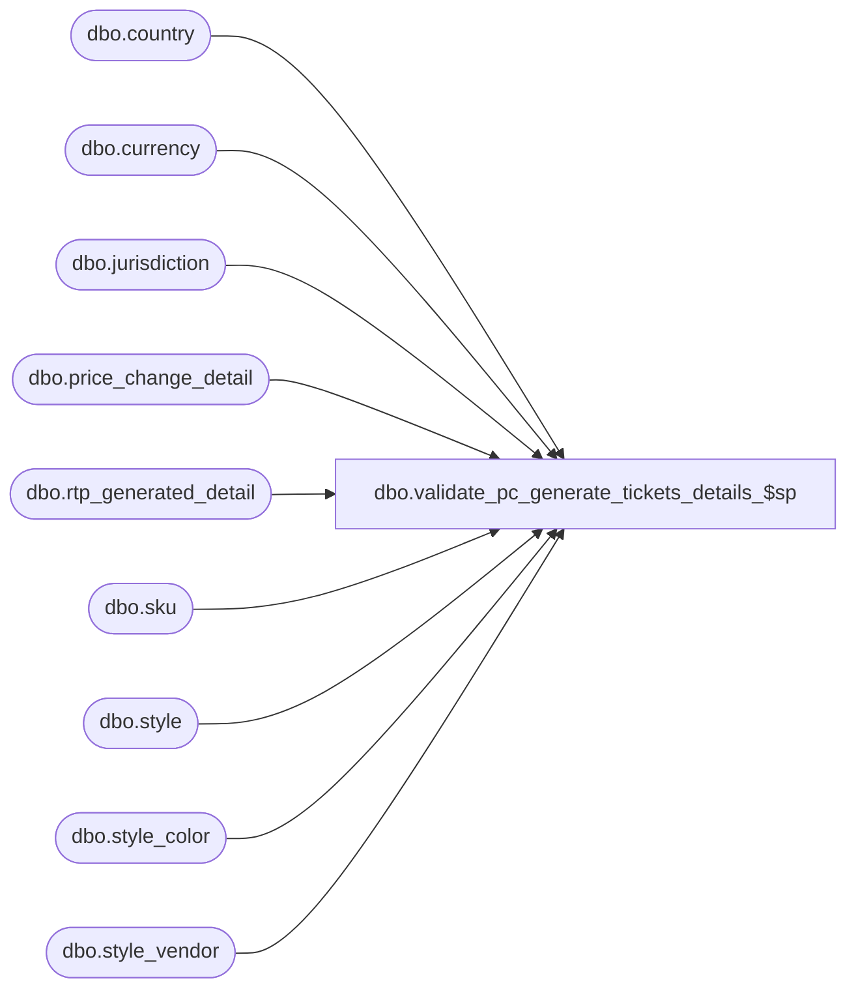

# dbo.validate_pc_generate_tickets_details_$sp

**Database:** me_01  
**Server:** bedrockdb02  

## Architecture Diagram



## Table Dependencies

| Referenced Table |
|---|
| dbo.country |
| dbo.currency |
| dbo.jurisdiction |
| dbo.price_change_detail |
| dbo.rtp_generated_detail |
| dbo.sku |
| dbo.style |
| dbo.style_color |
| dbo.style_vendor |

## Stored Procedure Code

```sql
-----------------------------------------------------------------------------------------------------------------------------
--	Main Query: Create Procedure
-----------------------------------------------------------------------------------------------------------------------------

CREATE PROCEDURE [dbo].[validate_pc_generate_tickets_details_$sp]

	@Price_Change_ID AS DECIMAL (12, 0)
	,@Price_Change_Instruction_ID AS DECIMAL (12, 0) = NULL
AS

DECLARE @Current_Date AS DATETIME = CAST(FLOOR(CAST(GETDATE() AS FLOAT)) AS DATETIME)

DECLARE @Document_Type AS TINYINT = 5
DECLARE @Print_Status AS TINYINT = 2

SET TRANSACTION ISOLATION LEVEL READ UNCOMMITTED
SET NOCOUNT ON

IF OBJECT_ID (N'tempdb.dbo.#temp_rtp_generated_detail_from_pc', N'U') IS NOT NULL
BEGIN

	DROP TABLE dbo.#temp_rtp_generated_detail_from_pc

END

IF OBJECT_ID (N'tempdb.dbo.#temp_rtp_generated_detail_from_rtp', N'U') IS NOT NULL
BEGIN

	DROP TABLE dbo.#temp_rtp_generated_detail_from_rtp

END

CREATE TABLE dbo.#temp_rtp_generated_detail_from_pc
	(
		location_id SMALLINT NOT NULL
		,vendor_id DECIMAL(12, 0) NOT NULL
		,style_id DECIMAL(12, 0) NOT NULL
		,style_color_id DECIMAL(13, 0) NOT NULL
		,style_size_id DECIMAL(13, 0) NOT NULL
		,unit_price DECIMAL(14, 2) NULL
		,rtp_format_id SMALLINT NOT NULL
		,currency_symbol NVARCHAR(3) NULL
		,currency_code NVARCHAR(3) NULL
	)

CREATE TABLE dbo.#temp_rtp_generated_detail_from_rtp
	(
		document_id DECIMAL(12, 0) NOT NULL
		,document_type TINYINT NOT NULL
		,location_id SMALLINT NOT NULL
		,vendor_id DECIMAL(12, 0) NOT NULL
		,style_id DECIMAL(12, 0) NOT NULL
		,style_color_id DECIMAL(13, 0) NOT NULL
		,style_size_id DECIMAL(13, 0) NOT NULL
		,tkt_unit DECIMAL(12, 0) NOT NULL
		,unit_price DECIMAL(14, 2) NULL
		,rtp_format_id SMALLINT NOT NULL
		,print_flag BIT NOT NULL
		,deleted_flag BIT NOT NULL
		,date_updated SMALLDATETIME NOT NULL
		,currency_symbol NVARCHAR(3) NULL
		,currency_code NVARCHAR(3) NULL
	)

INSERT INTO dbo.#temp_rtp_generated_detail_from_pc
	(
		location_id
		,vendor_id
		,style_id
		,style_color_id
		,style_size_id
		,unit_price
		,rtp_format_id
		,currency_symbol
		,currency_code
	)
SELECT
	PCD.location_id
	,SV.vendor_id
	,PCD.style_id
	,SC.style_color_id
	,SK.style_size_id
	,PCD.selling_retail_price AS unit_price
	,S.ticket_format_id AS rtp_format_id
	,CRCY.currency_symbol
	,CRCY.currency_code
FROM
	dbo.price_change_detail PCD
INNER JOIN dbo.style_vendor SV ON SV.style_id = PCD.style_id AND SV.primary_vendor_flag = 1
INNER JOIN dbo.style_color SC ON SC.style_id = PCD.style_id AND SC.color_id = PCD.color_id
INNER JOIN dbo.sku SK ON SK.sku_id = PCD.sku_id
INNER JOIN dbo.style S ON S.style_id = SC.style_id
INNER JOIN dbo.jurisdiction J ON J.jurisdiction_id = PCD.jurisdiction_id
INNER JOIN dbo.country CTRY ON CTRY.country_id = J.country_id
INNER JOIN dbo.currency CRCY ON CRCY.currency_id = CTRY.currency_id
WHERE
	price_change_id = @Price_Change_ID
	AND (@Price_Change_Instruction_ID IS NULL OR price_change_instruction_id = @Price_Change_Instruction_ID)

INSERT INTO dbo.#temp_rtp_generated_detail_from_rtp
	(
		document_id
		,document_type
		,location_id
		,vendor_id
		,style_id
		,style_color_id
		,style_size_id
		,tkt_unit
		,unit_price
		,rtp_format_id
		,print_flag
		,deleted_flag
		,date_updated
		,currency_symbol
		,currency_code
	)
SELECT
	RGD.document_id
	,RGD.document_type
	,RGD.location_id
	,RGD.vendor_id
	,RGD.style_id
	,RGD.style_color_id
	,RGD.style_size_id
	,RGD.tkt_unit
	,RGD.unit_price
	,RGD.rtp_format_id
	,RGD.print_flag
	,RGD.deleted_flag
	,RGD.date_updated
	,RGD.currency_symbol
	,RGD.currency_code
FROM
	dbo.rtp_generated_detail RGD
INNER JOIN dbo.sku SK ON SK.style_id = RGD.style_id
									AND SK.style_color_id = RGD.style_color_id
									AND SK.style_size_id = RGD.style_size_id
INNER JOIN dbo.style S ON S.style_id = SK.style_id
INNER JOIN style_vendor SV ON SV.style_id = RGD.style_id AND SV.vendor_id = RGD.vendor_id AND SV.primary_vendor_flag = 1
INNER JOIN dbo.price_change_detail PCD ON PCD.price_change_id = RGD.document_id
															AND PCD.location_id = RGD.location_id
															AND PCD.sku_id = SK.sku_id
															AND RGD.document_type = @Document_Type
															AND (@Price_Change_Instruction_ID IS NULL OR PCD.price_change_instruction_id = @Price_Change_Instruction_ID)

SELECT * FROM
	(
		SELECT
			document_id
			,document_type
			,location_id
			,vendor_id
			,style_id
			,style_color_id
			,style_size_id
			,tkt_unit
			,unit_price
			,rtp_format_id
			,print_flag
			,deleted_flag
			,date_updated
			,currency_symbol
			,currency_code
		FROM
			dbo.#temp_rtp_generated_detail_from_rtp

		EXCEPT

		SELECT
			@Price_Change_ID AS document_id
			,@Document_Type AS document_type
			,location_id
			,vendor_id
			,style_id
			,style_color_id
			,style_size_id
			,0 AS tkt_unit
			,unit_price
			,rtp_format_id
			,0 AS print_flag
			,0 AS deleted_flag
			,@Current_Date AS date_updated
			,currency_symbol
			,currency_code
		FROM
			dbo.#temp_rtp_generated_detail_from_pc
	) sqF

UNION ALL

SELECT * FROM
	(
		SELECT
			@Price_Change_ID AS document_id
			,@Document_Type AS document_type
			,location_id
			,vendor_id
			,style_id
			,style_color_id
			,style_size_id
			,0 AS tkt_unit
			,unit_price
			,rtp_format_id
			,0 AS print_flag
			,0 AS deleted_flag
			,@Current_Date AS date_updated
			,currency_symbol
			,currency_code
		FROM
			dbo.#temp_rtp_generated_detail_from_pc

		EXCEPT

		SELECT
			document_id
			,document_type
			,location_id
			,vendor_id
			,style_id
			,style_color_id
			,style_size_id
			,tkt_unit
			,unit_price
			,rtp_format_id
			,print_flag
			,deleted_flag
			,date_updated
			,currency_symbol
			,currency_code
		FROM
			dbo.#temp_rtp_generated_detail_from_rtp

	) sqT


RETURN
```

