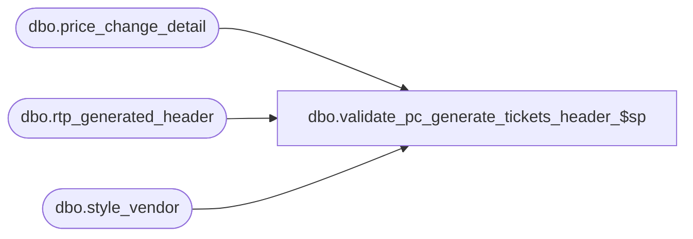

# dbo.validate_pc_generate_tickets_header_$sp

**Database:** me_01  
**Server:** bedrockdb02  

## Architecture Diagram



## Table Dependencies

| Referenced Table |
|---|
| dbo.price_change_detail |
| dbo.rtp_generated_header |
| dbo.style_vendor |

## Stored Procedure Code

```sql
-----------------------------------------------------------------------------------------------------------------------------
--	Main Query: Create Procedure
-----------------------------------------------------------------------------------------------------------------------------

CREATE PROCEDURE [dbo].[validate_pc_generate_tickets_header_$sp]

	@Price_Change_ID AS DECIMAL (12, 0)

AS

DECLARE @Current_Date AS DATETIME = CAST(FLOOR(CAST(GETDATE() AS FLOAT)) AS DATETIME)

DECLARE @Document_Type AS TINYINT = 5
DECLARE @Print_Status AS TINYINT = 2

SET TRANSACTION ISOLATION LEVEL READ UNCOMMITTED
SET NOCOUNT ON

IF OBJECT_ID (N'tempdb.dbo.#temp_rtp_generated_header', N'U') IS NOT NULL
BEGIN

	DROP TABLE dbo.#temp_rtp_generated_header

END

CREATE TABLE dbo.#temp_rtp_generated_header
	(
		location_id SMALLINT
		,vendor_id DECIMAL(12, 0)
	)

INSERT INTO dbo.#temp_rtp_generated_header
	(
		location_id
		,vendor_id
	)
SELECT
	DISTINCT
		PCD.location_id
		,SV.vendor_id
FROM
	dbo.price_change_detail PCD
INNER JOIN dbo.style_vendor SV ON SV.style_id = PCD.style_id AND SV.primary_vendor_flag = 1
WHERE
	price_change_id = @Price_Change_ID

SELECT * FROM
	(
		SELECT
			document_id
			,document_type
			,location_id
			,vendor_id
			--,print_status
			--,deleted_flag
			,date_updated
		FROM
			dbo.rtp_generated_header RGH

		EXCEPT

		SELECT
			@Price_Change_ID AS document_id
			,@Document_Type AS document_type
			,location_id
			,vendor_id
			--,@Print_Status AS print_status
			--,0 AS deleted_flag
			,@Current_Date AS date_updated
		FROM
			dbo.#temp_rtp_generated_header RGH
	) sqF

UNION ALL

SELECT * FROM
	(
		SELECT
			@Price_Change_ID AS document_id
			,@Document_Type AS document_type
			,location_id
			,vendor_id
			--,@Print_Status AS print_status
			--,0 AS deleted_flag
			,@Current_Date AS date_updated
		FROM
			dbo.#temp_rtp_generated_header RGH

		EXCEPT

		SELECT
			document_id
			,document_type
			,location_id
			,vendor_id
			--,print_status
			--,deleted_flag
			,date_updated
		FROM
			dbo.rtp_generated_header RGH

	) sqT


RETURN
```

