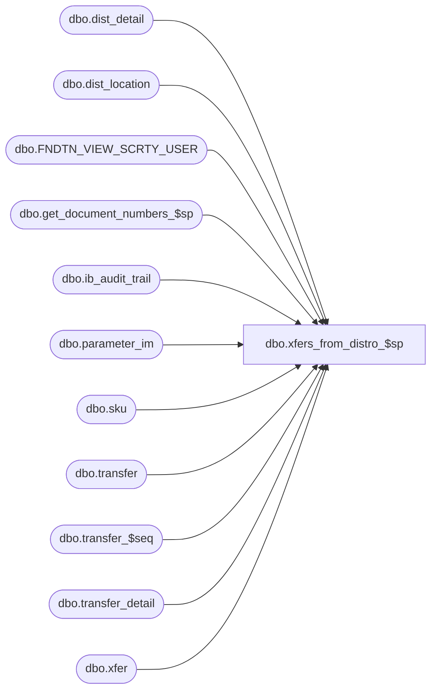

# dbo.xfers_from_distro_$sp

**Database:** me_01  
**Server:** bedrockdb02  

## Architecture Diagram



## Table Dependencies

| Referenced Table |
|---|
| dbo.dist_detail |
| dbo.dist_location |
| dbo.FNDTN_VIEW_SCRTY_USER |
| dbo.get_document_numbers_$sp |
| dbo.ib_audit_trail |
| dbo.parameter_im |
| dbo.sku |
| dbo.transfer |
| dbo.transfer_$seq |
| dbo.transfer_detail |
| dbo.xfer |

## Stored Procedure Code

```sql
CREATE PROCEDURE [dbo].[xfers_from_distro_$sp]
	( @security_user_id INT )
AS

/*
Proc name: 	xfers_from_distro_$sp
Description: Creates transfers with a status of "Ready to Send" from distribution documents

HISTORY:
Date       		Name         	Def#		Desc
Sept08,08   	Sameer Patel				Initial release
Oct03,08		Sameer Patel				Transfers should not be created when the from and to locations are the same.
											Added "WHERE" clause to insert into @transfer_detail
Oct08,08		Sameer Patel				Defaulted the column "end_send_date" to NULL in the transfer table
Jul28,10		Yan Ding    				Defect 109993 failed to generate store xfer # with alphanumeric mask
Oct, 2010		Tim Johnson					Employee Security CHanges
Apr 29, 11		Tim Johnsons				Correct the casing of USER_FULL_NAME
Jul 4,11		Joyce Kung					Defect 127493. Errors if multiple transfer document numbers are required.
4/17/2016		Ivan Dimitrov				Procedure fails if the first transfer in the system is created from a distribution
*/

DECLARE @error_number		AS INTEGER
DECLARE @error_message		AS NVARCHAR(2000)
DECLARE @object_name		AS NVARCHAR(255)
DECLARE @operation_name		AS NVARCHAR(100)

DECLARE	@error_severity		AS NVARCHAR(4000)
DECLARE @error_state		AS INTEGER

-- Declare variable for current date
DECLARE
	@current_date_time DATETIME
	, @current_date SMALLDATETIME

SET @current_date_time = getdate()
SET @current_date = CONVERT(SMALLDATETIME, CONVERT(NCHAR(8), @current_date_time, 112))

-- Variables for insert into ib_allocation
DECLARE
	@transaction_type_code INT

-- Dummy variable to lock sequence tables
DECLARE
	@dummy_val SMALLINT

-- The tables, #_suggested_doc_table, #_validated_doc_table and #_distro_numbers are created in .NET AR Code
-- Temp table, #_distro_numbers contains the distribution for which we have to create transfers
-- It has the following columns all of which can be found in the distribution table:
	-- distribution_id
	-- distribution_number
	-- from_location_id
	-- expected_receipt_date
	-- transaction_reason_id
-- Temp table, #_suggested_doc_table will be populated with a list of possible transfer document numbers.
-- Temp table, #_validated_doc_table will filter the #_suggested_doc_table for usable transfer document numbers.

----------------------------------------------------------------------------------------------------------------------------------------------------------------------------------------------------------------------------
-- Retrieve detail records from distribution tables

-- TRANSFERS WILL BE CREATED FOR EVERY DISTINCT COMBINATION OF THE FOLLOWING:
	-- DISTRIBUTION_NUMBER: DOCUMENT NUMBER OF DISTRIBUTION
	-- TO_LOCATION_ID: RECEIVING LOCATION
	-- FROM_LOCATION_ID: SENDING LOCATION
	-- EXPECTED_RECEIPT_DATE: EXPECTED RECEIPT DATE OF SHIPMENT/LOCATION FROM DIST_LOCATION

-- Declare @transfer_detail memory table with the following columns:
	-- id: identity column for this table which will be used later on to generate the id coulmns in transfer_detail
	-- to_location_id: receiving location
	-- from_location_id: sending location
	-- external_doc_no: document number of the distribution
	-- expected_receipt_date: expected receipt date of shipment/location from dist_location
	-- sku_id: item being shipped
	-- transaction_reason_id: reason for the transfer (selected by the user when prompted)
	-- style_color_id: style_color_id of sku_id
	-- style_id: style_id of sku_id
	-- color_id: color_id of sku_id
	-- units_sent: number of units sent to receiving location
	-- Primary key includes: id
	-- Unique key includes: to_location_id, from_location_id, expected_receipt_date, sku_id, distribution_no

DECLARE @transfer_detail TABLE
	( id INT IDENTITY(1,1) NOT NULL
	, to_location_id SMALLINT NOT NULL, from_location_id SMALLINT NOT NULL, external_doc_no NVARCHAR(20) NOT NULL
	, expected_receipt_date SMALLDATETIME NOT NULL, sku_id DECIMAL(13,0) NOT NULL, transaction_reason_id SMALLINT NOT NULL
	, style_color_id DECIMAL(13,0) NOT NULL, style_id DECIMAL(12,0) NOT NULL
	, units_sent INT NOT NULL
	, PRIMARY KEY (id)
	, UNIQUE (to_location_id, from_location_id, expected_receipt_date, external_doc_no, sku_id) )

-- Insert records into @transfer_detail; the following columns should be populated:
	-- to_location_id (location_id from dist_location table)
	-- from_location_id (from #_distro_numbers table)
	-- external_doc_no (distribution_number from #_distro_numbers table)
	-- expected_receipt_date (from #_distro_numbers table)
	-- sku_id (from dist_detail table)
	-- transaction_reason_id (from #_distro_numbers table)
	-- style_color_id (from sku table)
	-- style_id (from sku table)
	-- units_sent (quantity from dist_detail table)

BEGIN TRY

	INSERT INTO @transfer_detail
		( to_location_id, from_location_id, external_doc_no
		, expected_receipt_date, sku_id, transaction_reason_id
		, style_color_id, style_id
		, units_sent )
	SELECT
		dl.location_id to_location_id, wdn.from_location_id, wdn.distribution_number external_doc_no
		, dl.expected_receipt_date, dd.sku_id, wdn.transaction_reason_id
		, k.style_color_id, k.style_id
		, SUM(dd.quantity) units_sent
	FROM
		dist_detail dd WITH (NOLOCK)
	INNER JOIN dist_location dl WITH (NOLOCK) ON dd.distribution_id = dl.distribution_id AND dd.location_id = dl.location_id
	INNER JOIN #_distro_numbers wdn ON dd.distribution_id = wdn.distribution_id
	INNER JOIN sku k WITH (NOLOCK) ON dd.sku_id = k.sku_id
	WHERE
		dl.location_id <> wdn.from_location_id
	GROUP BY
		dl.location_id, wdn.from_location_id, wdn.distribution_number
		, dl.expected_receipt_date, dd.sku_id, wdn.transaction_reason_id
		, k.style_color_id, k.style_id
	HAVING
		SUM(dd.quantity) <> 0
	ORDER BY
		dl.location_id, wdn.from_location_id, dl.expected_receipt_date

END TRY

BEGIN CATCH

	SELECT
		@error_number = error_number()
		, @error_message = N'Failed to insert into @transfer_detail '
								+ N'(' + error_message() + N')'
		, @error_severity = error_severity()
		, @error_state = error_state()
		, @object_name = N'@transfer_detail'
		, @operation_name = N'INSERT (memory table)'

	GOTO error

END CATCH

-- Retrieve count of detail records in @transfer_detail
DECLARE
	@count_xfer_detail INT

BEGIN TRY

	SELECT @count_xfer_detail = COALESCE(MAX(id), 0) FROM @transfer_detail

END TRY

BEGIN CATCH

	SELECT
		@error_number = error_number()
		, @error_message = N'Failed to get count of records from @transfer_detail '
								+ N'(' + error_message() + N')'
		, @error_severity = error_severity()
		, @error_state = error_state()
		, @object_name = N'@transfer_detail'
		, @operation_name = N'SELECT (memory table)'

	GOTO error

END CATCH

----------------------------------------------------------------------------------------------------------------------------------------------------------------------------------------------------------------------------
IF (@count_xfer_detail <> 0)

	BEGIN

		-- Declare variables for transfer document number generation

		DECLARE
			@transfer_no_mask NVARCHAR(20)
			, @first_transfer_no NVARCHAR(20), @last_transfer_no NVARCHAR(20)
			, @last_generated_transfer_no NVARCHAR(20)
			, @transfer_no_rec_flag BIT

		-- Get information from parameter_im in order to generate document numbers

		BEGIN TRY

			SELECT
				@transfer_no_mask = transfer_no_mask
				, @first_transfer_no = first_transfer_no, @last_transfer_no = last_transfer_no
				, @last_generated_transfer_no = last_generated_transfer_no
				, @transfer_no_rec_flag  = transfer_no_rec_flag
			FROM
				parameter_im WITH (TABLOCKX, HOLDLOCK)

		END TRY

		BEGIN CATCH

			SELECT
				@error_number = error_number()
				, @error_message = N'Failed to select from parameter_im '
										+ N'(' + error_message() + N')'
				, @error_severity = error_severity()
				, @error_state = error_state()
				, @object_name = N'parameter_im'
				, @operation_name = N'SELECT'

			GOTO error

		END CATCH

		-- Declare @transfer memory table with the following columns:
			-- id: identity column for this table
			-- transaction_reason_id: reason for the transfer (selected by the user when prompted)
			-- from_location_id: sending location
			-- to_location_id: receiving location
			-- external_doc_no: distribution number from which transfer is created
			-- transfer_id: id of transfer document being generated
			-- document_no: document number of transfer to be generated
			-- begin_send_date: date before which no merchandise can be sent (by default, this will be set to @current_date)
			-- end_send_date: date after which no merchandise can be sent (by default, this will be set to NULL)
			-- date: date the transfer was created (by default, this will be set to @current_date)
			-- ship_date: date the store shipment was shipped (by default, this will be set to @current_date)
			-- last_activity_date (by default, this will be set to @current_date)
			-- document_status: status of transfer
				-- 2: ready to send
			-- state_no: state of transfer
				-- 2: ready to send state
			-- document_source: source of the transfer
				-- 9: enumueration for distribution source
			-- updatestamp (by default, this will be set to 1)
			-- routed_by_warehouse_flag (by default, this will be set to 0)
			-- received_by_warehouse_flag (by default, this will be set to 0)
			-- shipped_by_warehouse_flag (by default, this will be set to 0)
			-- print_flag (by default, this will be set to 0)
			-- last_item_id: in this case, this will be equal to the number of details on the transfer
			-- offset: value representing the total number of details for the transfer "created" before this one (within the same run)
				-- example: transfer 1 has 3 details -- last_item_id = 3, offset = 0
				--			transfer 2 has 4 details -- last_item_id = 4, offset = 3
				--			transfer 3 has 2 details -- last_item_id = 2, offset = 7
			-- Primary key: id
			-- Unique key: from_location_id, to_location_id, external_doc_no

		DECLARE @transfer TABLE
			( id INT IDENTITY(1,1) NOT NULL
			, transaction_reason_id SMALLINT NOT NULL
			, from_location_id SMALLINT NOT NULL, to_location_id SMALLINT NOT NULL, external_doc_no NVARCHAR(20) NOT NULL
			, transfer_id DECIMAL(12,0) NULL, document_no NVARCHAR(20) NULL
			, begin_send_date SMALLDATETIME NULL, end_send_date SMALLDATETIME NULL
			, create_date SMALLDATETIME NOT NULL, ship_date SMALLDATETIME NULL, last_activity_date SMALLDATETIME NOT NULL
			, document_status SMALLINT DEFAULT(2) NOT NULL, state_no SMALLINT DEFAULT(2) NOT NULL
			, document_source SMALLINT DEFAULT(9) NOT NULL
			, routed_by_warehouse_flag BIT DEFAULT(0) NOT NULL, received_by_warehouse_flag BIT DEFAULT(0) NOT NULL, shipped_by_warehouse_flag BIT DEFAULT(0) NOT NULL, print_flag BIT DEFAULT(0) NOT NULL
			, last_item_id DECIMAL(13,0) NOT NULL, offset DECIMAL(13,0) NULL
			, PRIMARY KEY (id)
			, UNIQUE (from_location_id, to_location_id, external_doc_no) )

		-- Insert records into @transfer using information from @transfer_detail

		BEGIN TRY

			INSERT INTO @transfer
				( transaction_reason_id
				, from_location_id, to_location_id, external_doc_no
				, begin_send_date
				, create_date, ship_date, last_activity_date
				, last_item_id )
			SELECT
				transaction_reason_id
				, from_location_id, to_location_id, external_doc_no
				, @current_date begin_send_date
				, @current_date create_date, @current_date ship_date, @current_date last_activity_date
				, COUNT(*) last_item_id
			FROM
				@transfer_detail
			GROUP BY
				transaction_reason_id
				, from_location_id, to_location_id, external_doc_no

		END TRY

		BEGIN CATCH

			SELECT
				@error_number = error_number()
				, @error_message = N'Failed to insert into @transfer '
										+ N'(' + error_message() + N')'
				, @error_severity = error_severity()
				, @error_state = error_state()
				, @object_name = N'@transfer'
				, @operation_name = N'INSERT (memory table)'

			GOTO error

		END CATCH

		-- Lock the transfer_$seq so other transfers can't be created at the same time

		BEGIN TRY

			SELECT @dummy_val = 1 FROM transfer_$seq WITH (TABLOCKX, HOLDLOCK)

		END TRY

		BEGIN CATCH

			SELECT
				@error_number = error_number()
				, @error_message = N'Failed to select/lock transfer_$seq '
										+ N'(' + error_message() + N')'
				, @error_severity = error_severity()
				, @error_state = error_state()
				, @object_name = N'transfer_$seq'
				, @operation_name = N'SELECT'

			GOTO error

		END CATCH

		-- Declare a variable to store the maxmimum transfer_id

		DECLARE @max_transfer_id AS DECIMAL(12,0)

		-- Retrieve maximum transfer_id from store shipment

		BEGIN TRY

			SELECT @max_transfer_id = ISNULL(MAX(transfer_id), 0) FROM transfer

		END TRY

		BEGIN CATCH

			SELECT
				@error_number = error_number()
				, @error_message = N'Failed to select maximum transfer_id from transfer '
										+ N'(' + error_message() + N')'
				, @error_severity = error_severity()
				, @error_state = error_state()
				, @object_name = N'transfer'
				, @operation_name = N'SELECT'

			GOTO error

		END CATCH

		-- Update transfer_id column in @transfer using information from transfer_$seq

		BEGIN TRY

			UPDATE t
			SET
				t.transfer_id = @max_transfer_id + t.id
			FROM
				@transfer t

		END TRY

		BEGIN CATCH

			SELECT
				@error_number = error_number()
				, @error_message = N'Failed to update transfer_id column in @transfer '
										+ N'(' + error_message() + N')'
				, @error_severity = error_severity()
				, @error_state = error_state()
				, @object_name = N'@transfer'
				, @operation_name = N'UPDATE (memory table)'

			GOTO error

		END CATCH

		-- Update offset column in @transfer

		BEGIN TRY

			UPDATE t
			SET
				t.offset = COALESCE(Z.offset, 0)
			FROM
				@transfer t
			LEFT OUTER JOIN
				( SELECT
					t.transfer_id
					, SUM(t.last_item_id) offset
				  FROM
					@transfer t
				  INNER JOIN @transfer t2 ON t.transfer_id > t2.transfer_id
				  GROUP BY
					t.transfer_id ) Z ON t.transfer_id = Z.transfer_id

		END TRY

		BEGIN CATCH

			SELECT
				@error_number = error_number()
				, @error_message = N'Failed to update offset column in @transfer '
										+ N'(' + error_message() + N')'
				, @error_severity = error_severity()
				, @error_state = error_state()
				, @object_name = N'@transfer'
				, @operation_name = N'UPDATE (memory table)'

			GOTO error

		END CATCH

		-- Update document_no in @transfer using information retrieved from parameter_im

		DECLARE @count_to_gen INT
		SET @count_to_gen = (SELECT MAX(id) FROM @transfer)

		BEGIN TRY

			EXEC get_document_numbers_$sp @transfer_no_mask, @first_transfer_no, @last_transfer_no, @last_generated_transfer_no, N'transfer', @count_to_gen, @transfer_no_rec_flag OUTPUT

		END TRY

		BEGIN CATCH

			SELECT
				@error_number = error_number()
				, @error_message = N'Failed to get next document numbers for transfers '
										+ N'(' + error_message() + N')'
				, @error_severity = error_severity()
				, @error_state = error_state()
				, @object_name = N'get_document_numbers_$sp'
				, @operation_name = N'EXEC (stored procedure)'

			GOTO error

		END CATCH

		BEGIN TRY

			UPDATE xfer
			SET
				document_no = v.document_no
			FROM
				@transfer xfer, #_validated_doc_table v
			WHERE
				xfer.id = v.id

		END TRY

		BEGIN CATCH

			SELECT
				@error_number = error_number()
				, @error_message = N'Failed to update document_no column in @transfer '
										+ N'(' + error_message() + N')'
				, @error_severity = error_severity()
				, @error_state = error_state()
				, @object_name = N'@transfer'
				, @operation_name = N'UPDATE (memory table)'

			GOTO error

		END CATCH


		-- Retrieve new maximum transfer_id from @transfer

		BEGIN TRY

			SELECT @max_transfer_id = COALESCE(MAX(transfer_id), 0) FROM @transfer

		END TRY

		BEGIN CATCH

			SELECT
				@error_number = error_number()
				, @error_message = N'Failed to select maximum transfer_id from @transfer '
										+ N'(' + error_message() + N')'
				, @error_severity = error_severity()
				, @error_state = error_state()
				, @object_name = N'@transfer'
				, @operation_name = N'SELECT (memory table)'

			GOTO error

		END CATCH

		-- Now that we have prepared all the information for the transfers
		-- We can finally insert/update the actual tables

		-- Insert header information for transfer from @transfer

		BEGIN TRY

			INSERT INTO transfer
				( transaction_reason_id
				, from_location_id, to_location_id, external_doc_no
				, transfer_id, document_no
				, begin_send_date
				, create_date, ship_date, last_activity_date
				, document_status, state_no
				, document_source
				, routed_by_warehouse_flag, received_by_warehouse_flag, shipped_by_warehouse_flag, print_flag
				, last_item_id )
			SELECT
				transaction_reason_id
				, from_location_id, to_location_id, external_doc_no
				, transfer_id, document_no
				, begin_send_date
				, create_date, ship_date, last_activity_date
				, document_status, state_no
				, document_source
				, routed_by_warehouse_flag, received_by_warehouse_flag, shipped_by_warehouse_flag, print_flag
				, last_item_id
			FROM
				@transfer

		END TRY

		BEGIN CATCH

			SELECT
				@error_number = error_number()
				, @error_message = N'Failed to insert into transfer '
										+ N'(' + error_message() + N')'
				, @error_severity = error_severity()
				, @error_state = error_state()
				, @object_name = N'transfer'
				, @operation_name = N'INSERT'

			GOTO error

		END CATCH

		-- Reset the identity on the table transfer_$seq

		BEGIN TRY

			IF @max_transfer_id <> 0
				DBCC CHECKIDENT(transfer_$seq, RESEED, @max_transfer_id)

		END TRY

		BEGIN CATCH

			SELECT
				@error_number = error_number()
				, @error_message = N'Failed to reset identity on transfer_$seq '
										+ N'(' + error_message() + N')'
				, @error_severity = error_severity()
				, @error_state = error_state()
				, @object_name = N'transfer_$seq'
				, @operation_name = N'DBCC CHECKIDENT RESEED'

			GOTO error

		END CATCH

		-- Update last document number in parameter_im

		BEGIN TRY

			UPDATE parameter_im
			SET
				last_generated_transfer_no = ( SELECT
													document_no
												 FROM
													@transfer t
												 INNER JOIN
													( SELECT
														MAX(transfer_id) transfer_id
													  FROM
														@transfer ) Z ON t.transfer_id = Z.transfer_id )
				, transfer_no_rec_flag = @transfer_no_rec_flag
		END TRY

		BEGIN CATCH

			SELECT
				@error_number = error_number()
				, @error_message = N'Failed to update last_generated_transfer_no column in parameter_im '
										+ N'(' + error_message() + N')'
				, @error_severity = error_severity()
				, @error_state = error_state()
				, @object_name = N'parameter_im'
				, @operation_name = N'UPDATE'

			GOTO error

		END CATCH

		-- Insert detail information for transfer into transfer_detail
		-- The transfer_detail_id is calculated using the following:
			-- transfer_id(from @transfer) * 1000000 + (id (from @transfer_detail) - offset(from @transfer))

		BEGIN TRY

			INSERT INTO transfer_detail
				( sku_id, style_id, style_color_id
				, transaction_reason_id
				, transfer_detail_id, transfer_id
				, units_sent )
			SELECT
				td.sku_id, td.style_id, td.style_color_id
				, td.transaction_reason_id
				, (t.transfer_id * 1000000) + (td.id - t.offset) transfer_detail_id, t.transfer_id
				, td.units_sent
			FROM
				@transfer_detail td
			INNER JOIN @transfer t ON td.from_location_id = t.from_location_id
											AND td.to_location_id = t.to_location_id
											AND td.external_doc_no = t.external_doc_no

		END TRY

		BEGIN CATCH

			SELECT
				@error_number = error_number()
				, @error_message = N'Failed to insert into transfer_detail '
										+ N'(' + error_message() + N')'
				, @error_severity = error_severity()
				, @error_state = error_state()
				, @object_name = N'transfer_detail'
				, @operation_name = N'INSERT'

			GOTO error

		END CATCH

		-- TODO: INSERTS INTO ib_allocation

	END

----------------------------------------------------------------------------------------------------------------------------------------------------------------------------------------------------------------------------
-- Audit trail inserts

-- Get employee information using security user id passed in from employee_table

DECLARE
	@employee_last_name NVARCHAR(30)
	, @employee_first_name NVARCHAR(30)

BEGIN TRY

	SELECT
		@employee_last_name = COALESCE(RIGHT(USER_FULL_NAME, ISNULL(NULLIF(CHARINDEX(' ', REVERSE(USER_FULL_NAME)) - 1, -1), LEN(USER_FULL_NAME))), USER_NAME),
		@employee_first_name = COALESCE(LEFT(USER_FULL_NAME, NULLIF(CHARINDEX(' ', USER_FULL_NAME) - 1, -1)), USER_NAME)
	FROM
		FNDTN_VIEW_SCRTY_USER
	WHERE
		USER_ID = @security_user_id

END TRY

BEGIN CATCH

	SELECT
		@error_number = error_number()
		, @error_message = N'Failed to create first and last name from user_full_name in FNDTN_VIEW_SCRTY_USER '
								+ N'(' + error_message() + N')'
		, @error_severity = error_severity()
		, @error_state = error_state()
		, @object_name = N'FNDTN_VIEW_SCRTY_USER'
		, @operation_name = N'SELECT'

	GOTO error

END CATCH


-- Insert records into ib_audit_trail

DECLARE
	@audit_trail_application NVARCHAR(10)
	, @audit_trail_activity NVARCHAR(20)
	, @audit_trail_application_type NVARCHAR(40)

SET @audit_trail_application = N'IM'

-- Insert transfer information into ib_audit_trail

SET @audit_trail_activity = N'Create'
SET @audit_trail_application_type = N'Transfer'

IF (@count_xfer_detail <> 0)

	BEGIN

		BEGIN TRY

			INSERT INTO ib_audit_trail
				( entry_date
				, application, activity, application_type
				, application_identifier
				, employee_last_name, employee_first_name )
			SELECT
				getdate() entry_date
				, @audit_trail_application, @audit_trail_activity, @audit_trail_application_type
				, document_no application_identifier
				, @employee_last_name employee_last_name, @employee_first_name employee_first_name
			FROM
				@transfer

		END TRY

		BEGIN CATCH

			SELECT
				@error_number = error_number()
				, @error_message = N'Failed to insert into ib_audit_trail (Create Activity) '
										+ N'(' + error_message() + N')'
				, @error_severity = error_severity()
				, @error_state = error_state()
				, @object_name = N'ib_audit_trail'
				, @operation_name = N'INSERT'

			GOTO error

		END CATCH

	END

-- Insert transfer into ib_audit_trail for activity SetReadyToSend

SET @audit_trail_activity = N'SetReadyToSend'
SET @audit_trail_application_type = N'Transfer'

IF (@count_xfer_detail <> 0)

	BEGIN

		BEGIN TRY

			INSERT INTO ib_audit_trail
				( entry_date
				, application, activity, application_type
				, application_identifier
				, employee_last_name, employee_first_name )
			SELECT
				getdate() entry_date
				, @audit_trail_application, @audit_trail_activity, @audit_trail_application_type
				, document_no application_identifier
				, @employee_last_name employee_last_name, @employee_first_name employee_first_name
			FROM
				@transfer

		END TRY

		BEGIN CATCH

			SELECT
				@error_number = error_number()
				, @error_message = N'Failed to insert into ib_audit_trail (SetReadyToSend Activity) '
										+ N'(' + error_message() + N')'
				, @error_severity = error_severity()
				, @error_state = error_state()
				, @object_name = N'ib_audit_trail'
				, @operation_name = N'INSERT'

			GOTO error

		END CATCH

	END

----------------------------------------------------------------------------------------------------------------------------------------------------------------------------------------------------------------------------

RETURN

error:

    RAISERROR ( @error_message, @error_severity, @error_state )

	RETURN
```

