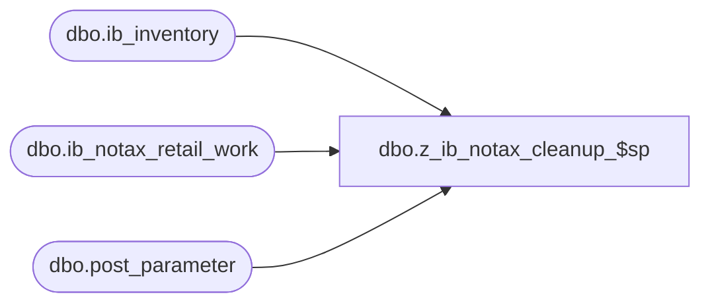

# dbo.z_ib_notax_cleanup_$sp

**Database:** me_01  
**Server:** bedrockdb02  

## Architecture Diagram



## Table Dependencies

| Referenced Table |
|---|
| dbo.ib_inventory |
| dbo.ib_notax_retail_work |
| dbo.post_parameter |

## Stored Procedure Code

```sql
CREATE procedure [dbo].[z_ib_notax_cleanup_$sp]
AS

declare @PValue decimal(12,0)
declare @CIb decimal(12,0)
declare @CNotax decimal(12,0)

BEGIN

SET @PValue = (select parameter_value from ma_01.dbo.post_parameter
where parameter_label = 'max ib_inventory_id')

SET @CIb = (select count(*) from ib_inventory where ib_inventory_id>@PValue)
SET @CNotax = (select count(*) from ib_notax_retail_work where ib_inventory_id>@PValue)


if @CIb > @CNotax 

	BEGIN

	delete ib_notax_retail_work
	where ib_inventory_id > @PValue

	END

END
```

