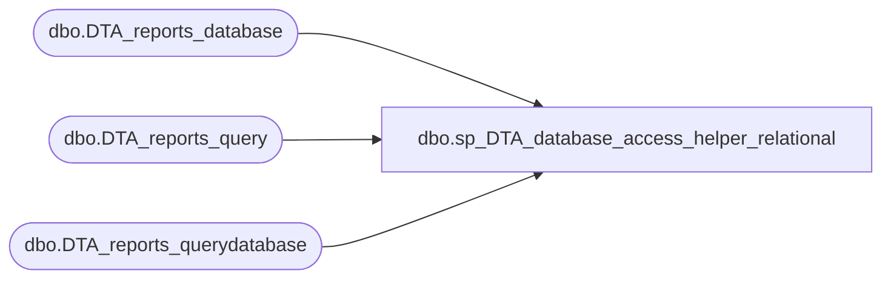

# dbo.sp_DTA_database_access_helper_relational

**Database:** msdb  
**Server:** bedrockdb02  

## Architecture Diagram



## Table Dependencies

| Referenced Table |
|---|
| dbo.DTA_reports_database |
| dbo.DTA_reports_query |
| dbo.DTA_reports_querydatabase |

## Stored Procedure Code

```sql
create procedure sp_DTA_database_access_helper_relational
			@SessionID		int
			as
			begin select D1.DatabaseName as "Database Name" ,R.Count as "Number of references" ,CAST(R.Usage as decimal(38,2)) as "Percent Usage" from 
				[msdb].[dbo].[DTA_reports_database] as D1 ,
				(
					select D.DatabaseID,SUM(Q.Weight) as Count,
							100.0 *  SUM(Q.Weight) / 
							( 1.0 * (	select	CASE WHEN SUM(Q.Weight) > 0 THEN  SUM(Q.Weight)
												else 1
												end	
									
										from [msdb].[dbo].[DTA_reports_query] as Q
										where Q.SessionID = @SessionID ))
				as Usage
		from 
					[msdb].[dbo].[DTA_reports_database] as D
					LEFT OUTER JOIN
					[msdb].[dbo].[DTA_reports_querydatabase] as QD ON QD.DatabaseID = D.DatabaseID
					LEFT OUTER JOIN
					DTA_reports_query as Q ON QD.QueryID = Q.QueryID
					and Q.SessionID = QD.SessionID and 
					Q.SessionID = @SessionID		
					GROUP BY D.DatabaseID
				) as R
				where R.DatabaseID = D1.DatabaseID  and
				D1.SessionID = @SessionID and
				R.Count > 0
				order by R.Count desc  end
```

