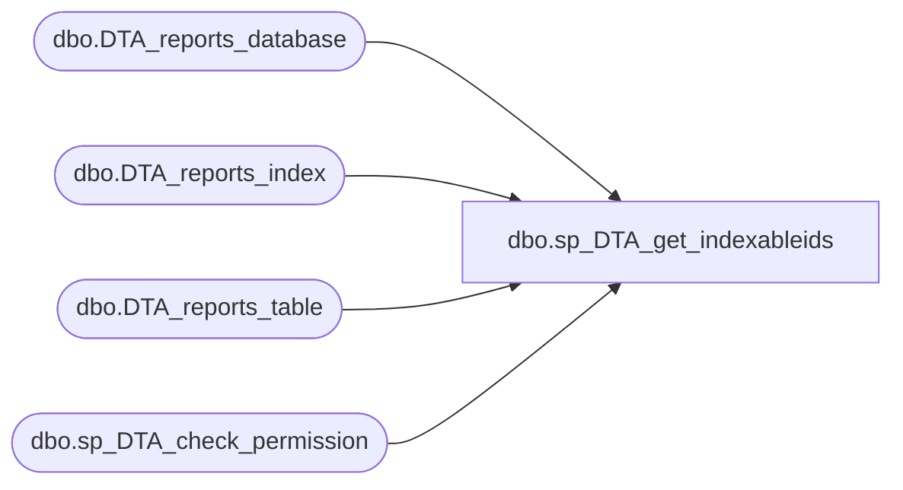

# dbo.sp_DTA_get_indexableids

**Database:** msdb  
**Server:** bedrockdb02  

## Architecture Diagram



## Table Dependencies

| Referenced Table |
|---|
| dbo.DTA_reports_database |
| dbo.DTA_reports_index |
| dbo.DTA_reports_table |
| dbo.sp_DTA_check_permission |

## Stored Procedure Code

```sql
create procedure sp_DTA_get_indexableids
	@SessionID	int
as
begin
	declare @retval  int							
	set nocount on

	exec @retval =  sp_DTA_check_permission @SessionID

	if @retval = 1
	begin
		raiserror(31002,-1,-1)
		return(1)
	end	

	select IndexID,DatabaseName,SchemaName,TableName,IndexName,SessionUniquefier 
	from [msdb].[dbo].[DTA_reports_index] as I,[msdb].[dbo].[DTA_reports_table] as T,
	[msdb].[dbo].[DTA_reports_database] as D 
	where I.TableID = T.TableID and T.DatabaseID = D.DatabaseID and D.SessionID = @SessionID 

end
```

