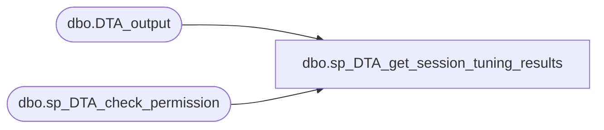

# dbo.sp_DTA_get_session_tuning_results

**Database:** msdb  
**Server:** bedrockdb02  

## Architecture Diagram



## Table Dependencies

| Referenced Table |
|---|
| dbo.DTA_output |
| dbo.sp_DTA_check_permission |

## Stored Procedure Code

```sql
create procedure sp_DTA_get_session_tuning_results 
	@SessionID int 
as 
begin
	set nocount on
	declare @retval  int							
	exec @retval =  sp_DTA_check_permission @SessionID

	if @retval = 1
	begin
		raiserror(31002,-1,-1)
		return(1)
	end	
	select	FinishStatus,TuningResults 
	from	msdb.dbo.DTA_output 
	where	SessionID=@SessionID
end
```

