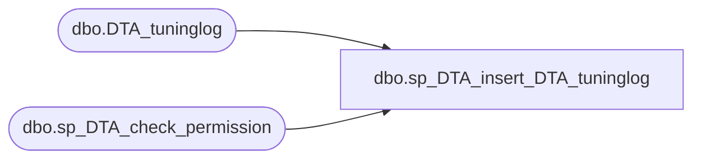

# dbo.sp_DTA_insert_DTA_tuninglog

**Database:** msdb  
**Server:** bedrockdb02  

## Architecture Diagram



## Table Dependencies

| Referenced Table |
|---|
| dbo.DTA_tuninglog |
| dbo.sp_DTA_check_permission |

## Stored Procedure Code

```sql
create procedure sp_DTA_insert_DTA_tuninglog
	@SessionID int,
	@RowID int,
	@CategoryID char(4),
	@Event ntext,
	@Statement ntext,
	@Frequency int,
	@Reason ntext
as
begin
	declare @retval  int							
	set nocount on

	exec @retval =  sp_DTA_check_permission @SessionID

	if @retval = 1
	begin
		raiserror(31002,-1,-1)
		return(1)
	end	
	insert into [msdb].[dbo].[DTA_tuninglog]([SessionID], [RowID], [CategoryID], [Event], [Statement], [Frequency], [Reason])
	values(@SessionID, @RowID, @CategoryID, @Event, @Statement, @Frequency, @Reason)
end
```

