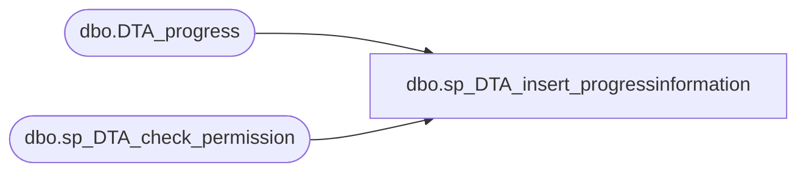

# dbo.sp_DTA_insert_progressinformation

**Database:** msdb  
**Server:** bedrockdb02  

## Architecture Diagram



## Table Dependencies

| Referenced Table |
|---|
| dbo.DTA_progress |
| dbo.sp_DTA_check_permission |

## Stored Procedure Code

```sql
create procedure sp_DTA_insert_progressinformation
	@SessionID int,
	@TuningStage int
as 
begin
	declare @retval  int							
	set nocount on

	exec @retval =  sp_DTA_check_permission @SessionID

	if @retval = 1
	begin
		raiserror(31002,-1,-1)
		return(1)
	end	

	INSERT into [msdb].[dbo].[DTA_progress]
		(SessionID,WorkloadConsumption,EstImprovement,TuningStage,ConsumingWorkLoadMessage,PerformingAnalysisMessage,GeneratingReportsMessage)
	values(@SessionID,0,0,@TuningStage,N'',N'',N'')
	
end
```

