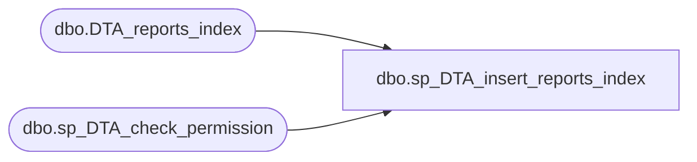

# dbo.sp_DTA_insert_reports_index

**Database:** msdb  
**Server:** bedrockdb02  

## Architecture Diagram



## Table Dependencies

| Referenced Table |
|---|
| dbo.DTA_reports_index |
| dbo.sp_DTA_check_permission |

## Stored Procedure Code

```sql
create procedure sp_DTA_insert_reports_index
	@SessionID			int,
	@TableID			int,
	@IndexName			sysname,
	@IsClustered		bit,
	@IsUnique			bit,
	@IsHeap				bit,
	@IsExisting			bit,
	@IsFiltered			bit,
	@Storage			int,
	@NumRows			bigint,
	@IsRecommended		bit,
	@RecommendedStorage int,
	@PartitionSchemeID	int,
	@SessionUniquefier  int,
	@FilterDefinition	nvarchar(1024)
as
begin
	declare @retval  int							
	set nocount on

	exec @retval =  sp_DTA_check_permission @SessionID

	if @retval = 1
	begin
		raiserror(31002,-1,-1)
		return(1)
	end	
	insert into [msdb].[dbo].[DTA_reports_index]([TableID], [IndexName], [IsClustered], [IsUnique], [IsHeap],[IsExisting], [IsFiltered],[Storage], [NumRows], [IsRecommended], [RecommendedStorage], [PartitionSchemeID],[SessionUniquefier],[FilterDefinition])	
	values(@TableID,@IndexName,@IsClustered,@IsUnique,@IsHeap,@IsExisting,@IsFiltered,@Storage,@NumRows,@IsRecommended,@RecommendedStorage,@PartitionSchemeID,@SessionUniquefier,@FilterDefinition)
end
```

