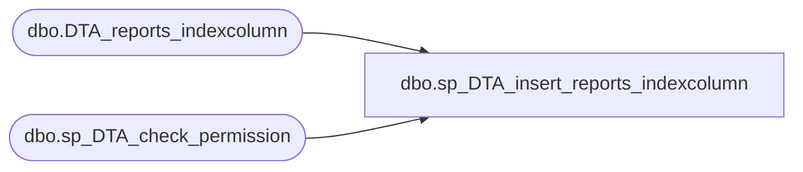

# dbo.sp_DTA_insert_reports_indexcolumn

**Database:** msdb  
**Server:** bedrockdb02  

## Architecture Diagram



## Table Dependencies

| Referenced Table |
|---|
| dbo.DTA_reports_indexcolumn |
| dbo.sp_DTA_check_permission |

## Stored Procedure Code

```sql
create procedure sp_DTA_insert_reports_indexcolumn
	@SessionID		int,
	@IndexID		int,
	@ColumnID		int,
	@ColumnOrder	int,
	@PartitionColumnOrder	int,
	@IsKeyColumn	bit,
	@IsDescendingColumn	bit
as
begin
	declare @retval  int							
	set nocount on

	exec @retval =  sp_DTA_check_permission @SessionID

	if @retval = 1
	begin
		raiserror(31002,-1,-1)
		return(1)
	end	
	insert into [msdb].[dbo].[DTA_reports_indexcolumn]([IndexID], [ColumnID], [ColumnOrder], [PartitionColumnOrder], [IsKeyColumn], [IsDescendingColumn])
	values(@IndexID,@ColumnID,@ColumnOrder,@PartitionColumnOrder,@IsKeyColumn,@IsDescendingColumn)
end
```

