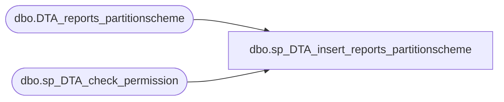

# dbo.sp_DTA_insert_reports_partitionscheme

**Database:** msdb  
**Server:** bedrockdb02  

## Architecture Diagram



## Table Dependencies

| Referenced Table |
|---|
| dbo.DTA_reports_partitionscheme |
| dbo.sp_DTA_check_permission |

## Stored Procedure Code

```sql
create procedure sp_DTA_insert_reports_partitionscheme
	@SessionID	int,   
	@PartitionFunctionID int,
	@PartitionSchemeName sysname,
	@PartitionSchemeDefinition ntext
as
begin
	declare @retval  int							
	set nocount on

	exec @retval =  sp_DTA_check_permission @SessionID

	if @retval = 1
	begin
		raiserror(31002,-1,-1)
		return(1)
	end	
	
	Insert into [msdb].[dbo].[DTA_reports_partitionscheme]( [PartitionFunctionID],[PartitionSchemeName],[PartitionSchemeDefinition]) values(@PartitionFunctionID,@PartitionSchemeName,@PartitionSchemeDefinition)
end
```

