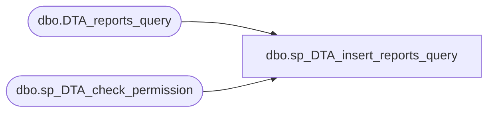

# dbo.sp_DTA_insert_reports_query

**Database:** msdb  
**Server:** bedrockdb02  

## Architecture Diagram



## Table Dependencies

| Referenced Table |
|---|
| dbo.DTA_reports_query |
| dbo.sp_DTA_check_permission |

## Stored Procedure Code

```sql
create procedure sp_DTA_insert_reports_query
	@SessionID			int,
	@QueryID			int,
	@StatementType		smallint,
	@StatementString	ntext,
	@CurrentCost		float,
	@RecommendedCost	float,
	@Weight				float,
	@EventString		ntext,
	@EventWeight		float
as
begin
	declare @retval  int							
	set nocount on

	exec @retval =  sp_DTA_check_permission @SessionID

	if @retval = 1
	begin
		raiserror(31002,-1,-1)
		return(1)
	end	

	insert into [msdb].[dbo].[DTA_reports_query]([SessionID],[QueryID], [StatementType], [StatementString], [CurrentCost], [RecommendedCost], [Weight], [EventString], [EventWeight])
	values(@SessionID,@QueryID,@StatementType,@StatementString,@CurrentCost,@RecommendedCost,@Weight,@EventString,@EventWeight)
	

end
```

