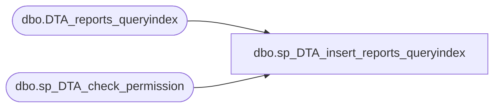

# dbo.sp_DTA_insert_reports_queryindex

**Database:** msdb  
**Server:** bedrockdb02  

## Architecture Diagram



## Table Dependencies

| Referenced Table |
|---|
| dbo.DTA_reports_queryindex |
| dbo.sp_DTA_check_permission |

## Stored Procedure Code

```sql
create procedure sp_DTA_insert_reports_queryindex
	@SessionID	int,
	@QueryID	int,
	@IndexID	int,
	@IsRecommendedConfiguration	bit
as
begin
	declare @retval  int							
	set nocount on

	exec @retval =  sp_DTA_check_permission @SessionID

	if @retval = 1
	begin
		raiserror(31002,-1,-1)
		return(1)
	end	
	insert into [msdb].[dbo].[DTA_reports_queryindex]([SessionID],[QueryID],[IndexID], [IsRecommendedConfiguration])
	values(@SessionID,@QueryID,@IndexID,@IsRecommendedConfiguration)
	
end
```

