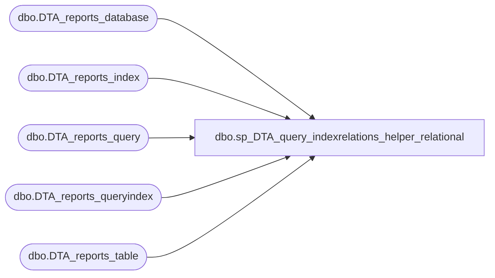

# dbo.sp_DTA_query_indexrelations_helper_relational

**Database:** msdb  
**Server:** bedrockdb02  

## Architecture Diagram



## Table Dependencies

| Referenced Table |
|---|
| dbo.DTA_reports_database |
| dbo.DTA_reports_index |
| dbo.DTA_reports_query |
| dbo.DTA_reports_queryindex |
| dbo.DTA_reports_table |

## Stored Procedure Code

```sql
create procedure sp_DTA_query_indexrelations_helper_relational
							@SessionID		int,
							@Recommended	int
							as
							begin 	select "Statement Id" =Q.QueryID, "Statement String" =Q.StatementString,"Database Name" =D.DatabaseName, "Schema Name" =T.SchemaName, "Table/View Name" =T.TableName, "Index Name" =I.IndexName 	 from 
						[msdb].[dbo].[DTA_reports_query] Q, 
						[msdb].[dbo].[DTA_reports_queryindex] QI, 
						[msdb].[dbo].[DTA_reports_index] I, 
						[msdb].[dbo].[DTA_reports_table] T,
						[msdb].[dbo].[DTA_reports_database] D
						where 
						Q.SessionID=QI.SessionID and 
						Q.QueryID=QI.QueryID and 
						QI.IndexID=I.IndexID and 
						I.TableID=T.TableID and 
						T.DatabaseID = D.DatabaseID and
						QI.IsRecommendedConfiguration = @Recommended and
						Q.SessionID=@SessionID order by Q.QueryID  end
```

