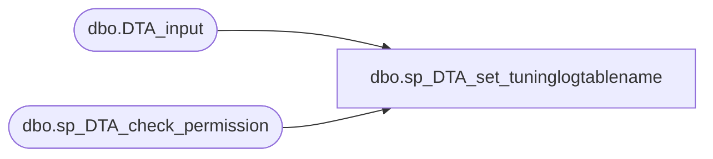

# dbo.sp_DTA_set_tuninglogtablename

**Database:** msdb  
**Server:** bedrockdb02  

## Architecture Diagram



## Table Dependencies

| Referenced Table |
|---|
| dbo.DTA_input |
| dbo.sp_DTA_check_permission |

## Stored Procedure Code

```sql
create procedure sp_DTA_set_tuninglogtablename
	@LogTableName nvarchar(1280), 
	@SessionID int 

as 
begin
	declare @retval  int							
	set nocount on

	exec @retval =  sp_DTA_check_permission @SessionID

	if @retval = 1
	begin
		raiserror(31002,-1,-1)
		return(1)
	end	

	update [msdb].[dbo].[DTA_input] set LogTableName = @LogTableName where SessionID = @SessionID
	

end
```

