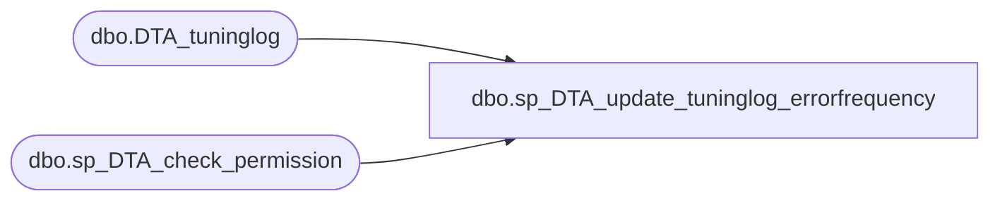

# dbo.sp_DTA_update_tuninglog_errorfrequency

**Database:** msdb  
**Server:** bedrockdb02  

## Architecture Diagram



## Table Dependencies

| Referenced Table |
|---|
| dbo.DTA_tuninglog |
| dbo.sp_DTA_check_permission |

## Stored Procedure Code

```sql
create procedure sp_DTA_update_tuninglog_errorfrequency
	@SessionID	int,
	@Frequency	int,
	@RowID		int
as
begin
	declare @retval  int							
	set nocount on

	exec @retval =  sp_DTA_check_permission @SessionID

	if @retval = 1
	begin
		raiserror(31002,-1,-1)
		return(1)
	end	

	update [msdb].[dbo].[DTA_tuninglog]
	set [Frequency]=@Frequency
	where [RowID]=@RowID and [SessionID] = @SessionID

end
```

